# About Kcode

Kcode is a local-first coding agent harness. It combines a remote frontier model, local tools, context compression, persistent memory, and a local GGUF sidecar model into one terminal workflow.

The short version:

- **Remote model:** does the main reasoning and response generation, for example GPT-5.5.
- **Kcode harness:** owns tools, files, terminal commands, browser/mouse automation, memory, token-saving context transforms, and runtime orchestration.
- **Local model sidecar:** helps with routing, memory extraction, summaries, critique, and bridge telemetry.
- **Context diet / interlang:** saves tokens by replacing old low-value exact context with compact summaries and rehydratable references.
- **Memory system:** keeps useful facts, preferences, and project state outside the main context window, then injects relevant memory when needed.

---

## 1. High-level architecture

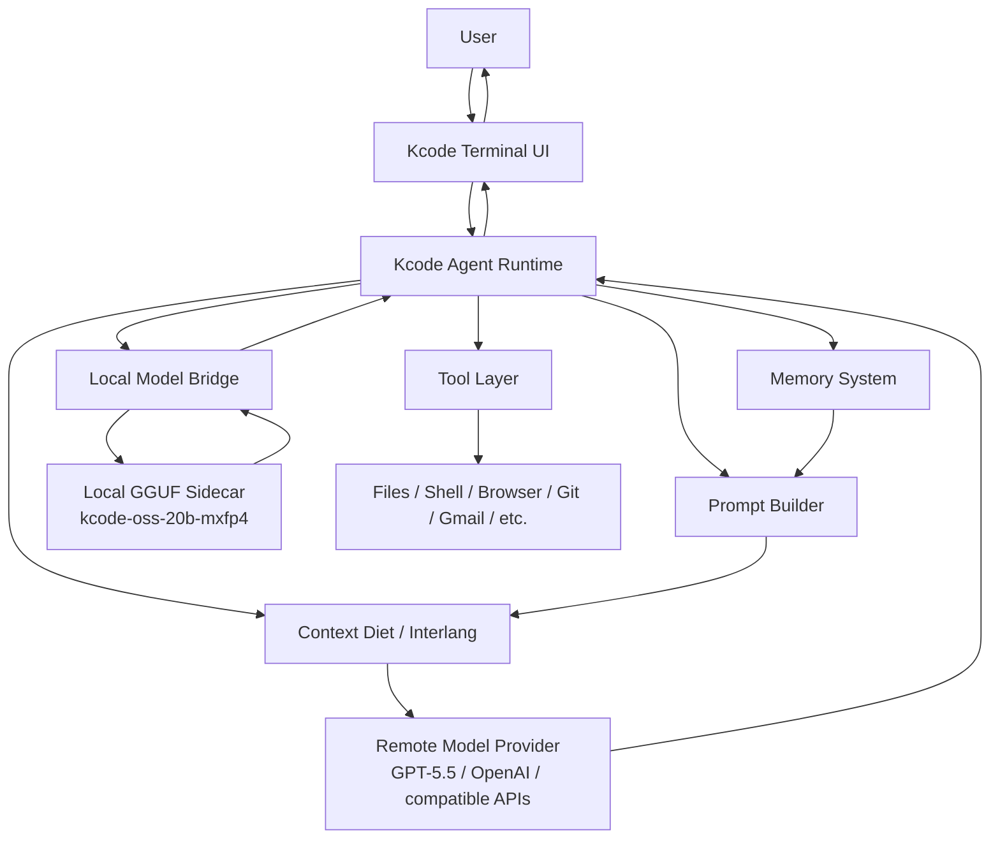

Kcode is not just a wrapper around an LLM API. It is the orchestration layer that decides what context to send, which tools are available, when to compact old data, when to recall memory, when to call the local sidecar, and how to persist useful information.

---

## 2. How token savings work

Kcode saves tokens primarily by preventing old, bulky context from being resent verbatim every turn.

Normal chat systems often resend a growing transcript:

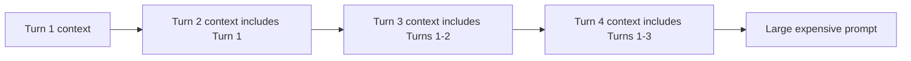

Kcode instead uses a **context diet**. Old low-value blocks, tool output, logs, repeated text, and already-seen content are replaced by compact references.

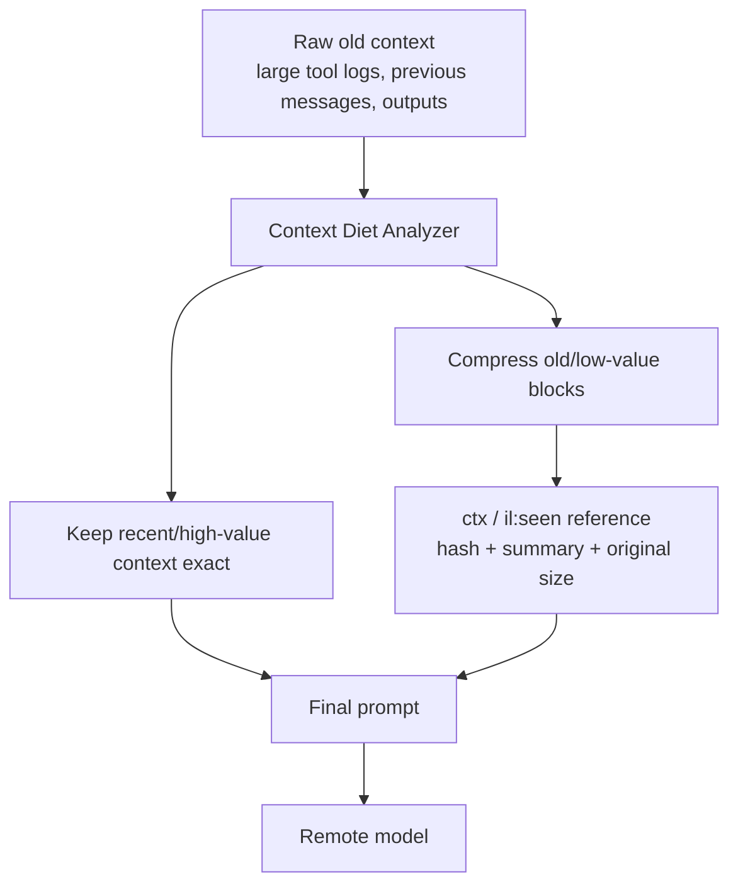

A compacted block looks conceptually like this:

```xml
<ctx v=1 k="old-tool-result" id="ctx:hash" h="hash" n=279518 c="0.66" p="high" ar="true" t="build,error" s="lines=...; files=...; first=..." />
```

That means the model still sees the removed block type, stable id/hash, original
size, confidence, priority, semantic topics, and deterministic summary. The exact
text is not repeated by default; the decoder prompt defines `.ctx_get id=...` as
the recovery path when exact old content matters.

### Token-saving modes

Kcode has an interlang/context compression path with modes such as safe, verified, aggressive, and ultra. The main active behavior is:

1. **Recent context stays exact.** The newest messages and current task details remain readable.
2. **Old bulky context gets summarized.** Long tool results, repeated logs, and old low-value content become compact `<ctx>` references.
3. **Seen content can become a reference.** If exact content was already provided earlier, later turns can use `<il:seen>` rather than resending it.
4. **The model can request exact text.** If a summary is insufficient, it can request `.ctx_get id=...`.
5. **Auto-restore is relevance-gated.** Kcode only proactively restores exact excerpts when the old block's topics match the latest real user turn.
6. **Stats are local-first.** Kcode logs original chars, encoded chars, saved chars, estimated saved tokens, and exact local-tokenizer estimates when available. Stats reminders are only injected for token/context-related turns.

Current ultra-mode defaults are tuned for long GPT-5.5 style coding sessions:

| Setting | Default | Purpose |
|---|---:|---|
| `KCODE_CONTEXT_DIET_TRIGGER_TOKENS` | `24000` | Start replacing old bulky blocks once the prompt is roughly this large. |
| `KCODE_CONTEXT_DIET_RECENT_MESSAGES` | `8` | Keep the newest messages exact so current task details remain visible. |
| `KCODE_CONTEXT_DIET_MIN_BLOCK_CHARS` | `420` | Old text/tool/reasoning blocks at or above this size can become `<ctx>` refs. |

These can be overridden per session. Lower values save more tokens but may cause
more `.ctx_get` rehydration requests when exact old content becomes important.

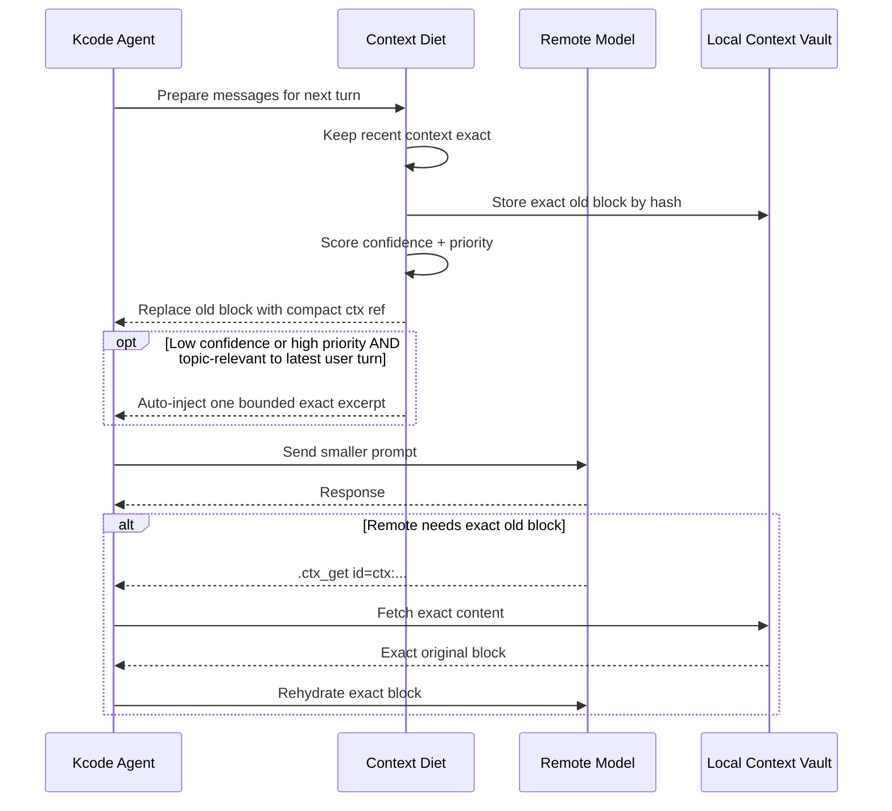

### Why prompts are still not tiny

Even after large savings, a final prompt may still be tens of thousands of characters because it includes:

- system/developer instructions,
- tool schemas,
- recent turns,
- current task details,
- memory reminders,
- compact summaries,
- and safety/protocol instructions.

The important part is that old raw context may be hundreds of thousands of characters, while the sent compact references may only be a small fraction of that.

---

## 3. Interlang and context vault references

Kcode uses a lightweight inter-language protocol inspired by context references and deterministic compression.

Main reference types:

| Type | Purpose |
|---|---|
| `<ctx ... />` | A local context-vault reference for old content stored by Kcode. |
| `<il:seen ... />` | A reference to exact content already seen earlier in the session. |
| `<il:v1>...</il>` | A compact encoding for repetitive lines or path prefixes. |
| `.ctx_get id=...` | A request for Kcode to rehydrate exact hidden content. |

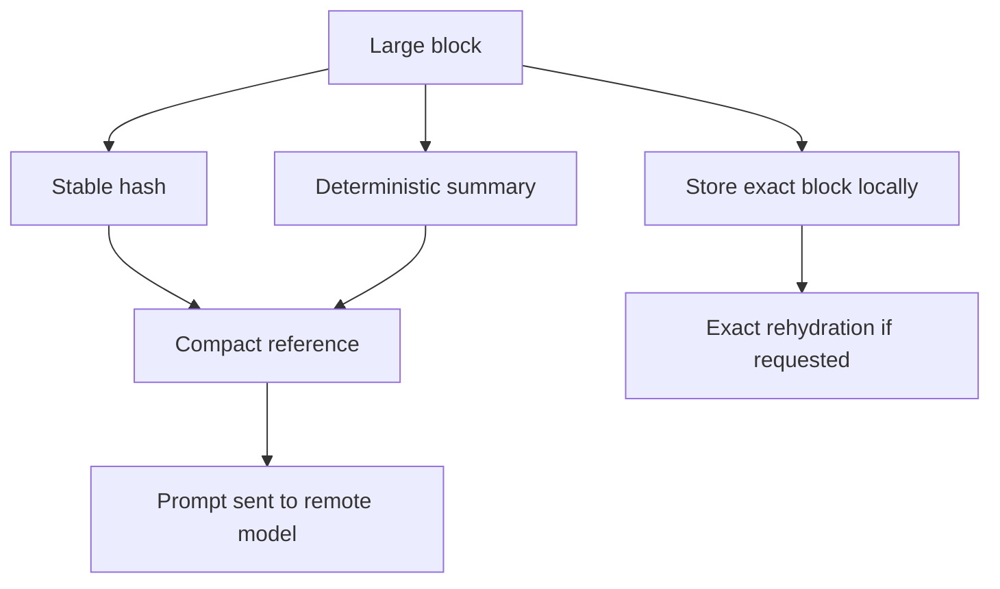

This is designed to be conservative: summaries are useful for normal reasoning, but exact hidden text is not invented. If exact lines matter, the model is instructed to ask for rehydration.

---

## 4. How memory works

Kcode memory is separate from raw chat history. Instead of depending only on the current prompt, Kcode can store durable facts and retrieve them later.

Memory can include:

- user preferences,
- project facts,
- implementation decisions,
- corrections,
- entities,
- useful summaries,
- and task-specific state.

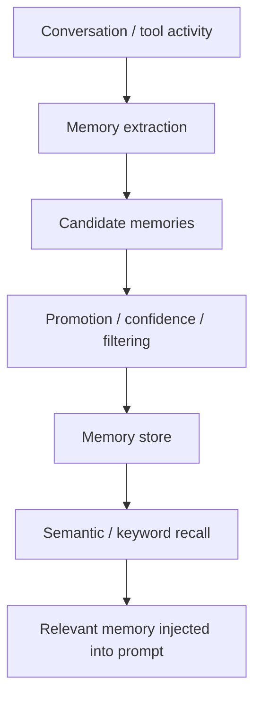

### Memory lifecycle

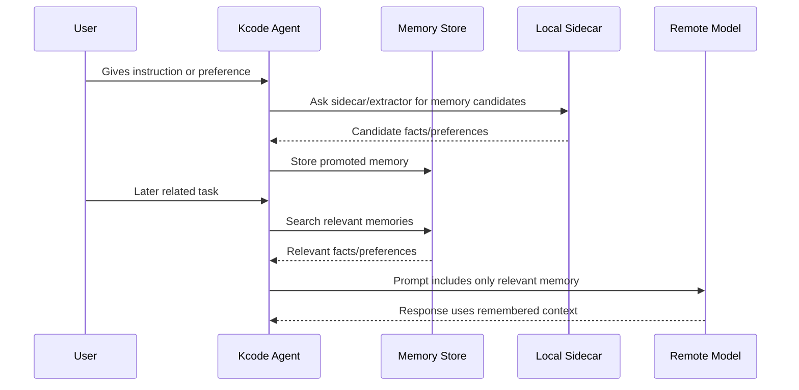

### Why memory saves tokens

Without memory, important facts must stay in the chat transcript forever. With memory, Kcode can store compact durable facts and only inject relevant ones.

For example, instead of resending a long conversation about a project rename, memory can store:

```text
User renamed Jcode to Kcode. Active Kcode home is ~/.kcode. Legacy ~/.jcode compatibility matters.
```

That is much cheaper than carrying the entire rename conversation forever.

---

## 5. Local model bridge

The local model bridge is the layer between Kcode and the local GGUF sidecar model.

Default local sidecar model identity:

```text
kcode-oss-20b-mxfp4
```

Default local file:

```text
~/.kcode/models/gguf/kcode-oss-20b-mxfp4.gguf
```

Installer source:

```text
https://huggingface.co/icedmoca/kcode-oss-20b-mxfp4
```

The bridge can help with:

- pre-routing,
- local critique,
- memory extraction,
- summarization,
- prompt/exchange logging,
- and local-only assistant support tasks.

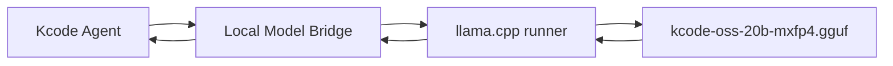

### Bridge logs

Kcode can record local bridge telemetry such as:

- upstream provider,
- upstream model,
- local model identity,
- prompt size,
- response size,
- prompt summaries,
- and memory promotion events.

This is useful for debugging whether compression is actually reducing what gets sent to the remote provider.

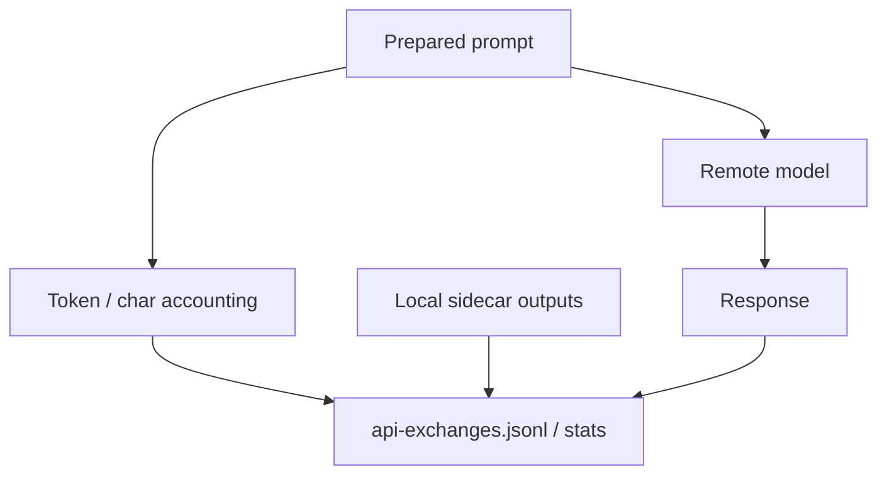

---

## 6. Tool layer

Kcode gives the agent controlled access to local tools. Depending on configuration, this can include:

- shell commands,
- file reads/writes/patches,
- code search,
- browser automation,
- mouse/screenshot automation,
- Gmail helpers,
- background tasks,
- TODO tracking,
- memory management,
- and multi-agent/swarm coordination.

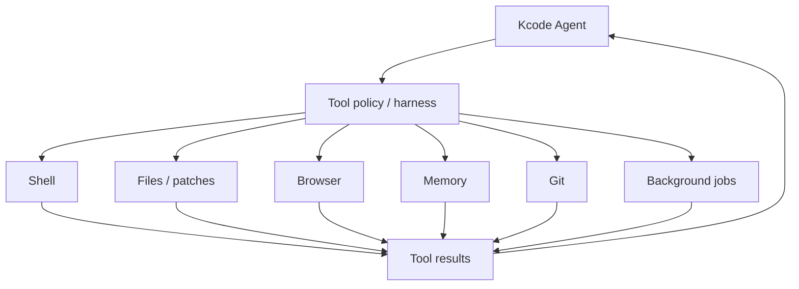

Tool output can be large, so tool results are one of the biggest targets for context diet compression.

---

## 7. Install layout

After running the installer, the normal layout is:

```text
~/.kcode/
  build-src/kcode/              # cloned source repo
  builds/current/               # active installed build
  builds/stable/                # stable installed build
  models/gguf/
    kcode-oss-20b-mxfp4.gguf    # local sidecar model
  local-model-bridge/           # local bridge logs/state
  memory-store/                 # persistent memory
```

Command wrappers are installed to:

```text
~/.local/bin/kcode
~/.local/bin/jcode   # compatibility alias
```

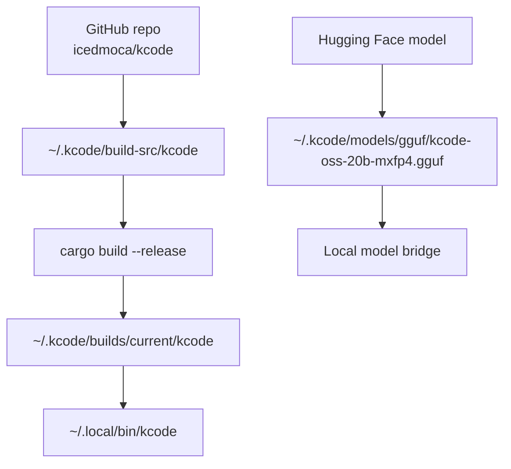

---

## 8. One-command install

```bash
curl -fsSL https://raw.githubusercontent.com/icedmoca/kcode/main/install/install.sh | bash
```

The installer:

1. clones `https://github.com/icedmoca/kcode`,
2. downloads `kcode-oss-20b-mxfp4.gguf` from Hugging Face,
3. builds Kcode,
4. installs `kcode` into `~/.local/bin`,
5. creates compatibility aliases,
6. and stores everything under `~/.kcode`.

---

## 9. Design goals

Kcode is designed around a few practical goals:

- **Spend remote tokens on useful current context, not old logs.**
- **Keep exact old context available locally when needed.**
- **Use memory for durable facts instead of bloating the transcript.**
- **Use a local model for cheap helper work.**
- **Keep the main remote model focused on high-value reasoning.**
- **Make the system observable with accounting logs and stats.**

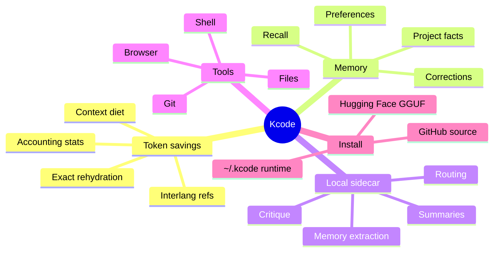

---

## 10. Practical example

A user asks a tiny follow-up like:

```text
ok did it work?
```

A normal transcript-based system might resend a large amount of previous tool output. Kcode can instead send:

- the recent exact messages,
- compact summaries of old tool output,
- memory facts relevant to the task,
- and references for exact old content if needed.

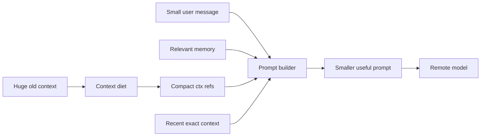

That is the core idea: Kcode keeps the useful state, but avoids paying to resend every byte of old context every turn.
