# How Kcode Combats Hallucinations

Kcode does not claim to make hallucinations impossible. Instead, it attacks the main causes of hallucination in long coding sessions: missing context, stale context, unverifiable tool output, lossy summaries with no escape hatch, and memory drift.

The core idea is simple:

> Kcode reduces the need to guess by keeping exact evidence locally, sending compact but accountable summaries to the model, and allowing exact rehydration whenever summary-level context is not enough.

---

## 1. The hallucination problem in long tool-heavy chats

In coding agents, hallucinations usually come from one of these failure modes:

| Failure mode | What happens | Kcode countermeasure |
|---|---|---|
| Context overload | The prompt gets too large, so important details are dropped or buried. | Context diet compresses old low-value blocks while preserving recent/high-value exact context. |
| Lost evidence | Tool results or file contents are summarized and exact text is gone. | Kcode stores exact old blocks locally by stable hash and can rehydrate them. |
| Summary overtrust | A model treats a summary as if it were exact source text. | `<ctx>` references explicitly say summary is not exact and include `.ctx_get` recovery instructions. |
| Stale memory | Old remembered facts override current repo state. | Memory is used as hints, while tools and exact file reads remain authoritative. |
| Unsupported claims | The model invents file names, code behavior, or test results. | Tool-first workflows, patch verification, tests, and local accounting logs create evidence. |
| Repeated giant logs | Huge logs encourage truncation and loss of important lines. | Logs become summarized references with semantic hints and exact retrieval when needed. |

---

## 2. System overview

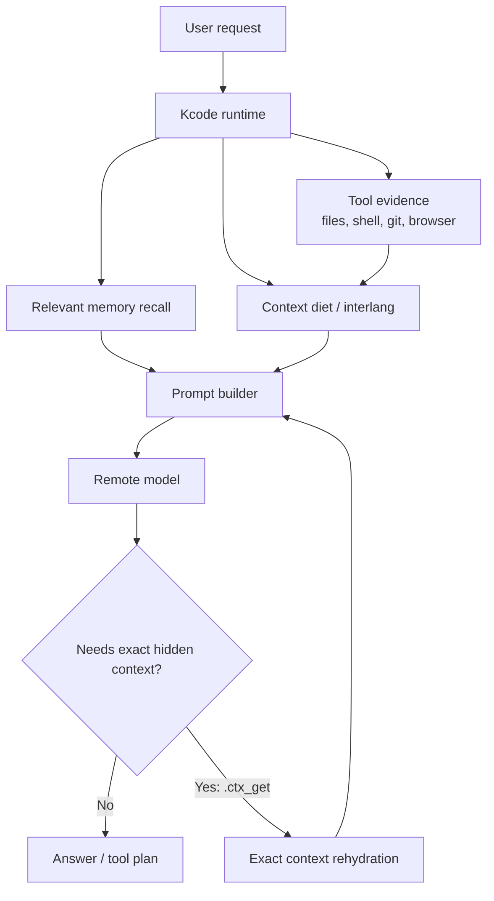

Kcode combats hallucination by making the model reason from evidence:

1. **Recent exact context** remains visible.
2. **Old bulky context** becomes compact references.
3. **Exact old content** remains locally available.
4. **Memory** adds durable facts, but does not replace verification.
5. **Tools/tests** validate claims before final answers.

---

## 3. Context diet: reducing confusion without deleting evidence

A normal long chat often forces a bad tradeoff:

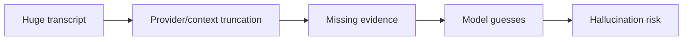

Kcode avoids that by replacing old low-value blocks with structured references:

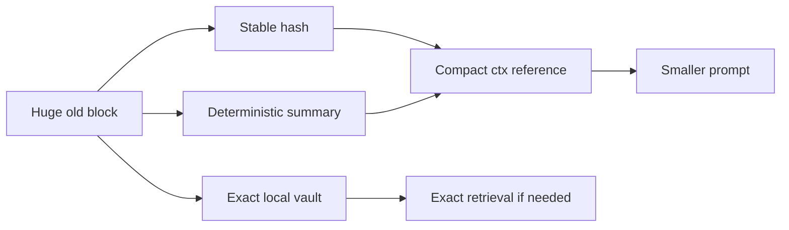

A `<ctx>` reference is intentionally explicit:

```xml
<ctx
  id="ctx:..."
  hash="..."
  original_chars="..."
  summary="lines=...; chars=...; files=[...]; first=..."
  policy="memory-safe context diet: old low-value context is summarized; request exact only if necessary"
  request_exact=".ctx_get id=ctx:... reason=<why exact old context is needed>" />
```

This combats hallucination because the model is told:

- this is a summary, not exact text,
- exact content exists locally,
- a stable id/hash identifies it,
- and it should request exact text instead of inventing details.

---

## 4. Exact rehydration: the anti-guessing escape hatch

If the model needs exact old content, it can ask for it with:

```text
.ctx_get id=ctx:<hash> reason=<why exact old context is needed>
```

or:

```text
. err need_ref <hash>
```

Kcode parses that request, retrieves the exact block from the local vault, and injects it back into the conversation.

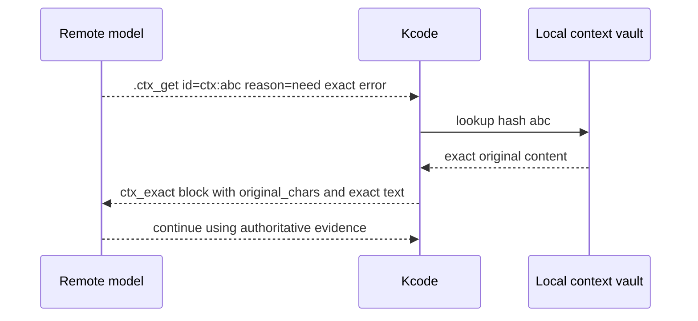

This matters because summaries are useful for orientation, but exact code, errors, command output, and file contents are often required for correctness.

---

## 5. Memory: durable hints, not fake evidence

Kcode memory stores useful durable facts outside the main chat transcript.

Examples:

- user preferences,
- project facts,
- rename decisions,
- known paths,
- prior corrections,
- long-term workflow preferences.

Memory is not treated as proof that the current repository still matches the fact. It is a retrieval system that helps the agent know what to check.

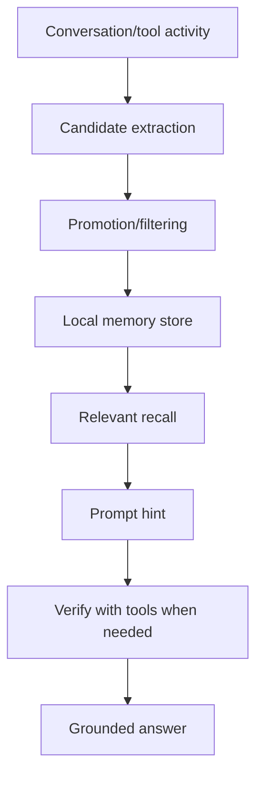

### How this reduces hallucination

Without memory, the model may try to infer old decisions from partial context. With memory, Kcode can preserve a compact durable statement such as:

```text
The active repo was renamed from Jcode to Kcode. The Kcode home is ~/.kcode. Legacy ~/.jcode compatibility matters.
```

That prevents the model from guessing the rename state. But Kcode can still verify with files and git before making claims.

---

## 6. Tool-first grounding

Kcode has tool access for files, shell commands, git, browser, background jobs, and more. The agent is expected to inspect and test rather than guess.

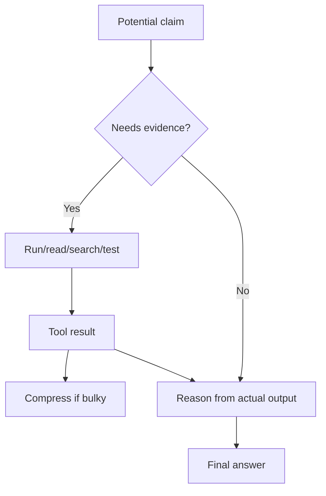

Examples:

- Before saying a build works, run `cargo check` or relevant tests.
- Before saying a file exists, list/read it.
- Before saying GitHub has a file, fetch the raw URL or inspect remote refs.
- Before saying token savings are active, inspect `interlang-stats.jsonl` and prompt accounting.

---

## 7. Local model bridge: helper, not final authority

The local sidecar model can help with routing, summaries, memory extraction, and critique. It is not treated as the final source of truth.

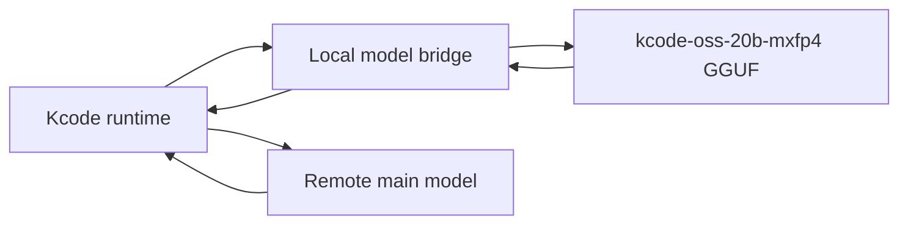

The bridge reduces hallucination indirectly by:

- summarizing and extracting memory candidates,
- creating local critique or second-pass checks,
- logging prompt/response metadata,
- and making token/context behavior observable.

But file contents, command output, tests, and exact rehydrated context remain more authoritative than sidecar guesses.

---

## 8. Real Kcode data from live context-diet accounting

The following data was measured from the local Kcode `interlang-stats.jsonl` on this machine during real usage.

### Recent 50 compaction events

| Metric | Value |
|---|---:|
| Total compaction events analyzed | 50 |
| Total original chars compacted | 36,069,596 |
| Total encoded chars sent for those blocks | 3,462,697 |
| Average char reduction | 90.42% |
| Estimated tokens saved, total | 8,151,726 |
| Estimated tokens saved, average/event | 163,034.52 |
| Exact local-tokenizer tokens saved, total | 12,551,016 |
| Exact local-tokenizer tokens saved, average/event | 251,020.32 |
| Total blocks encoded | 6,039 |
| Average blocks encoded/event | 120.78 |

### Latest observed compaction event

| Metric | Value |
|---|---:|
| Blocks encoded | 140 |
| Original chars | 766,131 |
| Encoded chars | 79,903 |
| Saved chars | 686,228 |
| Estimated saved tokens | 171,557 |
| Exact original tokens | 296,971 |
| Exact encoded tokens | 34,315 |
| Exact saved tokens | 262,656 |
| Diet blocks | 137 |
| Seen-ref blocks | 3 |
| Raw context avoided, estimated tokens | 191,533 |

### Visualized

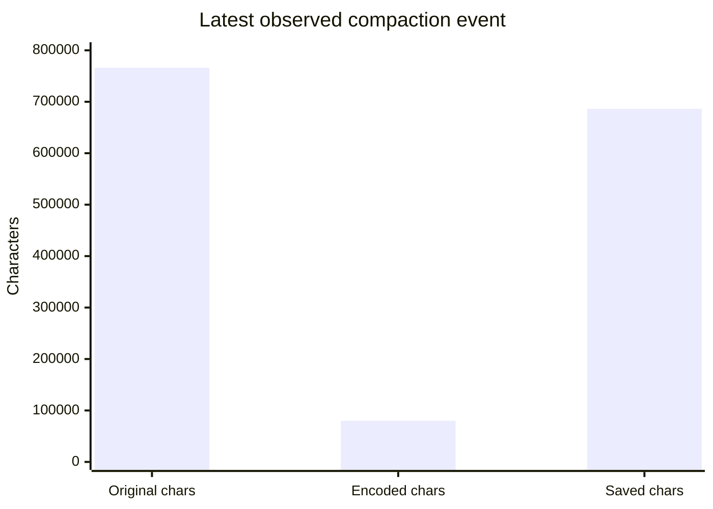

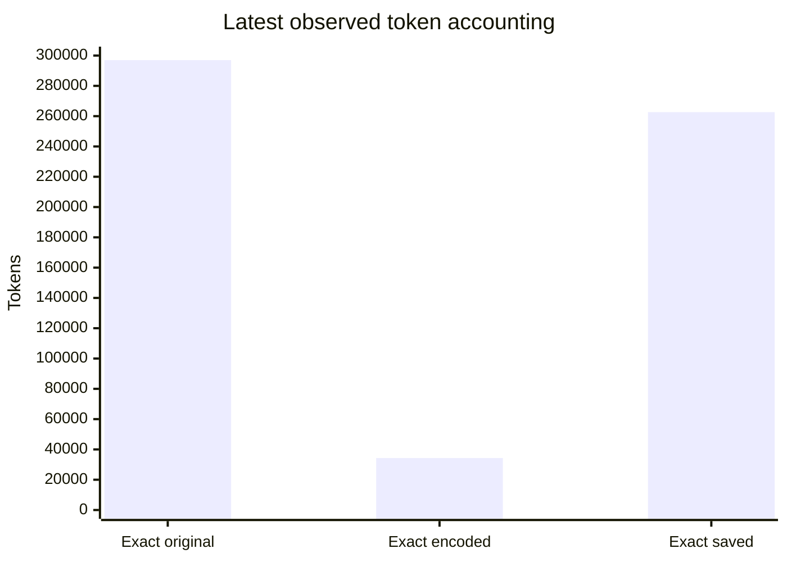

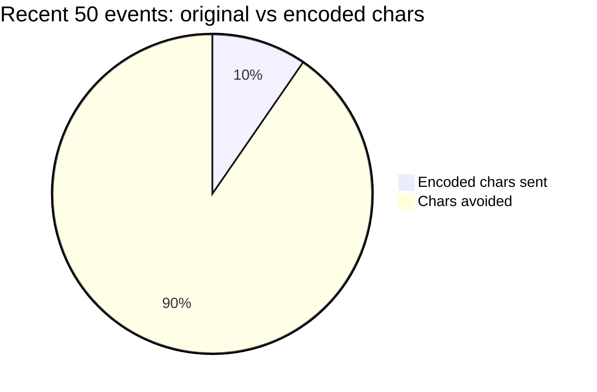

These numbers matter for hallucination because they show that Kcode is not just truncating huge context. It is converting old context into compact references while keeping exact content locally recoverable.

---

## 9. Why compression can reduce hallucination instead of increasing it

Compression can be dangerous if it destroys evidence. Kcode's approach is different:

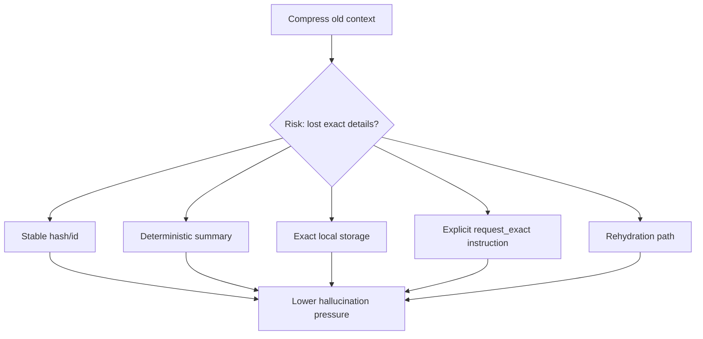

The model gets enough information to know what the old block was about, but it is warned not to invent exact details. If details matter, it can ask Kcode to retrieve them.

---

## 10. Failure modes Kcode still watches for

Kcode is designed to reduce hallucinations, not magically eliminate them. Important remaining risks include:

| Risk | Mitigation |
|---|---|
| Summary misses a crucial line | Use `.ctx_get` exact rehydration. |
| Memory is outdated | Verify with tools and current repo state. |
| Tool output is too large | Summarize plus retain exact local block. |
| Local sidecar gives weak advice | Treat sidecar as helper, not authority. |
| Remote model ignores protocol | Kcode can re-prompt with rehydrated evidence and explicit instructions. |
| Tests are not run | Kcode's coding workflow emphasizes validation before claiming success. |

---

## 11. Hallucination-control checklist

When Kcode is working correctly, high-confidence answers should usually come from this loop:

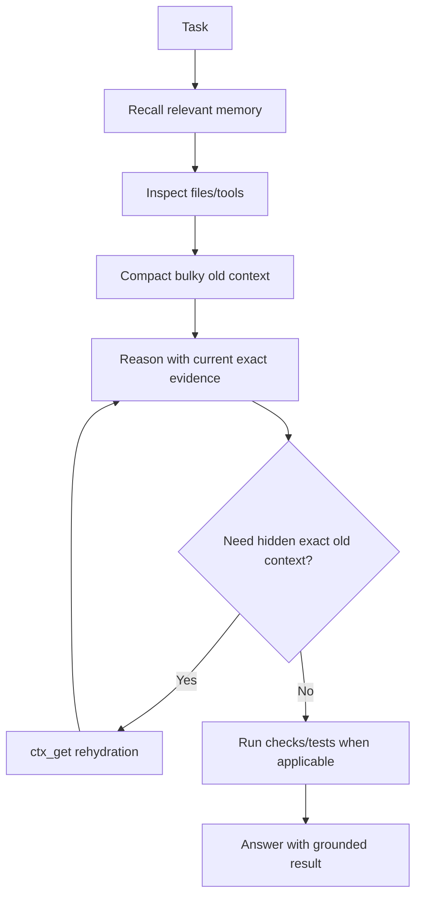

Practical checklist:

- Prefer tool evidence over memory when making repository claims.
- Keep recent task context exact.
- Use summaries for orientation, not exact quotes.
- Request exact context when a hidden block matters.
- Run tests/checks before saying code works.
- Record accounting so token/context behavior can be audited.

---

## 12. Bottom line

Kcode combats hallucinations by combining:

1. **context compression that does not delete exact evidence,**
2. **local exact rehydration via stable references,**
3. **durable memory used as hints,**
4. **tool-first verification,**
5. **local sidecar support for summaries and memory,**
6. **and real accounting logs that make token-saving behavior observable.**

The result is a system that can run long, tool-heavy sessions while reducing both token cost and the pressure on the model to guess.
