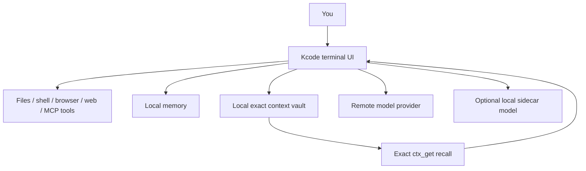

<p align="center">
  
</p>

# Kcode

**Kcode is a terminal-based AI coding agent built for long, real software work.**

It can read and edit your files, run shell commands, use browser automation, remember useful project facts, and keep long sessions affordable by compressing old context without losing the exact original text.

If you have used tools like Claude Code, Codex CLI, Cursor, or other terminal coding agents, Kcode is in the same general category, but it focuses especially on:

- **long sessions without runaway context cost,**
- **local-first memory and context storage,**
- **exact recall of old tool output when needed,**
- **a powerful terminal UI,**
- **many built-in tools,**
- **optional local GGUF sidecar model support.**

[](https://huggingface.co/icedmoca/kcode-oss-20b-mxfp4)

---

## What can Kcode do?

Kcode helps you work on a codebase from your terminal.

It can:

- **Edit code** across one file or many files.
- **Run tests, builds, linters, and scripts** in your project.
- **Debug failures** by reading logs, stack traces, diffs, and source code.
- **Use tools** such as shell, file search, browser automation, web search, Gmail, image generation/editing, and more.
- **Remember project facts** so you do not have to repeat preferences or architecture details every session.
- **Handle long conversations** by moving old bulky context into local references instead of resending everything forever.
- **Recall exact old context** with local `.ctx_get`-style rehydration when details matter.
- **Reduce tool-schema overhead** by only sending the tools that look relevant for the current turn, while keeping `tool_expand` available when more tools are needed.
- **Use a local sidecar model** for routing, memory, summaries, and telemetry if installed.

In plain English: **Kcode is meant to be your persistent terminal coding assistant that can keep working for a long time without forgetting why it is doing the work.**

---

## Why Kcode exists

Most coding agents work well for short tasks, but long sessions get messy:

- the prompt gets huge,
- old tool output disappears,
- the model starts guessing about earlier details,
- costs rise,
- and repeated tool schemas waste tokens on simple questions.

Kcode tries to solve that with a local-first design:



The key idea: **old context is not simply deleted.** Kcode stores exact old evidence locally, sends a compact reference to the model, and can restore the exact text when needed.

---

## Quick install

Run this in a terminal:

```bash
curl -fsSL https://raw.githubusercontent.com/icedmoca/kcode/main/install/install.sh | bash
```

Then start Kcode:

```bash
kcode
```

Check the installed version:

```bash
kcode --version
```

If `kcode` is not found, add `~/.local/bin` to your PATH:

```bash
export PATH="$HOME/.local/bin:$PATH"
```

---

## Requirements

You need:

- Linux or macOS shell environment,
- `git`,
- `curl`,
- Rust/Cargo,
- enough disk space for Rust build artifacts and the optional GGUF model.

On Ubuntu/Debian:

```bash
sudo apt-get update
sudo apt-get install -y git curl build-essential pkg-config libssl-dev
curl https://sh.rustup.rs -sSf | sh
```

---

## What the installer does

The installer will:

1. Clone/sync Kcode into `~/.kcode/build-src/kcode`.
2. Build the `kcode` binary with Cargo.
3. Install command wrappers into `~/.local/bin/kcode` and `~/.local/bin/jcode`.
4. Download the optional local sidecar model unless skipped.
5. Install and register the bundled Chromium MCP bridge unless skipped.
6. Write detailed logs to `~/.kcode/logs/install-YYYYMMDD-HHMMSS.log`.

The installer treats `~/.kcode/build-src/kcode` as an installer-managed cache. If it finds a locally diverged cache, it backs it up and clones a fresh copy rather than failing on Git internals.

---

## Kcode compared to other AI coding tools

This table is intentionally practical, not tribal. Many of these tools are excellent. Kcode is different mainly because it is a local-first harness focused on long-session context management and exact local rehydration.

| Tool | Main interface | Best at | Local tools / shell | Long-session memory/context strategy | Local model support | Notes |
|---|---|---|---|---|---|---|
| **Kcode** | Terminal UI / CLI harness | Long coding sessions, tool orchestration, local memory, exact context recall | Yes, broad built-in tool layer | Local context vault, compact refs, `.ctx_get` exact rehydration, context diet, dynamic tool-schema pruning | Optional GGUF sidecar model | Open-source, local-first, benchmark artifacts included in repo |
| **Claude Code / Claude CLI** | Terminal coding agent | Strong coding assistance with Claude models | Yes | Provider/tool-specific context handling | Not the main focus | Polished agent workflow, Anthropic ecosystem |
| **Codex CLI** | Terminal coding agent | OpenAI model-driven coding from terminal | Yes | Provider/tool-specific context handling | Not the main focus | Good fit for OpenAI-centric coding workflows |
| **Cursor** | GUI editor | Interactive IDE coding, autocomplete, codebase chat | Editor-integrated tools | Editor/index-driven context | Not the main focus | Excellent for people who want an AI-native IDE rather than terminal-first flow |
| **Cursor CLI** | CLI companion to Cursor-style workflows | Bringing Cursor-style help to terminal tasks | Varies by setup/version | Cursor ecosystem context | Not the main focus | Useful if you already live in Cursor |
| **Gemini CLI** | Terminal coding/research agent | Google Gemini workflows and large-context tasks | Yes | Provider/tool-specific context handling | Not the main focus | Strong fit for Gemini users and Google ecosystem |
| **Aider** | CLI pair-programming tool | Git-aware patching and code editing | Yes | Repo/chat history based | Can use local models depending on config | Mature CLI workflow with strong Git patch loop |
| **Continue** | IDE extension / local assistant | IDE-integrated customizable coding assistant | IDE/tool dependent | Configurable retrieval/indexing | Yes, often used with local models | Great for customizing model/provider/index choices inside editors |
| **OpenHands / agent frameworks** | Agent runtime / web or CLI workflows | Autonomous multi-step software tasks | Yes | Framework-specific | Depends on setup | More framework-like; often heavier than a simple terminal agent |

### When Kcode is a good fit

Use Kcode if you want:

- a terminal-first coding agent,
- long-running sessions,
- local memory and local context storage,
- exact recovery of old logs/diffs/tool outputs,
- lots of tools available from one harness,
- an open-source system you can inspect and modify.

### When another tool may be better

Use something else if you mainly want:

- a GUI-first editor experience, such as Cursor,
- the most polished vendor-specific workflow for one model provider,
- a minimal CLI with fewer moving parts,
- a production embedding-RAG stack already integrated into your IDE.

---

## Important concepts

### Context vault

Kcode stores old bulky context locally and replaces it in the prompt with compact references like:

```xml
<ctx k="old-tool-result" id="ctx:..." n=8507 c="0.56" p="high" ar="true" t="build,error" s="lines=...; files=[...]; first=..."/>
```

The model sees what kind of evidence exists, but the exact old text stays local until needed.

### Exact rehydration

If exact old text matters, Kcode can request it with a `.ctx_get`-style lookup. That means summaries are not treated as the source of truth. The exact local content is.

### Memory

Kcode can remember facts, preferences, project details, and corrections across sessions. Memory is intended to keep stable information out of the main prompt until it becomes relevant.

### Dynamic tool schemas

Instead of sending every tool schema on every turn, Kcode tries to send only relevant tool families. Direct answers can stay cheap, while tool-heavy tasks still get the tools they need.

### Local sidecar model

Kcode can use a local GGUF sidecar model for helper tasks such as routing, memory extraction, summaries, critique, and telemetry. The default model identity is:

```text
kcode-oss-20b-mxfp4
```

The installer downloads it to:

```text
~/.kcode/models/gguf/kcode-oss-20b-mxfp4.gguf
```

from:

```text
https://huggingface.co/icedmoca/kcode-oss-20b-mxfp4
```

---

## Documentation

- [ABOUT.md](ABOUT.md) - deeper architecture explanation.
- [BENCHMARKS.md](BENCHMARKS.md) - measured benchmarks, artifact manifest, and methodology.
- [HALLUCINATION_MITIGATION.md](HALLUCINATION_MITIGATION.md) - how Kcode avoids unsupported answers and restores exact context.
- [STATISTICS.md](STATISTICS.md) - context compression and telemetry details.

---

## Installer options

Customize installation with environment variables:

```bash
# Install somewhere other than ~/.kcode
KCODE_HOME="$HOME/.kcode-dev" bash install/install.sh

# Install command wrappers somewhere other than ~/.local/bin
KCODE_BIN_DIR="$HOME/bin" bash install/install.sh

# Clone from a fork
KCODE_REPO_URL="https://github.com/yourname/kcode.git" bash install/install.sh

# Skip downloading the model
KCODE_SKIP_MODEL=1 bash install/install.sh

# Skip installing the bundled Chromium MCP bridge
KCODE_SKIP_CHROMIUM_MCP=1 bash install/install.sh

# Debug build instead of release
KCODE_BUILD_PROFILE=debug bash install/install.sh
```

---

## Bundled Chromium MCP bridge

Kcode includes the Chromium MCP bridge in `vendor/chromium-agent-bridge`.

The installer copies it into:

```text
~/.kcode/chromium-agent-bridge
```

and writes an MCP registration to:

```text
~/.kcode/mcp.json
```

Chrome still requires one manual step after install:

1. open `chrome://extensions`,
2. enable Developer mode,
3. choose **Load unpacked**,
4. select `~/.kcode/chromium-agent-bridge/extension`.

---

## Context and token-saving knobs

Kcode enables context compression by default. Useful runtime overrides:

```bash
# Disable interlang/context-diet compression
KCODE_INTERLANG_COMPACT=0 kcode

# Compression mode: safe, verified, aggressive, ultra
KCODE_INTERLANG_MODE=ultra kcode

# Start dieting after this approximate prompt size
KCODE_CONTEXT_DIET_TRIGGER_TOKENS=24000 kcode

# Keep this many newest messages exact
KCODE_CONTEXT_DIET_RECENT_MESSAGES=8 kcode

# Minimum old block size eligible for context diet
KCODE_CONTEXT_DIET_MIN_BLOCK_CHARS=420 kcode
```

Token-savings accounting is appended to:

```text
~/.kcode/interlang-stats.jsonl
```

---

## OpenAI OAuth, API keys, and failover

Kcode can use OpenAI through ChatGPT/Codex OAuth accounts, a stored OpenAI platform API key, or automatic failover.

Manage this from inside Kcode:

```bash
# Choose credential behavior
/account openai auth-mode oauth     # OAuth/subscription only
/account openai auth-mode api_key   # platform API key only
/account openai auth-mode auto      # OAuth first, retry with API key on clear limit errors

# Store or clear a platform API key in ~/.kcode/openai-auth.json (0600)
/account openai api-key sk-...
/account openai api-key clear
```

In `auto` mode, Kcode retries a failed OAuth/subscription request once through OpenAI platform Bearer auth when the error clearly looks like a subscription limit or quota response. It does not silently use the API key when auth mode is `oauth`.

---

## Repository safety

This repository should contain source code, docs, installer files, benchmarks, and benchmark artifacts only.

Runtime state, logs, credentials, build outputs, and model files belong under your local `~/.kcode` directory and are ignored by `.gitignore`.

---

## Development

```bash
git clone https://github.com/icedmoca/kcode.git
cd kcode
cargo check
cargo build --release --bin kcode
```

Useful validation:

```bash
cargo test --lib
python3 scripts/context_benchmark.py
python3 scripts/final_benchmark_suite.py
```

---

## Project links

- GitHub: <https://github.com/icedmoca/kcode>
- Local model: <https://huggingface.co/icedmoca/kcode-oss-20b-mxfp4>
