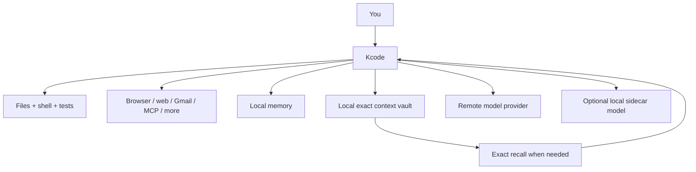

<p align="center">
  
</p>

# Kcode

**Kcode is an open-source terminal AI coding agent for long, real software work.**

It can edit your code, run tests, use tools, remember project details, and keep long sessions manageable by storing old context locally instead of resending a giant transcript forever.

## The short version

Kcode gives you:

- **A terminal-first AI coding agent** that can inspect, edit, test, and debug real repositories.
- **Long-session context management** with local exact-context storage and compact references.
- **Exact recall of old evidence** so previous logs, diffs, and tool outputs do not turn into fuzzy summaries.
- **Persistent memory** for project facts, preferences, and corrections.
- **A broad tool layer** for files, shell, code search, browser automation, web, Gmail, MCPs, todos, goals, subagents, and swarms.
- **Dynamic tool-schema pruning** so simple answers do not pay for every tool definition.
- **Optional local GGUF sidecar model support** for routing, memory, summaries, critique, and local helper tasks.
- **Committed benchmarks** with provider runs, edit→test fixtures, adversarial prompts, token/context telemetry, and artifact checksums.

In plain English: **Kcode is for people who want an AI coding assistant that can keep working in a terminal without losing track of the project.**

[](https://huggingface.co/icedmoca/kcode-oss-20b-mxfp4)

---

## Install

```bash
curl -fsSL https://raw.githubusercontent.com/icedmoca/kcode/main/install/install.sh | bash
kcode
```

For detailed installation, updating, auth, local model, Chromium MCP, and config options, see **[INSTALL.md](docs/INSTALL.md)**.

---

## What makes Kcode different?

Most coding agents are good at short tasks. Kcode is designed for the messier case: a long session where you have already run many commands, produced huge logs, changed files, hit errors, and still need the assistant to remember what happened.

Kcode's core idea is:

> **Do not trust a summary when exact evidence exists locally.**

Kcode can move old bulky context into local references, then recover the exact original text when needed. That keeps prompts smaller while preserving the ability to check the real evidence.



---

## What Kcode offers

### Coding work

- Read and edit source files.
- Apply patches and multi-file changes.
- Run tests, builds, linters, and scripts.
- Debug stack traces, logs, and failing commands.
- Search code with grep, glob, LSP-style stubs, and `agentgrep`.

### Tools and automation

- Shell/background commands.
- File operations.
- Browser automation and screenshots.
- Web search and URL fetch.
- Gmail actions.
- MCP server management.
- Local mouse/screenshot automation.
- Todos, goals, scheduled work, subagents, and swarms.

See **[TOOLS_AND_AGENTS.md](docs/TOOLS_AND_AGENTS.md)** for the detailed tool, agent, and MCP inventory.

### Context and memory

- Local context vault for old bulky evidence.
- Compact `<ctx>` references instead of giant repeated logs.
- `.ctx_get`-style exact recall when details matter.
- Persistent memory for useful facts and preferences.
- Token/context telemetry in `~/.kcode/interlang-stats.jsonl`.

### Benchmarks

Kcode includes a benchmark report and committed artifacts covering:

- provider edit→test runs,
- adversarial hallucination-guard prompts,
- real repo context retrieval tasks,
- token/context replay measurements,
- latency and tool-use smoke tests,
- artifact checksums and methodology.

Read **[BENCHMARKS.md](docs/BENCHMARKS.md)** for the full report.

---

## Technical comparison with other coding agents

This table is intentionally technical. It focuses on architecture-level differences that matter in long coding sessions: context representation, exact recall, tool schema cost, local telemetry, MCP/tool breadth, and reproducible benchmark evidence.

| Tool | Architecture focus | Kcode technical advantages | Tradeoff / where the other tool can win |
|---|---|---|---|
| **Kcode** | Local-first terminal agent harness with remote provider, optional local GGUF sidecar, local memory, context vault, broad tool layer, MCP support, and committed benchmark artifacts | Native exact context vault with compact `<ctx>` refs, `.ctx_get` exact rehydration, context-diet/interlang telemetry in `~/.kcode/interlang-stats.jsonl`, dynamic tool-schema pruning with `tool_expand`, local memory graph, Chromium MCP bridge, subagents/swarms/goals/scheduler, provider edit→test and adversarial benchmark artifacts committed in repo | Terminal-first and power-user oriented; not a polished GUI IDE |
| **Cursor** | AI-native GUI IDE with inline edits, autocomplete, repo chat, and editor-integrated retrieval | Kcode is stronger for terminal-native automation, long-session exact evidence retention, local benchmark artifacts, explicit context refs, local `.kcode` telemetry, and tool/MCP orchestration outside the editor | Cursor is better for GUI editing, inline completions, visual diff/editor UX, and users who want an IDE product instead of a terminal harness |
| **Cursor CLI** | CLI entry point around Cursor-style workflows | Kcode is a complete local harness rather than a CLI companion: persistent memory, exact context vault, dynamic tool schema selection, MCP management, background jobs, browser/mouse automation, and sidecar model hooks are first-class | Cursor CLI is simpler if your whole workflow already lives in Cursor and you only need CLI access to that ecosystem |
| **Claude Code / Claude CLI** | Vendor-native terminal coding agent optimized for Claude models | Kcode is provider-harness oriented: exact local vaulting independent of provider context behavior, local telemetry/artifact manifest, optional GGUF sidecar, OpenAI OAuth/API failover paths, tool schema pruning, and benchmark JSON traces live in the repo | Claude Code may be more polished for Anthropic-native workflows and may expose Claude-specific features sooner |
| **Codex CLI** | OpenAI-centric terminal coding workflow | Kcode adds a thicker harness around OpenAI-style models: local memory, exact rehydration, context-diet replay metrics, local sidecar helper model, MCP/browser bridge, Gmail/web/mouse tools, scheduled goals, and paper-style benchmark docs | Codex CLI may be simpler and more official if you only want OpenAI's standard terminal workflow with fewer local moving parts |
| **Gemini CLI** | Gemini-oriented terminal/research workflow, often leaning on large provider context windows | Kcode does not rely only on large provider context. It externalizes old evidence locally, records replay savings, restores exact old text on demand, and keeps provider/tool behavior benchmarked through committed JSON artifacts | Gemini CLI is a natural fit if your priority is Google/Gemini ecosystem integration or very large native context windows |
| **Aider** | Git-aware CLI pair programmer focused on patching/editing tracked files | Kcode has a broader agent runtime: more tool types, MCP/browser/Gmail/mouse support, local memory, context vaulting, exact old-output recall, subagents/swarms, and benchmarked provider edit→test smoke runs | Aider is excellent when you want a focused, mature Git patch loop with less agent-harness complexity |
| **Continue** | IDE extension with configurable local/remote models and retrieval | Kcode is stronger for terminal automation, explicit exact-context rehydration, local vault telemetry, tool-schema pruning, and reproducible benchmark artifacts outside an IDE | Continue is better if you want model/router/index customization directly inside VS Code or JetBrains-style workflows |
| **OpenHands / agent frameworks** | Heavier autonomous-agent/runtime framework for software tasks | Kcode is lighter as a daily terminal harness while still offering tools, memory, MCPs, subagents/swarms, context vaulting, and local telemetry. It is easier to inspect as a self-contained CLI/TUI workflow | Full agent frameworks can be better for research into autonomous multi-agent software engineering or web-dashboard workflows |

### What Kcode is specifically better at

Kcode's strongest technical differentiators are:

- **Exact local context replay:** old logs/diffs/tool outputs can be restored exactly instead of relying on a lossy summary.
- **Context-cost control:** context diet/interlang avoids resending giant old transcripts while keeping stable refs to the evidence.
- **Dynamic tool-schema pruning:** direct-answer turns avoid carrying the full tool catalog; tool-heavy turns can expand tools when needed.
- **Local-first observability:** token/context telemetry, benchmark JSON, artifact manifests, and run traces are committed or stored locally.
- **Harness breadth:** file editing, shell, browser, web, Gmail, mouse, memory, goals, schedules, MCP, subagents, and swarms live behind one agent runtime.
- **Provider independence at the harness layer:** Kcode's memory/context/tool architecture is not limited to one vendor's prompt-management behavior.

### The simple positioning

- Choose **Kcode** if you want a terminal coding agent that cares deeply about long-session memory, exact local context, tool orchestration, and measured behavior.
- Choose **Cursor** if you want the best GUI AI IDE experience.
- Choose **Claude Code / Codex CLI / Gemini CLI** if you want the most direct official workflow for a specific model provider.
- Choose **Aider** if you want a focused Git patching assistant.
- Choose **Continue** if you want an IDE extension you can configure around many models.

---

## Documentation

- **[INSTALL.md](docs/INSTALL.md)** - installation, updates, auth, local model, Chromium MCP, config, and uninstall.
- **[TOOLS_AND_AGENTS.md](docs/TOOLS_AND_AGENTS.md)** - built-in tools, agents, MCPs, and automation capabilities.
- **[TODO.md](docs/TODO.md)** - roadmap ideas and future work.
- **[ABOUT.md](docs/ABOUT.md)** - deeper architecture explanation.
- **[BENCHMARKS.md](docs/BENCHMARKS.md)** - measured benchmarks, methodology, and artifacts.
- **[HALLUCINATION_MITIGATION.md](docs/HALLUCINATION_MITIGATION.md)** - exact recall and hallucination mitigation.
- **[STATISTICS.md](docs/STATISTICS.md)** - context compression and telemetry details.

---

## Repository safety

This repository should contain source code, docs, installer files, benchmarks, and benchmark artifacts only.

Runtime state, logs, credentials, build outputs, and model files belong under your local `~/.kcode` directory and are ignored by `.gitignore`.

---

## Development

```bash
git clone https://github.com/icedmoca/kcode.git
cd kcode
cargo check
cargo build --release --bin kcode
```

Useful validation:

```bash
cargo test --lib
python3 scripts/context_benchmark.py
python3 scripts/final_benchmark_suite.py
```

---

## Links

- GitHub: <https://github.com/icedmoca/kcode>
- Local model: <https://huggingface.co/icedmoca/kcode-oss-20b-mxfp4>
