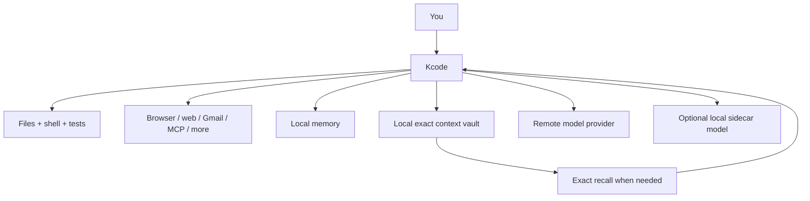

<p align="center">
  
</p>

# Kcode

**Kcode is an open-source terminal AI coding agent for long, real software work.**

It can edit your code, run tests, use tools, remember project details, and keep long sessions manageable by storing old context locally instead of resending a giant transcript forever.

## The short version

Kcode gives you:

- **A terminal-first AI coding agent** that can inspect, edit, test, and debug real repositories.
- **Long-session context management** with local exact-context storage and compact references.
- **Exact recall of old evidence** so previous logs, diffs, and tool outputs do not turn into fuzzy summaries.
- **Persistent memory** for project facts, preferences, and corrections.
- **A broad tool layer** for files, shell, code search, browser automation, web, Gmail, MCPs, todos, goals, subagents, and swarms.
- **Dynamic tool-schema pruning** so simple answers do not pay for every tool definition.
- **Optional local GGUF sidecar model support** for routing, memory, summaries, critique, and local helper tasks.
- **Committed benchmarks** with provider runs, edit→test fixtures, adversarial prompts, token/context telemetry, and artifact checksums.

In plain English: **Kcode is for people who want an AI coding assistant that can keep working in a terminal without losing track of the project.**

[](https://huggingface.co/icedmoca/kcode-oss-20b-mxfp4)

---

## Install

```bash
curl -fsSL https://raw.githubusercontent.com/icedmoca/kcode/main/install/install.sh | bash
kcode
```

For detailed installation, updating, auth, local model, Chromium MCP, and config options, see **[INSTALL.md](INSTALL.md)**.

---

## What makes Kcode different?

Most coding agents are good at short tasks. Kcode is designed for the messier case: a long session where you have already run many commands, produced huge logs, changed files, hit errors, and still need the assistant to remember what happened.

Kcode's core idea is:

> **Do not trust a summary when exact evidence exists locally.**

Kcode can move old bulky context into local references, then recover the exact original text when needed. That keeps prompts smaller while preserving the ability to check the real evidence.



---

## What Kcode offers

### Coding work

- Read and edit source files.
- Apply patches and multi-file changes.
- Run tests, builds, linters, and scripts.
- Debug stack traces, logs, and failing commands.
- Search code with grep, glob, LSP-style stubs, and `agentgrep`.

### Tools and automation

- Shell/background commands.
- File operations.
- Browser automation and screenshots.
- Web search and URL fetch.
- Gmail actions.
- MCP server management.
- Local mouse/screenshot automation.
- Todos, goals, scheduled work, subagents, and swarms.

See **[TOOLS_AND_AGENTS.md](TOOLS_AND_AGENTS.md)** for the detailed tool, agent, and MCP inventory.

### Context and memory

- Local context vault for old bulky evidence.
- Compact `<ctx>` references instead of giant repeated logs.
- `.ctx_get`-style exact recall when details matter.
- Persistent memory for useful facts and preferences.
- Token/context telemetry in `~/.kcode/interlang-stats.jsonl`.

### Benchmarks

Kcode includes a benchmark report and committed artifacts covering:

- provider edit→test runs,
- adversarial hallucination-guard prompts,
- real repo context retrieval tasks,
- token/context replay measurements,
- latency and tool-use smoke tests,
- artifact checksums and methodology.

Read **[BENCHMARKS.md](BENCHMARKS.md)** for the full report.

---

## Comparison with other coding agents

This table is opinionated but practical. It focuses on what a normal user is likely to feel day to day.

| Tool | Interface | Biggest strength | Where Kcode is stronger | Where the other tool may be better |
|---|---|---|---|---|
| **Kcode** | Terminal UI / CLI harness | Long terminal coding sessions with local context vault, memory, tools, benchmarks, and optional local sidecar | This is Kcode | If you want a polished GUI IDE instead of terminal-first work |
| **Cursor** | GUI editor | AI-native IDE experience, inline editing, autocomplete, visual workflow | Kcode is more terminal-first, local-context-vault focused, and benchmark/artifact oriented | Cursor is usually better if you want an editor-first product |
| **Cursor CLI** | CLI companion | Cursor-style assistance from terminal workflows | Kcode is a full harness with memory, local vault, MCP/tools, sidecar, and benchmark artifacts | Better if you already live in Cursor's ecosystem |
| **Claude Code / Claude CLI** | Terminal coding agent | Strong Claude-powered code editing and agent workflow | Kcode emphasizes local-first context storage, exact rehydration, dynamic tool pruning, and open benchmark artifacts | Claude Code may be more polished for Anthropic-native workflows |
| **Codex CLI** | Terminal coding agent | OpenAI-centric terminal coding workflow | Kcode adds local context vault/memory, optional sidecar, broader harness tooling, and benchmark artifacts | Codex CLI may be simpler if you only want OpenAI's official flow |
| **Gemini CLI** | Terminal coding/research agent | Google Gemini workflows and large-context model use | Kcode focuses more on local memory/context-vault mechanics and exact evidence replay | Gemini CLI is natural if you prefer Google's model ecosystem |
| **Aider** | CLI pair programmer | Git-aware patch workflow and mature CLI editing loop | Kcode has a broader tool/agent/memory/context-vault harness | Aider is excellent if you want a focused Git patching tool |
| **Continue** | IDE extension / local assistant | Configurable IDE assistant with local/remote model choices | Kcode is terminal-first with explicit context-vault/replay benchmarks | Continue is better if you want IDE integration and custom model routing |
| **OpenHands / agent frameworks** | Agent runtime / web/CLI | Autonomous software-agent framework | Kcode is lighter as a daily terminal harness with local memory/context focus | Frameworks may be better for research/autonomous-agent experiments |

### The simple positioning

- Choose **Kcode** if you want a terminal coding agent that cares deeply about long-session memory, exact local context, and tool orchestration.
- Choose **Cursor** if you want the best AI IDE experience.
- Choose **Claude Code / Codex CLI / Gemini CLI** if you want the most direct official workflow for a specific model provider.
- Choose **Aider** if you want a focused Git patching assistant.
- Choose **Continue** if you want an IDE extension you can configure around many models.

---

## Documentation

- **[INSTALL.md](INSTALL.md)** - installation, updates, auth, local model, Chromium MCP, config, and uninstall.
- **[TOOLS_AND_AGENTS.md](TOOLS_AND_AGENTS.md)** - built-in tools, agents, MCPs, and automation capabilities.
- **[ABOUT.md](ABOUT.md)** - deeper architecture explanation.
- **[BENCHMARKS.md](BENCHMARKS.md)** - measured benchmarks, methodology, and artifacts.
- **[HALLUCINATION_MITIGATION.md](HALLUCINATION_MITIGATION.md)** - exact recall and hallucination mitigation.
- **[STATISTICS.md](STATISTICS.md)** - context compression and telemetry details.

---

## Repository safety

This repository should contain source code, docs, installer files, benchmarks, and benchmark artifacts only.

Runtime state, logs, credentials, build outputs, and model files belong under your local `~/.kcode` directory and are ignored by `.gitignore`.

---

## Development

```bash
git clone https://github.com/icedmoca/kcode.git
cd kcode
cargo check
cargo build --release --bin kcode
```

Useful validation:

```bash
cargo test --lib
python3 scripts/context_benchmark.py
python3 scripts/final_benchmark_suite.py
```

---

## Links

- GitHub: <https://github.com/icedmoca/kcode>
- Local model: <https://huggingface.co/icedmoca/kcode-oss-20b-mxfp4>
