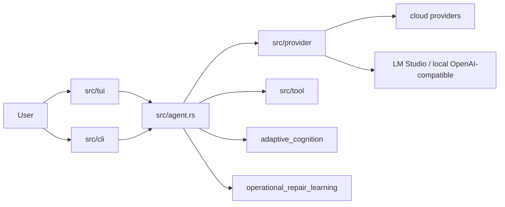

<p align="center">
  
</p>

# Kcode

Kcode is a Rust terminal agent for coding, debugging, provider experimentation, local model diagnostics, adaptive memory, and operational repair learning. It is designed to be hackable: the implementation is in this repository, the documentation is source-backed, and the validation scripts can detect stale inventory.

## Why Kcode exists

Kcode is built for developers who want a terminal-first coding agent that can:

- inspect and edit the same workspace you are using;
- call local tools and shell commands with visible results;
- route across multiple model providers;
- diagnose local LM Studio/OpenAI-compatible model servers;
- remember useful operational signals locally;
- learn recurring repair patterns from build, test, runtime, provider, auth, network, tooling, and context failures;
- keep its documentation synchronized with what is actually implemented.

## Current capabilities

### TUI and interaction

- Chat-oriented terminal UI under `src/tui`.
- Slash command registry with generated inventory in `docs/reference/implementation-inventory.md`.
- Model picker, account picker, sidebars, status rendering, and rendering tests.
- Context sidebar rows use a rainbow `∞` marker instead of a misleading dynamic context bar.

### Agent runtime

- Turn execution in `src/agent.rs` and runtime support crates.
- Tool-call handling, streaming provider responses, turn admission, and result rendering.
- Workspace-aware operation intended for iterative development and validation.

### Provider layer

- Provider implementations under `src/provider`.
- Routing, fallback, account failover, catalog refresh, streaming/SSE parsing, and provider-specific request shaping.
- Local OpenAI-compatible diagnostics via `src/local_model.rs`.

### Tools and integrations

- Shell execution.
- Patch/edit workflows.
- Browser/search/MCP-style integrations where configured.
- Benchmark and simulation binaries under `src/bin` and `crates`.

### Adaptive cognition and repair learning

- `src/adaptive_cognition.rs` stores local execution signals and prompt-memory retrieval data.
- `src/operational_repair_learning.rs` classifies failures, tracks recurrence, calibrates confidence, recommends replay gates, and emits compact repair memory.
- Learned repair motifs are mirrored into adaptive cognition so future prompts can surface prior operational fixes.

## Architecture at a glance



Read the full architecture guide: [`docs/ARCHITECTURE.md`](docs/ARCHITECTURE.md).

## Quick start

```bash
git clone https://github.com/icedmoca/kcode.git
cd kcode
cargo build --release
```

For operating-system-specific setup, PATH changes, WSL notes, Rust installation, native dependencies, and LM Studio setup, read [`docs/INSTALL.md`](docs/INSTALL.md).

## Documentation map

| Document | Purpose |
| --- | --- |
| [`docs/INSTALL.md`](docs/INSTALL.md) | Full install guide for Linux, macOS, Windows, and WSL, plus LM Studio setup. |
| [`docs/ARCHITECTURE.md`](docs/ARCHITECTURE.md) | Comprehensive subsystem architecture and implementation map. |
| [`docs/OPERATIONS.md`](docs/OPERATIONS.md) | Development, validation, diagnostics, provider operations, local models, and repair learning. |
| [`docs/reference/implementation-inventory.md`](docs/reference/implementation-inventory.md) | Generated inventory of binaries, slash commands, provider files, and public modules. |
| [`docs/BENCHMARKS.md`](docs/BENCHMARKS.md) | Benchmark notes and historical benchmark context. |
| [`docs/ABOUT.md`](docs/ABOUT.md) | Project background and extended notes. |

## Common development loop

```bash
cargo fmt
cargo check --lib
cargo test --lib operational_repair_learning
python3 scripts/validate_docs.py
```

Use focused tests for the subsystem you touched, then broaden validation before merging larger changes.

## Local models and LM Studio

Kcode can diagnose local OpenAI-compatible servers such as LM Studio.

```text
/kcode-local-model
```

For benchmark runs:

```bash
cargo run --bin kcode-bench -- \
  --local-provider lmstudio \
  --local-url http://127.0.0.1:1234/v1 \
  --local-model '<model-id>'
```

The complete LM Studio instructions are now part of [`docs/INSTALL.md`](docs/INSTALL.md#lm-studio-and-local-openai-compatible-models).

## Keeping docs truthful

After adding or renaming binaries, provider files, public modules, or slash commands:

```bash
python3 scripts/validate_docs.py --write-inventory
python3 scripts/validate_docs.py
```

The validator checks required docs, required implementation anchors, generated inventory freshness, and README truth anchors.

## Repository ownership note

Kcode evolves quickly. When changing behavior, prefer implementation-backed docs, focused tests, and commits that keep the repo buildable at each step.
