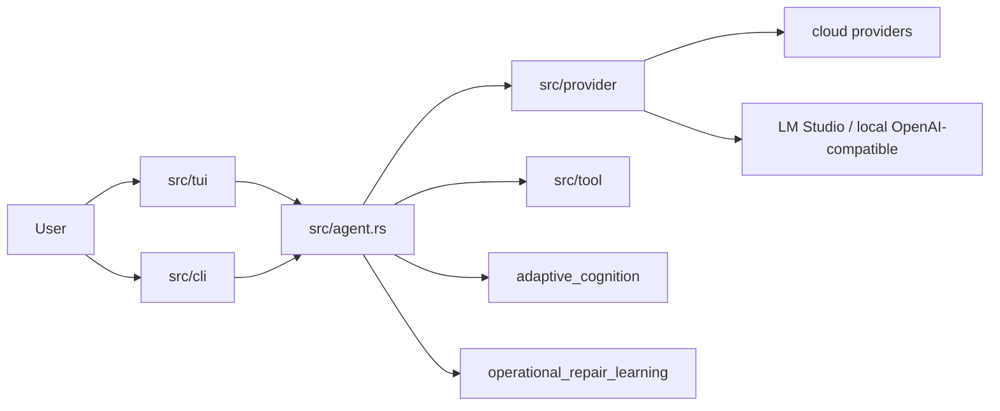

# Kcode

Kcode is a Rust terminal agent for coding, debugging, provider experimentation, local model diagnostics, and adaptive operational repair learning.

This repository is the source of truth. The documentation is intentionally tied to implementation inventory generated from the Rust source tree.

## What Kcode currently includes

- Terminal UI with chat, slash commands, model/account selection, status sidebars, and rendering tests.
- CLI entry points for interactive, remote/headless, auth, and utility flows.
- Provider adapters under `src/provider` with routing, streaming, failover, fallback, catalog refresh, and account failover support.
- Tool execution layer under `src/tool` for shell, editing/patching, browser/search, memory, scheduling, and MCP-style integrations.
- Adaptive cognition in `src/adaptive_cognition.rs` for local execution signals and prompt-memory retrieval.
- Operational repair learning in `src/operational_repair_learning.rs` for failure classification, recurring repair motifs, confidence calibration, and replay-gate recommendations.
- LM Studio/local OpenAI-compatible diagnostics through `src/local_model.rs` and `docs/LMSTUDIO.md`.
- Benchmark/simulation binaries including provider/local benchmarking and TUI benchmarking.

## Architecture at a glance



Read the full architecture guide: [`docs/ARCHITECTURE.md`](docs/ARCHITECTURE.md).

## Documentation map

| Document | Purpose |
| --- | --- |
| [`docs/ARCHITECTURE.md`](docs/ARCHITECTURE.md) | Current subsystem architecture and implementation paths. |
| [`docs/OPERATIONS.md`](docs/OPERATIONS.md) | Day-to-day operation, validation, local model checks, and repair learning operations. |
| [`docs/LMSTUDIO.md`](docs/LMSTUDIO.md) | LM Studio/local OpenAI-compatible setup and diagnostics. |
| [`docs/LIMITATIONS.md`](docs/LIMITATIONS.md) | Honest limitations and non-goals. |
| [`docs/OPERATIONAL_MATURITY.md`](docs/OPERATIONAL_MATURITY.md) | Implemented maturity levels and extension path. |
| [`docs/reference/implementation-inventory.md`](docs/reference/implementation-inventory.md) | Generated inventory of binaries, slash commands, provider files, and public modules. |
| [`docs/INSTALL.md`](docs/INSTALL.md) | Installation notes. |
| [`docs/BENCHMARKS.md`](docs/BENCHMARKS.md) | Benchmark notes and historical benchmark context. |

## Quick development loop

```bash
cargo fmt
cargo check --lib
cargo test --lib operational_repair_learning
python3 scripts/validate_docs.py
```

Use focused tests for the subsystem you touched, then broaden validation before merging larger changes.

## Local models and LM Studio

Kcode can diagnose local OpenAI-compatible servers such as LM Studio.

```text
/kcode-local-model
```

For benchmark runs:

```bash
cargo run --bin kcode-bench -- \
  --local-provider lmstudio \
  --local-url http://127.0.0.1:1234/v1 \
  --local-model '<model-id>'
```

See [`docs/LMSTUDIO.md`](docs/LMSTUDIO.md).

## Adaptive failure intelligence

The operational repair learning subsystem classifies failures into operational classes, tracks recurrence, learns repair motifs, calibrates confidence from repair outcomes, and recommends replay gates. Learned repair motifs are mirrored into adaptive cognition so compact prompt memory can surface prior repairs.

Relevant files:

- `src/operational_repair_learning.rs`
- `src/adaptive_cognition.rs`
- `docs/OPERATIONS.md`
- `docs/OPERATIONAL_MATURITY.md`

## Keeping docs truthful

After adding or renaming binaries, provider files, public modules, or slash commands:

```bash
python3 scripts/validate_docs.py --write-inventory
python3 scripts/validate_docs.py
```

The validator checks required docs, required implementation anchors, and generated inventory freshness.
