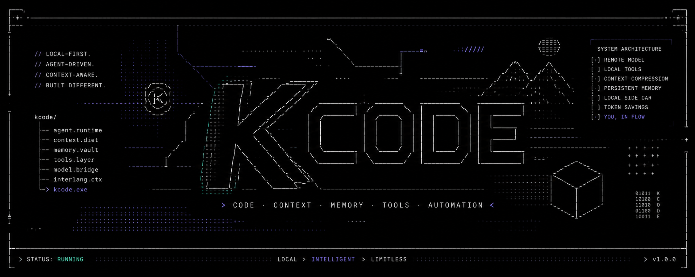
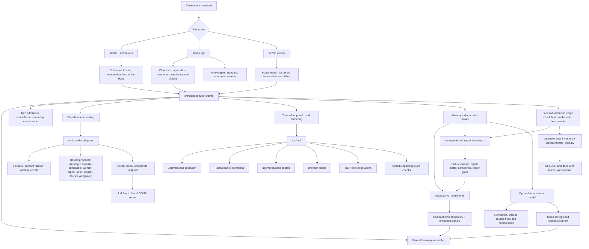

<p align="center">
  
</p>

# Kcode

Kcode is a Rust terminal agent for coding, debugging, provider experimentation, local model diagnostics, adaptive memory, and operational repair learning. It is designed to be hackable: the implementation is in this repository, the documentation is source-backed, and the validation scripts can detect stale inventory.

## Quick install

Run the installer, reload your shell path if needed, then start Kcode:

```bash
curl -fsSL https://raw.githubusercontent.com/icedmoca/kcode/main/install/install.sh | bash
exec "$SHELL" -l
kcode
```

If you already cloned the repo locally, you can run:

```bash
./install.sh
kcode
```

## Why Kcode exists

Kcode is built for developers who want a terminal-first coding agent that can:

- inspect and edit the same workspace you are using;
- call local tools and shell commands with visible results;
- route across multiple model providers;
- diagnose local LM Studio/OpenAI-compatible model servers;
- remember useful operational signals locally;
- learn recurring repair patterns from build, test, runtime, provider, auth, network, tooling, and context failures;
- keep its documentation synchronized with what is actually implemented.

## Current capabilities

### Excellent adaptive memory

Kcode has a strong local memory system designed for real coding work. Its adaptive cognition layer records useful execution signals, retrieves compact prompt memory, and keeps prior operational context available without dumping entire transcripts back into every turn. On top of that, operational repair learning turns repeated build, test, provider, runtime, auth, network, tooling, and context failures into reusable repair motifs.

The result is memory that is practical rather than noisy: Kcode can carry forward what mattered, surface prior fixes when similar failures recur, and keep improving its repair instincts while staying deterministic, local, and testable. This makes Kcode especially good at long-running repository evolution where the agent benefits from remembering what worked, what failed, and what validation was needed.

### Token savings from memory and local sidecar work

Kcode is designed to save tokens by remembering the right things instead of replaying everything. Adaptive cognition keeps compact, high-signal memory; repair learning stores concise failure→fix motifs; and the optional local sidecar model can handle cheaper support work such as summaries, routing hints, critique, memory compression, and local diagnostics. That means the expensive frontier model can spend more context on the current task while Kcode preserves continuity through compact local state.

In practice this helps long sessions stay efficient: less repeated explanation, less transcript bloat, fewer repeated investigations, and faster recovery when a familiar build or test failure returns. The local sidecar model is especially useful as a low-cost assistant for background understanding while the primary provider focuses on the hard reasoning step.

### TUI and interaction

- Chat-oriented terminal UI under `src/tui`.
- Slash command registry with generated inventory in `docs/reference/implementation-inventory.md`.
- Model picker, account picker, sidebars, status rendering, and rendering tests.
- Context sidebar rows use a rainbow `∞` marker instead of a misleading dynamic context bar.
- The local sidecar model can support UI-facing workflows by providing inexpensive summaries, command explanations, and compact context hints without spending premium provider tokens.

### Agent runtime

- Turn execution in `src/agent.rs` and runtime support crates.
- Tool-call handling, streaming provider responses, turn admission, and result rendering.
- Workspace-aware operation intended for iterative development and validation.
- The local sidecar model can help with low-risk routing, summarization, and preflight analysis so the main agent turn keeps more context for decisions that need the strongest model.

### Provider layer

- Provider implementations under `src/provider`.
- Routing, fallback, account failover, catalog refresh, streaming/SSE parsing, and provider-specific request shaping.
- Local OpenAI-compatible diagnostics via `src/local_model.rs`.
- The local sidecar model gives Kcode a cheap nearby model path for diagnostics, sanity checks, and fallback-style support when cloud calls are unnecessary or should be preserved.

### Tools and integrations

- Shell execution.
- Patch/edit workflows.
- Browser/search/MCP-style integrations where configured.
- Benchmark and simulation binaries under `src/bin` and `crates`.
- The local sidecar model can summarize tool output, compress noisy logs, and help decide which validation result matters before escalating back to the primary model.

### Adaptive cognition and repair learning

- `src/adaptive_cognition.rs` stores local execution signals and prompt-memory retrieval data.
- `src/operational_repair_learning.rs` classifies failures, tracks recurrence, calibrates confidence, recommends replay gates, and emits compact repair memory.
- Learned repair motifs are mirrored into adaptive cognition so future prompts can surface prior operational fixes.
- The local sidecar model is a natural fit for memory compression: it can condense long histories, logs, and repeated failures into compact records that save tokens while preserving continuity.

## Architecture at a glance




Read the full architecture guide: [`docs/ARCHITECTURE.md`](docs/ARCHITECTURE.md).

## Quick start

```bash
git clone https://github.com/icedmoca/kcode.git
cd kcode
cargo build --release
```

For operating-system-specific setup, PATH changes, WSL notes, Rust installation, native dependencies, and LM Studio setup, read [`docs/INSTALL.md`](docs/INSTALL.md).

## Documentation map

| Document | Purpose |
| --- | --- |
| [`docs/INSTALL.md`](docs/INSTALL.md) | Full install guide for Linux, macOS, Windows, and WSL, plus LM Studio setup. |
| [`docs/ARCHITECTURE.md`](docs/ARCHITECTURE.md) | Comprehensive subsystem architecture and implementation map. |
| [`docs/OPERATIONS.md`](docs/OPERATIONS.md) | Development, validation, diagnostics, provider operations, local models, and repair learning. |
| [`docs/reference/implementation-inventory.md`](docs/reference/implementation-inventory.md) | Generated inventory of binaries, slash commands, provider files, and public modules. |
| [`docs/BENCHMARKS.md`](docs/BENCHMARKS.md) | Benchmark notes and historical benchmark context. |
| [`docs/ABOUT.md`](docs/ABOUT.md) | Project background and extended notes. |

## Common development loop

```bash
cargo fmt
cargo check --lib
cargo test --lib operational_repair_learning
python3 scripts/validate_docs.py
```

Use focused tests for the subsystem you touched, then broaden validation before merging larger changes.

You can also run `/improve` inside the TUI to start safe recursive self-improvement. The command is intended to propose and execute bounded, reviewable improvements with validation instead of uncontrolled rewrites.

## Supported model/provider matrix

<p align="center">
  
  
  
  
  
  
  
  
  
  
  
  
  
  
  
  
</p>

Provider/model availability depends on credentials, endpoint health, catalog refresh, and the specific adapter implementation under `src/provider`. The generated provider inventory is in [`docs/reference/implementation-inventory.md`](docs/reference/implementation-inventory.md).
