# About Kcode

Kcode is a local-first coding agent harness. It combines a remote frontier model, local tools, context compression, persistent memory, and a local GGUF sidecar model into one terminal workflow.

The short version:

- **Remote model:** does the main reasoning and response generation, for example GPT-5.5.
- **Kcode harness:** owns tools, files, terminal commands, browser/mouse automation, memory, token-saving context transforms, and runtime orchestration.
- **Local model sidecar:** helps with routing, memory extraction, summaries, critique, and bridge telemetry.
- **Context diet / interlang:** saves tokens by replacing old low-value exact context with compact summaries and rehydratable references.
- **Memory system:** keeps useful facts, preferences, and project state outside the main context window, then injects relevant memory when needed.
- **Dynamic tool schemas:** direct-answer turns send only core tools plus `tool_expand`; tool-heavy turns get the relevant schemas up front.

---

## 1. High-level architecture

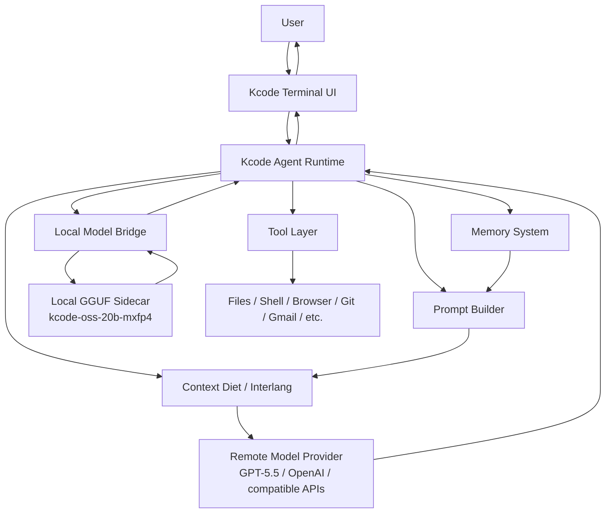

Kcode is not just a wrapper around an LLM API. It is the orchestration layer that decides what context to send, which tools are available, when to compact old data, when to recall memory, when to call the local sidecar, and how to persist useful information.

---

## 2. How token savings work

Kcode saves tokens, but the deeper point is context reliability. Without a retrieval layer, long sessions eventually face a bad choice: either resend an enormous transcript forever, or silently drop older tool output and hope the model guesses correctly from partial memory. That is where many long coding sessions drift.

Kcode's answer is not ordinary compression. It is **lossless externalized context with explicit epistemics**:

- exact old evidence is stored outside the provider prompt,
- summaries are useful breadcrumbs but are **not authoritative**,
- compact refs are stable pointers to exact evidence,
- `.ctx_get` is a first-class retrieval protocol when exact text matters.

Normal chat systems often resend a growing transcript:

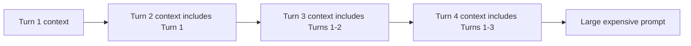

Kcode instead uses a **context diet** that externalizes old evidence without destroying it. Old tool output, logs, repeated text, and already-seen content become compact references backed by exact local vault entries. Without this, long sessions silently drop critical tool output and the model guesses.

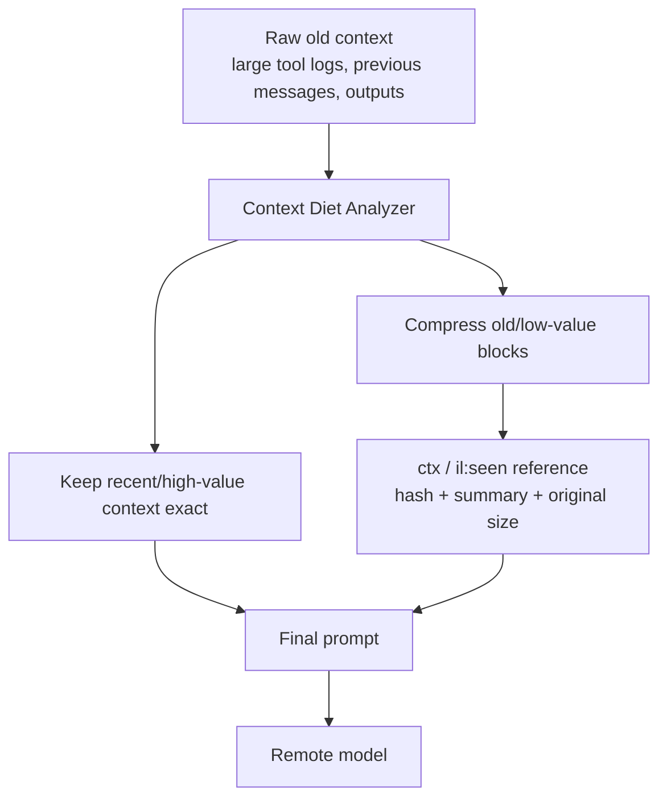

A compacted block looks conceptually like this:

```xml
<ctx k="old-tool-result" id="ctx:hash" n=279518 c="0.66" p="high" ar="true" t="build,error" s="lines=...; files=...; first=..."/>
```

That means the model still sees the removed block type, stable id/hash, original
size, confidence, priority, semantic topics, and deterministic summary. The exact
text is not repeated by default; the decoder prompt defines `.ctx_get id=...` as
the recovery path when exact old content matters.

### Token-saving modes

Kcode has an interlang/context compression path with modes such as safe, verified, aggressive, and ultra. The main active behavior is:

1. **Recent context stays exact.** The newest messages and current task details remain readable.
2. **Old bulky context is externalized losslessly.** Long tool results, repeated logs, and old low-value content become compact `<ctx>` references backed by exact local vault entries. Without this, long sessions silently drop critical tool output and the model guesses.
3. **Summaries are non-authoritative.** Ref summaries help routing and reasoning, but exact vaulted text is the source of truth.
4. **Seen content can become a reference.** If exact content was already provided earlier, later turns can use `<il:seen>` rather than resending it.
5. **The model can page fault exact text.** If a summary is insufficient, it can request `.ctx_get id=...`. This is the core active retrieval loop, similar to a virtual-memory page fault.
6. **Auto-restore is relevance-gated.** Kcode only proactively restores exact excerpts when the old block's topics match the latest real user turn.
7. **Stats are local-first.** Kcode logs original chars, encoded chars, saved chars, estimated saved tokens, and exact local-tokenizer estimates when available. Stats reminders are only injected for token/context-related turns.

Current ultra-mode defaults are tuned for long GPT-5.5 style coding sessions:

| Setting | Default | Purpose |
|---|---:|---|
| `KCODE_CONTEXT_DIET_TRIGGER_TOKENS` | `24000` | Start replacing old bulky blocks once the prompt is roughly this large. |
| `KCODE_CONTEXT_DIET_RECENT_MESSAGES` | `8` | Keep the newest messages exact so current task details remain visible. |
| `KCODE_CONTEXT_DIET_MIN_BLOCK_CHARS` | `420` | Old text/tool/reasoning blocks at or above this size can become `<ctx>` refs. |

These can be overridden per session. Lower values save more tokens but may cause
more `.ctx_get` rehydration requests when exact old content becomes important.

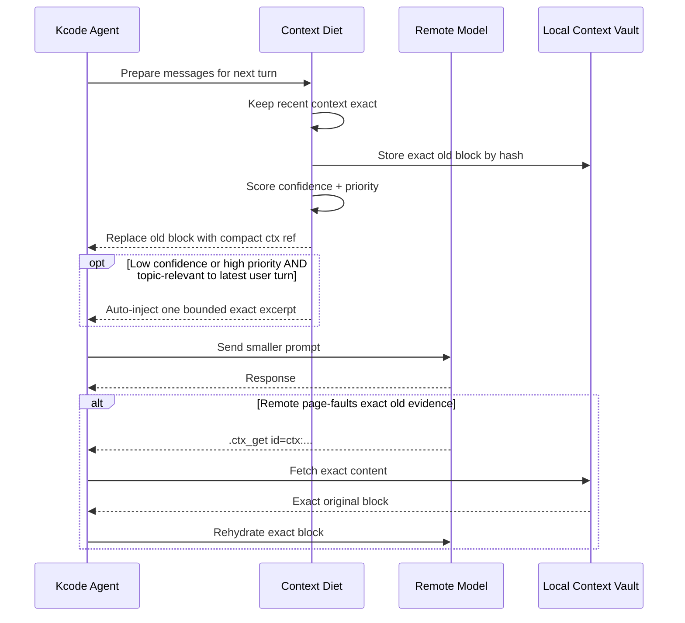

### How retrieval selection works

Kcode's retrieval system is the main behavior shift. Normal systems have passive context: whatever is currently in the prompt is all the model gets. Kcode has an active retrieval protocol: the prompt can contain compact handles, and the model can fault exact evidence back in when needed.

The key idea is that context diet is **lossless at the vault layer** and **selective at the active-prompt layer**. This is not just compression. It is externalized exact context with explicit epistemics: summaries are hints, refs are pointers, and vaulted text is the authority.

There are three different states for old context:

| State | What the remote model sees | What Kcode keeps locally | When it is used |
|---|---|---|---|
| Recent exact context | Full text | Full text | Current task, newest turns, important active details. |
| Compact reference | `<ctx ... />` metadata, topics, summary, hash, ID | Full original text in the local vault | Old bulky logs, tool output, repeated text, stale details. |
| Rehydrated exact context | A bounded exact excerpt or full fetched block | Full original text remains stored | Debugging, fixing, failure analysis, explicit `.ctx_get`, or high-confidence relevance. |

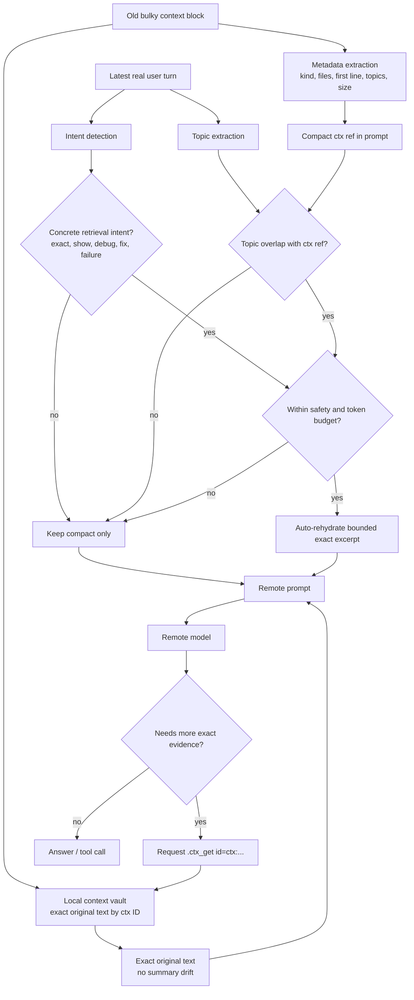

Retrieval selection is intentionally conservative:

1. **Keep the active work exact.** Kcode keeps the newest and most task-relevant messages readable without retrieval.
2. **Vault old bulky blocks.** When old content becomes expensive, Kcode stores the exact original text by stable ID/hash and sends a compact `<ctx>` ref.
3. **Expose useful breadcrumbs.** The ref includes type, size, priority, confidence, topics, files, and a deterministic summary so the model knows what exists.
4. **Avoid generic false positives.** Words like `test`, `build`, `token`, or `memory` do not by themselves cause exact old code/logs to be injected.
5. **Require concrete retrieval intent.** Proactive exact restore now requires an intent such as exact inspection, showing context, debugging, fixing, or investigating a failure.
6. **Require topic overlap.** The latest user turn must match the old block's semantic topics before Kcode spends prompt budget on exact rehydration.
7. **Cap proactive restore.** Kcode restores at most a small bounded excerpt automatically so one old block cannot flood the prompt.
8. **Preserve explicit perfect recall.** If exact lines matter, `.ctx_get id=...` retrieves the original vaulted text, not a regenerated summary. This is the page-fault path that turns compact context into exact evidence on demand.

This makes Kcode different from ordinary summarization. Summaries can drift over time; Kcode's compact refs are pointers to exact stored evidence. The model does not always have every old token in the active prompt, but it has stable handles and a protocol for retrieving exact old evidence when needed. In practice, this gives Kcode a large retrieval-backed effective context window with much lower token cost and less distraction.

The analogy is virtual memory for context:

```text
normal long chat: prompt-only context, older details are compressed away or forgotten
Kcode: active prompt + exact external context store + explicit page-fault retrieval
```

That is the novelty: exact context is never treated as destroyed, summaries are explicitly non-authoritative, and retrieval is first-class.

### Why prompts are still not tiny

Even after large savings, a final prompt may still be tens of thousands of characters because it includes:

- system/developer instructions,
- tool schemas,
- recent turns,
- current task details,
- memory reminders,
- compact summaries,
- and safety/protocol instructions.

The important part is that old raw context may be hundreds of thousands of characters, while the sent compact references may only be a small fraction of that.

---

## 3. Interlang and context vault references

Kcode uses a lightweight inter-language protocol inspired by context references and deterministic compression.

Main reference types:

| Type | Purpose |
|---|---|
| `<ctx ... />` | A local context-vault reference for old content stored by Kcode. |
| `<il:seen ... />` | A reference to exact content already seen earlier in the session. |
| `<il:v1>...</il>` | A compact encoding for repetitive lines or path prefixes. |
| `.ctx_get id=...` | A request for Kcode to rehydrate exact hidden content. |

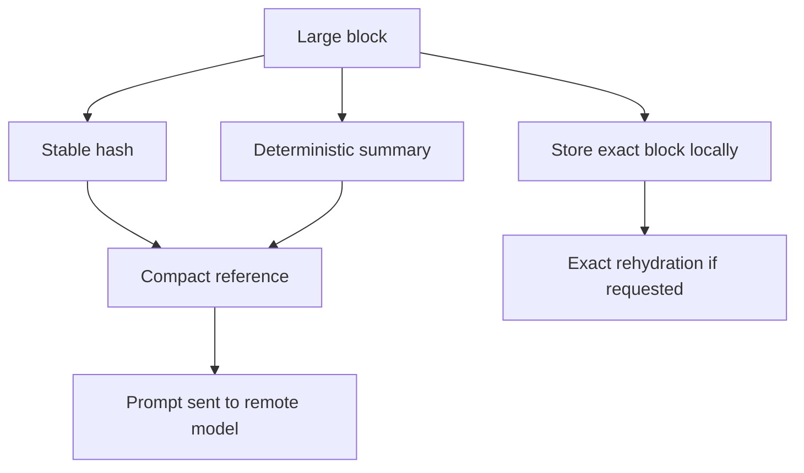

This is designed to be conservative: summaries are useful for normal reasoning, but they are non-authoritative. Exact hidden text is not invented or regenerated. If exact lines matter, the model is instructed to page-fault the original evidence with `.ctx_get`.

---

## 4. How memory works

Kcode memory is separate from raw chat history. Instead of depending only on the current prompt, Kcode can store durable facts and retrieve them later.

Memory can include:

- user preferences,
- project facts,
- implementation decisions,
- corrections,
- entities,
- useful summaries,
- and task-specific state.

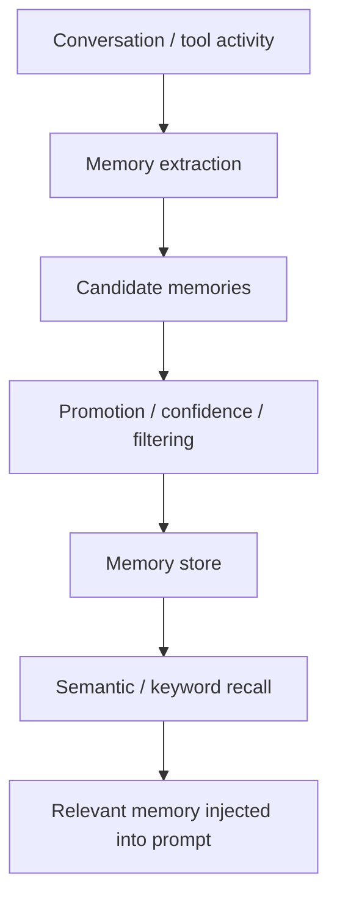

### Memory lifecycle

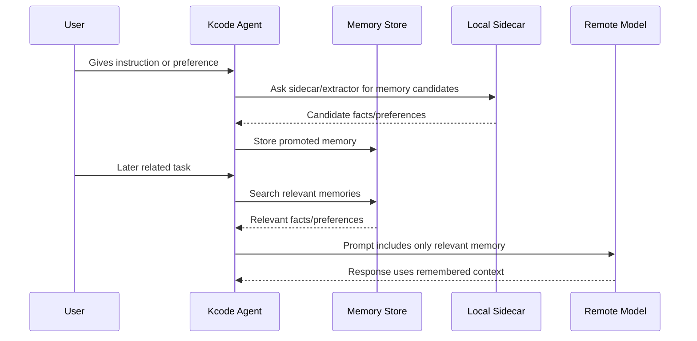

### Why memory saves tokens

Without memory, important facts must stay in the chat transcript forever. With memory, Kcode can store compact durable facts and only inject relevant ones.

For example, instead of resending a long conversation about a project rename, memory can store:

```text
User renamed Jcode to Kcode. Active Kcode home is ~/.kcode. Legacy ~/.jcode compatibility matters.
```

That is much cheaper than carrying the entire rename conversation forever.

---

## 5. Local model bridge

The local model bridge is the layer between Kcode and the local GGUF sidecar model.

Default local sidecar model identity:

```text
kcode-oss-20b-mxfp4
```

Default local file:

```text
~/.kcode/models/gguf/kcode-oss-20b-mxfp4.gguf
```

Installer source:

```text
https://huggingface.co/icedmoca/kcode-oss-20b-mxfp4
```

The bridge can help with:

- pre-routing,
- local critique,
- memory extraction,
- summarization,
- prompt/exchange logging,
- and local-only assistant support tasks.

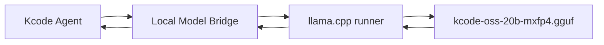

### Bridge logs

Kcode can record local bridge telemetry such as:

- upstream provider,
- upstream model,
- local model identity,
- prompt size,
- response size,
- prompt summaries,
- and memory promotion events.

This is useful for debugging whether compression is actually reducing what gets sent to the remote provider.

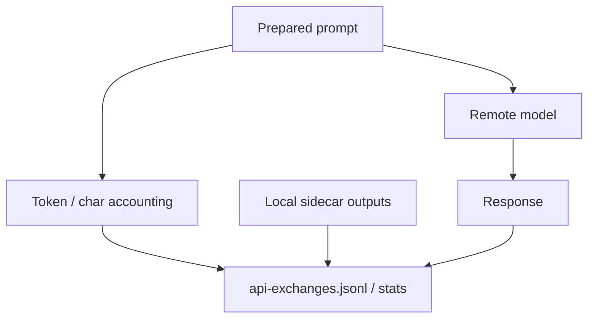

---

## 6. Tool layer

Kcode gives the agent controlled access to local tools. Depending on configuration, this can include:

- shell commands,
- file reads/writes/patches,
- code search,
- browser automation,
- mouse/screenshot automation,
- Gmail helpers,
- background tasks,
- TODO tracking,
- memory management,
- and multi-agent/swarm coordination.

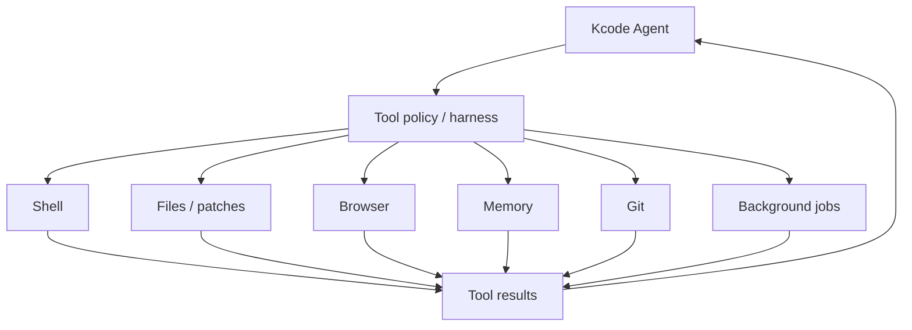

Tool output can be large, so tool results are one of the biggest targets for context diet compression.

---

## 7. Install layout

After running the installer, the normal layout is:

```text
~/.kcode/
  build-src/kcode/              # cloned source repo
  builds/current/               # active installed build
  builds/stable/                # stable installed build
  models/gguf/
    kcode-oss-20b-mxfp4.gguf    # local sidecar model
  local-model-bridge/           # local bridge logs/state
  memory-store/                 # persistent memory
```

Command wrappers are installed to:

```text
~/.local/bin/kcode
~/.local/bin/jcode   # compatibility alias
```

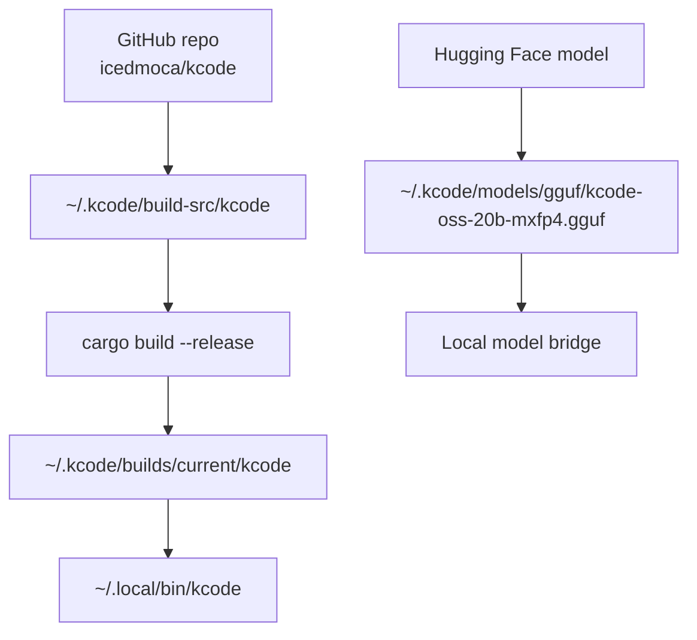

---

## 8. One-command install

```bash
curl -fsSL https://raw.githubusercontent.com/icedmoca/kcode/main/install/install.sh | bash
```

The installer:

1. clones `https://github.com/icedmoca/kcode`,
2. downloads `kcode-oss-20b-mxfp4.gguf` from Hugging Face,
3. builds Kcode,
4. installs `kcode` into `~/.local/bin`,
5. creates compatibility aliases,
6. and stores everything under `~/.kcode`.

---

## 9. Design goals

Kcode is designed around a few practical goals:

- **Spend remote tokens on useful current context, not old logs.**
- **Keep exact old context available locally when needed.**
- **Use memory for durable facts instead of bloating the transcript.**
- **Use a local model for cheap helper work.**
- **Keep the main remote model focused on high-value reasoning.**
- **Make the system observable with accounting logs and stats.**

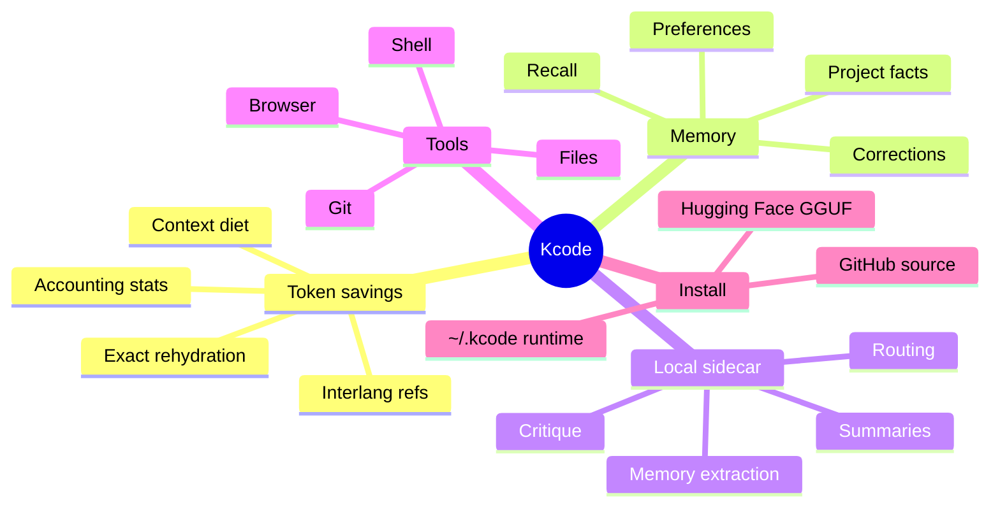

---

## 10. Practical example

A user asks a tiny follow-up like:

```text
ok did it work?
```

A normal transcript-based system might resend a large amount of previous tool output. Kcode can instead send:

- the recent exact messages,
- compact summaries of old tool output,
- memory facts relevant to the task,
- and references for exact old content if needed.

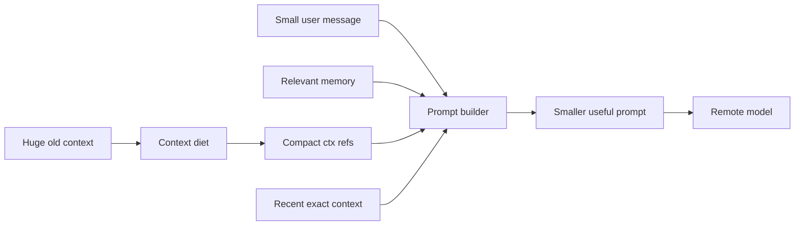

That is the core idea: Kcode keeps the useful state, but avoids paying to resend every byte of old context every turn.

---

## Hallucination mitigation and exact-evidence design

Kcode does not claim to make hallucinations impossible. Instead, it attacks the main causes of hallucination in long coding sessions: missing context, stale context, unverifiable tool output, lossy summaries with no escape hatch, and memory drift.

The core idea is simple:

> Kcode reduces the need to guess by keeping exact evidence locally, sending compact but accountable summaries to the model, and allowing exact rehydration whenever summary-level context is not enough.

---

## 1. The hallucination problem in long tool-heavy chats

In coding agents, hallucinations usually come from one of these failure modes:

| Failure mode | What happens | Kcode countermeasure |
|---|---|---|
| Context overload | The prompt gets too large, so important details are dropped or buried. | Context diet compresses old low-value blocks while preserving recent/high-value exact context. |
| Lost evidence | Tool results or file contents are summarized and exact text is gone. | Kcode stores exact old blocks locally by stable hash and can rehydrate them. |
| Summary overtrust | A model treats a summary as if it were exact source text. | `<ctx>` references explicitly say summary is not exact and include `.ctx_get` recovery instructions. |
| Stale memory | Old remembered facts override current repo state. | Memory is used as hints, while tools and exact file reads remain authoritative. |
| Unsupported claims | The model invents file names, code behavior, or test results. | Tool-first workflows, patch verification, tests, and local accounting logs create evidence. |
| Repeated giant logs | Huge logs encourage truncation and loss of important lines. | Logs become summarized references with semantic hints and exact retrieval when needed. |

---

## 2. System overview

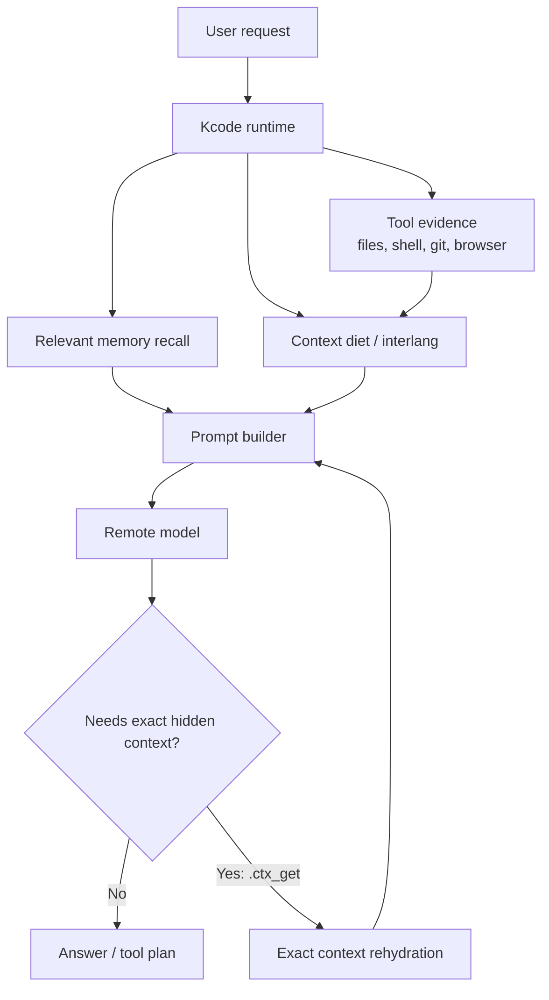

Kcode combats hallucination by making the model reason from evidence:

1. **Recent exact context** remains visible.
2. **Old bulky context** becomes compact references.
3. **Exact old content** remains locally available.
4. **Memory** adds durable facts, but does not replace verification.
5. **Tools/tests** validate claims before final answers.

---

## 3. Context diet: reducing confusion without deleting evidence

A normal long chat often forces a bad tradeoff:

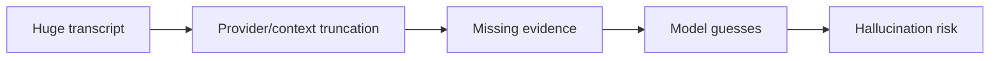

Kcode avoids that by replacing old low-value blocks with structured references:

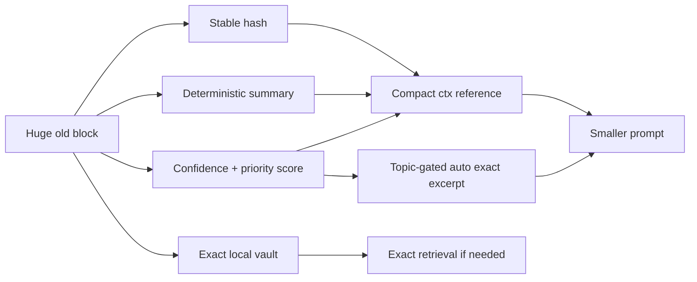

A `<ctx>` reference is intentionally compact but accountable:

```xml
<ctx k="old-tool-result" id="ctx:..." n=8507 c="0.56" p="high" ar="true" t="build,error" s="lines=...; chars=...; files=[...]; first=..."/>
```

The decoder prompt defines the schema once, so each reference does not repeat the
same long policy text. This combats hallucination because the model still sees:

- this is a summary, not exact text,
- exact content exists locally,
- a stable id/hash identifies it,
- Kcode has scored confidence, priority, and semantic topics,
- and it should request `.ctx_get id=...` instead of inventing details.

If Kcode itself decides a compacted block is low-confidence or high-priority, it
can proactively inject an exact excerpt, but only when that block's semantic
topics overlap the latest real user turn. Auto-restore is capped to one short
excerpt by default. This preserves the anti-hallucination benefit for relevant
old evidence while avoiding unrelated old logs, diffs, or API output being
re-injected into unrelated tasks. Sensitive-looking content is excluded from
automatic exact injection and remains explicit-request only.

Current ultra-mode defaults are deliberately tuned for long tool-heavy coding
sessions: begin context diet at roughly `24,000` prompt tokens, keep the newest
`8` messages exact, and allow old text/tool/reasoning blocks of `420+` chars to
be replaced by `<ctx>` references. Those defaults save more tokens than the
earlier conservative diet while preserving the current task and a rehydration
escape hatch.

---

## 4. Exact rehydration: the anti-guessing escape hatch

If the model needs exact old content, it can ask for it with:

```text
.ctx_get id=ctx:<hash> reason=<why exact old context is needed>
```

or:

```text
. err need_ref <hash>
```

Kcode parses that request, retrieves the exact block from the local vault, and injects it back into the conversation.

If the model knows the topic but not the id, it can search refs first:

```text
.ctx_search query=<path/function/error/topic> reason=<why this search is needed>
```

Kcode returns matching context references and summaries only. The model must still call `.ctx_get id=<id> reason=<why>` for exact text; summaries are not authority.

You can inspect retrieval state in the TUI with `/context` or `/tokens`. This reports current-turn retrieval counts, duplicate/cap suppressions, injected chars, and recent retrieval events.

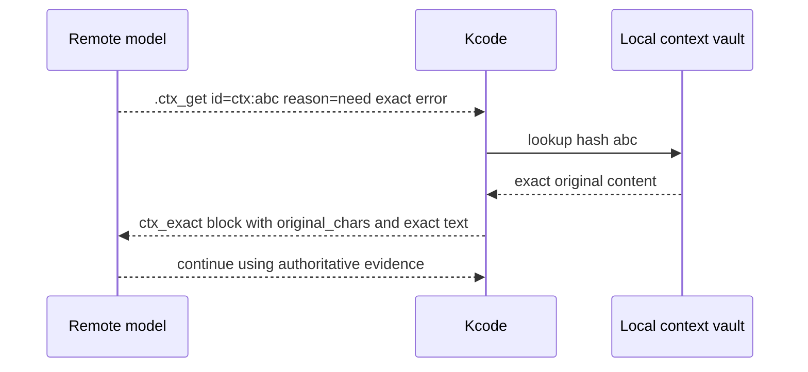

This matters because summaries are useful for orientation, but exact code, errors, command output, and file contents are often required for correctness.

---

## 5. Memory: durable hints, not fake evidence

Kcode memory stores useful durable facts outside the main chat transcript.

Examples:

- user preferences,
- project facts,
- rename decisions,
- known paths,
- prior corrections,
- long-term workflow preferences.

Memory is not treated as proof that the current repository still matches the fact. It is a retrieval system that helps the agent know what to check.

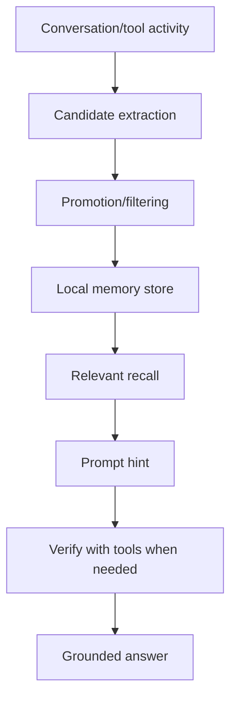

### How this reduces hallucination

Without memory, the model may try to infer old decisions from partial context. With memory, Kcode can preserve a compact durable statement such as:

```text
The active repo was renamed from Jcode to Kcode. The Kcode home is ~/.kcode. Legacy ~/.jcode compatibility matters.
```

That prevents the model from guessing the rename state. But Kcode can still verify with files and git before making claims.

---

## 6. Tool-first grounding

Kcode has tool access for files, shell commands, git, browser, background jobs, and more. The agent is expected to inspect and test rather than guess.

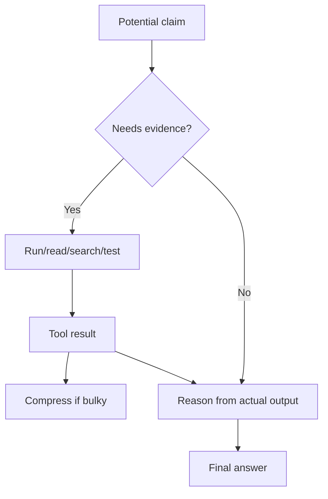

Examples:

- Before saying a build works, run `cargo check` or relevant tests.
- Before saying a file exists, list/read it.
- Before saying GitHub has a file, fetch the raw URL or inspect remote refs.
- Before saying token savings are active, inspect `interlang-stats.jsonl` and prompt accounting.

---

## 7. Local model bridge: helper, not final authority

The local sidecar model can help with routing, summaries, memory extraction, and critique. It is not treated as the final source of truth.

```mermaid
flowchart LR
    K[Kcode runtime] --> B[Local model bridge]
    B --> L[kcode-oss-20b-mxfp4 GGUF]
    L --> B
    B --> K
    K --> R[Remote main model]
    R --> K
```

The bridge reduces hallucination indirectly by:

- summarizing and extracting memory candidates,
- creating local critique or second-pass checks,
- logging prompt/response metadata,
- and making token/context behavior observable.

But file contents, command output, tests, and exact rehydrated context remain more authoritative than sidecar guesses.

---

## 8. Real Kcode data from live context-diet accounting

The following data was measured from the local Kcode `interlang-stats.jsonl` on this machine during real usage after the more aggressive ultra-mode context-diet tuning.

### Recent 50 compaction events

| Metric | Value |
|---|---:|
| Total compaction events analyzed | 50 |
| Total original chars compacted | 16,709,366 |
| Total encoded chars sent for those blocks | 1,372,721 |
| Average char reduction | 91.78% |
| Estimated tokens saved, total | 3,834,161 |
| Estimated tokens saved, average/event | 76,683.22 |
| Exact local-tokenizer tokens saved, total | 5,914,442 |
| Exact local-tokenizer tokens saved, average/event | 118,288.84 |
| Total blocks encoded | 2,372 |
| Average blocks encoded/event | 47.44 |

### Latest observed compaction event

| Metric | Value |
|---|---:|
| Blocks encoded | 65 |
| Original chars | 377,444 |
| Encoded chars | 36,544 |
| Saved chars | 340,900 |
| Estimated saved tokens | 85,225 |
| Exact original tokens | 143,681 |
| Exact encoded tokens | 15,503 |
| Exact saved tokens | 128,178 |
| Diet blocks | 63 |
| Seen-ref blocks | 2 |
| Raw context avoided, estimated tokens | 94,361 |

### Visualized

```mermaid
xychart-beta
    title "Latest observed compaction event"
    x-axis ["Original chars", "Encoded chars", "Saved chars"]
    y-axis "Characters" 0 --> 400000
    bar [377444, 36544, 340900]
```

```mermaid
xychart-beta
    title "Latest observed token accounting"
    x-axis ["Exact original", "Exact encoded", "Exact saved"]
    y-axis "Tokens" 0 --> 150000
    bar [143681, 15503, 128178]
```

```mermaid
pie title Recent 50 events: original vs encoded chars
    "Encoded chars sent" : 1372721
    "Chars avoided" : 15336645
```

These numbers matter for hallucination because they show that Kcode is not just truncating huge context. It is converting old context into compact references while keeping exact content locally recoverable.

---

## 9. Why compression can reduce hallucination instead of increasing it

Compression can be dangerous if it destroys evidence. Kcode's approach is different:

```mermaid
flowchart TD
    Compress[Compress old context] --> Risk{Risk: lost exact details?}
    Risk --> Mitigation1[Stable hash/id]
    Risk --> Mitigation2[Deterministic summary]
    Risk --> Mitigation3[Exact local storage]
    Risk --> Mitigation4[Explicit request_exact instruction]
    Risk --> Mitigation5[Rehydration path]
    Mitigation1 --> Safer[Lower hallucination pressure]
    Mitigation2 --> Safer
    Mitigation3 --> Safer
    Mitigation4 --> Safer
    Mitigation5 --> Safer
```

The model gets enough information to know what the old block was about, but it is warned not to invent exact details. If details matter, it can ask Kcode to retrieve them.

---

## 10. Failure modes Kcode still watches for

Kcode is designed to reduce hallucinations, not magically eliminate them. Important remaining risks include:

| Risk | Mitigation |
|---|---|
| Summary misses a crucial line | Use `.ctx_get` exact rehydration. |
| Memory is outdated | Verify with tools and current repo state. |
| Tool output is too large | Summarize plus retain exact local block. |
| Local sidecar gives weak advice | Treat sidecar as helper, not authority. |
| Remote model ignores protocol | Kcode can re-prompt with rehydrated evidence and explicit instructions. |
| Tests are not run | Kcode's coding workflow emphasizes validation before claiming success. |

---

## 11. Hallucination-control checklist

When Kcode is working correctly, high-confidence answers should usually come from this loop:

```mermaid
flowchart TD
    Start[Task] --> Recall[Recall relevant memory]
    Recall --> Inspect[Inspect files/tools]
    Inspect --> Compact[Compact bulky old context]
    Compact --> Reason[Reason with current exact evidence]
    Reason --> NeedExact{Need hidden exact old context?}
    NeedExact -->|Yes| Rehydrate[ctx_get rehydration]
    Rehydrate --> Reason
    NeedExact -->|No| Validate[Run checks/tests when applicable]
    Validate --> Answer[Answer with grounded result]
```

Practical checklist:

- Prefer tool evidence over memory when making repository claims.
- Keep recent task context exact.
- Use summaries for orientation, not exact quotes.
- Request exact context when a hidden block matters.
- Run tests/checks before saying code works.
- Record accounting so token/context behavior can be audited.

---

## 12. Bottom line

Kcode combats hallucinations by combining:

1. **context compression that does not delete exact evidence,**
2. **local exact rehydration via stable references,**
3. **durable memory used as hints,**
4. **tool-first verification,**
5. **local sidecar support for summaries and memory,**
6. **and real accounting logs that make token-saving behavior observable.**

The result is a system that can run long, tool-heavy sessions while reducing both token cost and the pressure on the model to guess.

## Token savings without losing grounding

Kcode's token-saving path is designed to reduce fixed overhead without hiding evidence the model may need. Context refs can be rehydrated exactly with `.ctx_get`, and direct-answer turns now use dynamic tool-schema pruning: they send only core tools plus `tool_expand`, so the model can request more tools rather than carrying every schema on every turn. This lowers cost on simple turns without weakening grounded tool use on complex tasks.
