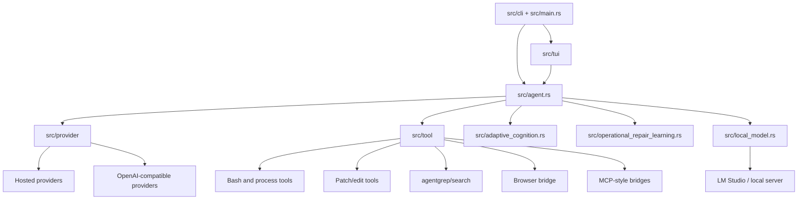
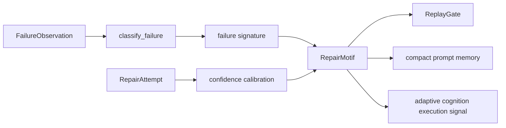

# Kcode architecture

Kcode is a Rust terminal agent with a TUI, CLI, agent runtime, provider adapters, tool execution layer, adaptive memory, local model diagnostics, and operational repair learning. This document is written to match the implementation in this repository.

## Architectural principles

1. **Terminal first**: the TUI and CLI are primary surfaces, not wrappers around a web app.
2. **Provider modularity**: provider quirks live under `src/provider` instead of being smeared across the agent loop.
3. **Tool transparency**: shell, editing, search, browser, and MCP-style tool paths are visible in the runtime and tests.
4. **Local memory is explicit**: adaptive cognition and repair motifs are deterministic data structures, not hidden model state.
5. **Docs are source-backed**: generated inventory documents binaries, slash commands, provider files, and modules.

## High-level shape



## Source layout

| Path | Role |
| --- | --- |
| `src/main.rs` | Main binary entry. |
| `src/cli` | CLI parsing and command dispatch. |
| `src/tui` | Terminal application, widgets, input handling, slash commands, tests. |
| `src/agent.rs` | Agent turn orchestration. |
| `src/provider` | Provider adapters, routing, failover, account failover, catalog refresh, SSE parsing. |
| `src/tool` | Built-in tool implementations and integrations. |
| `src/adaptive_cognition.rs` | Persistent local cognition and execution signals. |
| `src/operational_repair_learning.rs` | Failure classification and repair motif learning. |
| `src/local_model.rs` | Local OpenAI-compatible diagnostics. |
| `src/bin` | Benchmark, harness, server, and utility binaries. |
| `crates` | Supporting crates and simulation/runtime pieces. |
| `docs/reference` | Generated implementation inventory. |

## CLI and TUI

The CLI parses top-level execution modes, auth/account commands, remote/headless paths, and utility commands. The TUI owns interactive state: chat history, input composition, slash command registry, model/account picking, sidebars, and rendering.

The slash command inventory is generated into `docs/reference/implementation-inventory.md`. If a command appears there, it was discovered from `RegisteredCommand::public` in source.

## Agent runtime

The runtime coordinates:

- prompt/message construction;
- provider selection;
- streaming responses;
- tool-call execution;
- turn admission and cancellation;
- result rendering;
- memory and diagnostics hooks.

Runtime code should avoid provider-specific assumptions. Provider differences belong in provider adapters.

## Provider layer

Provider implementation files live under `src/provider`. The generated inventory lists each file. Important provider responsibilities include:

- request shaping and headers;
- model catalog behavior;
- streaming response parsing;
- provider-specific error interpretation;
- fallback and failover;
- account refresh/failover;
- provider picker metadata.

OpenAI-compatible does not mean identical. A local LM Studio server, an OpenRouter request, and another compatible endpoint may all use similar JSON shapes but still require different defaults, headers, model IDs, latency expectations, and error handling.

## Tool layer

Tools are part of the agent contract. They should be deterministic where possible, clearly report errors, and avoid irreversible actions without explicit user approval. Tool behavior is often easier to test than model behavior, so tool changes should include focused tests or reproducible command validation.

## Adaptive cognition

`adaptive_cognition` persists local execution signals and retrieval metadata. It is intended to provide compact, relevant memory rather than unbounded transcript replay.

Responsibilities:

- store cognition records;
- rank or select useful prompt memory;
- track execution signals;
- expose deterministic tests for memory behavior;
- receive mirrored operational repair motifs.

## Operational repair learning

`operational_repair_learning` turns raw operational failures into compact motifs.

Pipeline:



Replay gates are recommendations:

- `Skip`: no meaningful failure.
- `Smoke`: cheap validation, usually external/provider/tooling.
- `Focused`: targeted validation for runtime, context, build, or test failures.
- `Full`: recurring build/test failures that need broader regression coverage.

## Local model diagnostics

`src/local_model.rs` handles local OpenAI-compatible checks. LM Studio setup and operations live in `docs/INSTALL.md` so installation and local model setup are in one place.

## UI context marker

The context usage rows in `src/tui/info_widget_usage.rs` render a rainbow `∞` marker. This avoids implying exact context safety while retaining a recognizable context row.

## Documentation inventory

`docs/reference/implementation-inventory.md` and `.json` are generated by:

```bash
python3 scripts/validate_docs.py --write-inventory
```

The validator also checks required docs and implementation anchors.
