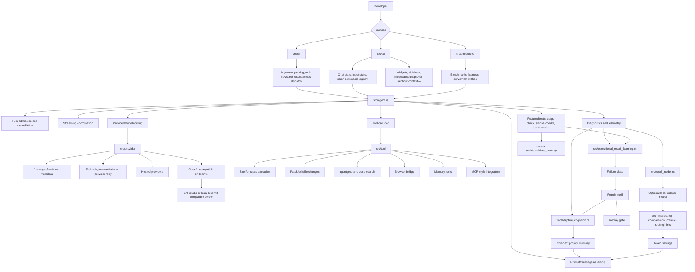

# Neura architecture: implementation-backed technical reference

Neura is a Rust terminal agent whose architecture is organized around explicit control surfaces, provider adapters, tool execution, local memory, and operational repair learning. This document is intentionally descriptive rather than aspirational: paths named here correspond to source files or generated inventory in this repository.

## 1. Architectural thesis

Neura is not just a chat loop. It is a terminal-native operating environment for repository evolution. The central design question is: how can a coding agent safely operate over a mutable workspace while preserving continuity, minimizing token waste, and keeping provider/tool behavior debuggable?

Neura answers this with five layers:

1. **Entry and interaction**: CLI, TUI, slash commands, model/account selection, sidebars.
2. **Agent turn runtime**: message assembly, provider routing, streaming, tool-call orchestration, validation hooks.
3. **External action layer**: tools, shell, search, browser, edit/patch, MCP-style bridges.
4. **Provider and local model layer**: cloud adapters, OpenAI-compatible endpoints, local LM Studio/server diagnostics, sidecar support.
5. **Memory and repair intelligence**: adaptive cognition, operational repair motifs, replay gates, compact prompt memory.

The architecture tries to separate policy from mechanism. Provider-specific request shaping belongs in provider adapters. Tool behavior belongs in tools. Failure interpretation belongs in operational repair learning. Persistent memory belongs in adaptive cognition.

## 2. Full system flow



## 3. Source map

| Area | Important paths | Architectural responsibility |
| --- | --- | --- |
| Main/CLI | `src/main.rs`, `src/cli` | Process entry, argument parsing, command dispatch, auth and noninteractive modes. |
| TUI | `src/tui` | Interactive terminal state, rendering, slash commands, sidebars, input handling, TUI tests. |
| Agent loop | `src/agent.rs`, runtime crates | Turn lifecycle, provider calls, tool calls, stream handling, validation integration. |
| Providers | `src/provider` | Adapter-specific semantics, request shape, streaming, failover, catalog/account handling. |
| Tools | `src/tool` | Workspace action primitives: shell, edit, patch, browser/search, memory, scheduling, MCP-like bridges. |
| Local model | `src/local_model.rs` | OpenAI-compatible local server diagnostics and local provider benchmark support. |
| Adaptive cognition | `src/adaptive_cognition.rs` | Local execution signals, retrieval decisions, prompt memory, repair motif mirroring. |
| Repair learning | `src/operational_repair_learning.rs` | Failure classes, recurrence, confidence, repair motifs, replay gates. |
| Bench/sim | `src/bin`, `crates` | Benchmarks, harness/server utilities, simulation support. |
| Documentation truth | `docs/reference`, `scripts/validate_docs.py` | Generated implementation inventory and doc consistency checks. |

## 4. Entry surfaces

### CLI

The CLI is the controlled noninteractive surface. It should remain deterministic, scriptable, and conservative. CLI code is responsible for parsing intent and dispatching into runtime paths without duplicating provider/tool semantics.

Typical CLI responsibilities:

- select run mode;
- route auth/account commands;
- start remote/headless flows;
- invoke utility binaries and benchmarks;
- expose behavior suitable for shell automation.

### TUI

The TUI is the primary human interaction layer. It owns the active conversation, text input, slash command registry, status widgets, model picker, and account picker.

The TUI is deliberately not the owner of provider semantics. It asks the runtime/provider layers for behavior. It does own user-visible representation: labels, sidebars, command descriptions, and rendering tests.

### Binaries and harnesses

`src/bin` contains supporting binaries such as benchmark and harness utilities. These provide reproducible operational views into performance, provider behavior, local model checks, and TUI behavior.

## 5. Runtime lifecycle

A Neura turn can be understood as:

1. **Admission**: decide whether a turn may begin, whether cancellation is needed, and what state must be captured.
2. **Context assembly**: combine user input, conversation state, selected compact memory, tool context, and system/developer constraints.
3. **Provider routing**: choose provider/model based on explicit selection, defaults, failover, and availability.
4. **Streaming response**: parse provider events and update the UI or noninteractive caller.
5. **Tool loop**: execute requested tools, return results, and continue the model turn when appropriate.
6. **Validation**: run focused checks when the task implies code or documentation changes.
7. **Learning**: record useful execution signals and repair motifs.

This separation helps Neura avoid a monolithic agent function where UI, provider details, tools, and memory all become entangled.

## 6. Provider architecture

Provider files under `src/provider` are the source of truth for provider behavior. The generated inventory lists them. The provider layer handles differences that cannot be abstracted away safely:

- authentication/account refresh;
- model catalogs;
- request JSON shape;
- provider-specific headers;
- streaming/SSE event format;
- retry and failover behavior;
- model name aliases and routing prefixes;
- error normalization.

OpenAI-compatible endpoints are similar, not identical. Neura therefore treats compatibility as an adapter family rather than assuming all compatible servers are operationally equivalent.

## 7. Local sidecar model architecture

The local sidecar model is a token-economy component. It is best used for cheap, local support tasks:

- summarizing long tool output;
- compressing logs before they enter prompt memory;
- generating routing hints;
- critiquing low-risk drafts;
- checking local OpenAI-compatible server health;
- supporting benchmark comparisons.

The sidecar does not replace the primary provider for difficult reasoning unless the loaded local model is capable enough. Its architectural value is that it lets Neura spend frontier-provider tokens where they matter most.

## 8. Tool architecture

Tools are executable capabilities. Good tool architecture requires:

- explicit input and output;
- safe defaults;
- noninteractive execution where possible;
- clear error propagation;
- reproducible validation;
- avoidance of irreversible operations without user confirmation.

Neura's tool layer is the bridge between model intent and workspace mutation. Because tools can change files or run commands, tool tests and operational discipline matter more than prose claims.

## 9. Memory architecture

Neura memory has two complementary forms:

1. **Adaptive cognition**: persistent local signals that can be retrieved as compact prompt memory.
2. **Operational repair learning**: deterministic motifs derived from failures and repair attempts.

The memory system is designed to avoid transcript bloat. It stores distilled signals, not every token. This is important because repository work often spans many turns, and naive transcript replay quickly wastes context.

## 10. Operational repair intelligence

The repair learning subsystem defines:

- `FailureObservation`: what failed;
- `RepairAttempt`: what was tried;
- `FailureClass`: build/test/runtime/provider/tooling/auth/network/context/unknown;
- `RepairMotif`: recurring failure signature and preferred repair;
- `ReplayGate`: validation intensity recommendation.

The key architectural decision is determinism. Classification and replay-gate assignment are rule-based and testable. This means Neura can learn operational patterns without outsourcing the truth of failure classification to a model.

## 11. Token economy

Neura saves tokens through:

- compact prompt memory instead of raw transcript replay;
- local sidecar summarization and compression;
- repair motifs that prevent repeated investigation;
- focused validation gates instead of always running maximal checks;
- documentation inventory generation instead of manual repeated explanation.

Token economy is an architectural concern because context is a finite operational budget.

## 12. Documentation synchronization

The documentation system has a validator, `scripts/validate_docs.py`, which checks required docs, anchors, and generated inventory freshness. This is intentionally part of architecture: documentation that drifts away from implementation creates operational risk.

Run:

```bash
python3 scripts/validate_docs.py --write-inventory
python3 scripts/validate_docs.py
```

## 13. Design constraints and tradeoffs

- Neura optimizes for explicitness over hidden magic.
- Provider adapters are allowed to differ because providers genuinely differ.
- Local memory is compact and selective, not a complete transcript database.
- The local sidecar is a support model, not a guaranteed replacement for frontier models.
- UI simplifications, such as the rainbow context `∞`, are allowed when they reduce misleading precision.
- Repair learning recommends validation intensity; it does not prove correctness.

## 14. Extension guidelines

When adding a subsystem:

1. Put provider-specific behavior in provider adapters.
2. Put tool-specific behavior in tools.
3. Add deterministic tests for non-model logic.
4. Update source-backed docs and inventory.
5. Consider whether adaptive cognition or repair learning should record a signal.
6. Keep user-facing TUI text concise but docs comprehensive.
