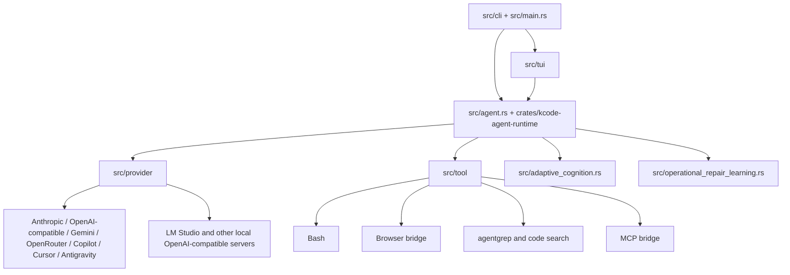

# Kcode architecture

Kcode is a Rust terminal agent built around a TUI, an agent runtime, provider adapters, tool execution, persistent local state, and diagnostics. This document describes the current implementation, not a roadmap.

## High-level shape

## Major subsystems

| Subsystem | Primary paths | Current responsibility |
| --- | --- | --- |
| CLI and command dispatch | `src/cli`, `src/main.rs` | Parses startup modes, auth commands, remote/headless flows, and utility commands. |
| TUI application | `src/tui` | Terminal UI, chat state, slash commands, sidebars, model picker, account picker, input handling, and rendering tests. |
| Agent runtime | `src/agent.rs`, `crates/kcode-agent-runtime` | Drives turns, providers, tool calls, streaming, and turn admission. |
| Provider layer | `src/provider` | Provider-specific request/stream handling, model routing, failover, account failover, catalog refresh, and provider diagnostics. |
| Tool layer | `src/tool` | Built-in tools such as shell, patch/edit, browser, grep/search, memory, scheduling, and MCP integration. |
| Adaptive cognition | `src/adaptive_cognition.rs` | Persistent local learning signals, retrieval decisions, execution signals, and prompt-memory selection. |
| Operational repair learning | `src/operational_repair_learning.rs` | Classifies failures, learns recurring repair motifs, calibrates confidence, assigns replay gates, and produces compact repair memory. |
| Local model diagnostics | `src/local_model.rs`, `docs/LMSTUDIO.md` | Checks local OpenAI-compatible servers such as LM Studio and supports benchmark-side local provider runs. |
| Benchmarks and simulation | `src/bin/kcode_bench.rs`, `src/bin/tui_bench.rs`, `crates/kcode-mobile-sim` | Provider/local benchmarks, TUI benchmarks, and simulation helpers. |

## Provider routing truth

The provider implementation is file-backed under `src/provider`. The inventory in `docs/reference/implementation-inventory.md` is generated from the current source tree and lists provider files. Provider capabilities vary by adapter. Do not assume a provider supports every feature unless its adapter implements that request path.

Key concepts:

- Model selection and provider routing are centralized in the provider module.
- Provider failover and fallback logic are implemented under `src/provider/*failover*`.
- OpenAI-compatible flows are used for several providers and local model endpoints, but each adapter may add headers, catalog behavior, or stream parsing.
- LM Studio is treated as a local OpenAI-compatible server for diagnostics and benchmarking, not as a hosted account provider.

## Memory and learning

Kcode has two complementary learning paths:

1. `adaptive_cognition` persists local cognitive records and execution signals in `.kcode` state.
2. `operational_repair_learning` interprets operational failures into repair motifs and mirrors learned motifs back into adaptive cognition so older recall paths can surface them.

This is deliberately deterministic and testable. Failure classification and replay-gate selection are implemented without relying on model output.

## Sidebars and status UI

The TUI info widgets live under `src/tui/info_widget*.rs`. The context usage rows now render a rainbow `∞` marker instead of a dynamic usage bar. Actual context accounting remains available to the model/runtime paths, but the sidebar avoids presenting a misleading precision meter.

## Testing philosophy

Kcode uses a mix of unit tests, TUI rendering tests, provider parser tests, and compile checks. When changing architecture-facing behavior, add deterministic tests near the subsystem that owns the behavior and run focused tests before broader checks.
