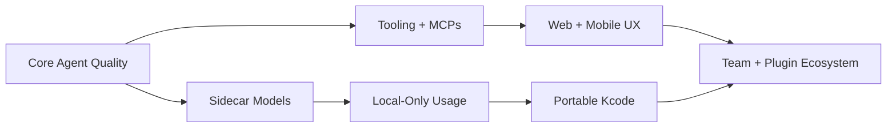
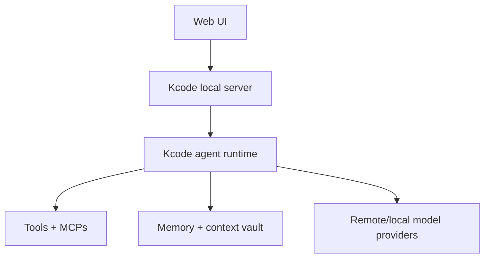

# Kcode Roadmap / TODO

This roadmap tracks high-impact future work for Kcode. It is intentionally practical: each item should eventually become an issue, milestone, benchmark, or release note.

## Roadmap overview

| Area | Goal | Priority | Status |
|---|---|---:|---|
| Sidecar model quality | Make local helper routing, memory, summaries, and critique faster and more accurate | P0 | [ ] |
| Local-only mode | Make Kcode useful without remote providers for supported workflows | P0 | [ ] |
| Tooling expansion | Add more safe, high-leverage tools and workflows | P1 | [ ] |
| MCP ecosystem | Add more first-party MCP integrations | P1 | [ ] |
| Portable distribution | Run from a USB stick or portable folder | P1 | [ ] |
| Web/mobile access | Make Kcode usable outside the terminal | P2 | [ ] |
| Team/workspace features | Shared memory, goals, artifacts, and dashboards | P2 | [ ] |

---

## P0 — Core local intelligence

### Sidecar models

- [ ] **Claude sidecar training loop**
  - Explore a teacher/student sidecar pipeline for routing, memory extraction, summaries, critique, and exact-context decisions.
  - See [Claude Sidecar TODO](sidecartodo/claudesidecar.md).

- [ ] **Optimize sidecar model**
  - Improve routing, memory extraction, summarization, and critique latency.
  - Add benchmark targets for sidecar response time, accuracy, and CPU/RAM usage.
  - Acceptance criteria:
    - sidecar routing latency is measured in benchmarks,
    - memory extraction quality has regression tests,
    - summaries preserve exact retrieval IDs when available.

- [ ] **More sidecar models**
  - Support multiple sidecar model sizes and roles.
  - Suggested profiles:

| Profile | Intended use | Example constraints |
|---|---|---|
| Tiny | routing, intent classification, tool gating | very low RAM / CPU |
| Small | memory extraction, summaries, critique | laptop friendly |
| Medium | local-only coding assistance | stronger quality, higher RAM |
| Specialist | embeddings, reranking, code search | task-specific |

### Local-model-only usage

- [ ] **Easy install and local-model-only usage**
  - Make it obvious how to install and run Kcode without a remote provider.
  - Add a first-run wizard option: “local only.”
  - Document what works well locally and what still needs a remote frontier model.
  - Acceptance criteria:
    - `KCODE_SKIP_REMOTE=1` or equivalent documented path,
    - README/INSTALL quickstart for local-only mode,
    - benchmark section for local-only tasks.

---

## P1 — Tools, MCPs, and portability

### Tooling

- [ ] **Add more tooling**
  - Improve the built-in tool catalog with high-value developer workflows.
  - Candidate tools:
    - GitHub issues/PR review,
    - Docker/container inspection,
    - database schema/query helpers,
    - dependency audit helpers,
    - log/timeline visualizer,
    - test flake detector,
    - profiler/performance summary tool.

### MCP integrations

- [ ] **More MCPs: Telegram, Obsidian, etc.**
  - Add first-party MCP recipes and/or bundled bridges for common workflows.

| MCP / Integration | Why it matters | Notes |
|---|---|---|
| Telegram | agent notifications, approvals, mobile control | useful for long-running tasks |
| Obsidian | local knowledge base and notes | good fit for durable memory |
| Slack / Discord | team notifications and coordination | needs careful permission model |
| GitHub | issues, PRs, reviews, releases | high-value developer workflow |
| Linear / Jira | task and project management | useful for teams |
| Notion | docs and lightweight project state | optional productivity bridge |
| Filesystem index | local semantic/code search | should be privacy-first |

### Portable Kcode

- [ ] **USB stick / portable Kcode setup**
  - Make Kcode runnable from a portable folder or USB drive.
  - Avoid hardcoded absolute paths where possible.
  - Support portable config/model/cache directories.
  - Acceptance criteria:
    - documented portable layout,
    - smoke test from a temp directory,
    - no credential leakage into the portable bundle by default.

---

## P2 — New interfaces

### Web UI

- [ ] **Web UI**
  - Build a browser interface for Kcode sessions.
  - Useful for users who do not want a terminal UI.
  - Suggested features:
    - session list,
    - live transcript,
    - tool-call timeline,
    - diff viewer,
    - benchmark dashboard,
    - memory browser,
    - approval prompts.

### Mobile app

- [ ] **Mobile app**
  - Remote monitor/control for long-running Kcode tasks.
  - Likely first version should be companion-style, not a full IDE.
  - Suggested features:
    - push notifications,
    - approve/deny tool calls,
    - view progress and diffs,
    - send short instructions,
    - pause/resume sessions.

---

## P2 — Ecosystem and collaboration

### Kcode API endpoints

- [ ] **Kcode API endpoints**
  - Expose a small local HTTP/WebSocket API so other apps can start sessions, send prompts, inspect status, and subscribe to tool events.
  - Keep it local-first and secure by default.

| Endpoint | Method | Example use | Example payload / response |
|---|---|---|---|
| `/api/sessions` | `POST` | Start a new Kcode session | `{ "cwd": "/repo", "model": "gpt-5.5" }` |
| `/api/sessions/{id}/prompt` | `POST` | Send a prompt to a session | `{ "message": "fix the failing tests" }` |
| `/api/sessions/{id}/events` | `GET` / WebSocket | Stream model/tool/status events | `tool_started`, `tool_finished`, `assistant_delta` |
| `/api/sessions/{id}/status` | `GET` | Check if a session is running, waiting, or done | `{ "status": "running", "current_tool": "bash" }` |
| `/api/sessions/{id}/cancel` | `POST` | Stop a running task | `{ "reason": "user cancelled" }` |
| `/api/tools` | `GET` | List available tools/MCPs | `{ "tools": ["bash", "read", "browser"] }` |
| `/api/memory/search` | `POST` | Search Kcode memory | `{ "query": "deploy target", "scope": "project" }` |
| `/api/benchmarks/summary` | `GET` | Show benchmark/token/latency summary | `{ "token_reduction_pct": 92.7 }` |

Acceptance criteria:

- local-only by default,
- auth token required before listening on non-loopback interfaces,
- OpenAPI schema or generated docs,
- event stream for tool calls and assistant deltas,
- examples for curl, JavaScript, and Python,
- tests for auth, cancellation, and event ordering.

- [ ] **Plugin marketplace for community tools, MCPs, prompts, and workflows**
  - Make it easy to discover and install extensions.
  - Include security metadata, permissions, and versioning.
  - Avoid running untrusted plugins silently.

- [ ] **Team/shared workspace mode with synced memories, goals, and benchmark artifacts**
  - Let teams share project-level context safely.
  - Separate personal memory from team memory.
  - Include audit logs for shared facts and tool actions.

- [ ] **Built-in benchmark dashboard for token usage, latency, tool success, and hallucination-guard results**
  - Turn benchmark JSON artifacts into an interactive dashboard.
  - Track regressions over time.
  - Show provider tokens, replay estimates, latency, success/failure rates, and artifact checksums.

---

## Suggested milestone plan

| Milestone | Theme | Candidate deliverables |
|---|---|---|
| M1 | Sidecar quality | sidecar benchmarks, optimized routing, multiple sidecar profiles |
| M2 | Local-only Kcode | local-only install path, local task suite, local model docs |
| M3 | Tooling + MCP expansion | Telegram/Obsidian/GitHub MCP recipes, safer plugin permissions |
| M4 | Portable Kcode | USB/portable layout, path portability tests, docs |
| M5 | Web/mobile UX | web dashboard, mobile companion, approval notifications |
| M6 | Team ecosystem | shared memory, plugin marketplace, benchmark dashboard |

## Definition of done for roadmap items

A roadmap item should be considered done only when it has:

- [ ] user-facing documentation,
- [ ] tests or benchmark coverage,
- [ ] security/privacy review if it touches credentials, tools, MCPs, or memory,
- [ ] release notes or README mention when user-visible,
- [ ] migration/compatibility notes if it changes config or local paths.

## Notes

- Prefer local-first and privacy-preserving designs.
- Avoid adding tools that are powerful but hard to sandbox unless the permission model is clear.
- Every new context/memory feature should include benchmark or regression coverage.
- Every new integration should document what data leaves the machine.

---

## Research agenda addendum

### Repair learning integration

- Connect repair motifs directly to replay harness selection.
- Add richer failure signatures for provider-specific errors.
- Track validation cost and success rate per replay gate.
- Surface repair memory in the TUI with concise explanations.
- Add persistence tests for multi-session repair recurrence.

### Local sidecar model evolution

- Make sidecar task routing explicit and configurable.
- Add sidecar-specific benchmark tasks for compression and critique.
- Track token savings from sidecar summaries.
- Add safety boundaries for weak local models.
- Compare LM Studio models by sidecar role rather than only final-answer quality.

### Documentation maturity

- Expand generated inventory to include CLI subcommands and selected public structs/enums.
- Add diagrams for provider failover and tool-call loop.
- Keep README concise while docs remain comprehensive.
- Make docs validation stricter about stale links.
