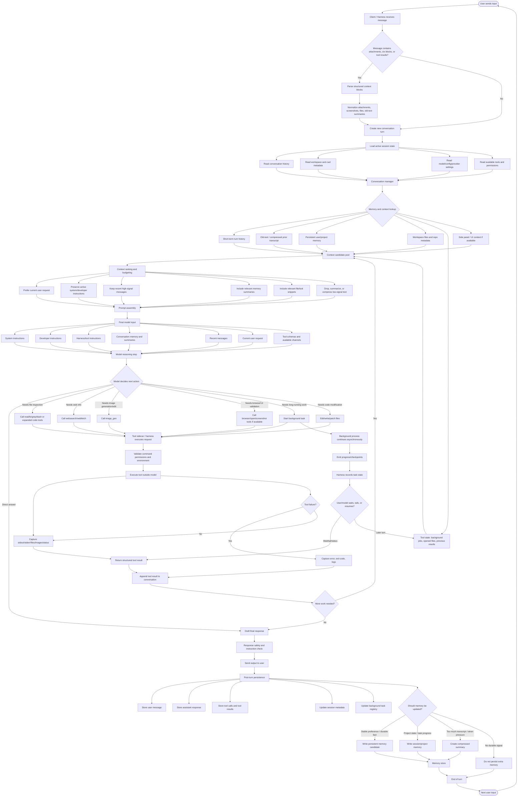
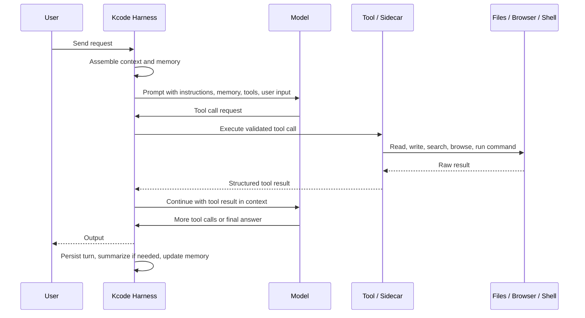
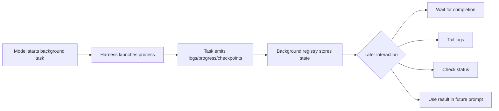
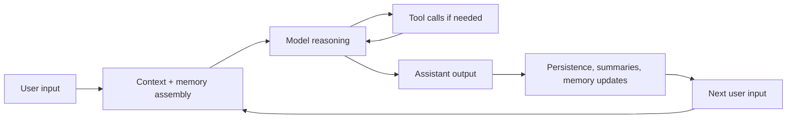

# Kcode Memory and Conversation Flow

This document maps the high-level flow of a Kcode agent turn: from the moment the user sends input, through context assembly, memory retrieval, sidecar/tool execution, model output, summarization/compaction, and finally into the next user input cycle.

The diagram is intentionally comprehensive and GitHub-ready. It focuses on the agent lifecycle rather than every internal helper function.

## End-to-End Flow

## Key Concepts

### 1. Conversation Turn

A turn begins when the user sends input. Kcode wraps that input with the current session state, available tools, active instructions, and relevant context. The model does not see the entire filesystem or entire past transcript by default. It sees a curated prompt assembled from the most useful pieces.

### 2. Memory Layers

Kcode-style memory can be understood as several layers:

| Layer | Purpose | Typical contents |
|---|---|---|
| Immediate turn context | What is happening right now | Current user request, recent assistant replies, latest tool output |
| Short-term session memory | Keep the active task coherent | Current files, todo/progress, background task IDs, recent decisions |
| Compressed transcript / old-text | Preserve older conversation without overflowing context | Summaries of previous messages and important facts |
| Persistent memory | Durable user/project facts | Preferences, recurring workflows, stable project details |
| Workspace context | Facts from the actual environment | Files, git state, code search results, screenshots, local configs |
| Tool state | Non-language-model execution state | Background jobs, command outputs, browser screenshots, generated artifacts |

### 3. Sidecar / Harness Role

The model decides what should happen, but tools run outside the model in the harness or sidecar layer. That separation is important:

- The model proposes a tool call.
- The harness validates and executes it.
- The result is captured as structured output.
- The result is appended back into the conversation.
- The model reasons over the new result and either continues or answers.

This is why a failed command, screenshot, file read, or background task output becomes part of the next reasoning step.

### 4. Context Budgeting

Because model context is finite, Kcode must decide what to include. The usual priority order is:

1. System and developer instructions.
2. The current user request.
3. Recent high-signal conversation.
4. Relevant memory summaries.
5. Relevant tool outputs.
6. Relevant file snippets.
7. Older or lower-signal history, usually compressed or omitted.

When the transcript grows too large, older messages may be converted into compact `old-text` style summaries. The model can still use their important content, but not necessarily every exact token.

### 5. Tool Result Loop

A single user request can involve many model/tool cycles:

### 6. Background Tasks

Long-running jobs are not just normal shell calls. They can continue while the conversation proceeds.

### 7. Output to Next Input Loop

The important loop is:

Every assistant output and tool result can influence the next user input because the session state is updated after each turn.

## Practical Reading of the Flow

If the user says, “fix this bug,” the flow usually looks like this:

1. User sends the request.
2. Kcode loads session history, repo state, and relevant memory.
3. The model decides it needs to inspect files.
4. The harness reads/searches files.
5. Tool results are returned to the model.
6. The model edits code.
7. The harness writes files and runs tests.
8. Test output returns to the model.
9. The model iterates until tests pass or a blocker is found.
10. The assistant reports what changed.
11. Kcode stores the final state, tool outputs, and any useful summary for future turns.

## Why Memory Matters

Memory prevents the agent from treating every message as a totally fresh session. It lets the system preserve:

- What the user asked for earlier.
- What files were created or modified.
- What tests passed or failed.
- What decisions were already made.
- Which background tasks are still running.
- What user preferences should continue to apply.

But memory is also controlled. Not every detail should become durable memory. Temporary logs, failed exploratory commands, and low-value text are usually better kept only in session history or compressed summaries.

## Summary

Kcode’s flow is best understood as a loop:

1. **Input arrives.**
2. **Context and memory are assembled.**
3. **The model reasons.**
4. **Tools execute outside the model.**
5. **Results return to the model.**
6. **The assistant outputs an answer or continues work.**
7. **The turn is stored, summarized, and possibly written to memory.**
8. **The next user input starts the loop again.**

That loop is what lets the agent remain coherent across multiple tool calls, file edits, screenshots, background jobs, and follow-up requests.
