# Kcode Memory and Conversation Flow

This document maps the high-level flow of a Kcode agent turn: from the moment the user sends input, through context assembly, memory retrieval, sidecar/tool execution, model output, summarization/compaction, and finally into the next user input cycle.

The diagram is intentionally comprehensive and GitHub-ready. It focuses on the agent lifecycle rather than every internal helper function.

## End-to-End Flow

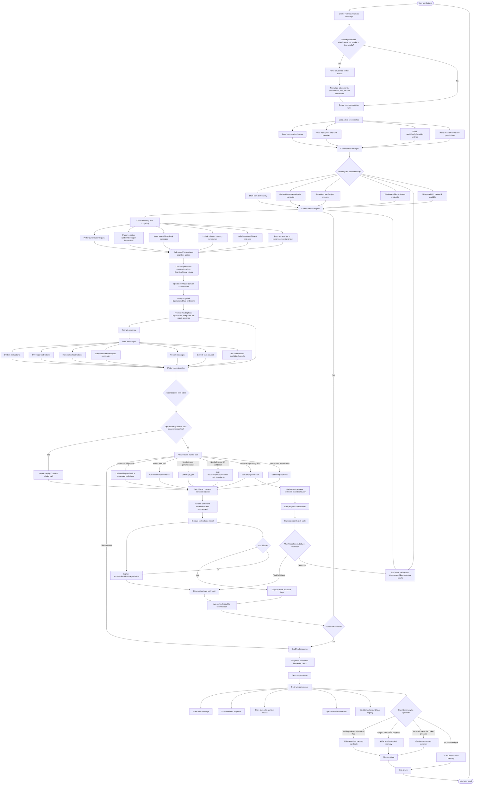

## Key Concepts

### 1. Conversation Turn

A turn begins when the user sends input. Kcode wraps that input with the current session state, available tools, active instructions, and relevant context. The model does not see the entire filesystem or entire past transcript by default. It sees a curated prompt assembled from the most useful pieces.

### 2. Memory Layers

Kcode-style memory can be understood as several layers:

| Layer | Purpose | Typical contents |
|---|---|---|
| Immediate turn context | What is happening right now | Current user request, recent assistant replies, latest tool output |
| Short-term session memory | Keep the active task coherent | Current files, todo/progress, background task IDs, recent decisions |
| Compressed transcript / old-text | Preserve older conversation without overflowing context | Summaries of previous messages and important facts |
| Persistent memory | Durable user/project facts | Preferences, recurring workflows, stable project details |
| Workspace context | Facts from the actual environment | Files, git state, code search results, screenshots, local configs |
| Tool state | Non-language-model execution state | Background jobs, command outputs, browser screenshots, generated artifacts |

### 3. Sidecar / Harness Role

The model decides what should happen, but tools run outside the model in the harness or sidecar layer. That separation is important:

- The model proposes a tool call.
- The harness validates and executes it.
- The result is captured as structured output.
- The result is appended back into the conversation.
- The model reasons over the new result and either continues or answers.

This is why a failed command, screenshot, file read, or background task output becomes part of the next reasoning step.

### 4. Context Budgeting

Because model context is finite, Kcode must decide what to include. The usual priority order is:

1. System and developer instructions.
2. The current user request.
3. Recent high-signal conversation.
4. Relevant memory summaries.
5. Relevant tool outputs.
6. Relevant file snippets.
7. Older or lower-signal history, usually compressed or omitted.

When the transcript grows too large, older messages may be converted into compact `old-text` style summaries. The model can still use their important content, but not necessarily every exact token.

### 5. Tool Result Loop

A single user request can involve many model/tool cycles:

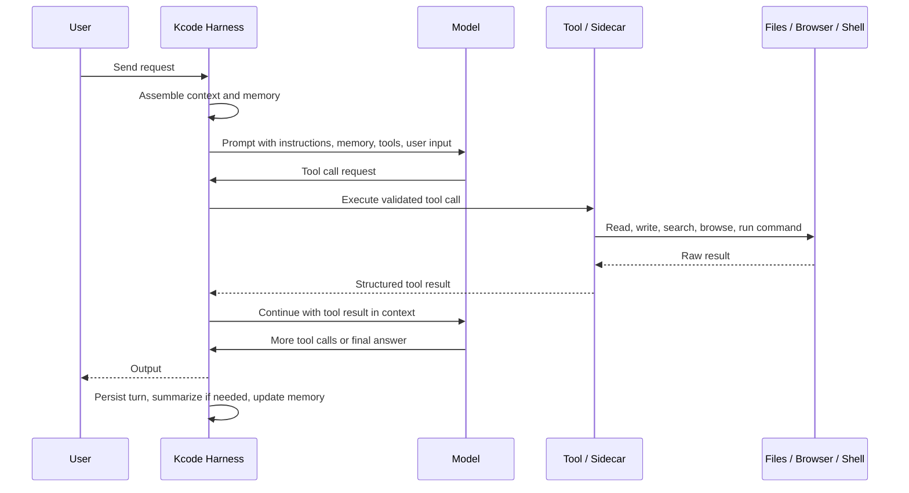

### 6. Background Tasks

Long-running jobs are not just normal shell calls. They can continue while the conversation proceeds.

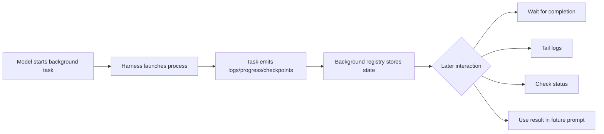

### 7. Output to Next Input Loop

The important loop is:

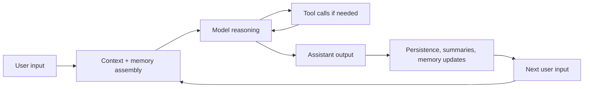

Every assistant output and tool result can influence the next user input because the session state is updated after each turn.

## Practical Reading of the Flow

If the user says, “fix this bug,” the flow usually looks like this:

1. User sends the request.
2. Kcode loads session history, repo state, and relevant memory.
3. The model decides it needs to inspect files.
4. The harness reads/searches files.
5. Tool results are returned to the model.
6. The model edits code.
7. The harness writes files and runs tests.
8. Test output returns to the model.
9. The model iterates until tests pass or a blocker is found.
10. The assistant reports what changed.
11. Kcode stores the final state, tool outputs, and any useful summary for future turns.

## Why Memory Matters

Memory prevents the agent from treating every message as a totally fresh session. It lets the system preserve:

- What the user asked for earlier.
- What files were created or modified.
- What tests passed or failed.
- What decisions were already made.
- Which background tasks are still running.
- What user preferences should continue to apply.

But memory is also controlled. Not every detail should become durable memory. Temporary logs, failed exploratory commands, and low-value text are usually better kept only in session history or compressed summaries.


## Self-Model Integration Added in the New Phase

Kcode now has an explicit self-model substrate in the Rust crate:

- `src/self_model.rs`
- exported through `src/lib.rs` as `pub mod self_model;`

This phase added a deterministic operational cognition layer that can be used by routing, repair, replay, benchmarking, slash-command surfaces, and future telemetry. The goal is not to make the agent “sentient.” The goal is to give Kcode a structured way to reason about its own operational condition while it is working.

### New Core Types

| Type | Role |
|---|---|
| `SelfModel` | Snapshot of Kcode’s current operational state across cognitive domains |
| `CognitiveDomain` | Functional area being assessed, such as context assembly, memory retrieval, tool execution, provider routing, repair, replay, benchmarking, and user interaction |
| `OperationalState` | Health state: `Nominal`, `Watch`, `Degraded`, or `Blocked` |
| `CognitiveSignal` | One normalized observation about a domain |
| `DomainAssessment` | Aggregated health score and state for one domain |
| `RoutingBias` | Router-facing output such as prefer low latency, prefer high context, or avoid tool-heavy plans |
| `OperationalEvent` | Higher-level event submitted by systems such as context compilation, tool runs, provider decisions, repair attempts, replay checks, or benchmark samples |
| `OperationalCognition` | Facade that ingests events and keeps the `SelfModel` updated |
| `OperationalGuidance` | Compact guidance object for routing, repair, replay, benchmark, command, or telemetry consumers |

### Self-Model Domain Map

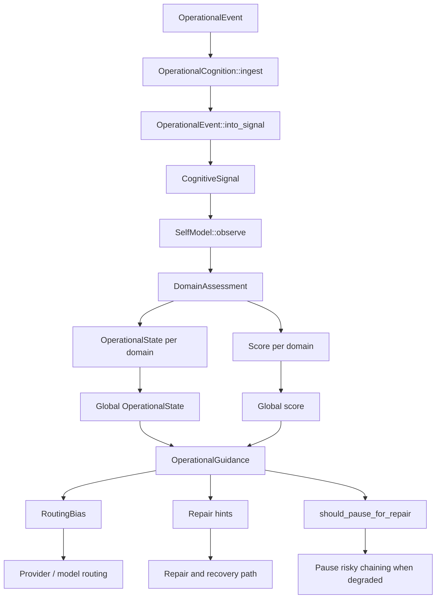

### Cognitive Domains

The implemented cognitive domains are:

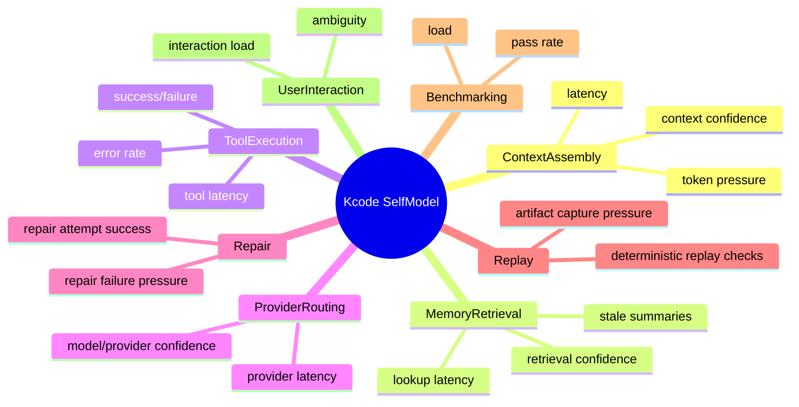

### Operational Events to Signals

The new integration facade accepts operational events and turns them into normalized cognitive signals:

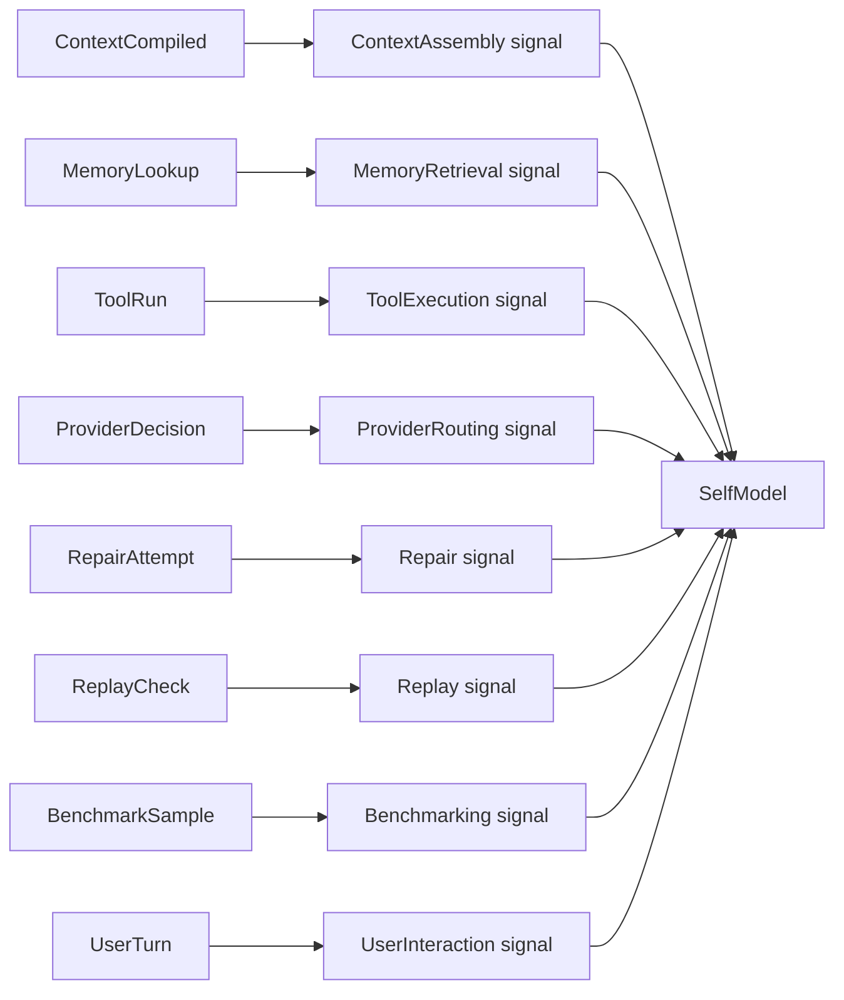

### How Scores Become Operational State

Each domain receives a computed score derived from:

- confidence
- load
- error rate
- optional latency penalty

The score maps to an operational state:

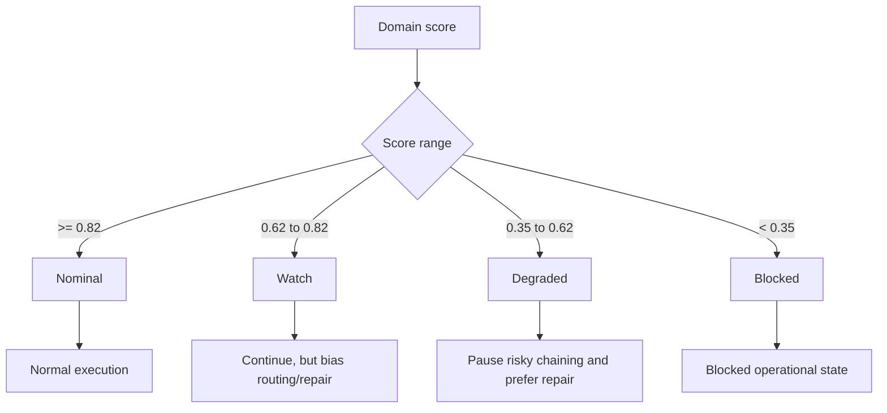

### Routing Bias

The self-model produces `RoutingBias`, which can be consumed by provider/model routing or planning code.

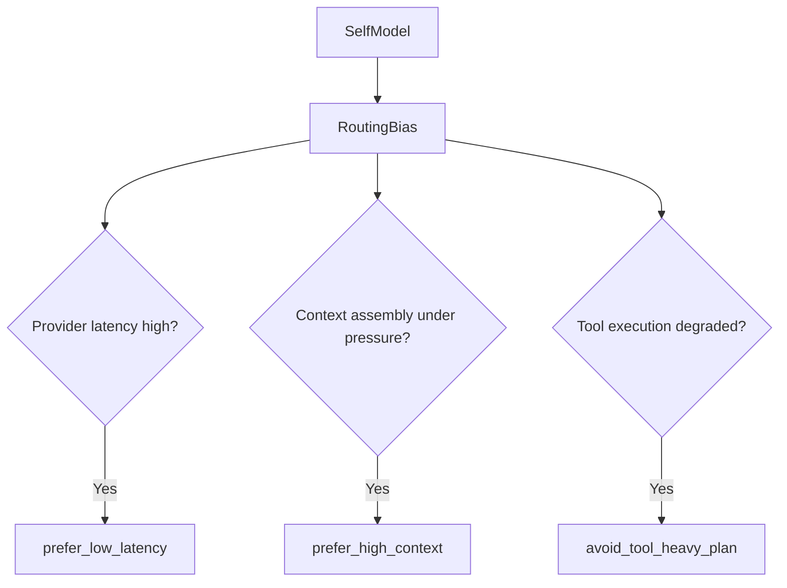

Examples:

- If provider routing has high latency, routing can prefer lower-latency options.
- If context assembly is under pressure, routing can prefer models or modes with better context capacity.
- If tool execution is degraded, planning can avoid long chains of dependent tool calls and validate more often.

### Repair Guidance

The self-model also produces repair hints. These are deterministic strings based on degraded domains.

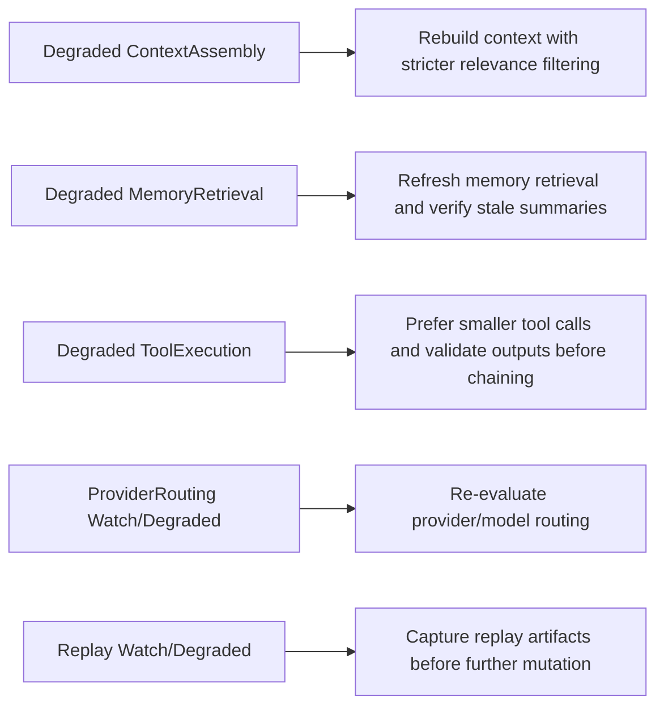

The `OperationalGuidance` object exposes:

- `state`
- `score`
- `routing_bias`
- `repair_hints`
- `should_pause_for_repair`

### Updated Turn Loop With Self-Model

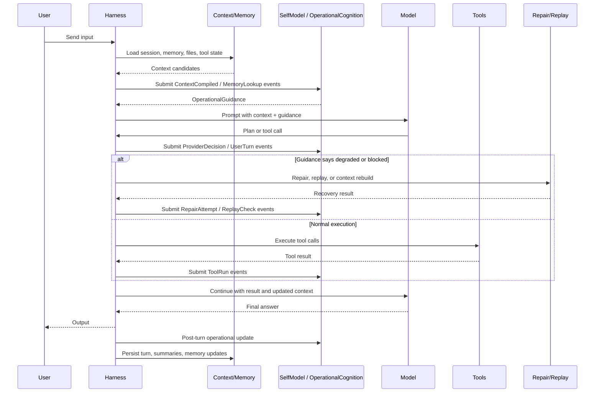

### What This Phase Tightened

Before this phase, memory, context, routing, repair, replay, and benchmarks could exist as separate concerns. The new self-model gives them a common operational vocabulary:

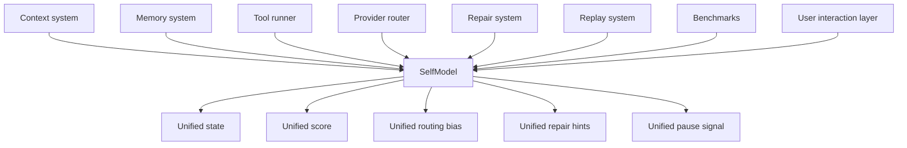

This makes future features easier because each subsystem can submit operational events instead of inventing its own isolated health model.

### Validation Added

The implementation includes focused tests for:

- nominal self-model state
- degraded tool execution producing repair hints
- provider latency producing low-latency routing bias
- repeated observations being averaged
- operational events updating domains and guidance
- failed tool events requesting a repair pause

The targeted validation command used was:

```bash
cargo test self_model --lib --quiet
```

Expected result:

```text
6 passed; 0 failed
```

## Updated Practical Reading of the Flow

With self-model integration, a “fix this bug” request now has an extra operational cognition layer:

1. User sends the request.
2. Kcode loads session history, repo state, and relevant memory.
3. Context and memory systems emit operational events.
4. `OperationalCognition` updates the `SelfModel`.
5. The model receives normal context plus operational guidance.
6. If the self-model reports degraded tool execution, context pressure, or provider latency, the agent can adjust its plan.
7. The harness reads/searches files.
8. Tool results are returned and tool success/failure updates the self-model.
9. The model edits code.
10. Tests run and results update operational state.
11. If needed, repair/replay guidance triggers recovery before continuing.
12. The assistant reports what changed.
13. Kcode stores the final state, tool outputs, summaries, and any useful memory updates.

## Operational Cognition Verbalization + Semantic State Abstraction

A later phase adds `src/semantic_operational_layer.rs`, a deterministic layer above `SelfModel` that turns operational cognition into bounded semantic state and safe verbalizations.

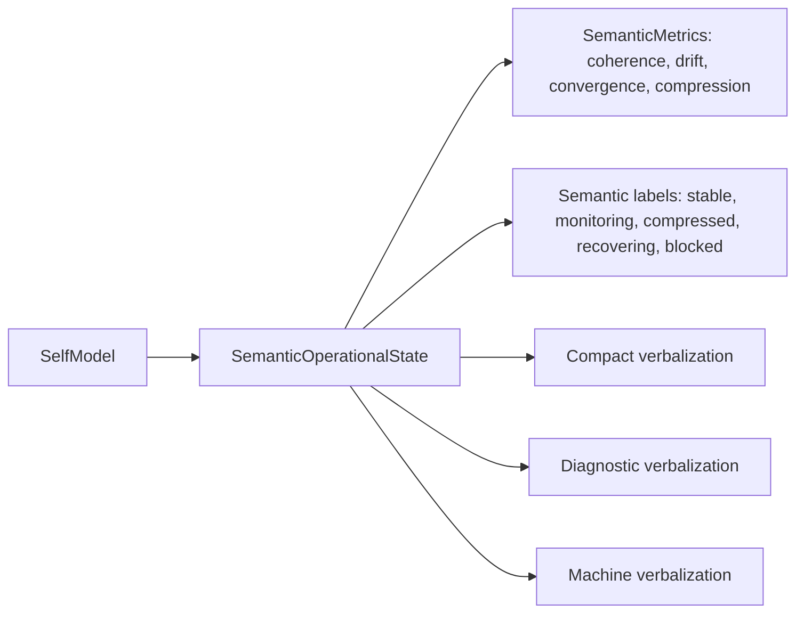

This gives routing, repair, replay, telemetry, benchmarks, and future slash/status commands a shared vocabulary for describing operational state without relying on prompt-only explanations. See [`docs/semantic_operational_layer.md`](semantic_operational_layer.md).


## Long-Horizon Operational Pressure + Continuous Cognition Stress Infrastructure

The newest phase adds `src/long_horizon_pressure.rs`, a bounded stress infrastructure layer above `SelfModel` and `SemanticOperationalState`. It lets Kcode simulate finite multi-step operational pressure and produce reports without creating an autonomous daemon.

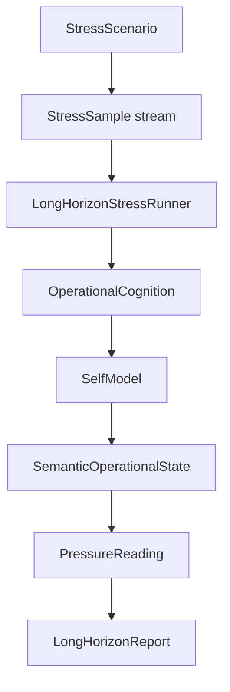

It introduces built-in scenarios for baseline operation, context saturation, tool failure bursts, provider latency, memory staleness, and mixed long-horizon pressure. Each bounded run records drift, compression, convergence, semantic labels, operational state, repair pressure, and warning conditions.

See [`docs/long_horizon_report.md`](long_horizon_report.md).

## Summary

Kcode’s flow is best understood as a loop:

1. **Input arrives.**
2. **Context and memory are assembled.**
3. **Operational events update the self-model.**
4. **The self-model produces routing bias, repair hints, and pause guidance.**
5. **The model reasons with both task context and operational guidance.**
6. **Tools execute outside the model.**
7. **Results return to the model and update operational state.**
8. **The assistant outputs an answer or continues work.**
9. **The turn is stored, summarized, and possibly written to memory.**
10. **The next user input starts the loop again.**

That loop is what lets the agent remain coherent across multiple tool calls, file edits, screenshots, background jobs, and follow-up requests.
