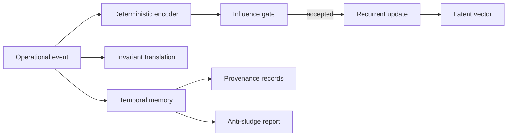

# Dynamic Latent Operational Recurrence + Invariant Translation Layers

Kcode now includes a deterministic, inspectable latent operational recurrence layer. The implementation lives in:

- `src/latent_operational_recurrence.rs`
- `src/cli/latent.rs`
- CLI command: `kcode kcode-latent ...`

## What this layer does

The layer converts operational events into a stable low-dimensional vector, applies recurrence over time, translates events into invariant matches, preserves temporal provenance, and reports drift/anti-sludge signals.

It is intentionally **not opaque model magic**. The vector schema is fixed, deterministic, serialized as JSON, and covered by tests.

## CLI

```bash
kcode kcode-latent status
kcode kcode-latent vector
kcode kcode-latent observe build success --tag test --tag validation --tool cargo --latent-provider openai
kcode kcode-latent translate build success --tag test --tag validation
kcode kcode-latent drift
kcode kcode-latent remap 1
kcode kcode-latent invariants
kcode kcode-latent provenance
kcode kcode-latent temporal
kcode kcode-latent influence build success --tag test
kcode kcode-latent report --output ~/Desktop/latent_report.md
kcode kcode-latent learn build success --tag test --tag validation --tool cargo
kcode kcode-latent learned-vectors
kcode kcode-latent attractors
kcode kcode-latent counterfactual build success --tag test --alternate-tag validation --alternate-tag provenance
kcode kcode-latent doctrine
kcode kcode-latent immune
kcode kcode-latent topology
kcode kcode-latent convergence
kcode kcode-latent evolution-report --output ~/Desktop/latent_evolution_report.md
```

## State

Default state path:

```text
~/.kcode/latent_operational_state.json
```

Override for tests or isolated runs:

```bash
KCODE_LATENT_STATE=/tmp/kcode-latent.json kcode kcode-latent status
```

## Recurrence model



## Invariants

Default invariant translations include:

- validate before done,
- preserve user intent,
- avoid irreversible actions,
- track provenance.

Each invariant has a canonical expression and required tags. Translation returns a confidence score and explanation.

## Guardrails

- Low-signal events are rejected.
- Near-duplicate influence is rejected.
- Temporal memory is capped to prevent unbounded sludge.
- Anti-sludge reporting surfaces duplicate and low-signal ratios.
- Schema remap is explicit and versioned.

## Validation

Core tests cover:

- deterministic event encoding,
- recurrence update behavior,
- invariant translation matching,
- influence gate rejection for empty signal.
