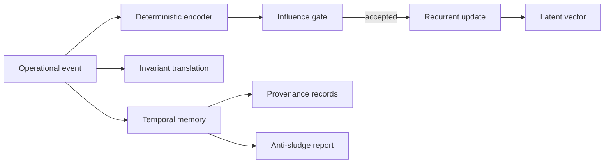

# Dynamic Latent Operational Recurrence + Invariant Translation Layers

Kcode now includes a deterministic, inspectable latent operational recurrence layer. The implementation lives in:

- `src/latent_operational_recurrence.rs`
- `src/cli/latent.rs`
- CLI command: `kcode kcode-latent ...`

## What this layer does

The layer converts operational events into a stable low-dimensional vector, applies recurrence over time, translates events into invariant matches, preserves temporal provenance, and reports drift/anti-sludge signals.

It is intentionally **not opaque model magic**. The vector schema is fixed, deterministic, serialized as JSON, and covered by tests.

## CLI

```bash
kcode kcode-latent status
kcode kcode-latent vector
kcode kcode-latent observe build success --tag test --tag validation --tool cargo --latent-provider openai
kcode kcode-latent translate build success --tag test --tag validation
kcode kcode-latent drift
kcode kcode-latent remap 1
kcode kcode-latent invariants
kcode kcode-latent provenance
kcode kcode-latent temporal
kcode kcode-latent influence build success --tag test
kcode kcode-latent report --output ~/Desktop/latent_report.md
kcode kcode-latent learn build success --tag test --tag validation --tool cargo
kcode kcode-latent learned-vectors
kcode kcode-latent attractors
kcode kcode-latent counterfactual build success --tag test --alternate-tag validation --alternate-tag provenance
kcode kcode-latent doctrine
kcode kcode-latent immune
kcode kcode-latent topology
kcode kcode-latent convergence
kcode kcode-latent evolution-report --output ~/Desktop/latent_evolution_report.md
kcode kcode-latent ingest build success --tag test --tag validation --tool cargo --source cli
kcode kcode-latent learn-now --limit 32
kcode kcode-latent background-status
kcode kcode-latent samples
kcode kcode-latent outcomes
kcode kcode-latent doctrines
kcode kcode-latent pause
kcode kcode-latent resume
```

## State

Default state path:

```text
~/.kcode/latent_operational_state.json
```

Override for tests or isolated runs:

```bash
KCODE_LATENT_STATE=/tmp/kcode-latent.json kcode kcode-latent status
```

## Recurrence model



## Invariants

Default invariant translations include:

- validate before done,
- preserve user intent,
- avoid irreversible actions,
- track provenance.

Each invariant has a canonical expression and required tags. Translation returns a confidence score and explanation.

## Guardrails

- Low-signal events are rejected.
- Near-duplicate influence is rejected.
- Temporal memory is capped to prevent unbounded sludge.
- Anti-sludge reporting surfaces duplicate and low-signal ratios.
- Schema remap is explicit and versioned.

## Validation

Core tests cover:

- deterministic event encoding,
- recurrence update behavior,
- invariant translation matching,
- influence gate rejection for empty signal.

## Live operational fabric commands

```bash
kcode kcode-latent fabric-status
kcode kcode-latent fabric-events
kcode kcode-latent fabric-report --output ~/Desktop/live_operational_fabric_report.md
kcode kcode-latent fabric-pause
kcode kcode-latent fabric-resume
kcode kcode-latent fabric-ping
```

The fabric emits live user-message, provider request/response, tool, token, local sidecar token-estimate, memory bridge, and background latent learning events. Events are persisted under `~/.kcode/live_operational_fabric/events.jsonl` and bridged into the latent background sample queue.

Automatic background adaptation is enabled by default: every live fabric event opportunistically runs a bounded latent background cycle. Set `KCODE_LIVE_FABRIC_AUTO_CYCLE=0` to disable it for debugging.

## Latent memory bank commands

```bash
kcode kcode-latent latent-memory-status
kcode kcode-latent latent-memory-blocks
kcode kcode-latent latent-memory-report --output ~/Desktop/latent_memory_report.md
kcode kcode-latent latent-memory-usefulness
```

Latent memory stores ctx-style blocks for stable attractors, noise patterns, validation doctrine, useful drift synthesis, and operational lessons. Background learning consults this bank before vector updates to suppress duplicates, down-rank noise, anchor excessive drift, and preserve useful drift as synthesis memory.

## Operational policy influence commands

```bash
kcode kcode-latent policy-status
kcode kcode-latent policy-rules
kcode kcode-latent policy-decide test-validation final-answer
kcode kcode-latent policy-audit
kcode kcode-latent policy-report --output ~/Desktop/policy_influence_report.md
kcode kcode-latent policy-domains
```

Policy influence is gated by latent memory usefulness: low-confidence memories do not become policy, policy decisions are audited, and observe-only mode is available in state for safe rollout.

## Policy outcome credit commands

```bash
kcode kcode-latent policy-credit-report --output ~/Desktop/policy_credit_report.md
kcode kcode-latent policy-credit-assign <audit-id> success
```

Policy outcome credit assigns success/failure back to policy audits, updates rule confidence, and propagates usefulness back into the source latent memory when a rule came from memory.

## Policy shadow simulation commands

```bash
kcode kcode-latent policy-simulate --limit 200
kcode kcode-latent policy-shadow-report --output ~/Desktop/policy_shadow_report.md
kcode kcode-latent policy-promote-safe
kcode kcode-latent policy-demote-bad
```

Shadow simulation replays recent live fabric events and latent background samples through current policies, estimates counterfactual delta, then allows safe promotion or demotion before stronger runtime enforcement.

## Operational Self-Eval Harness

Kcode now includes a closed-loop operational self-eval harness that evaluates the live latent/policy stack against itself before trusting autonomous promotion.

Commands:

- `kcode kcode-latent eval-run` runs the full self-eval suite and persists `~/.kcode/operational_eval_report.json`.
- `kcode kcode-latent eval-report --output ~/Desktop/operational_eval_report.md` renders a human-readable report.
- `kcode kcode-latent eval-gate` enforces the promotion gate and fails closed if critical invariants do not pass.

The suite checks token abstraction, latent memory rehydration after accepted learning, background recursive adaptation, policy decision availability, policy outcome credit assignment, shadow policy simulation, and destructive-action safety invariants. The eval injects its own learning samples back into the adaptive loop, so it is not just a passive report. It becomes part of the system's own operational memory and gating cycle.

## Adversarial Operational Eval + Promotion Hardening

The self-eval harness now has an adversarial companion gate. This protects promotion from passing merely because normal operational usefulness looks good.

Commands:

- `kcode kcode-latent adversarial-eval-run` runs adversarial cases and persists `~/.kcode/adversarial_eval_report.json`.
- `kcode kcode-latent adversarial-eval-report --output ~/Desktop/adversarial_eval_report.md` renders the adversarial report.
- `kcode kcode-latent adversarial-eval-gate` enforces the adversarial hardening gate.
- `kcode kcode-latent eval-gate` now requires both the normal operational eval gate and the adversarial gate.

Covered adversarial classes include destructive prompt injection, latent memory poisoning, token flood pressure, tool-budget abuse, promotion without evidence, harmful shadow counterfactuals, and ctx/memory exfiltration pressure. Promotion fails closed if any critical adversarial case fails.

## Autonomous Internal Testing + Bounded Self-Improvement Scheduler

Kcode now has a bounded autonomous internal testing scheduler. It recursively evaluates the current runtime against operational evals, adversarial evals, and focused internal validations, then synthesizes improvement candidates. It is dry-run by default and mutation-disabled by default.

Commands:

- `kcode kcode-latent self-improve-run --iterations 1` runs one bounded dry-run cycle.
- `kcode kcode-latent self-improve-run --iterations 1 --dry-run false --allow-mutation true` enables the mutation path, but only for safe actions and only after all gates pass.
- `kcode kcode-latent self-improve-report --output ~/Desktop/self_improvement_report.md` renders the latest report.

The scheduler is intentionally fail-closed: it caps iterations, requires operational and adversarial gates, runs internal validation, records blocked actions, and does not apply code changes in dry-run mode.

## Evidence-Ranked Self-Improvement Tasks + Tiny Patch Mutation Gates

The autonomous self-improvement scheduler now synthesizes an evidence-ranked task queue and evaluates a tiny patch mutation gate before any change can be considered. Ranking uses operational score, adversarial score, self-improvement evidence, expected utility, risk, confidence, and a tiny-patch plan.

Commands:

- `kcode kcode-self-improve tasks` synthesizes the ranked task queue.
- `kcode kcode-self-improve task-report --output ~/Desktop/self_improvement_tasks.md` renders the queue.
- `kcode kcode-self-improve tiny-patch-gate` evaluates the highest-ranked task in dry-run mode.
- Compatibility aliases also exist under `kcode kcode-latent self-improve-tasks`, `self-improve-task-report`, and `self-improve-tiny-patch-gate`.

Tiny patch mutation is blocked unless dry-run is disabled, mutation is explicitly allowed, file and line thresholds are tiny, risk is below threshold, no user confirmation is required, and the task is marked mutation-safe.

## Full Cognition Evidence Ledger Wiring

The cognition evidence ledger is now wired as a broader append-only evidence chain with receipts, parent/cause links, subsystem labels, query, explain, and expanded report output.

Commands:

- `kcode kcode-latent evidence-ledger-verify` verifies the hash chain.
- `kcode kcode-latent evidence-ledger-query --kind tiny-patch --subsystem self-improvement --limit 10` queries recent evidence blocks.
- `kcode kcode-latent evidence-ledger-explain <index-or-hash-prefix>` explains one block and shows parent/cause counts.
- `kcode kcode-latent evidence-ledger-report --output ~/Desktop/evidence_ledger_report.md` renders the chain report.

Operational evals, adversarial evals, self-improvement cycles, evidence-ranked tasks, and tiny patch gates now append receipts into the ledger. Tiny patch gate evidence is causally linked to the ranked task report block that produced it.

## Evidence Ledger Replayable Decision Simulator

The cognition evidence ledger can now be replayed as a deterministic decision simulator. Replay reconstructs each eligible decision using only historical blocks up to that block index, verifies no future evidence leaks into the replay, scores the replayed outcome, and generates conservative/exploratory/audit-first alternatives.

Commands:

- `kcode kcode-latent evidence-replay-run --limit 20` replays recent ledger-backed decisions.
- `kcode kcode-latent evidence-replay-report --output ~/Desktop/evidence_replay_report.md --limit 20` renders a replay report.
- `kcode kcode-latent evidence-replay-explain <index-or-hash-prefix>` explains replay context for one ledger block.

Replay is read-only: it consumes the append-only ledger, validates historical context, and reports counterfactual alternatives without mutating runtime policy.
