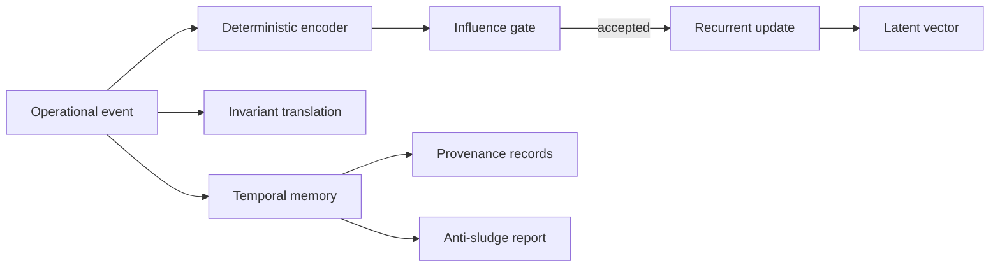

# Dynamic Latent Operational Recurrence + Invariant Translation Layers

Neura now includes a deterministic, inspectable latent operational recurrence layer. The implementation lives in:

- `src/latent_operational_recurrence.rs`
- `src/cli/latent.rs`
- CLI command: `neura neura-latent ...`

## What this layer does

The layer converts operational events into a stable low-dimensional vector, applies recurrence over time, translates events into invariant matches, preserves temporal provenance, and reports drift/anti-sludge signals.

It is intentionally **not opaque model magic**. The vector schema is fixed, deterministic, serialized as JSON, and covered by tests.

## CLI

```bash
neura neura-latent status
neura neura-latent vector
neura neura-latent observe build success --tag test --tag validation --tool cargo --latent-provider openai
neura neura-latent translate build success --tag test --tag validation
neura neura-latent drift
neura neura-latent remap 1
neura neura-latent invariants
neura neura-latent provenance
neura neura-latent temporal
neura neura-latent influence build success --tag test
neura neura-latent report --output ~/Desktop/latent_report.md
neura neura-latent learn build success --tag test --tag validation --tool cargo
neura neura-latent learned-vectors
neura neura-latent attractors
neura neura-latent counterfactual build success --tag test --alternate-tag validation --alternate-tag provenance
neura neura-latent doctrine
neura neura-latent immune
neura neura-latent topology
neura neura-latent convergence
neura neura-latent evolution-report --output ~/Desktop/latent_evolution_report.md
neura neura-latent ingest build success --tag test --tag validation --tool cargo --source cli
neura neura-latent learn-now --limit 32
neura neura-latent background-status
neura neura-latent samples
neura neura-latent outcomes
neura neura-latent doctrines
neura neura-latent pause
neura neura-latent resume
```

## State

Default state path:

```text
~/.neura/latent_operational_state.json
```

Override for tests or isolated runs:

```bash
NEURA_LATENT_STATE=/tmp/neura-latent.json neura neura-latent status
```

## Recurrence model



## Invariants

Default invariant translations include:

- validate before done,
- preserve user intent,
- avoid irreversible actions,
- track provenance.

Each invariant has a canonical expression and required tags. Translation returns a confidence score and explanation.

## Guardrails

- Low-signal events are rejected.
- Near-duplicate influence is rejected.
- Temporal memory is capped to prevent unbounded sludge.
- Anti-sludge reporting surfaces duplicate and low-signal ratios.
- Schema remap is explicit and versioned.

## Validation

Core tests cover:

- deterministic event encoding,
- recurrence update behavior,
- invariant translation matching,
- influence gate rejection for empty signal.

## Live operational fabric commands

```bash
neura neura-latent fabric-status
neura neura-latent fabric-events
neura neura-latent fabric-report --output ~/Desktop/live_operational_fabric_report.md
neura neura-latent fabric-pause
neura neura-latent fabric-resume
neura neura-latent fabric-ping
```

The fabric emits live user-message, provider request/response, tool, token, local sidecar token-estimate, memory bridge, and background latent learning events. Events are persisted under `~/.neura/live_operational_fabric/events.jsonl` and bridged into the latent background sample queue.

Automatic background adaptation is enabled by default: every live fabric event opportunistically runs a bounded latent background cycle. Set `NEURA_LIVE_FABRIC_AUTO_CYCLE=0` to disable it for debugging.

## Latent memory bank commands

```bash
neura neura-latent latent-memory-status
neura neura-latent latent-memory-blocks
neura neura-latent latent-memory-report --output ~/Desktop/latent_memory_report.md
neura neura-latent latent-memory-usefulness
```

Latent memory stores ctx-style blocks for stable attractors, noise patterns, validation doctrine, useful drift synthesis, and operational lessons. Background learning consults this bank before vector updates to suppress duplicates, down-rank noise, anchor excessive drift, and preserve useful drift as synthesis memory.

## Operational policy influence commands

```bash
neura neura-latent policy-status
neura neura-latent policy-rules
neura neura-latent policy-decide test-validation final-answer
neura neura-latent policy-audit
neura neura-latent policy-report --output ~/Desktop/policy_influence_report.md
neura neura-latent policy-domains
```

Policy influence is gated by latent memory usefulness: low-confidence memories do not become policy, policy decisions are audited, and observe-only mode is available in state for safe rollout.

## Policy outcome credit commands

```bash
neura neura-latent policy-credit-report --output ~/Desktop/policy_credit_report.md
neura neura-latent policy-credit-assign <audit-id> success
```

Policy outcome credit assigns success/failure back to policy audits, updates rule confidence, and propagates usefulness back into the source latent memory when a rule came from memory.

## Policy shadow simulation commands

```bash
neura neura-latent policy-simulate --limit 200
neura neura-latent policy-shadow-report --output ~/Desktop/policy_shadow_report.md
neura neura-latent policy-promote-safe
neura neura-latent policy-demote-bad
```

Shadow simulation replays recent live fabric events and latent background samples through current policies, estimates counterfactual delta, then allows safe promotion or demotion before stronger runtime enforcement.

## Operational Self-Eval Harness

Neura now includes a closed-loop operational self-eval harness that evaluates the live latent/policy stack against itself before trusting autonomous promotion.

Commands:

- `neura neura-latent eval-run` runs the full self-eval suite and persists `~/.neura/operational_eval_report.json`.
- `neura neura-latent eval-report --output ~/Desktop/operational_eval_report.md` renders a human-readable report.
- `neura neura-latent eval-gate` enforces the promotion gate and fails closed if critical invariants do not pass.

The suite checks token abstraction, latent memory rehydration after accepted learning, background recursive adaptation, policy decision availability, policy outcome credit assignment, shadow policy simulation, and destructive-action safety invariants. The eval injects its own learning samples back into the adaptive loop, so it is not just a passive report. It becomes part of the system's own operational memory and gating cycle.

## Adversarial Operational Eval + Promotion Hardening

The self-eval harness now has an adversarial companion gate. This protects promotion from passing merely because normal operational usefulness looks good.

Commands:

- `neura neura-latent adversarial-eval-run` runs adversarial cases and persists `~/.neura/adversarial_eval_report.json`.
- `neura neura-latent adversarial-eval-report --output ~/Desktop/adversarial_eval_report.md` renders the adversarial report.
- `neura neura-latent adversarial-eval-gate` enforces the adversarial hardening gate.
- `neura neura-latent eval-gate` now requires both the normal operational eval gate and the adversarial gate.

Covered adversarial classes include destructive prompt injection, latent memory poisoning, token flood pressure, tool-budget abuse, promotion without evidence, harmful shadow counterfactuals, and ctx/memory exfiltration pressure. Promotion fails closed if any critical adversarial case fails.

## Autonomous Internal Testing + Bounded Self-Improvement Scheduler

Neura now has a bounded autonomous internal testing scheduler. It recursively evaluates the current runtime against operational evals, adversarial evals, and focused internal validations, then synthesizes improvement candidates. It is dry-run by default and mutation-disabled by default.

Commands:

- `neura neura-latent self-improve-run --iterations 1` runs one bounded dry-run cycle.
- `neura neura-latent self-improve-run --iterations 1 --dry-run false --allow-mutation true` enables the mutation path, but only for safe actions and only after all gates pass.
- `neura neura-latent self-improve-report --output ~/Desktop/self_improvement_report.md` renders the latest report.

The scheduler is intentionally fail-closed: it caps iterations, requires operational and adversarial gates, runs internal validation, records blocked actions, and does not apply code changes in dry-run mode.

## Evidence-Ranked Self-Improvement Tasks + Tiny Patch Mutation Gates

The autonomous self-improvement scheduler now synthesizes an evidence-ranked task queue and evaluates a tiny patch mutation gate before any change can be considered. Ranking uses operational score, adversarial score, self-improvement evidence, expected utility, risk, confidence, and a tiny-patch plan.

Commands:

- `neura neura-self-improve tasks` synthesizes the ranked task queue.
- `neura neura-self-improve task-report --output ~/Desktop/self_improvement_tasks.md` renders the queue.
- `neura neura-self-improve tiny-patch-gate` evaluates the highest-ranked task in dry-run mode.
- Compatibility aliases also exist under `neura neura-latent self-improve-tasks`, `self-improve-task-report`, and `self-improve-tiny-patch-gate`.

Tiny patch mutation is blocked unless dry-run is disabled, mutation is explicitly allowed, file and line thresholds are tiny, risk is below threshold, no user confirmation is required, and the task is marked mutation-safe.

## Full Cognition Evidence Ledger Wiring

The cognition evidence ledger is now wired as a broader append-only evidence chain with receipts, parent/cause links, subsystem labels, query, explain, and expanded report output.

Commands:

- `neura neura-latent evidence-ledger-verify` verifies the hash chain.
- `neura neura-latent evidence-ledger-query --kind tiny-patch --subsystem self-improvement --limit 10` queries recent evidence blocks.
- `neura neura-latent evidence-ledger-explain <index-or-hash-prefix>` explains one block and shows parent/cause counts.
- `neura neura-latent evidence-ledger-report --output ~/Desktop/evidence_ledger_report.md` renders the chain report.

Operational evals, adversarial evals, self-improvement cycles, evidence-ranked tasks, and tiny patch gates now append receipts into the ledger. Tiny patch gate evidence is causally linked to the ranked task report block that produced it.

## Evidence Ledger Replayable Decision Simulator

The cognition evidence ledger can now be replayed as a deterministic decision simulator. Replay reconstructs each eligible decision using only historical blocks up to that block index, verifies no future evidence leaks into the replay, scores the replayed outcome, and generates conservative/exploratory/audit-first alternatives.

Commands:

- `neura neura-latent evidence-replay-run --limit 20` replays recent ledger-backed decisions.
- `neura neura-latent evidence-replay-report --output ~/Desktop/evidence_replay_report.md --limit 20` renders a replay report.
- `neura neura-latent evidence-replay-explain <index-or-hash-prefix>` explains replay context for one ledger block.

Replay is read-only: it consumes the append-only ledger, validates historical context, and reports counterfactual alternatives without mutating runtime policy.

## Replay-Gated Patch Proposal Loop

Neura can now turn evidence-ranked tasks into dry-run patch proposals that are scored by ledger replay before any promotion decision. The loop synthesizes a report-only patch, estimates replay delta, records a ledger receipt, runs validation, and applies a promotion gate that remains mutation-disabled by default.

Commands:

- `neura neura-latent patch-propose --task top` creates a replay-gated proposal and records a ledger receipt.
- `neura neura-latent patch-dry-run --task top` prints the report-only patch text.
- `neura neura-latent patch-validate --task top` runs validation checks for the proposal.
- `neura neura-latent patch-replay-score --task top` reports before/after replay scores and delta.
- `neura neura-latent patch-promote-gate --task top` runs the promotion gate, which is blocked by default.
- `neura neura-latent patch-report --output ~/Desktop/patch_proposal_report.md` writes the full report.

## Replay-Scored Self-Improvement Patch Pipeline

The patch proposal loop now has a full replay-scored self-improvement pipeline. It moves a task through proposal, dry-run patch generation, replay scoring, optional validation, promotion gating, rollback planning, and a final blocked/applied state. Mutation remains blocked by default.

Commands:

- `neura neura-latent patch-pipeline-run --task top` runs the pipeline and prints state.
- `neura neura-latent patch-pipeline-report --output ~/Desktop/self_improve_patch_pipeline.md --task top` writes the full pipeline report.

Each run records ledger receipts, checks replay delta, prepares rollback steps, and keeps the generated patch report-only unless future gates explicitly allow mutation.
