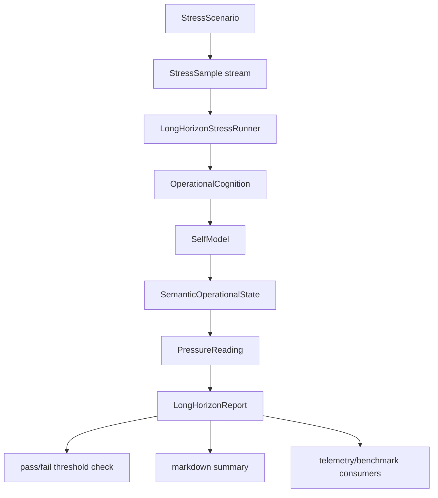
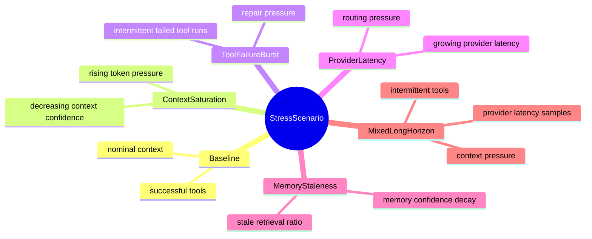
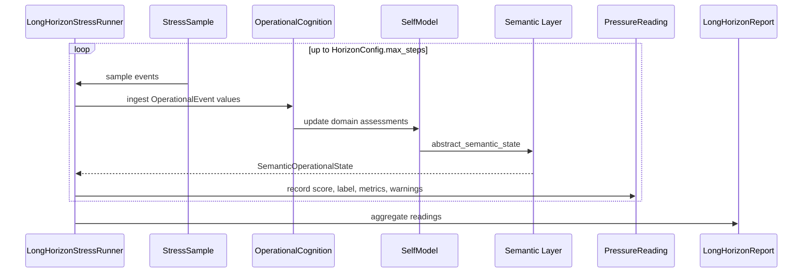

# Long-Horizon Operational Pressure + Continuous Cognition Stress Infrastructure

This phase adds bounded stress infrastructure above the self-model and semantic operational layer.

Implemented in:

```text
src/long_horizon_pressure.rs
```

Exported through:

```rust
pub mod long_horizon_pressure;
```

## Purpose

The layer gives Kcode deterministic infrastructure for answering:

- How does operational cognition behave across many steps?
- When do drift, compression, and convergence become concerning?
- Do tool failure bursts create repair pressure?
- Do provider latency or context saturation affect semantic state?
- Can stress results be summarized in a stable report?

It is intentionally finite and caller-driven. It is not an autonomous daemon.

## Architecture



## Core Types

| Type | Purpose |
|---|---|
| `StressScenario` | Built-in finite scenario class |
| `StressSample` | One step of stress input, mapping to operational events |
| `HorizonConfig` | Bounds and thresholds for a run |
| `PressureReading` | Per-step semantic/operational pressure snapshot |
| `LongHorizonReport` | Aggregate result across a bounded horizon |
| `LongHorizonStressRunner` | Finite runner that ingests samples and produces a report |
| `generate_scenario` | Deterministic scenario generator for tests/docs/benchmarks |

## Built-In Scenarios



## Bounded Run Loop



## Pressure Metrics

Each reading records:

- step
- scenario
- `OperationalState`
- `SemanticLabel`
- semantic metrics
  - coherence
  - drift
  - convergence
  - compression
- score
- warnings

Warnings are generated for:

- high drift
- high compression
- low convergence
- repair pause recommendation

## Validation

Targeted command:

```bash
cargo test long_horizon_pressure --lib
```

Focused coverage:

- baseline pressure passes default thresholds
- mixed horizon respects `max_steps`
- tool failure bursts produce repair pressure
- markdown reports include final semantic state and recent readings
