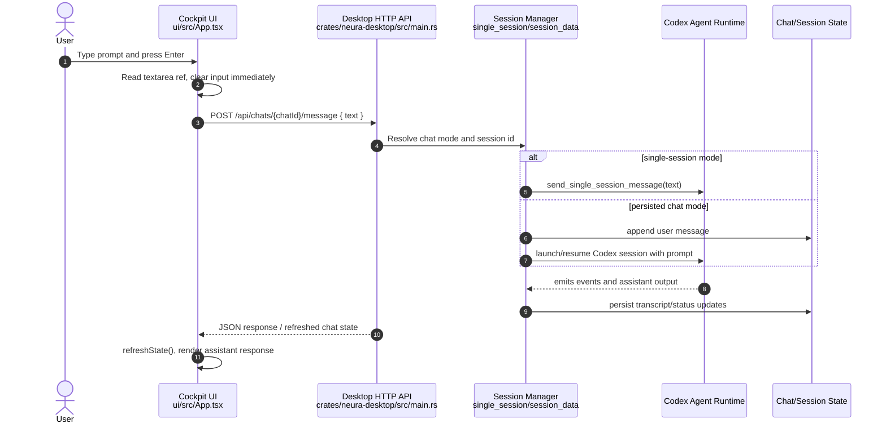
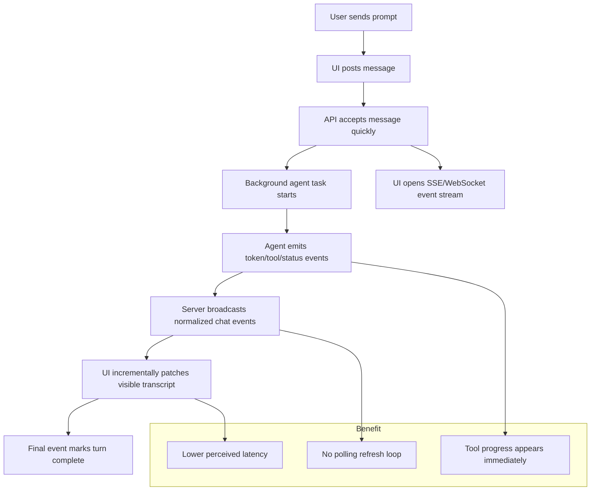

# Neura Message Flow Test

This diagram captures the current high-level flow when a user sends a message to Neura, plus a technical suggestion for making responses feel even more immediate.

## Suggested improvement

The current flow is simple and reliable, but the UI still waits on request/refresh boundaries for some updates. A more responsive design would push agent events to the cockpit as they happen.

