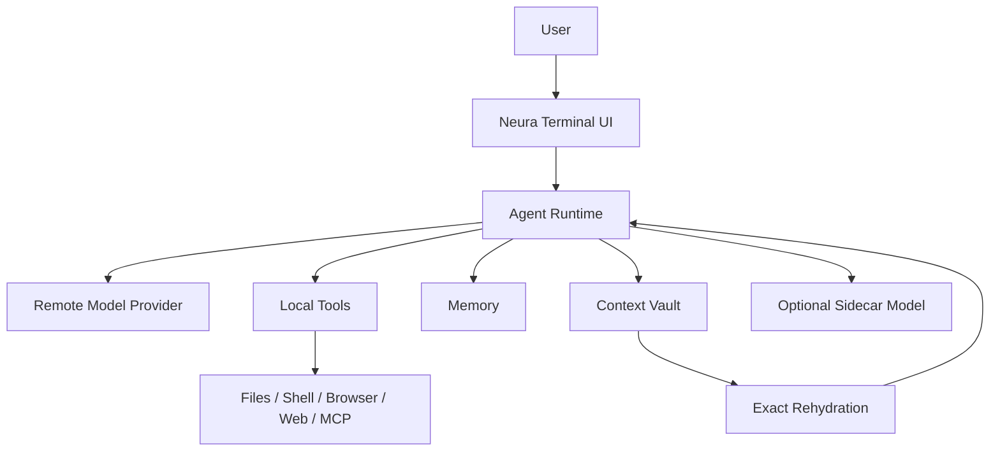
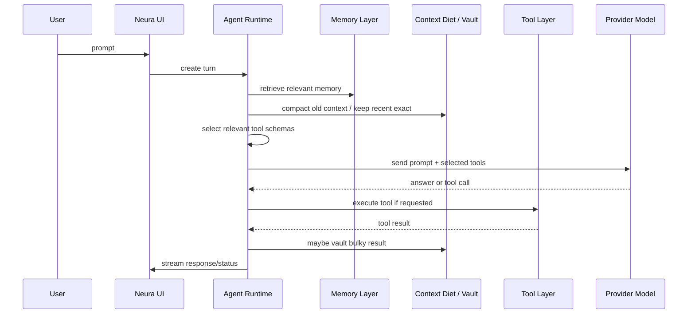
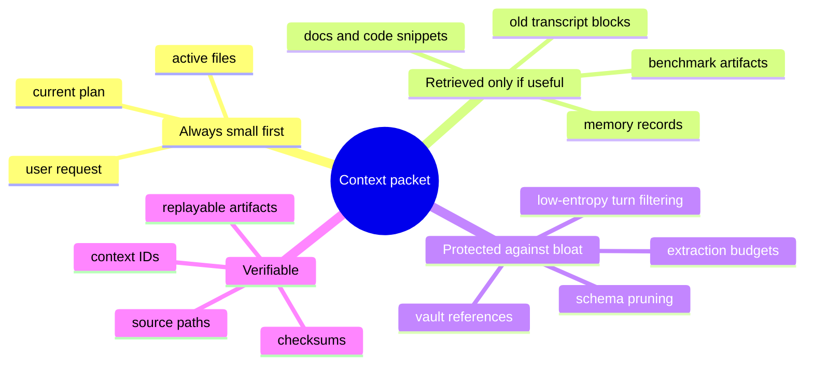
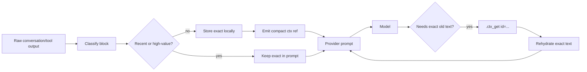
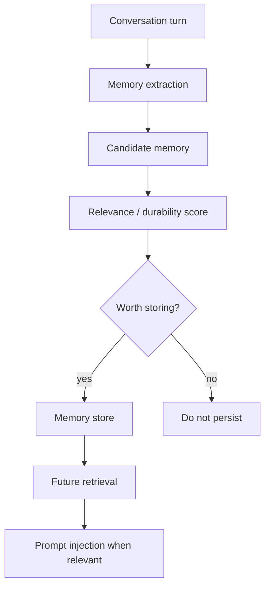
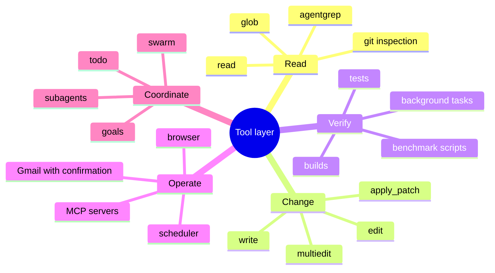
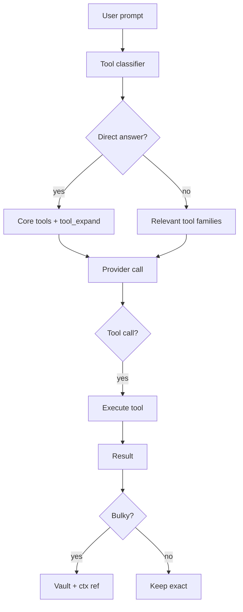
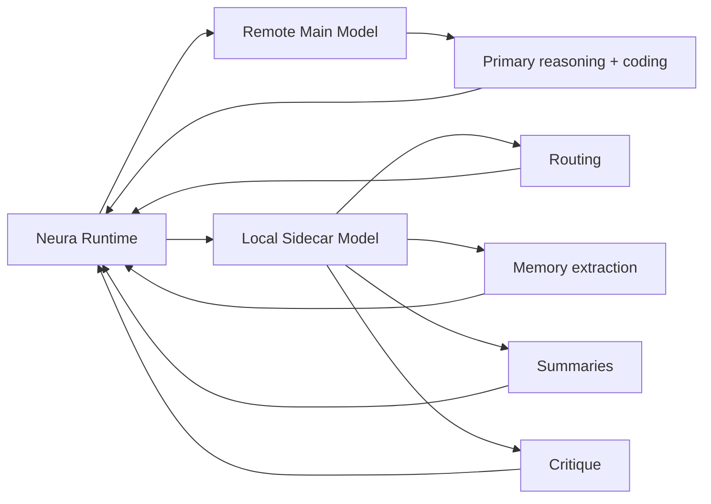
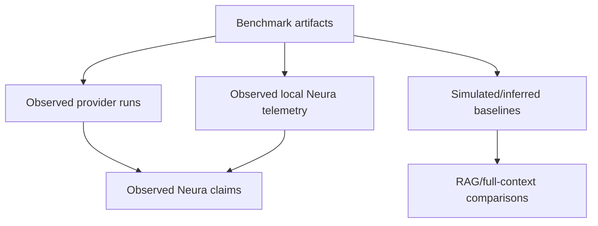

# Neura Technical Rubric and System Diagrams

This document explains Neura at multiple levels of detail. It is meant for reviewers, contributors, and technically curious users who want a structured mental model of the system.

## Level 0 — One-sentence overview

Neura is a local-first terminal coding agent harness that connects a remote model to local tools, memory, context compression, exact context recall, MCP integrations, and optional local sidecar models.

## Level 1 — Simple system map

### Level 1 rubric

| Component | Purpose | User-visible result |
|---|---|---|
| Terminal UI | human interaction | chat, tool logs, status, progress |
| Agent runtime | orchestration | decides prompts, tools, memory, provider calls |
| Remote provider | main reasoning model | coding answers and tool decisions |
| Tools | real-world actions | file edits, tests, browser, web, Gmail, MCPs |
| Memory | durable facts/preferences | less repeated context from the user |
| Context vault | exact old evidence | long sessions without losing logs/diffs |
| Sidecar model | local helper intelligence | routing, summaries, critique, extraction |

---

## Level 2 — Request lifecycle

### Level 2 rubric

| Stage | Key decision | Correct behavior | Failure mode |
|---|---|---|---|
| Turn creation | what is the user asking? | preserve latest user intent exactly | stale context dominates current task |
| Memory retrieval | what durable facts matter? | recall only relevant facts | irrelevant memory injection |
| Context diet | what old context can be compacted? | keep recent/current task exact | over-compress critical evidence |
| Tool schema selection | what tools should model see? | send relevant tools, keep `tool_expand` | huge schema overhead or missing tools |
| Provider call | what context reaches model? | grounded, bounded, auditable prompt | hallucinated hidden details |
| Tool execution | can action be performed safely? | run reversible/validated steps | destructive or wrong command |
| Result vaulting | should output stay exact or compact? | preserve exact local evidence | losing build logs/diffs/errors |

---

### Context mindmap

## Level 3 — Context architecture

Neura treats context like a local virtual memory system.

### Context object rubric

| Field | Meaning | Why it matters |
|---|---|---|
| `id` | stable context identifier | exact lookup key |
| `k` | kind of block | tool output, old text, vault ref, etc. |
| `n` | original size | tells model how much was omitted |
| `c` | confidence | helps decide whether summary is reliable |
| `p` | priority | normal/high/verify handling |
| `t` | semantic topics | topic-gated auto-restore |
| `s` | deterministic summary | breadcrumb, not source of truth |

### Context correctness rubric

| Grade | Criteria |
|---|---|
| Excellent | exact current task remains visible; old bulky evidence is ref-backed; exact rehydration works; sensitive content is not auto-injected |
| Good | most old context compacted safely; rare manual `.ctx_get` needed |
| Risky | summaries are treated as authoritative or old errors are hard to recover |
| Bad | old tool output is dropped or hallucinated from memory |

---

## Level 4 — Memory architecture

### Memory categories

| Category | Example | Retention expectation |
|---|---|---|
| Fact | project uses `~/.neura/build-src/neura` | durable until corrected |
| Preference | user wants concise answers | durable but user-editable |
| Entity | repo, model, server, person | durable with relationships |
| Correction | old assumption was wrong | high priority for future turns |

### Memory migration rubric

| Concern | Neura-style answer |
|---|---|
| Schema changes | version entries and support compatibility adapters |
| Bad extraction | keep audit trail and allow correction memories |
| Long sessions | append/update carefully, compact separately |
| Safety | do not silently persist secrets or credentials |
| Tests | old fixture snapshots should load after migrations |

---

### Tooling mindmap

## Level 5 — Tool system

### Tool families

| Family | Tools / examples | Main risk |
|---|---|---|
| Files | `read`, `write`, `edit`, `patch`, `glob` | wrong file edits |
| Shell | `bash`, `bg`, batch execution | destructive commands |
| Search | `agentgrep`, `grep`, `codesearch` | noisy matches |
| Browser/UI | `browser`, `mouse`, Chromium MCP | flaky UI state |
| Web | `websearch`, `webfetch` | stale or untrusted pages |
| Memory/goals | `memory`, `todo`, `goal`, `schedule` | wrong persistence |
| Agents | `subagent`, `swarm` | coordination complexity |
| MCP | `mcp`, external servers | permissions and data flow |

### Tool quality rubric

| Grade | Criteria |
|---|---|
| Excellent | minimal necessary tools exposed; command outputs validated; errors summarized; exact logs recoverable |
| Good | correct tools exposed; occasional extra schema overhead |
| Risky | too many tools exposed every turn or missing expansion path |
| Bad | tools hallucinated, destructive actions unguarded, outputs lost |

---

## Level 6 — Provider and sidecar split

### Provider split rubric

| Task | Best home | Reason |
|---|---|---|
| complex coding reasoning | remote frontier model | quality |
| cheap routing | sidecar | latency/cost |
| memory extraction | sidecar or remote fallback | structured local task |
| benchmark grading | sidecar + deterministic checks | repeatability |
| exact context lookup | Neura runtime | must be deterministic/local |
| tool execution | Neura runtime | real-world side effects |

---

## Level 7 — Benchmark/evaluation architecture

### Evaluation rubric

| Evidence type | Strength | Example |
|---|---|---|
| Observed provider run | strongest | edit→test task passes |
| Observed local telemetry | strong for local behavior | context chars reduced |
| Deterministic local benchmark | strong for retrieval mechanics | exact target block found |
| Simulated baseline | useful comparison | full-context replay cost |
| Inferred baseline | weakest | lexical RAG comparison |

### Paper-grade benchmark checklist

- [ ] claim has a ground truth definition,
- [ ] claim has an artifact path,
- [ ] observed vs inferred vs simulated is labeled,
- [ ] failure cases are retained,
- [ ] confidence intervals used for pass rates,
- [ ] benchmark scripts are committed,
- [ ] artifact manifest includes checksums.

---

## End-to-end system rubric

| Dimension | Excellent | Good | Weak |
|---|---|---|---|
| Context retention | exact old evidence recoverable | most old context recoverable | old evidence lost |
| Token efficiency | bulky old context externalized safely | moderate savings | giant transcript resent |
| Tool use | relevant schemas, validated execution | mostly correct tool use | wrong/missing tools |
| Memory | durable, relevant, auditable | useful but noisy | stale/incorrect injection |
| Safety | reversible changes, clear permissions | occasional manual review needed | destructive/untracked actions |
| Benchmarks | observed artifacts + baselines | partial benchmarks | vibe claims only |
| Extensibility | MCPs/plugins/sidecars documented | ad hoc integrations | hardcoded workflows |

## Contributor rubric

A Neura feature is ready when it has:

- [ ] clear user-facing purpose,
- [ ] documented configuration,
- [ ] tests or benchmark coverage,
- [ ] safe failure behavior,
- [ ] no hidden credential persistence,
- [ ] telemetry or logs where useful,
- [ ] docs updated in `docs/`,
- [ ] benchmark impact considered if it affects context, tools, memory, or provider calls.
