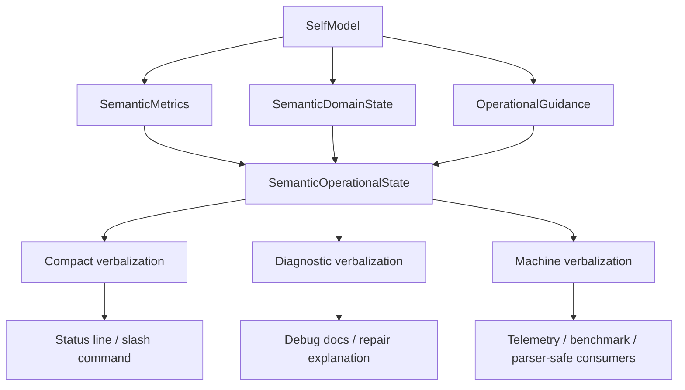
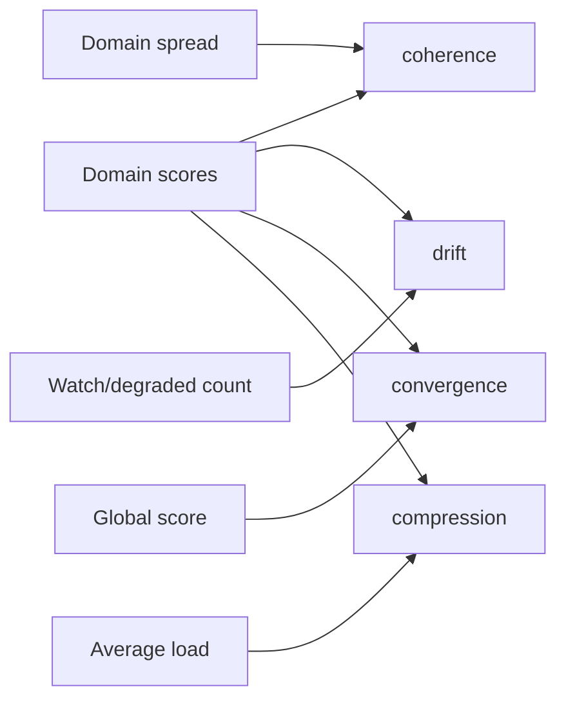
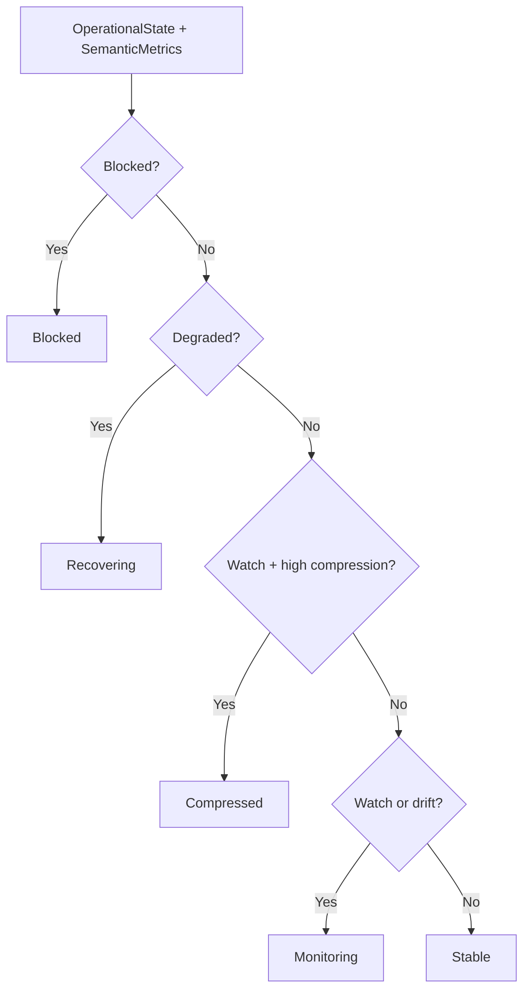

# Operational Cognition Verbalization and Semantic State Abstraction Layer

This phase adds a deterministic semantic layer above Neura's `SelfModel`. The layer converts operational cognition signals into bounded, non-anthropomorphic language and machine-readable semantic state.

## Why This Exists

The previous self-model phase gave Neura structured operational cognition:

- domain assessments
- operational states
- routing bias
- repair hints
- pause-for-repair guidance

This phase adds semantic abstraction and verbalization so those signals can be safely surfaced to:

- slash/status commands
- telemetry
- repair and replay flows
- provider routing
- benchmarks
- documentation/debug views

## Runtime Shape



## New Rust Module

Implemented in:

```text
src/semantic_operational_layer.rs
```

Exported through:

```rust
pub mod semantic_operational_layer;
```

## Core Types

| Type | Purpose |
|---|---|
| `SemanticLabel` | Stable semantic label: `Stable`, `Monitoring`, `Compressed`, `Recovering`, `Blocked` |
| `VerbalizationMode` | `Compact`, `Diagnostic`, or `Machine` output mode |
| `VerbalizationBudget` | Bounds domains, reasons, and max characters |
| `SemanticMetrics` | Coherence, drift, convergence, and compression metrics |
| `SemanticDomainState` | Semantic state for one cognitive domain |
| `SemanticOperationalState` | Complete abstracted state derived from `SelfModel` |

## Semantic Metrics



- **coherence**: how consistent the domain scores are.
- **drift**: how much the system is moving away from nominal operation.
- **convergence**: how strongly the operational state is settling toward a usable path.
- **compression**: how much load/context pressure is shaping the state.

## Labeling



## Verbalization Modes

### Compact

Single-line status output:

```text
semantic_state=stable operational_state=Nominal score=1.00 coherence=1.00 drift=0.00 convergence=1.00
```

### Diagnostic

Human-readable multi-line output for debugging and repair:

```text
Semantic operational state: recovering (Degraded, score 0.42)
Metrics: coherence 0.81, drift 0.58, convergence 0.54, compression 0.73
- repair pause is recommended
- tool_execution: recovering score 0.31 (...)
Action: pause risky chaining and prefer repair/replay/context rebuild.
```

### Machine

Stable key-value format for parsers:

```text
a_semantic_state=monitoring b_operational_state=Watch c_score=0.740 d_coherence=0.890 ...
```

The alphabetic prefixes keep critical fields early even under truncation budgets.

## Safety Constraints

The layer is intentionally bounded:

- no unbounded introspection loops
- no anthropomorphic self-claims
- no prompt-only state
- deterministic labels and metrics
- UTF-8 safe truncation
- explicit `VerbalizationBudget`

## Validation

Targeted tests:

```bash
cargo test semantic_operational_layer --lib
```

Current focused coverage:

- nominal model verbalizes as stable
- failed tool execution becomes recovering/blocked and requests repair
- high context pressure becomes compressed/monitoring/recovering/blocked
- machine verbalization respects budget and preserves semantic state key
