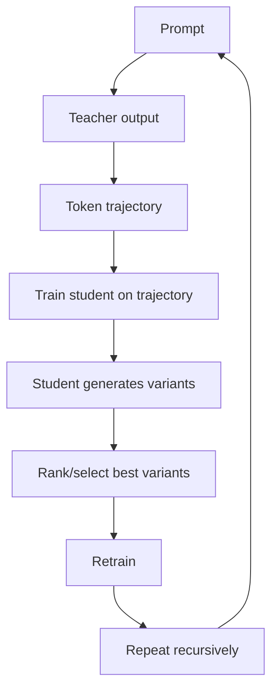
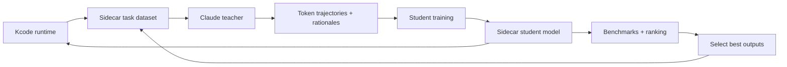

# Claude Sidecar TODO

This document tracks a possible Claude-based sidecar workflow for Kcode. The idea is to use a strong teacher model to generate training trajectories, then repeatedly improve smaller/local sidecar behavior through ranking, selection, and retraining.

## Core recursive training loop

## Goal

Build a sidecar model pipeline that can improve Kcode helper tasks such as:

- routing,
- memory extraction,
- tool selection hints,
- context summarization,
- hallucination critique,
- benchmark grading,
- prompt compression,
- exact-context rehydration decisions.

The Claude sidecar concept should not replace the main coding model. It should help Kcode make cheaper, faster, more reliable local decisions around the main model.

## Proposed architecture

## Candidate sidecar tasks

| Task | Teacher signal | Student output | Evaluation |
|---|---|---|---|
| Tool routing | best tool family for prompt | tool shortlist | exact match / task success |
| Memory extraction | durable facts/preferences | structured memory entries | precision/recall against labels |
| Context summarization | compact non-authoritative summary | `<ctx>` summary text | exact-recall usefulness + no hallucination |
| Rehydration decision | whether exact context is needed | yes/no + context ID | false positive/false negative rate |
| Prompt critique | likely failure modes | critique checklist | human or benchmark grader |
| Benchmark grading | pass/fail/failure mode | JSON result | agreement with oracle |

## Data sources

Potential training examples can come from:

- committed benchmark artifacts,
- Kcode local telemetry,
- successful provider edit→test traces,
- adversarial hallucination benchmark traces,
- context recall benchmark tasks,
- manually reviewed high-quality sessions,
- synthetic tasks generated from real repository structures.

Sensitive data must be excluded or redacted before using any trace as training data.

## Ranking and selection

Student variants should be ranked by:

1. task correctness,
2. faithfulness to available context,
3. no unsupported claims,
4. token efficiency,
5. deterministic JSON/schema compliance,
6. latency,
7. robustness on adversarial prompts.

A simple first version can use rule-based graders. A stronger version can use a teacher model as a judge, but only when paired with deterministic checks and saved artifacts.

## Safety requirements

- Do not train on credentials, private emails, tokens, or secrets.
- Keep exact provenance for every training sample.
- Separate user-private local data from public training data.
- Add opt-in controls before any user trace is used.
- Store dataset manifests with hashes and redaction status.
- Benchmark sidecar regressions before release.

## Milestones

| Milestone | Deliverable |
|---|---|
| M1 | Define sidecar task schemas and JSON output formats |
| M2 | Build a small curated teacher/student dataset from benchmark artifacts |
| M3 | Train/evaluate first routing and memory-extraction student |
| M4 | Add variant generation and ranking loop |
| M5 | Add recursive retraining with regression gates |
| M6 | Integrate best student into Kcode sidecar runtime behind a feature flag |

## Open implementation notes

- Start with routing and memory extraction because they are easy to score.
- Keep the training loop offline at first; do not make it part of normal Kcode startup.
- Prefer small, reproducible experiments over large opaque training runs.
- Every recursive training generation should write an artifact manifest.
- The student should fail closed: if confidence is low, defer to existing Kcode logic.

## TODO checklist

- [ ] Define Claude teacher prompt templates
- [ ] Define token trajectory storage format
- [ ] Create dataset manifest schema
- [ ] Add redaction pipeline for sensitive traces
- [ ] Build first 100-example routing dataset
- [ ] Build first 100-example memory extraction dataset
- [ ] Add variant generation runner
- [ ] Add ranking/select script
- [ ] Add sidecar regression benchmark suite
- [ ] Add feature flag for experimental Claude-trained sidecar
