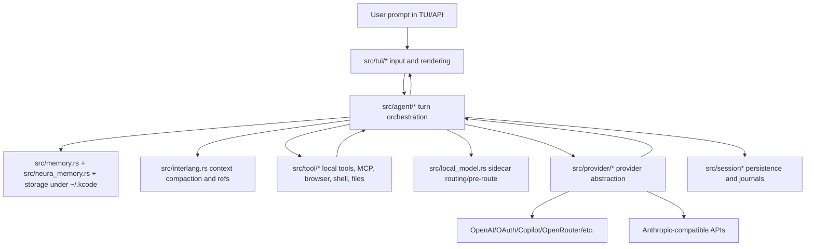
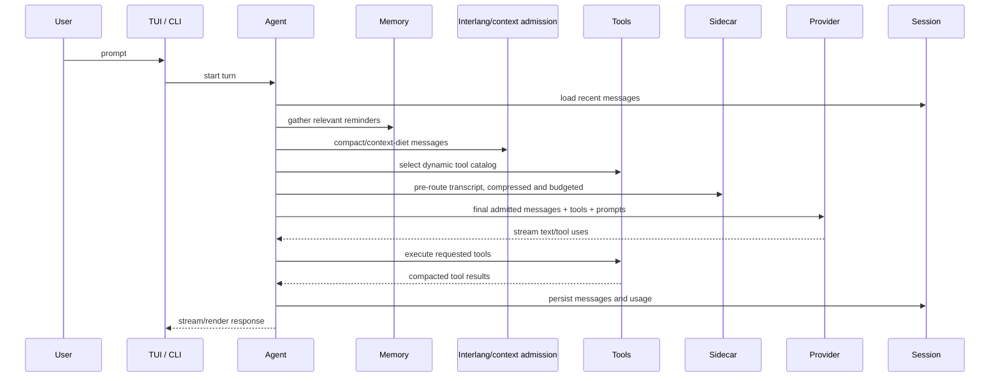
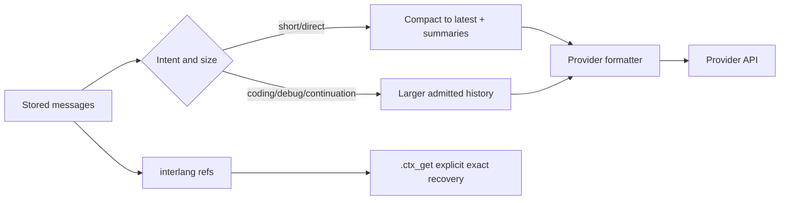

# Kcode system topology and full file map
This document is the long-form systems map for Kcode. It explains the end-to-end runtime, how the major subsystems call each other, and gives every repository file a navigable place in the architecture. It is intentionally exhaustive: source modules receive descriptions and every non-generated repository file is listed so a reader can trace from a user prompt to provider call, tool execution, memory/context handling, UI rendering, persistence, benchmarks, and documentation.
> Scope note: `target/`, `.git/`, and generated build artifacts are excluded. Test fixtures are included because they document behavior and guard regressions.
## End-to-end runtime in one diagram

## Major subsystem map
| Subsystem | Main files | Responsibility | Calls into | Called by |
|---|---|---|---|---|
| CLI and process startup | `src/main.rs`, `src/cli/*`, `src/commands.rs` | Parse command-line commands, start TUI/API/harness paths, route install/auth/session commands. | agent, auth, provider, setup, config | shell, installer, tests |
| Agent turn engine | `src/agent.rs`, `src/agent/*` | Own a conversation turn: prepare messages, memory, tools, prompts, streaming, interruption, retries, compaction, side panels. | session, provider, tool, interlang, memory, local_model, telemetry | TUI, CLI, API/harness |
| Prompt and context admission | `src/prompt.rs`, `src/interlang.rs`, `src/agent/turn_loops.rs` | Build static/dynamic system prompts, compact old context, create context refs, enforce final pre-send budgets. | message, util, storage, tokenizer | agent turn loops and providers |
| Provider abstraction | `src/provider/*` | Normalize model routing, OAuth/API auth, request formatting, streaming, retries, token usage. | auth, account store, route builders, message, pricing | agent |
| Tools and MCP | `src/tool/*` | Expose local capabilities: shell, file read/edit/write, search, browser, Gmail, memory, scheduling, swarm, MCP. | OS, browser bridge, MCP servers, session, memory | agent |
| TUI | `src/tui/*` | Terminal user interface, input handling, rendering, account picker, inline interaction, side panel. | agent, auth, session, commands | main/CLI |
| Persistence and sessions | `src/session*`, `src/storage.rs`, `src/active_pids.rs` | Store sessions, journals, active process metadata, todo state, logs. | filesystem, message, telemetry | agent, TUI, CLI |
| Memory | `src/memory.rs`, `src/neura_memory.rs`, `src/memory_*`, `src/local_model.rs` | Promote, recall, compact, and route external memory/context. | storage, local sidecar, interlang | agent, tools |
| Auth and accounts | `src/auth/*`, `src/account_*`, `src/oauth_*` | Handle OAuth/API key accounts, refresh, failover, account selection. | provider, tui, filesystem | CLI, TUI, provider |
| Benchmarks and evaluation | `scripts/*benchmark*.py`, `benchmark-results/*`, `docs/BENCHMARKS.md` | Observed and simulated benchmarks, reports, artifacts, manifests. | CLI, repo files, provider/tool loops | docs and developer workflow |

## Runtime sequence: from prompt to response

## Provider and prompt budgeting
Provider calls are intentionally provider-agnostic at the admission layer. Before OpenAI, Anthropic, Copilot, OpenRouter, or any other backend formats the request, `src/agent/turn_loops.rs` decides whether the message payload is too large for the current intent. Short/direct turns get a small budget and compact old text/tool blocks; coding/debug turns get a larger budget. `src/interlang.rs` stores exact context externally and sends refs/candidates, with explicit `.ctx_get` for exact recovery. `src/local_model.rs` uses a separate adaptive pre-route transcript budget for sidecar routing.

## Source directory architecture

### `src/agent`
| File | Lines | Role in the system | Important symbols | Related flow |
|---|---:|---|---|---|
| [`src/agent/compaction.rs`](../src/agent/compaction.rs) | 154 | Best-effort emergency recovery after a context-limit error. | `fn is_context_limit_error(error: &str) -> bool; fn effective_context_tokens_from_usage(` | turn orchestration |
| [`src/agent/environment.rs`](../src/agent/environment.rs) | 98 | Set logging context for this agent's session/provider | `` | turn orchestration |
| [`src/agent/interrupts.rs`](../src/agent/interrupts.rs) | 399 | Source module or test fixture. See symbols and path for its subsystem role. | `fn soft_interrupt_session_display_role(source: SoftInterruptSource) -> Option<StoredDisplayRole>; fn soft_interrupt_protocol_display_role(source: SoftInterruptSource) -> Option<String>; pub fn restore_persisted_soft_interrupts(&self) -> usize; pub fn persist_soft_interrupt_snapshot(&self); pub fn push_alert(&mut self, alert: String); pub fn take_alerts(&mut self) -> Vec<String>` | turn orchestration |
| [`src/agent/messages.rs`](../src/agent/messages.rs) | 77 | Source module or test fixture. See symbols and path for its subsystem role. | `` | turn orchestration |
| [`src/agent/prompting.rs`](../src/agent/prompting.rs) | 123 | Source module or test fixture. See symbols and path for its subsystem role. | `fn append_current_turn_system_reminder(&self, split: &mut crate::prompt::SplitSystemPrompt)` | turn orchestration |
| [`src/agent/provider.rs`](../src/agent/provider.rs) | 113 | Source module or test fixture. See symbols and path for its subsystem role. | `pub fn set_premium_mode(&self, mode: crate::provider::copilot::PremiumMode); pub fn premium_mode(&self) -> crate::provider::copilot::PremiumMode; pub fn provider_fork(&self) -> Arc<dyn Provider>; pub fn provider_handle(&self) -> Arc<dyn Provider>; pub fn available_models(&self) -> Vec<&'static str>; pub fn available_models_for_switching(&self) -> Vec<String>` | provider routing |
| [`src/agent/response_recovery.rs`](../src/agent/response_recovery.rs) | 199 | Source module or test fixture. See symbols and path for its subsystem role. | `fn parse_text_wrapped_tool_call(; fn continuation_prompt_for_stop_reason(stop_reason: &str) -> String` | turn orchestration |
| [`src/agent/status.rs`](../src/agent/status.rs) | 119 | Get the text content of the last message (first Text block) | `pub fn session_memory_profile_snapshot(; pub fn message_count(&self) -> usize; pub fn last_message_role(&self) -> Option<Role>; pub fn last_message_text(&self) -> Option<&str>; pub fn build_transcript_for_extraction(&self) -> String; pub fn last_assistant_text(&self) -> Option<String>` | turn orchestration |
| [`src/agent/streaming.rs`](../src/agent/streaming.rs) | 32 | Source module or test fixture. See symbols and path for its subsystem role. | `fn stream_keepalive_interval() -> Duration` | turn orchestration |
| [`src/agent/tools.rs`](../src/agent/tools.rs) | 63 | Source module or test fixture. See symbols and path for its subsystem role. | `` | tool execution |
| [`src/agent/turn_execution.rs`](../src/agent/turn_execution.rs) | 951 | Run a single turn with the given user message | `pub fn clear(&mut self); pub fn reset_provider_session(&mut self); pub fn unlock_tools(&mut self); pub fn is_canary(&self) -> bool; pub fn is_debug(&self) -> bool; pub fn set_canary(&mut self, build_hash: &str)` | turn orchestration |
| [`src/agent/turn_loops.rs`](../src/agent/turn_loops.rs) | 1075 | Run turns until no more tool calls | `fn latest_user_turn_mentions_context_stats(; fn should_apply_final_prompt_admission(messages: &[Message]) -> bool; fn final_prompt_message_budget(latest: &str, simple: bool) -> usize; fn compact_provider_messages_for_short_turn(messages: &[Message]) -> Vec<Message>; fn summarize_provider_block_for_payload_diet(text: &str, kind: &str) -> String; fn escape_summary_attr_for_payload_diet(text: &str) -> String` | turn orchestration |
| [`src/agent/turn_streaming_broadcast.rs`](../src/agent/turn_streaming_broadcast.rs) | 897 | Source module or test fixture. See symbols and path for its subsystem role. | `fn latest_user_turn_mentions_context_stats(` | turn orchestration |
| [`src/agent/turn_streaming_mpsc.rs`](../src/agent/turn_streaming_mpsc.rs) | 1074 | Source module or test fixture. See symbols and path for its subsystem role. | `fn latest_user_turn_mentions_context_stats(` | turn orchestration |
| [`src/agent/utils.rs`](../src/agent/utils.rs) | 78 | Source module or test fixture. See symbols and path for its subsystem role. | `fn git_output(dir: &Path, args: &[&str]) -> Option<String>` | turn orchestration |

### `src/agent.rs`
| File | Lines | Role in the system | Important symbols | Related flow |
|---|---:|---|---|---|
| [`src/agent.rs`](../src/agent.rs) | 689 | Source module or test fixture. See symbols and path for its subsystem role. | `pub struct TokenUsage; pub struct Agent; fn should_track_client_cache(&self) -> bool; fn build_base(; fn current_skills_snapshot(&self) -> Arc<SkillRegistry>; pub fn available_skill_names(&self) -> Vec<String>` | turn orchestration |

### `src/agent_tests.rs`
| File | Lines | Role in the system | Important symbols | Related flow |
|---|---:|---|---|---|
| [`src/agent_tests.rs`](../src/agent_tests.rs) | 594 | Source module or test fixture. See symbols and path for its subsystem role. | `struct DelayedProvider; struct NativeAutoCompactionProvider;; fn name(&self) -> &str; fn fork(&self) -> Arc<dyn Provider>; fn name(&self) -> &str; fn supports_compaction(&self) -> bool` | tests/fixtures |

### `src/ambient`
| File | Lines | Role in the system | Important symbols | Related flow |
|---|---:|---|---|---|
| [`src/ambient/runner.rs`](../src/ambient/runner.rs) | 1070 | Background ambient mode runner. | `pub struct AmbientRunnerHandle; struct AmbientRunnerInner; pub fn new(safety: Arc<SafetySystem>) -> Self; pub fn nudge(&self); pub fn safety(&self) -> &Arc<SafetySystem>` | runtime |
| [`src/ambient/runner_tests.rs`](../src/ambient/runner_tests.rs) | 184 | Source module or test fixture. See symbols and path for its subsystem role. | `struct EnvVarGuard; fn set_path(key: &'static str, value: &std::path::Path) -> Self; fn drop(&mut self); struct TestProvider;; struct StreamingTestProvider; fn queue_response(&self, events: Vec<StreamEvent>)` | tests/fixtures |
| [`src/ambient/scheduler.rs`](../src/ambient/scheduler.rs) | 530 | Adaptive usage calculator for ambient mode scheduling. | `pub enum UsageSource; pub struct UsageRecord; pub fn total_tokens(&self) -> u64; pub struct RateLimitInfo; pub struct UsageLog; pub fn load() -> Self` | runtime |

### `src/ambient.rs`
| File | Lines | Role in the system | Important symbols | Related flow |
|---|---:|---|---|---|
| [`src/ambient.rs`](../src/ambient.rs) | 1115 | Context passed from the ambient runner to a visible TUI cycle. | `pub struct VisibleCycleContext; pub fn context_path() -> Result<PathBuf>; pub fn save(&self) -> Result<()>; pub fn load() -> Result<Self>; pub fn result_path() -> Result<PathBuf>; pub enum AmbientStatus` | runtime |

### `src/ambient_runner.rs`
| File | Lines | Role in the system | Important symbols | Related flow |
|---|---:|---|---|---|
| [`src/ambient_runner.rs`](../src/ambient_runner.rs) | 3 | Source module or test fixture. See symbols and path for its subsystem role. | `` | runtime |

### `src/ambient_scheduler.rs`
| File | Lines | Role in the system | Important symbols | Related flow |
|---|---:|---|---|---|
| [`src/ambient_scheduler.rs`](../src/ambient_scheduler.rs) | 1 | Source module or test fixture. See symbols and path for its subsystem role. | `` | runtime |

### `src/ambient_tests.rs`
| File | Lines | Role in the system | Important symbols | Related flow |
|---|---:|---|---|---|
| [`src/ambient_tests.rs`](../src/ambient_tests.rs) | 411 | Source module or test fixture. See symbols and path for its subsystem role. | `fn test_ambient_status_default(); fn test_priority_ordering(); fn test_scheduled_queue_push_and_pop(); fn test_pop_ready_sorts_by_priority_then_time(); fn test_take_ready_direct_items_only_removes_direct_targets(); fn test_ambient_state_record_cycle()` | tests/fixtures |

### `src/auth`
| File | Lines | Role in the system | Important symbols | Related flow |
|---|---:|---|---|---|
| [`src/auth/account_store.rs`](../src/auth/account_store.rs) | 241 | Source module or test fixture. See symbols and path for its subsystem role. | `pub fn canonical_account_label(prefix: &str, index: usize) -> String; pub fn next_account_label(prefix: &str, account_count: usize) -> String; pub fn login_target_label<T, F>(; pub fn active_account_label<T, F>(; pub fn set_active_account<T, F>(; pub fn upsert_account<T, FGet, FSet>(` | auth/accounts |
| [`src/auth/antigravity.rs`](../src/auth/antigravity.rs) | 624 | Source module or test fixture. See symbols and path for its subsystem role. | `fn antigravity_client_id() -> String; fn antigravity_client_secret() -> String; fn antigravity_version() -> String; fn metadata_platform() -> &'static str; fn user_agent() -> String; fn client_metadata_header() -> String` | auth/accounts |
| [`src/auth/azure.rs`](../src/auth/azure.rs) | 124 | Source module or test fixture. See symbols and path for its subsystem role. | `fn parse_bool(raw: &str) -> Option<bool>; pub fn normalize_endpoint(raw: &str) -> Option<String>; pub fn load_endpoint() -> Option<String>; pub fn load_model() -> Option<String>; pub fn has_api_key() -> bool; pub fn uses_entra_id() -> bool` | auth/accounts |
| [`src/auth/claude.rs`](../src/auth/claude.rs) | 566 | Represents a named Anthropic OAuth account stored in kcode's auth.json. | `pub enum ExternalClaudeAuthSource; pub fn source_id(self) -> &'static str; pub fn display_name(self) -> &'static str; pub fn path(self) -> Result<PathBuf>; pub struct ClaudeCredentials; pub struct AnthropicAccount` | auth/accounts |
| [`src/auth/claude_tests.rs`](../src/auth/claude_tests.rs) | 410 | Source module or test fixture. See symbols and path for its subsystem role. | `struct EnvVarGuard; fn set(key: &'static str, value: &std::path::Path) -> Self; fn drop(&mut self); fn kcode_auth_file_default_is_empty(); fn kcode_auth_file_roundtrip(); fn kcode_path_respects_kcode_home()` | tests/fixtures |
| [`src/auth/codex.rs`](../src/auth/codex.rs) | 796 | Source module or test fixture. See symbols and path for its subsystem role. | `pub struct CodexCredentials; pub enum OpenAiAuthPreference; fn default() -> Self; pub fn parse(value: &str) -> Option<Self>; pub fn as_str(self) -> &'static str; pub struct OpenAiAccount` | auth/accounts |
| [`src/auth/codex_tests.rs`](../src/auth/codex_tests.rs) | 410 | Source module or test fixture. See symbols and path for its subsystem role. | `struct EnvVarGuard; fn set(key: &'static str, value: &str) -> Self; fn set_path(key: &'static str, value: &std::path::Path) -> Self; fn drop(&mut self); fn auth_file_with_oauth_tokens(); fn auth_file_with_api_key_only()` | tests/fixtures |
| [`src/auth/commands.rs`](../src/auth/commands.rs) | 183 | Source module or test fixture. See symbols and path for its subsystem role. | `fn cache_command_result(command: &str, exists: bool); fn is_wsl2() -> bool; fn explicit_command_exists(path: &std::path::Path) -> bool` | auth/accounts |
| [`src/auth/copilot.rs`](../src/auth/copilot.rs) | 815 | VSCode's OAuth client ID for GitHub Copilot device flow. | `fn cached_github_token() -> Option<String>; fn cache_github_token(token: &str); pub fn invalidate_github_token_cache(); pub enum ExternalCopilotAuthSource; pub fn source_id(self) -> &'static str; pub fn display_name(self) -> &'static str` | auth/accounts |
| [`src/auth/copilot_auth_tests.rs`](../src/auth/copilot_auth_tests.rs) | 516 | Source module or test fixture. See symbols and path for its subsystem role. | `fn copilot_api_token_not_expired(); fn copilot_api_token_expired(); fn copilot_api_token_expiring_within_buffer(); fn load_token_from_hosts_json() -> Result<()>; fn load_token_from_apps_json() -> Result<()>; fn load_token_missing_oauth_token_field() -> Result<()>` | tests/fixtures |
| [`src/auth/cursor.rs`](../src/auth/cursor.rs) | 613 | Source module or test fixture. See symbols and path for its subsystem role. | `pub enum ExternalCursorAuthSource; pub fn source_id(self) -> &'static str; pub fn display_name(self) -> &'static str; pub fn path(self) -> Result<PathBuf>; pub struct CursorDirectTokens; struct CursorAuthFileData` | auth/accounts |
| [`src/auth/cursor_tests.rs`](../src/auth/cursor_tests.rs) | 367 | Source module or test fixture. See symbols and path for its subsystem role. | `fn config_file_path_under_kcode(); fn save_and_load_api_key(); fn load_key_quoted(); fn load_key_single_quoted(); fn load_key_empty_value(); fn load_key_missing_file()` | tests/fixtures |
| [`src/auth/doctor.rs`](../src/auth/doctor.rs) | 51 | Source module or test fixture. See symbols and path for its subsystem role. | `pub fn recommended_actions(` | auth/accounts |
| [`src/auth/external.rs`](../src/auth/external.rs) | 402 | Source module or test fixture. See symbols and path for its subsystem role. | `pub enum ExternalAuthSource; pub struct ExternalOAuthTokens; pub fn source_id(self) -> &'static str; pub fn display_name(self) -> &'static str; pub fn path(self) -> Result<PathBuf>; pub fn trust_external_auth_source(source: ExternalAuthSource) -> Result<()>` | auth/accounts |
| [`src/auth/external_tests.rs`](../src/auth/external_tests.rs) | 194 | Source module or test fixture. See symbols and path for its subsystem role. | `fn write_auth_file(path: &std::path::Path, value: serde_json::Value); fn opencode_api_key_imports_from_trusted_file(); fn pi_api_key_env_reference_uses_named_env_var(); fn pi_shell_command_api_keys_are_not_executed(); fn load_copilot_oauth_token_from_pi_auth(); fn unconsented_source_detects_supported_api_key_files()` | tests/fixtures |
| [`src/auth/gemini.rs`](../src/auth/gemini.rs) | 619 | Source module or test fixture. See symbols and path for its subsystem role. | `fn gemini_client_id() -> String; fn gemini_client_secret() -> String; pub struct GeminiCliCommand; pub fn display(&self) -> String; pub struct GeminiTokens; pub fn is_expired(&self) -> bool` | auth/accounts |
| [`src/auth/gemini_tests.rs`](../src/auth/gemini_tests.rs) | 223 | Source module or test fixture. See symbols and path for its subsystem role. | `struct GeminiOauthEnvReset; fn drop(&mut self); fn set_test_gemini_oauth_env() -> GeminiOauthEnvReset; fn parses_env_command_with_args(); fn falls_back_to_gemini_binary_when_available(); fn falls_back_to_npx_when_gemini_binary_missing()` | tests/fixtures |
| [`src/auth/google.rs`](../src/auth/google.rs) | 397 | Source module or test fixture. See symbols and path for its subsystem role. | `pub enum GmailAccessTier; pub fn scopes(&self) -> Vec<&'static str>; pub fn can_send(&self) -> bool; pub fn can_delete(&self) -> bool; pub fn label(&self) -> &'static str; pub struct GoogleCredentials` | auth/accounts |
| [`src/auth/login_diagnostics.rs`](../src/auth/login_diagnostics.rs) | 167 | Source module or test fixture. See symbols and path for its subsystem role. | `pub enum AuthFailureReason; pub fn label(self) -> &'static str; pub fn classify_auth_failure_message(message: &str) -> AuthFailureReason; pub fn auth_failure_recovery_hint(provider_id: &str, reason: AuthFailureReason) -> Option<String>; pub fn augment_auth_error_message(provider_id: &str, message: impl AsRef<str>) -> String; fn classifies_callback_timeout()` | auth/accounts |
| [`src/auth/login_flows.rs`](../src/auth/login_flows.rs) | 61 | Source module or test fixture. See symbols and path for its subsystem role. | `fn run_external_login_command_inner(; pub fn run_external_login_command(program: &str, args: &[&str]) -> Result<()>; pub fn run_external_login_command_owned(program: &str, args: &[String]) -> Result<()>; pub fn run_external_login_command_with_terminal_handoff(; pub fn run_external_login_command_owned_with_terminal_handoff(` | auth/accounts |
| [`src/auth/mod.rs`](../src/auth/mod.rs) | 1260 | Per-process cache for command existence lookups. | `pub fn browser_suppressed(cli_no_browser: bool) -> bool; fn env_truthy(key: &str) -> bool; fn auth_timing_logging_enabled() -> bool; pub fn check() -> Self; pub fn check_fast() -> Self; pub fn has_any_available(&self) -> bool` | auth/accounts |
| [`src/auth/oauth.rs`](../src/auth/oauth.rs) | 1308 | Claude Code OAuth configuration | `pub fn redirect_uri(port: u16) -> String; pub fn default_redirect_uri() -> String; pub struct OAuthTokens; fn generate_pkce() -> (String, String); fn generate_state() -> String; pub fn generate_pkce_public() -> (String, String)` | auth/accounts |
| [`src/auth/oauth_tests/basic.rs`](../src/auth/oauth_tests/basic.rs) | 347 | Source module or test fixture. See symbols and path for its subsystem role. | `fn pkce_verifier_and_challenge_are_different(); fn pkce_challenge_is_base64url(); fn pkce_challenge_is_sha256_of_verifier(); fn pkce_generates_unique_values(); fn state_is_random_hex(); fn state_generates_unique_values()` | auth/accounts |
| [`src/auth/oauth_tests/flow.rs`](../src/auth/oauth_tests/flow.rs) | 856 | Source module or test fixture. See symbols and path for its subsystem role. | `fn utf8_body(body: Vec<u8>) -> Result<String>; fn form_pairs(body: Vec<u8>) -> Result<HashMap<String, String>>; fn require_param<'a>(pairs: &'a HashMap<String, String>, key: &str) -> Result<&'a str>; fn claude_exchange_request_uses_form_urlencoded() -> Result<()>; fn claude_exchange_request_body_is_not_json() -> Result<()>; fn claude_refresh_request_uses_form_urlencoded() -> Result<()>` | auth/accounts |
| [`src/auth/oauth_tests/mod.rs`](../src/auth/oauth_tests/mod.rs) | 99 | Source module or test fixture. See symbols and path for its subsystem role. | `struct EnvVarGuard; fn set(key: &'static str, value: &std::path::Path) -> Self; fn drop(&mut self)` | auth/accounts |
| [`src/auth/refresh_state.rs`](../src/auth/refresh_state.rs) | 116 | Source module or test fixture. See symbols and path for its subsystem role. | `pub struct ProviderRefreshRecord; pub fn status_path() -> Result<PathBuf>; pub fn load_all() -> BTreeMap<String, ProviderRefreshRecord>; pub fn get(provider_id: &str) -> Option<ProviderRefreshRecord>; pub fn record_success(provider_id: &str) -> Result<()>; pub fn record_failure(provider_id: &str, error: impl AsRef<str>) -> Result<()>` | auth/accounts |
| [`src/auth/status_types.rs`](../src/auth/status_types.rs) | 200 | Authentication status for all supported providers | `pub struct AuthStatus; pub struct ProviderAuth; pub enum AuthState; pub enum AuthCredentialSource; pub fn label(self) -> &'static str; pub enum AuthExpiryConfidence` | auth/accounts |
| [`src/auth/tests.rs`](../src/auth/tests.rs) | 379 | Source module or test fixture. See symbols and path for its subsystem role. | `fn restore_env_var(key: &str, previous: Option<OsString>); fn write_mock_cursor_agent(dir: &std::path::Path, script_body: &str) -> std::path::PathBuf; fn command_candidates_adds_extension_on_windows(); fn auth_state_default_is_not_configured(); fn auth_status_default_all_not_configured(); fn provider_auth_default()` | tests/fixtures |
| [`src/auth/validation.rs`](../src/auth/validation.rs) | 97 | Source module or test fixture. See symbols and path for its subsystem role. | `pub struct ProviderValidationRecord; pub fn status_path() -> Result<PathBuf>; pub fn load_all() -> BTreeMap<String, ProviderValidationRecord>; pub fn get(provider_id: &str) -> Option<ProviderValidationRecord>; pub fn save(provider_id: &str, record: ProviderValidationRecord) -> Result<()>; pub fn status_label(provider_id: &str) -> Option<String>` | auth/accounts |

### `src/background`
| File | Lines | Role in the system | Important symbols | Related flow |
|---|---:|---|---|---|
| [`src/background/model.rs`](../src/background/model.rs) | 301 | Directory for background task output files | `pub enum BackgroundTaskEventKind; pub struct BackgroundTaskEventRecord; pub struct TaskStatusFile; fn default_true() -> bool; fn terminal_event_kind(; pub fn format_progress_summary(progress: &BackgroundTaskProgress) -> String` | runtime |
| [`src/background/tests.rs`](../src/background/tests.rs) | 222 | Source module or test fixture. See symbols and path for its subsystem role. | `` | tests/fixtures |

### `src/background.rs`
| File | Lines | Role in the system | Important symbols | Related flow |
|---|---:|---|---|---|
| [`src/background.rs`](../src/background.rs) | 1153 | Background task execution manager | `pub struct BackgroundTaskManager; fn with_output_dir(output_dir: PathBuf) -> Self; pub fn new() -> Self; fn generate_task_id() -> String; pub fn output_path_for(&self, task_id: &str) -> PathBuf; pub fn status_path_for(&self, task_id: &str) -> PathBuf` | runtime |

### `src/bin`
| File | Lines | Role in the system | Important symbols | Related flow |
|---|---:|---|---|---|
| [`src/bin/harness.rs`](../src/bin/harness.rs) | 216 | Use an explicit working directory (defaults to a temp folder). | `struct Args; struct NoopProvider;; fn name(&self) -> &str; fn fork(&self) -> Arc<dyn Provider>; fn available_models_display(&self) -> Vec<String>; struct ToolCase` | runtime |
| [`src/bin/mermaid_side_panel_probe.rs`](../src/bin/mermaid_side_panel_probe.rs) | 64 | Source module or test fixture. See symbols and path for its subsystem role. | `fn usage() -> &'static str; fn parse_u16_arg(args: &mut std::vec::IntoIter<String>, flag: &str) -> Result<u16>; fn main() -> Result<()>` | runtime |
| [`src/bin/session_memory_bench.rs`](../src/bin/session_memory_bench.rs) | 250 | Scenario source | `struct Args; enum Scenario; enum BenchMode; fn main() -> anyhow::Result<()>; fn load_or_build_session(args: &Args) -> anyhow::Result<Session>; fn build_synthetic_session(turns: usize, tool_input_kib: usize, tool_output_kib: usize) -> Session` | memory/context |
| [`src/bin/test_api.rs`](../src/bin/test_api.rs) | 37 | Source module or test fixture. See symbols and path for its subsystem role. | `` | tests/fixtures |
| [`src/bin/tui_bench/side_panel.rs`](../src/bin/tui_bench/side_panel.rs) | 122 | Source module or test fixture. See symbols and path for its subsystem role. | `fn make_side_panel_content(approx_len: usize, mermaid_count: usize) -> String` | terminal UI |
| [`src/bin/tui_bench.rs`](../src/bin/tui_bench.rs) | 1652 | Source module or test fixture. See symbols and path for its subsystem role. | `fn is_edit_tool_name(name: &str) -> bool; fn percentile_ms(samples_ms: &[f64], percentile: f64) -> f64; struct TimingSummary; struct SidePanelFrameProfile; struct MermaidUiBenchmarkSummary; struct TuiPolicySummary` | terminal UI |

### `src/browser.rs`
| File | Lines | Role in the system | Important symbols | Related flow |
|---|---:|---|---|---|
| [`src/browser.rs`](../src/browser.rs) | 824 | Source module or test fixture. See symbols and path for its subsystem role. | `pub struct BrowserStatus; fn kcode_dir() -> PathBuf; fn browser_dir() -> PathBuf; pub fn browser_binary_path() -> PathBuf; fn host_binary_path() -> PathBuf; fn xpi_path() -> PathBuf` | runtime |

### `src/browser_tests.rs`
| File | Lines | Role in the system | Important symbols | Related flow |
|---|---:|---|---|---|
| [`src/browser_tests.rs`](../src/browser_tests.rs) | 134 | Source module or test fixture. See symbols and path for its subsystem role. | `fn test_is_browser_command(); fn test_rewrite_command_with_full_path(); fn test_paths(); fn test_platform_asset_name(); fn test_should_prompt_extension_install_only_before_setup_complete(); fn ensure_browser_session_fails_fast_when_session_process_exits_immediately()` | tests/fixtures |

### `src/build`
| File | Lines | Role in the system | Important symbols | Related flow |
|---|---:|---|---|---|
| [`src/build/paths.rs`](../src/build/paths.rs) | 389 | Get the kcode repository directory | `pub fn get_repo_dir() -> Option<PathBuf>; pub fn find_repo_in_ancestors(start: &Path) -> Option<PathBuf>; pub fn binary_stem() -> &'static str; pub fn binary_name() -> &'static str; fn profile_binary_path(repo_dir: &Path, profile: &str) -> PathBuf; pub fn release_binary_path(repo_dir: &Path) -> PathBuf` | runtime |
| [`src/build/source_state.rs`](../src/build/source_state.rs) | 228 | Source module or test fixture. See symbols and path for its subsystem role. | `fn stable_hash_update(state: &mut u64, bytes: &[u8]); fn stable_hash_str(state: &mut u64, value: &str); fn stable_hash_hex(bytes: &[u8]) -> String; fn canonicalize_or_self(path: &Path) -> PathBuf; fn hash_path_scope(path: &Path) -> String; fn git_output_bytes(repo_dir: &Path, args: &[&str]) -> Result<Vec<u8>>` | runtime |
| [`src/build/storage_helpers.rs`](../src/build/storage_helpers.rs) | 175 | Get path to builds directory | `pub fn builds_dir() -> Result<PathBuf>; pub fn manifest_path() -> Result<PathBuf>; pub fn version_binary_path(hash: &str) -> Result<PathBuf>; pub fn stable_binary_path() -> Result<PathBuf>; pub fn current_binary_path() -> Result<PathBuf>; pub fn shared_server_binary_path() -> Result<PathBuf>` | runtime |
| [`src/build/tests.rs`](../src/build/tests.rs) | 348 | Source module or test fixture. See symbols and path for its subsystem role. | `fn with_temp_kcode_home<T>(f: impl FnOnce() -> T) -> T; fn create_git_repo_fixture() -> tempfile::TempDir; fn source_state_fixture(short_hash: &str, fingerprint: &str) -> SourceState; fn test_build_manifest_default(); fn test_binary_version_hash_mismatch_rejects_publish_candidate(); fn test_dev_binary_source_metadata_mismatch_rejects_publish_candidate()` | tests/fixtures |

### `src/build.rs`
| File | Lines | Role in the system | Important symbols | Related flow |
|---|---:|---|---|---|
| [`src/build.rs`](../src/build.rs) | 894 | Source module or test fixture. See symbols and path for its subsystem role. | `pub struct SelfDevBuildCommand; pub struct SourceState; pub struct PublishedBuild; pub struct PendingActivation; pub struct DevBinarySourceMetadata; fn from(source: &SourceState) -> Self` | runtime |

### `src/bus.rs`
| File | Lines | Role in the system | Important symbols | Related flow |
|---|---:|---|---|---|
| [`src/bus.rs`](../src/bus.rs) | 480 | Source module or test fixture. See symbols and path for its subsystem role. | `pub enum ToolStatus; pub fn as_str(&self) -> &'static str; pub struct ToolEvent; pub struct TodoEvent; pub struct ToolSummaryState; pub struct ToolSummary` | runtime |

### `src/cache_tracker.rs`
| File | Lines | Role in the system | Important symbols | Related flow |
|---|---:|---|---|---|
| [`src/cache_tracker.rs`](../src/cache_tracker.rs) | 397 | Client-side cache tracking for append-only validation | `pub struct CacheTracker; pub struct CacheViolation; pub fn new() -> Self; fn hash_label(hash: u64) -> String; fn prefix_hashes_for_messages(messages: &[Message]) -> Vec<u64>; pub fn record_request(&mut self, messages: &[Message]) -> Option<CacheViolation>` | runtime |

### `src/catchup.rs`
| File | Lines | Role in the system | Important symbols | Related flow |
|---|---:|---|---|---|
| [`src/catchup.rs`](../src/catchup.rs) | 637 | Source module or test fixture. See symbols and path for its subsystem role. | `struct PersistedCatchupState; pub struct CatchupBrief; pub fn needs_catchup(session_id: &str, updated_at: DateTime<Utc>, status: &SessionStatus) -> bool; pub fn mark_seen(session_id: &str, updated_at: DateTime<Utc>) -> Result<()>; pub fn build_brief(session: &Session) -> CatchupBrief; pub fn render_markdown(` | runtime |

### `src/channel.rs`
| File | Lines | Role in the system | Important symbols | Related flow |
|---|---:|---|---|---|
| [`src/channel.rs`](../src/channel.rs) | 440 | Source module or test fixture. See symbols and path for its subsystem role. | `pub trait MessageChannel: Send + Sync; fn name(&self) -> &str;; fn is_send_enabled(&self) -> bool;; fn is_reply_enabled(&self) -> bool;; pub struct ChannelRegistry; pub fn from_config(config: &SafetyConfig) -> Self` | runtime |

### `src/cli`
| File | Lines | Role in the system | Important symbols | Related flow |
|---|---:|---|---|---|
| [`src/cli/args/tests.rs`](../src/cli/args/tests.rs) | 269 | Source module or test fixture. See symbols and path for its subsystem role. | `fn test_provider_choice_aliases_parse(); fn model_list_subcommand_parses(); fn login_no_browser_flag_parses(); fn login_scriptable_flags_parse(); fn quiet_global_flag_parses(); fn run_json_subcommand_parses()` | tests/fixtures |
| [`src/cli/args.rs`](../src/cli/args.rs) | 498 | Provider to use (kcode, claude, openai, openrouter, azure, opencode, opencode-go, zai, 302ai, baseten, cortecs, deepseek, firmware, huggingface, moonshotai, nebius, scaleway, stackit, groq, mistral, perplexity, togetherai, deepinfra, xai, lmstudio, ollama, chutes, cerebras, alibaba-coding-plan, openai-compatible, cursor, copilot, gemini, antigravity, google, or auto-detect) | `` | runtime |
| [`src/cli/auth_test/choice.rs`](../src/cli/auth_test/choice.rs) | 212 | Source module or test fixture. See symbols and path for its subsystem role. | `struct OpenAiCompatibleModelsResponse; struct OpenAiCompatibleModelInfo; fn print_auth_test_reports(reports: &[AuthTestProviderReport])` | auth/accounts |
| [`src/cli/auth_test/probes.rs`](../src/cli/auth_test/probes.rs) | 256 | Source module or test fixture. See symbols and path for its subsystem role. | `fn generic_credential_paths_for_provider(; fn auth_state_label(state: crate::auth::AuthState) -> &'static str; fn probe_generic_provider_auth(` | auth/accounts |
| [`src/cli/auth_test/run.rs`](../src/cli/auth_test/run.rs) | 415 | Source module or test fixture. See symbols and path for its subsystem role. | `fn persist_auth_test_report(report: &AuthTestProviderReport)` | auth/accounts |
| [`src/cli/auth_test/types.rs`](../src/cli/auth_test/types.rs) | 331 | Source module or test fixture. See symbols and path for its subsystem role. | `fn provider_choice(self) -> super::provider_init::ProviderChoice; fn label(self) -> &'static str; fn supports_smoke(self) -> bool; fn from_provider_choice(choice: &super::provider_init::ProviderChoice) -> Option<Self>; fn credential_paths(self) -> Result<Vec<String>>; struct AuthTestStepReport` | auth/accounts |
| [`src/cli/auth_test.rs`](../src/cli/auth_test.rs) | 13 | Source module or test fixture. See symbols and path for its subsystem role. | `` | tests/fixtures |
| [`src/cli/commands/report_info.rs`](../src/cli/commands/report_info.rs) | 518 | Source module or test fixture. See symbols and path for its subsystem role. | `struct AuthStatusProviderReport; struct AuthStatusReport; struct AuthDoctorProviderReport; struct AuthDoctorReport; struct ProviderListReport; struct ProviderCurrentReport` | runtime |
| [`src/cli/commands/restart.rs`](../src/cli/commands/restart.rs) | 269 | Source module or test fixture. See symbols and path for its subsystem role. | `pub fn run_restart_status_command() -> Result<()>; pub fn run_restart_clear_command() -> Result<()>; pub fn run_restart_restore_command() -> Result<()>; fn current_restart_restore_exe() -> Result<PathBuf>; struct ConnectedRestartSessionRow` | runtime |
| [`src/cli/commands/restart_tests.rs`](../src/cli/commands/restart_tests.rs) | 78 | Source module or test fixture. See symbols and path for its subsystem role. | `struct TestEnvGuard; fn new() -> anyhow::Result<Self>; fn drop(&mut self)` | tests/fixtures |
| [`src/cli/commands.rs`](../src/cli/commands.rs) | 1054 | Source module or test fixture. See symbols and path for its subsystem role. | `pub enum AmbientSubcommand; pub enum MemorySubcommand; pub fn run_memory_command(cmd: MemorySubcommand) -> Result<()>; pub fn run_pair_command(list: bool, revoke: Option<String>) -> Result<()>; pub fn resolve_connect_host(bind_addr: &str) -> String; pub fn parse_tailscale_dns_name(status_json: &[u8]) -> Option<String>` | runtime |
| [`src/cli/commands_tests.rs`](../src/cli/commands_tests.rs) | 470 | Source module or test fixture. See symbols and path for its subsystem role. | `struct SavedEnv; fn capture(keys: &[&str]) -> Self; fn drop(&mut self); struct TestProvider;; fn name(&self) -> &str; fn fork(&self) -> Arc<dyn Provider>` | tests/fixtures |
| [`src/cli/debug.rs`](../src/cli/debug.rs) | 294 | Source module or test fixture. See symbols and path for its subsystem role. | `` | runtime |
| [`src/cli/dispatch.rs`](../src/cli/dispatch.rs) | 729 | Source module or test fixture. See symbols and path for its subsystem role. | `fn resolve_resume_arg(args: &mut Args) -> Result<()>; fn resolve_resume_id(resume_id: &str) -> Result<String>; fn map_memory_subcommand(subcmd: MemoryCommand) -> commands::MemorySubcommand; fn map_ambient_subcommand(subcmd: AmbientCommand) -> commands::AmbientSubcommand; fn map_transcript_mode(mode: TranscriptModeArg) -> crate::protocol::TranscriptMode; fn spawn_lock_path(socket_path: &std::path::Path) -> std::path::PathBuf` | runtime |
| [`src/cli/dispatch_tests.rs`](../src/cli/dispatch_tests.rs) | 223 | Source module or test fixture. See symbols and path for its subsystem role. | `struct ReloadTestEnv; fn new() -> Self; fn drop(&mut self); fn spawn_lock_serializes_shared_server_bootstrap(); fn resolve_resume_id_imports_raw_codex_session_ids()` | tests/fixtures |
| [`src/cli/hot_exec.rs`](../src/cli/hot_exec.rs) | 532 | Source module or test fixture. See symbols and path for its subsystem role. | `pub fn has_requested_action(run_result: &RunResult) -> bool; pub fn execute_requested_action(run_result: &RunResult) -> Result<()>; pub fn hot_restart(session_id: &str) -> Result<()>; pub fn hot_reload(session_id: &str) -> Result<()>; pub fn hot_rebuild(session_id: &str) -> Result<()>; fn rebuild_version_label(repo_dir: &Path) -> String` | runtime |
| [`src/cli/login/scriptable.rs`](../src/cli/login/scriptable.rs) | 751 | Source module or test fixture. See symbols and path for its subsystem role. | `` | runtime |
| [`src/cli/login/tests.rs`](../src/cli/login/tests.rs) | 140 | Source module or test fixture. See symbols and path for its subsystem role. | `fn set_or_clear_env(key: &str, value: Option<std::ffi::OsString>); fn scriptable_resume_command_matches_input_kind(); fn load_pending_login_removes_expired_record(); fn load_pending_login_accepts_legacy_format(); fn uses_scriptable_flow_detects_dash_input_without_consuming_stdin(); fn auto_scriptable_flow_reason_prefers_non_interactive_for_oauth_provider()` | tests/fixtures |
| [`src/cli/login.rs`](../src/cli/login.rs) | 1121 | Source module or test fixture. See symbols and path for its subsystem role. | `pub struct LoginOptions; fn has_provided_input(&self) -> bool; fn resolve_provided_input(&self) -> Result<Option<ProvidedAuthInput>>; fn uses_scriptable_flow(&self) -> Result<bool>; enum ProvidedAuthInput; enum LoginFlowOutcome` | runtime |
| [`src/cli/mod.rs`](../src/cli/mod.rs) | 13 | Source module or test fixture. See symbols and path for its subsystem role. | `` | runtime |
| [`src/cli/output.rs`](../src/cli/output.rs) | 27 | Source module or test fixture. See symbols and path for its subsystem role. | `pub fn set_quiet_enabled(enabled: bool); pub fn quiet_enabled() -> bool; pub fn stderr_info(message: impl AsRef<str>); pub fn stderr_blank_line()` | runtime |
| [`src/cli/provider_init/external_auth.rs`](../src/cli/provider_init/external_auth.rs) | 474 | Source module or test fixture. See symbols and path for its subsystem role. | `enum ExternalAuthReviewAction; fn prompt_to_review_external_auth_sources(; fn approve_external_auth_review_candidate(candidate: &ExternalAuthReviewCandidate) -> Result<()>; fn revoke_external_auth_review_candidate(candidate: &ExternalAuthReviewCandidate) -> Result<()>; fn validate_openrouter_like_import() -> Result<String>` | provider routing |
| [`src/cli/provider_init.rs`](../src/cli/provider_init.rs) | 1358 | Source module or test fixture. See symbols and path for its subsystem role. | `pub enum ProviderChoice; pub fn as_arg_value(&self) -> &'static str; pub fn profile_for_choice(choice: &ProviderChoice) -> Option<OpenAiCompatibleProfile>; pub fn login_provider_for_choice(choice: &ProviderChoice) -> Option<LoginProviderDescriptor>; pub fn choice_for_login_provider(provider: LoginProviderDescriptor) -> Option<ProviderChoice>; pub fn prompt_login_provider_selection(` | provider routing |
| [`src/cli/provider_init_tests.rs`](../src/cli/provider_init_tests.rs) | 448 | Source module or test fixture. See symbols and path for its subsystem role. | `fn lock_env() -> std::sync::MutexGuard<'static, ()>; fn test_provider_choice_arg_values(); fn test_server_bootstrap_login_selection_preserves_order(); fn test_auto_init_login_selection_preserves_order(); fn test_init_provider_kcode_delegates_runtime_profile_to_wrapper(); fn test_openai_compatible_profile_overrides()` | tests/fixtures |
| [`src/cli/selfdev.rs`](../src/cli/selfdev.rs) | 170 | Source module or test fixture. See symbols and path for its subsystem role. | `pub fn client_selfdev_requested() -> bool` | runtime |
| [`src/cli/selfdev_tests.rs`](../src/cli/selfdev_tests.rs) | 296 | Source module or test fixture. See symbols and path for its subsystem role. | `fn lock_env() -> std::sync::MutexGuard<'static, ()>; struct TestEnvGuard; fn new() -> anyhow::Result<Self>; fn drop(&mut self); fn setup_test_env() -> TestEnvGuard; struct TestProvider;` | tests/fixtures |
| [`src/cli/startup.rs`](../src/cli/startup.rs) | 197 | Source module or test fixture. See symbols and path for its subsystem role. | `fn parse_and_prepare_args() -> Result<Args>; fn spawn_background_update_check(args: &Args); fn should_spawn_background_update_check(args: &Args) -> bool; fn has_live_terminal_attached() -> bool; fn should_auto_install_update(args: &Args, live_terminal_attached: bool) -> bool; fn report_main_error(error: &anyhow::Error)` | runtime |
| [`src/cli/terminal.rs`](../src/cli/terminal.rs) | 311 | Source module or test fixture. See symbols and path for its subsystem role. | `pub struct TuiRuntimeState; pub fn set_current_session(session_id: &str); pub fn get_current_session() -> Option<String>; pub fn install_panic_hook(); pub fn mark_current_session_crashed(message: String); pub fn panic_payload_to_string(payload: &(dyn std::any::Any + Send)) -> String` | runtime |
| [`src/cli/tui_launch/tests.rs`](../src/cli/tui_launch/tests.rs) | 217 | Source module or test fixture. See symbols and path for its subsystem role. | `struct EnvVarGuard; fn set_path(key: &'static str, value: &Path) -> Self; fn set_value(key: &'static str, value: &str) -> Self; fn drop(&mut self); fn write_fake_handterm(temp: &tempfile::TempDir, output_path: &Path); fn wait_for_lines(path: &Path, min_lines: usize) -> Vec<String>` | tests/fixtures |
| [`src/cli/tui_launch.rs`](../src/cli/tui_launch.rs) | 1452 | Source module or test fixture. See symbols and path for its subsystem role. | `fn applescript_escape(text: &str) -> String; fn sh_escape(text: &str) -> String; fn shell_command(args: &[String]) -> String; fn focus_title_best_effort(title: &str); fn focus_title_best_effort(_title: &str); fn push_unique_terminal(candidates: &mut Vec<String>, term: impl Into<String>)` | terminal UI |

### `src/compaction.rs`
| File | Lines | Role in the system | Important symbols | Related flow |
|---|---:|---|---|---|
| [`src/compaction.rs`](../src/compaction.rs) | 1779 | Background compaction for conversation context management | `pub struct Summary; pub struct CompactionEvent; pub enum CompactionAction; struct CompactionResult; pub struct CompactionManager; pub fn new() -> Self` | runtime |

### `src/compaction_tests.rs`
| File | Lines | Role in the system | Important symbols | Related flow |
|---|---:|---|---|---|
| [`src/compaction_tests.rs`](../src/compaction_tests.rs) | 736 | Source module or test fixture. See symbols and path for its subsystem role. | `struct MockSummaryProvider;; fn name(&self) -> &str; fn fork(&self) -> Arc<dyn Provider>; fn make_text_message(role: Role, text: &str) -> Message; fn test_new_manager(); fn test_notify_message_added()` | tests/fixtures |

### `src/config`
| File | Lines | Role in the system | Important symbols | Related flow |
|---|---:|---|---|---|
| [`src/config/config_file.rs`](../src/config/config_file.rs) | 275 | Get the config file path | `pub fn path() -> Option<PathBuf>; pub fn load() -> Self; fn load_from_file() -> Option<Self>; pub fn save(&self) -> anyhow::Result<()>; pub fn set_copilot_premium(mode: Option<&str>) -> anyhow::Result<()>; pub fn set_default_model(model: Option<&str>, provider: Option<&str>) -> anyhow::Result<()>` | runtime |
| [`src/config/default_file.rs`](../src/config/default_file.rs) | 246 | Create a default config file with comments | `pub fn create_default_config_file() -> anyhow::Result<PathBuf>` | runtime |
| [`src/config/display_summary.rs`](../src/config/display_summary.rs) | 279 | Source module or test fixture. See symbols and path for its subsystem role. | `pub fn display_string(&self) -> String` | runtime |
| [`src/config/env_overrides.rs`](../src/config/env_overrides.rs) | 458 | Apply environment variable overrides | `fn parse_env_bool(raw: &str) -> Option<bool>; fn parse_env_list(raw: &str) -> Vec<String>` | runtime |

### `src/config.rs`
| File | Lines | Role in the system | Important symbols | Related flow |
|---|---:|---|---|---|
| [`src/config.rs`](../src/config.rs) | 843 | Configuration file support for kcode | `pub fn config() -> &'static Config; pub enum CompactionMode; pub fn as_str(&self) -> &'static str; pub fn parse(input: &str) -> Option<Self>; pub struct CompactionConfig; fn default() -> Self` | runtime |

### `src/config_tests.rs`
| File | Lines | Role in the system | Important symbols | Related flow |
|---|---:|---|---|---|
| [`src/config_tests.rs`](../src/config_tests.rs) | 193 | Source module or test fixture. See symbols and path for its subsystem role. | `fn test_openai_reasoning_effort_defaults_to_low(); fn test_generated_default_config_uses_low_openai_reasoning_effort(); fn test_ambient_visible_defaults_to_true(); fn test_display_auto_server_reload_defaults_to_true(); fn test_display_alignment_defaults_to_left(); fn test_provider_failover_defaults_match_new_behavior()` | tests/fixtures |

### `src/copilot_usage.rs`
| File | Lines | Role in the system | Important symbols | Related flow |
|---|---:|---|---|---|
| [`src/copilot_usage.rs`](../src/copilot_usage.rs) | 223 | Local Copilot usage tracking | `fn usage_path() -> PathBuf; pub struct CopilotUsageTracker; pub struct DayUsage; pub struct MonthUsage; pub struct AllTimeUsage; fn load() -> Self` | runtime |

### `src/dictation.rs`
| File | Lines | Role in the system | Important symbols | Related flow |
|---|---:|---|---|---|
| [`src/dictation.rs`](../src/dictation.rs) | 376 | Source module or test fixture. See symbols and path for its subsystem role. | `pub struct DictationRun; fn last_focused_session_write_cache() -> &'static Mutex<Option<String>>; pub fn remember_last_focused_session(session_id: &str) -> Result<()>; pub fn last_focused_session() -> Result<Option<String>>; pub fn type_text(text: &str) -> Result<()>; pub fn focused_kcode_session() -> Result<Option<String>>` | runtime |

### `src/dictation_tests.rs`
| File | Lines | Role in the system | Important symbols | Related flow |
|---|---:|---|---|---|
| [`src/dictation_tests.rs`](../src/dictation_tests.rs) | 197 | Source module or test fixture. See symbols and path for its subsystem role. | `struct EnvVarGuard; fn set<K: AsRef<std::ffi::OsStr>>(key: &'static str, value: K) -> Self; fn drop(&mut self); struct ChildGuard(std::process::Child);; fn spawn_named(name: &str) -> Self; fn pid(&self) -> u32` | tests/fixtures |

### `src/embedding.rs`
| File | Lines | Role in the system | Important symbols | Related flow |
|---|---:|---|---|---|
| [`src/embedding.rs`](../src/embedding.rs) | 493 | Embedding facade for kcode. | `pub struct Embedder; struct EmbedderCache; pub struct EmbedderStats; fn embedder_cache() -> &'static Mutex<EmbedderCache>; fn saturating_u64_from_u128(value: u128) -> u64; pub fn load() -> Result<Self>` | runtime |

### `src/embedding_stub.rs`
| File | Lines | Role in the system | Important symbols | Related flow |
|---|---:|---|---|---|
| [`src/embedding_stub.rs`](../src/embedding_stub.rs) | 203 | Stub embedding module when the `embeddings` feature is disabled. | `struct TopKItem<T>; fn eq(&self, other: &Self) -> bool; fn partial_cmp(&self, other: &Self) -> Option<std::cmp::Ordering>; fn cmp(&self, other: &Self) -> std::cmp::Ordering; fn top_k_scored<T, I>(items: I, limit: usize) -> Vec<(T, f32)>; pub struct EmbedderStats` | runtime |

### `src/env.rs`
| File | Lines | Role in the system | Important symbols | Related flow |
|---|---:|---|---|---|
| [`src/env.rs`](../src/env.rs) | 35 | Mutate the process environment for kcode runtime configuration. | `pub fn set_var<K, V>(key: K, value: V); pub fn remove_var<K>(key: K)` | runtime |

### `src/gateway.rs`
| File | Lines | Role in the system | Important symbols | Related flow |
|---|---:|---|---|---|
| [`src/gateway.rs`](../src/gateway.rs) | 740 | WebSocket gateway for remote clients (iOS app, web). | `pub struct GatewayConfig; fn default() -> Self; pub struct PairedDevice; pub struct DeviceRegistry; pub struct PairingCode; pub fn load() -> Self` | runtime |

### `src/gateway_tests.rs`
| File | Lines | Role in the system | Important symbols | Related flow |
|---|---:|---|---|---|
| [`src/gateway_tests.rs`](../src/gateway_tests.rs) | 122 | Source module or test fixture. See symbols and path for its subsystem role. | `fn test_device_registry_pairing(); fn test_device_registry_token_auth(); fn test_device_re_pairing(); fn test_parse_bearer_token(); fn test_parse_query_token(); fn test_hex_token_validation()` | tests/fixtures |

### `src/gmail.rs`
| File | Lines | Role in the system | Important symbols | Related flow |
|---|---:|---|---|---|
| [`src/gmail.rs`](../src/gmail.rs) | 448 | Source module or test fixture. See symbols and path for its subsystem role. | `pub struct GmailClient; fn default() -> Self; pub fn new() -> Self; struct LabelList; pub enum MessageFormat; fn as_str(&self) -> &'static str` | runtime |

### `src/goal.rs`
| File | Lines | Role in the system | Important symbols | Related flow |
|---|---:|---|---|---|
| [`src/goal.rs`](../src/goal.rs) | 905 | Source module or test fixture. See symbols and path for its subsystem role. | `pub enum GoalScope; pub fn parse(value: &str) -> Option<Self>; pub fn as_str(&self) -> &'static str; pub enum GoalStatus; pub fn parse(value: &str) -> Option<Self>; pub fn as_str(&self) -> &'static str` | runtime |

### `src/goal_tests.rs`
| File | Lines | Role in the system | Important symbols | Related flow |
|---|---:|---|---|---|
| [`src/goal_tests.rs`](../src/goal_tests.rs) | 90 | Source module or test fixture. See symbols and path for its subsystem role. | `fn create_and_resume_goal_persists_project_goal(); fn write_goal_page_auto_focuses_first_goal_only()` | tests/fixtures |

### `src/id.rs`
| File | Lines | Role in the system | Important symbols | Related flow |
|---|---:|---|---|---|
| [`src/id.rs`](../src/id.rs) | 371 | Server/location names with their icons. | `pub fn new_id(prefix: &str) -> String; pub fn session_icon(name: &str) -> &'static str; pub fn server_icon(name: &str) -> &'static str; pub fn new_memorable_server_id() -> (String, String); pub fn extract_server_name(server_id: &str) -> Option<&str>; pub fn new_memorable_session_id() -> (String, String)` | runtime |

### `src/import.rs`
| File | Lines | Role in the system | Important symbols | Related flow |
|---|---:|---|---|---|
| [`src/import.rs`](../src/import.rs) | 1504 | Import Claude Code sessions into kcode | `pub struct SessionIndexEntry; pub struct SessionsIndex; pub struct ClaudeCodeSessionInfo; struct ClaudeCodeEntry; struct ClaudeCodeMessage; enum ClaudeCodeContent` | runtime |

### `src/import_tests.rs`
| File | Lines | Role in the system | Important symbols | Related flow |
|---|---:|---|---|---|
| [`src/import_tests.rs`](../src/import_tests.rs) | 440 | Source module or test fixture. See symbols and path for its subsystem role. | `struct EnvVarGuard; fn set_path(key: &'static str, value: &std::path::Path) -> Self; fn drop(&mut self); fn test_truncate_title(); fn test_convert_text_content(); fn test_convert_empty_content()` | tests/fixtures |

### `src/interlang.rs`
| File | Lines | Role in the system | Important symbols | Related flow |
|---|---:|---|---|---|
| [`src/interlang.rs`](../src/interlang.rs) | 1937 | Optional llm-interlang-inspired message compaction. | `struct SeenBlock; enum ContextPriority; fn as_str(self) -> &'static str; struct ContextMetadata; fn seen_blocks() -> &'static Mutex<HashMap<String, SeenBlock>>; pub enum InterlangMode` | memory/context |

### `src/lib.rs`
| File | Lines | Role in the system | Important symbols | Related flow |
|---|---:|---|---|---|
| [`src/lib.rs`](../src/lib.rs) | 96 | Source module or test fixture. See symbols and path for its subsystem role. | `pub fn set_current_session(session_id: &str); pub fn get_current_session() -> Option<String>` | runtime |

### `src/local_model.rs`
| File | Lines | Role in the system | Important symbols | Related flow |
|---|---:|---|---|---|
| [`src/local_model.rs`](../src/local_model.rs) | 1955 | Source module or test fixture. See symbols and path for its subsystem role. | `struct LocalModelProfile; enum LocalPromptStyle; fn kcode_home() -> String; fn portable_path(path: &str) -> String; fn llama_completion_path_owned() -> String; fn profile_path(profile: LocalModelProfile) -> String` | runtime |

### `src/logging.rs`
| File | Lines | Role in the system | Important symbols | Related flow |
|---|---:|---|---|---|
| [`src/logging.rs`](../src/logging.rs) | 319 | Logging infrastructure for kcode | `pub struct LogContext; pub fn set_session(session: &str); pub fn set_server(server: &str); pub fn set_provider_info(provider: &str, model: &str); fn context_prefix() -> String; fn current_task_id() -> Option<String>` | runtime |

### `src/login_qr.rs`
| File | Lines | Role in the system | Important symbols | Related flow |
|---|---:|---|---|---|
| [`src/login_qr.rs`](../src/login_qr.rs) | 156 | Source module or test fixture. See symbols and path for its subsystem role. | `fn env_truthy(key: &str) -> bool; fn qr_rendering_enabled() -> bool; fn tui_qr_rendering_enabled() -> bool; pub fn render_unicode_qr(data: &str) -> Result<String, qr2term::QrError>; pub fn markdown_section(data: &str, heading: &str) -> Option<String>; pub fn markdown_section_for_tui(data: &str, heading: &str) -> Option<String>` | runtime |

### `src/main.rs`
| File | Lines | Role in the system | Important symbols | Related flow |
|---|---:|---|---|---|
| [`src/main.rs`](../src/main.rs) | 57 | Source module or test fixture. See symbols and path for its subsystem role. | `fn configure_system_allocator(); fn mallopt(param: i32, value: i32) -> i32;; fn configure_system_allocator(); fn main() -> Result<()>` | runtime |

### `src/mcp`
| File | Lines | Role in the system | Important symbols | Related flow |
|---|---:|---|---|---|
| [`src/mcp/client.rs`](../src/mcp/client.rs) | 353 | MCP Client - handles communication with a single MCP server | `pub struct McpHandle; pub fn name(&self) -> &str; pub fn server_info(&self) -> Option<ServerInfo>; pub fn tools(&self) -> Vec<McpToolDef>; pub struct McpClient; pub fn handle(&self) -> McpHandle` | runtime |
| [`src/mcp/manager.rs`](../src/mcp/manager.rs) | 377 | MCP Manager - manages MCP server connections for a single session. | `pub struct McpManagerMemoryProfile; pub struct McpManager; pub fn new() -> Self; pub fn with_shared_pool(pool: Arc<SharedMcpPool>, session_id: String) -> Self; pub fn with_config(config: McpConfig) -> Self; pub fn is_shared(&self) -> bool` | runtime |
| [`src/mcp/mod.rs`](../src/mcp/mod.rs) | 17 | MCP (Model Context Protocol) client implementation | `` | runtime |
| [`src/mcp/pool.rs`](../src/mcp/pool.rs) | 429 | Shared MCP Server Pool | `struct FailedConnectRecord; enum ConnectAttempt; pub struct SharedMcpPool; pub fn new(config: McpConfig) -> Self; pub fn from_default_config() -> Self; pub fn get_shared_pool() -> Option<Arc<SharedMcpPool>>` | runtime |
| [`src/mcp/protocol.rs`](../src/mcp/protocol.rs) | 370 | MCP Protocol types (JSON-RPC 2.0) | `pub struct JsonRpcRequest; pub fn new(id: u64, method: impl Into<String>, params: Option<Value>) -> Self; pub struct JsonRpcResponse; pub struct JsonRpcError; pub struct InitializeParams; pub struct ClientCapabilities` | runtime |
| [`src/mcp/protocol_tests.rs`](../src/mcp/protocol_tests.rs) | 115 | Source module or test fixture. See symbols and path for its subsystem role. | `fn test_json_rpc_request_serialization(); fn test_json_rpc_response_deserialization(); fn test_json_rpc_error_response(); fn test_mcp_config_deserialization(); fn test_mcp_config_empty(); fn test_tool_def_deserialization()` | tests/fixtures |
| [`src/mcp/tool.rs`](../src/mcp/tool.rs) | 109 | MCP Tool - wraps MCP server tools for kcode's tool system | `pub struct McpTool; pub fn new(; fn name(&self) -> &str; fn description(&self) -> &str; fn parameters_schema(&self) -> Value` | tool execution |

### `src/memory`
| File | Lines | Role in the system | Important symbols | Related flow |
|---|---:|---|---|---|
| [`src/memory/activity.rs`](../src/memory/activity.rs) | 399 | Global memory activity state - updated by sidecar, read by info widget | `pub fn get_activity() -> Option<MemoryActivity>; pub fn activity_snapshot() -> Option<crate::protocol::MemoryActivitySnapshot>; pub fn apply_remote_activity_snapshot(snapshot: &crate::protocol::MemoryActivitySnapshot); pub fn set_state(state: MemoryState); pub fn add_event(kind: MemoryEventKind); pub fn pipeline_start()` | memory/context |
| [`src/memory/cache.rs`](../src/memory/cache.rs) | 58 | Source module or test fixture. See symbols and path for its subsystem role. | `struct GraphCacheEntry; struct GraphCache; fn new() -> Self; fn graph_cache() -> &'static Mutex<GraphCache>; fn graph_mtime(path: &PathBuf) -> Option<SystemTime>` | memory/context |
| [`src/memory/model.rs`](../src/memory/model.rs) | 269 | Trust levels for memories | `pub enum TrustLevel; pub struct Reinforcement; pub struct MemoryEntry; fn default_confidence() -> f32; fn default_active() -> bool; pub fn new(category: MemoryCategory, content: impl Into<String>) -> Self` | memory/context |
| [`src/memory/pending.rs`](../src/memory/pending.rs) | 384 | Pending memory prompt from background check - ready to inject on next turn. | `pub struct PendingMemory; pub fn is_fresh(&self) -> bool; fn prompt_signature(prompt: &str) -> String; fn memory_set(ids: &[String]) -> HashSet<String>; fn memory_overlap_ratio(left: &HashSet<String>, right: &HashSet<String>) -> f32; pub fn take_pending_memory(session_id: &str) -> Option<PendingMemory>` | memory/context |
| [`src/memory/ranking.rs`](../src/memory/ranking.rs) | 146 | Source module or test fixture. See symbols and path for its subsystem role. | `struct TopKItem<T>; fn eq(&self, other: &Self) -> bool; fn partial_cmp(&self, other: &Self) -> Option<std::cmp::Ordering>; fn cmp(&self, other: &Self) -> std::cmp::Ordering; struct TopKOrdItem<T, K>; fn eq(&self, other: &Self) -> bool` | memory/context |
| [`src/memory/search.rs`](../src/memory/search.rs) | 95 | Source module or test fixture. See symbols and path for its subsystem role. | `` | memory/context |

### `src/memory.rs`
| File | Lines | Role in the system | Important symbols | Related flow |
|---|---:|---|---|---|
| [`src/memory.rs`](../src/memory.rs) | 1946 | Memory system for cross-session learning | `pub fn memory_sidecar_enabled() -> bool; fn emit_memory_activity(event_tx: Option<&MemoryEventSink>); pub enum MemoryScope; fn includes_project(self) -> bool; fn includes_global(self) -> bool; struct LegacyNotesFile` | memory/context |

### `src/memory_agent.rs`
| File | Lines | Role in the system | Important symbols | Related flow |
|---|---:|---|---|---|
| [`src/memory_agent.rs`](../src/memory_agent.rs) | 1777 | Persistent Memory Agent | `struct RetrievalContext; pub struct MemoryAgentStats; pub fn build_transcript_for_extraction(messages: &[crate::message::Message]) -> String; fn manager_for_working_dir(working_dir: Option<&str>) -> MemoryManager; pub struct MemoryAgentHandle; pub fn update_context_sync(&self, session_id: &str, messages: Arc<[crate::message::Message]>)` | memory/context |

### `src/memory_agent_tests.rs`
| File | Lines | Role in the system | Important symbols | Related flow |
|---|---:|---|---|---|
| [`src/memory_agent_tests.rs`](../src/memory_agent_tests.rs) | 74 | Source module or test fixture. See symbols and path for its subsystem role. | `fn infer_candidate_tag_uses_repeated_non_stopword(); fn apply_cluster_assignment_links_members(); fn trivial_relevance_context_skips_only_low_information_chatter()` | tests/fixtures |

### `src/memory_graph.rs`
| File | Lines | Role in the system | Important symbols | Related flow |
|---|---:|---|---|---|
| [`src/memory_graph.rs`](../src/memory_graph.rs) | 666 | Graph-based memory storage with tags, clusters, and semantic links | `struct TopKItem<T>; fn eq(&self, other: &Self) -> bool; fn partial_cmp(&self, other: &Self) -> Option<std::cmp::Ordering>; fn cmp(&self, other: &Self) -> std::cmp::Ordering; fn top_k_scored<T, I>(items: I, limit: usize) -> Vec<(T, f32)>; pub enum EdgeKind` | memory/context |

### `src/memory_graph_tests.rs`
| File | Lines | Role in the system | Important symbols | Related flow |
|---|---:|---|---|---|
| [`src/memory_graph_tests.rs`](../src/memory_graph_tests.rs) | 313 | Source module or test fixture. See symbols and path for its subsystem role. | `fn make_test_memory(content: &str) -> MemoryEntry; fn test_new_graph(); fn test_add_memory(); fn test_add_memory_with_tags(); fn test_tag_memory(); fn test_untag_memory()` | tests/fixtures |

### `src/memory_log.rs`
| File | Lines | Role in the system | Important symbols | Related flow |
|---|---:|---|---|---|
| [`src/memory_log.rs`](../src/memory_log.rs) | 363 | Persistent memory event log for post-session analysis. | `struct MemoryLogger; fn open(date: &str) -> Option<Self>; fn write_entry(&mut self, entry: &LogEntry); fn log_dir() -> Option<PathBuf>; fn ensure_logger(date: &str) -> bool; struct LogEntry` | memory/context |

### `src/memory_prompt.rs`
| File | Lines | Role in the system | Important symbols | Related flow |
|---|---:|---|---|---|
| [`src/memory_prompt.rs`](../src/memory_prompt.rs) | 379 | Source module or test fixture. See symbols and path for its subsystem role. | `fn truncate_chars(value: &str, max_chars: usize) -> String; fn format_content_block_for_relevance(block: &crate::message::ContentBlock) -> Option<String>; fn format_content_block_for_extraction(block: &crate::message::ContentBlock) -> Option<String>; fn format_message_context_with(; pub fn format_context_for_relevance(messages: &[crate::message::Message]) -> String; fn selected_entries_for_prompt(entries: &[MemoryEntry], limit: usize) -> Vec<&MemoryEntry>` | memory/context |

### `src/memory_tests.rs`
| File | Lines | Role in the system | Important symbols | Related flow |
|---|---:|---|---|---|
| [`src/memory_tests.rs`](../src/memory_tests.rs) | 613 | Source module or test fixture. See symbols and path for its subsystem role. | `fn with_temp_home<F, T>(f: F) -> T; fn pending_memory_freshness_and_clear(); fn pending_memory_suppresses_immediate_duplicate_payloads(); fn pending_memory_suppresses_overlapping_memory_sets(); fn pending_memory_keeps_existing_similar_payload_instead_of_replacing_it(); fn pending_memory_per_session_isolation()` | tests/fixtures |

### `src/memory_types.rs`
| File | Lines | Role in the system | Important symbols | Related flow |
|---|---:|---|---|---|
| [`src/memory_types.rs`](../src/memory_types.rs) | 198 | Represents current memory system activity. | `pub struct MemoryActivity; pub fn is_processing(&self) -> bool; pub enum StepStatus; pub struct StepResult; pub struct PipelineState; pub fn new() -> Self` | memory/context |

### `src/message`
| File | Lines | Role in the system | Important symbols | Related flow |
|---|---:|---|---|---|
| [`src/message/notifications.rs`](../src/message/notifications.rs) | 434 | Source module or test fixture. See symbols and path for its subsystem role. | `pub struct InputShellResult; fn sanitize_fenced_block(text: &str) -> String; pub fn format_input_shell_result_markdown(shell: &InputShellResult) -> String; pub fn input_shell_status_notice(shell: &InputShellResult) -> String; fn format_background_task_status(status: &BackgroundTaskStatus) -> &'static str; fn normalize_background_task_preview(preview: &str) -> Option<String>` | runtime |
| [`src/message/tests.rs`](../src/message/tests.rs) | 536 | Source module or test fixture. See symbols and path for its subsystem role. | `fn sanitize_tool_id_alphanumeric_passthrough(); fn tool_call_intent_from_input_trims_optional_intent(); fn sanitize_tool_id_hyphens_passthrough(); fn sanitize_tool_id_replaces_dots(); fn sanitize_tool_id_replaces_colons(); fn sanitize_tool_id_replaces_special_chars()` | tests/fixtures |

### `src/message.rs`
| File | Lines | Role in the system | Important symbols | Related flow |
|---|---:|---|---|---|
| [`src/message.rs`](../src/message.rs) | 733 | Role in conversation | `fn compile_static_regex(pattern: &str) -> Option<Regex>; fn compile_static_regexes(patterns: &[&str]) -> Vec<Regex>; pub enum Role; pub struct Message; pub struct CacheControl; pub fn ephemeral(ttl: Option<String>) -> Self` | runtime |

### `src/message_notifications.rs`
| File | Lines | Role in the system | Important symbols | Related flow |
|---|---:|---|---|---|
| [`src/message_notifications.rs`](../src/message_notifications.rs) | 207 | Source module or test fixture. See symbols and path for its subsystem role. | `pub struct InputShellResult; fn sanitize_fenced_block(text: &str) -> String; pub fn format_input_shell_result_markdown(shell: &InputShellResult) -> String; pub fn input_shell_status_notice(shell: &InputShellResult) -> String; fn format_background_task_status(status: &BackgroundTaskStatus) -> &'static str; fn normalize_background_task_preview(preview: &str) -> Option<String>` | runtime |

### `src/neura_memory.rs`
| File | Lines | Role in the system | Important symbols | Related flow |
|---|---:|---|---|---|
| [`src/neura_memory.rs`](../src/neura_memory.rs) | 320 | Neura-agent inspired memory utilities ported into Kcode. | `fn sensitive_detector_tags_credentials(); fn explicit_sensitive_recall_requires_secret_and_intent(); fn keyword_overlap_bonus_rewards_uncommon_terms(); fn relation_extraction_tags_preferences(); fn relevance_gate_abstains_on_noise(); fn relevance_gate_allows_high_trust_exact_overlap()` | memory/context |

### `src/notifications.rs`
| File | Lines | Role in the system | Important symbols | Related flow |
|---|---:|---|---|---|
| [`src/notifications.rs`](../src/notifications.rs) | 568 | Notification dispatcher for ambient mode. | `pub enum Priority; fn ntfy_value(self) -> &'static str; fn ntfy_tags(self) -> &'static str; pub struct NotificationDispatcher; fn default() -> Self; pub fn new() -> Self` | runtime |

### `src/perf.rs`
| File | Lines | Role in the system | Important symbols | Related flow |
|---|---:|---|---|---|
| [`src/perf.rs`](../src/perf.rs) | 780 | Source module or test fixture. See symbols and path for its subsystem role. | `pub enum PerformanceTier; pub fn label(self) -> &'static str; pub fn badge(self) -> Option<&'static str>; pub fn animations_enabled(self) -> bool; pub fn idle_animation_enabled(self) -> bool; pub fn prompt_entry_animation_enabled(self) -> bool` | runtime |

### `src/plan.rs`
| File | Lines | Role in the system | Important symbols | Related flow |
|---|---:|---|---|---|
| [`src/plan.rs`](../src/plan.rs) | 350 | A swarm plan item. | `pub struct PlanItem; pub struct PlanGraphSummary; pub fn is_completed_status(status: &str) -> bool; pub fn is_terminal_status(status: &str) -> bool; pub fn is_active_status(status: &str) -> bool; pub fn is_runnable_status(status: &str) -> bool` | runtime |

### `src/platform.rs`
| File | Lines | Role in the system | Important symbols | Related flow |
|---|---:|---|---|---|
| [`src/platform.rs`](../src/platform.rs) | 337 | Create a symlink (Unix) or copy the file (Windows). | `fn desired_nofile_soft_limit(current: u64, hard: u64, minimum: u64) -> Option<u64>; pub fn symlink_or_copy(src: &Path, dst: &Path) -> std::io::Result<()>; fn copy_dir_recursive(src: &Path, dst: &Path) -> std::io::Result<()>; pub fn set_permissions_owner_only(path: &Path) -> std::io::Result<()>; pub fn set_directory_permissions_owner_only(path: &Path) -> std::io::Result<()>; pub fn set_permissions_executable(path: &Path) -> std::io::Result<()>` | runtime |

### `src/platform_tests.rs`
| File | Lines | Role in the system | Important symbols | Related flow |
|---|---:|---|---|---|
| [`src/platform_tests.rs`](../src/platform_tests.rs) | 103 | Source module or test fixture. See symbols and path for its subsystem role. | `fn desired_nofile_soft_limit_only_raises_when_possible(); fn spawn_detached_creates_new_session(); fn is_process_running_reports_exited_children_as_stopped(); fn spawn_replacement_process_returns_without_waiting_for_child_exit()` | tests/fixtures |

### `src/process_memory.rs`
| File | Lines | Role in the system | Important symbols | Related flow |
|---|---:|---|---|---|
| [`src/process_memory.rs`](../src/process_memory.rs) | 593 | Source module or test fixture. See symbols and path for its subsystem role. | `struct JemallocStatsMibs; struct JemallocProfilingMibs; pub struct ProcessMemorySnapshot; pub struct OsProcessMemoryInfo; pub struct AllocatorInfo; pub struct AllocatorStats` | memory/context |

### `src/process_title.rs`
| File | Lines | Role in the system | Important symbols | Related flow |
|---|---:|---|---|---|
| [`src/process_title.rs`](../src/process_title.rs) | 176 | Source module or test fixture. See symbols and path for its subsystem role. | `fn compact_process_title(prefix: &str, name: Option<&str>) -> String; fn session_name(session_id: &str) -> String; fn set_killall_process_name(); fn with_selfdev_env_removed<T>(f: impl FnOnce() -> T) -> T; fn initial_title_labels_server(); fn initial_title_labels_resume_client_with_short_name()` | runtime |

### `src/prompt.rs`
| File | Lines | Role in the system | Important symbols | Related flow |
|---|---:|---|---|---|
| [`src/prompt.rs`](../src/prompt.rs) | 549 | System prompt management | `pub struct SplitSystemPrompt; pub fn chars(&self) -> usize; pub fn estimated_tokens(&self) -> usize; pub struct SkillInfo; pub struct ContextInfo; pub fn estimated_tokens(&self) -> usize` | runtime |

### `src/prompt_tests.rs`
| File | Lines | Role in the system | Important symbols | Related flow |
|---|---:|---|---|---|
| [`src/prompt_tests.rs`](../src/prompt_tests.rs) | 165 | Verify the default system prompt does NOT identify as "Claude Code" | `fn test_default_system_prompt_no_claude_code_identity(); fn test_skill_prompt_integration(); fn test_load_agents_md_files_uses_sandboxed_global_files(); fn test_dynamic_system_prompt_includes_time_and_timezone(); fn test_prompt_overlay_files_are_loaded_from_project_and_global_kcode_dirs(); fn test_non_selfdev_prompt_includes_lightweight_selfdev_hint()` | tests/fixtures |

### `src/protocol`
| File | Lines | Role in the system | Important symbols | Related flow |
|---|---:|---|---|---|
| [`src/protocol/notifications.rs`](../src/protocol/notifications.rs) | 41 | Type of notification from another agent | `pub enum NotificationType; pub enum FeatureToggle` | runtime |

### `src/protocol.rs`
| File | Lines | Role in the system | Important symbols | Related flow |
|---|---:|---|---|---|
| [`src/protocol.rs`](../src/protocol.rs) | 1347 | Client-server protocol for kcode | `pub enum TranscriptMode; pub enum CommDeliveryMode; pub struct HistoryMessage; pub struct SessionActivitySnapshot; pub enum Request; pub enum ServerEvent` | runtime |

### `src/protocol_memory.rs`
| File | Lines | Role in the system | Important symbols | Related flow |
|---|---:|---|---|---|
| [`src/protocol_memory.rs`](../src/protocol_memory.rs) | 56 | Source module or test fixture. See symbols and path for its subsystem role. | `pub enum MemoryStateSnapshot; pub enum MemoryStepStatusSnapshot; pub struct MemoryStepResultSnapshot; pub struct MemoryPipelineSnapshot; pub struct MemoryActivitySnapshot` | memory/context |

### `src/protocol_tests`
| File | Lines | Role in the system | Important symbols | Related flow |
|---|---:|---|---|---|
| [`src/protocol_tests/comm_requests.rs`](../src/protocol_tests/comm_requests.rs) | 362 | Source module or test fixture. See symbols and path for its subsystem role. | `fn test_comm_propose_plan_roundtrip() -> Result<()>; fn test_stdin_response_roundtrip() -> Result<()>; fn test_stdin_response_deserialize_from_json() -> Result<()>; fn test_stdin_request_event_roundtrip() -> Result<()>; fn test_stdin_request_event_defaults() -> Result<()>; fn test_comm_await_members_roundtrip() -> Result<()>` | runtime |
| [`src/protocol_tests/comm_responses.rs`](../src/protocol_tests/comm_responses.rs) | 222 | Source module or test fixture. See symbols and path for its subsystem role. | `fn test_swarm_plan_event_roundtrip_with_summary() -> Result<()>; fn test_comm_task_control_response_roundtrip() -> Result<()>; fn test_comm_status_roundtrip() -> Result<()>; fn test_comm_plan_status_roundtrip() -> Result<()>; fn test_comm_members_roundtrip_includes_status() -> Result<()>; fn test_comm_status_response_roundtrip() -> Result<()>` | runtime |
| [`src/protocol_tests/core_events.rs`](../src/protocol_tests/core_events.rs) | 285 | Source module or test fixture. See symbols and path for its subsystem role. | `fn test_request_roundtrip() -> Result<()>; fn test_event_roundtrip() -> Result<()>; fn test_interrupted_event_decodes_from_json() -> Result<()>; fn test_connection_type_event_roundtrip() -> Result<()>; fn test_status_detail_event_roundtrip() -> Result<()>; fn test_generated_image_event_roundtrip() -> Result<()>` | runtime |
| [`src/protocol_tests/misc_events.rs`](../src/protocol_tests/misc_events.rs) | 311 | Source module or test fixture. See symbols and path for its subsystem role. | `fn test_transcript_request_roundtrip() -> Result<()>; fn test_transcript_event_roundtrip() -> Result<()>; fn test_memory_activity_event_roundtrip() -> Result<()>; fn test_input_shell_request_roundtrip() -> Result<()>; fn test_input_shell_result_event_roundtrip() -> Result<()>; fn test_protocol_enum_roundtrips_cover_wire_names() -> Result<()>` | runtime |
| [`src/protocol_tests/randomized.rs`](../src/protocol_tests/randomized.rs) | 119 | Source module or test fixture. See symbols and path for its subsystem role. | `fn test_protocol_request_roundtrip_randomized_samples() -> Result<()>; fn sample_ascii(rng: &mut rand::rngs::StdRng, max_len: usize) -> String; fn test_resume_session_roundtrip_preserves_client_sync_flags() -> Result<()>` | runtime |

### `src/protocol_tests.rs`
| File | Lines | Role in the system | Important symbols | Related flow |
|---|---:|---|---|---|
| [`src/protocol_tests.rs`](../src/protocol_tests.rs) | 16 | Source module or test fixture. See symbols and path for its subsystem role. | `fn parse_request_json(json: &str) -> Result<Request>; fn parse_event_json(json: &str) -> Result<ServerEvent>` | tests/fixtures |

### `src/provider`
| File | Lines | Role in the system | Important symbols | Related flow |
|---|---:|---|---|---|
| [`src/provider/accessors.rs`](../src/provider/accessors.rs) | 63 | Source module or test fixture. See symbols and path for its subsystem role. | `` | provider routing |
| [`src/provider/account_failover.rs`](../src/provider/account_failover.rs) | 152 | Source module or test fixture. See symbols and path for its subsystem role. | `fn error_looks_like_usage_limit(summary: &str) -> bool` | provider routing |
| [`src/provider/anthropic.rs`](../src/provider/anthropic.rs) | 1959 | Direct Anthropic API provider | `pub fn set_cache_ttl_1h(enabled: bool); pub fn is_cache_ttl_1h() -> bool; fn oauth_beta_headers(model: &str) -> &'static str; fn stainless_arch() -> &'static str; fn stainless_os() -> &'static str; struct OAuthClientMetadata` | provider routing |
| [`src/provider/anthropic_tests.rs`](../src/provider/anthropic_tests.rs) | 715 | Source module or test fixture. See symbols and path for its subsystem role. | `fn test_parse_sse_event(); fn test_effectively_1m_requires_explicit_suffix(); fn test_oauth_beta_headers_require_explicit_1m_suffix(); fn test_cache_breakpoint_no_messages(); fn test_cache_breakpoint_too_few_messages(); fn test_cache_breakpoint_adds_to_assistant_message()` | tests/fixtures |
| [`src/provider/antigravity.rs`](../src/provider/antigravity.rs) | 720 | Source module or test fixture. See symbols and path for its subsystem role. | `struct PersistedCatalog; struct CatalogModel; struct FetchAvailableModelsResponse; struct FetchAvailableModelEntry; struct FetchAvailableQuotaInfo; fn metadata_platform() -> &'static str` | provider routing |
| [`src/provider/antigravity_tests.rs`](../src/provider/antigravity_tests.rs) | 140 | Source module or test fixture. See symbols and path for its subsystem role. | `fn parse_fetch_available_models_response_discovers_metadata_and_priority_order(); fn available_models_display_includes_dynamic_cache_and_current_override(); fn available_models_display_seeds_from_persisted_catalog(); fn catalog_detail_mentions_quota_and_reset(); fn catalog_stale_handles_invalid_timestamp()` | tests/fixtures |
| [`src/provider/catalog_refresh.rs`](../src/provider/catalog_refresh.rs) | 114 | Source module or test fixture. See symbols and path for its subsystem role. | `pub struct ModelCatalogRefreshSummary; pub fn summarize_model_catalog_refresh(; fn is_display_only_age_suffix(detail: &str) -> bool; fn normalize_route_refresh_detail(detail: &str) -> String` | provider routing |
| [`src/provider/claude.rs`](../src/provider/claude.rs) | 1132 | Global mutex to serialize Claude CLI requests | `pub struct NativeToolResult; pub struct NativeToolResultPayload; pub fn success(request_id: String, output: String) -> Self; pub fn error(request_id: String, error: String) -> Self; pub struct ClaudeProvider; pub fn new() -> Self` | provider routing |
| [`src/provider/cli_common.rs`](../src/provider/cli_common.rs) | 240 | Source module or test fixture. See symbols and path for its subsystem role. | `fn provider_login_hint(provider_name: &str) -> Option<&'static str>; fn looks_like_auth_error(stderr_text: &str) -> bool; pub fn build_cli_prompt(system: &str, messages: &[Message]) -> String` | provider routing |
| [`src/provider/copilot.rs`](../src/provider/copilot.rs) | 1149 | Source module or test fixture. See symbols and path for its subsystem role. | `enum CatalogSource; struct PersistedCatalog; pub enum PremiumMode; pub struct CopilotApiProvider; fn persisted_catalog_path() -> Result<std::path::PathBuf>; fn load_persisted_catalog() -> Option<PersistedCatalog>` | provider routing |
| [`src/provider/copilot_tests.rs`](../src/provider/copilot_tests.rs) | 602 | Source module or test fixture. See symbols and path for its subsystem role. | `fn make_test_provider(fetched: Vec<String>) -> CopilotApiProvider; fn available_models_display_returns_fetched_when_populated(); fn available_models_display_returns_fallback_when_empty(); fn available_models_static_always_returns_fallback(); fn set_model_accepts_any_model_id(); fn set_model_rejects_empty()` | tests/fixtures |
| [`src/provider/cursor.rs`](../src/provider/cursor.rs) | 927 | Source module or test fixture. See symbols and path for its subsystem role. | `struct CursorModelsResponse; struct PersistedCatalog; fn merge_cursor_models(dynamic: &[String], current: &str) -> Vec<String>; fn runtime_cursor_api_key() -> Option<String>; fn use_native_transport() -> bool; pub struct CursorCliProvider` | provider routing |
| [`src/provider/cursor_tests.rs`](../src/provider/cursor_tests.rs) | 123 | Source module or test fixture. See symbols and path for its subsystem role. | `fn available_models_include_composer_models(); fn available_models_display_includes_custom_current_model(); fn available_models_display_prefers_fetched_cursor_models(); fn merge_cursor_models_deduplicates_dynamic_entries(); fn available_models_display_seeds_from_persisted_catalog(); fn set_model_accepts_composer_models()` | tests/fixtures |
| [`src/provider/dispatch.rs`](../src/provider/dispatch.rs) | 340 | Source module or test fixture. See symbols and path for its subsystem role. | `` | provider routing |
| [`src/provider/failover.rs`](../src/provider/failover.rs) | 319 | Source module or test fixture. See symbols and path for its subsystem role. | `fn contains_standalone_status_code(haystack: &str, code: &str) -> bool` | provider routing |
| [`src/provider/gemini.rs`](../src/provider/gemini.rs) | 891 | Source module or test fixture. See symbols and path for its subsystem role. | `struct PersistedCatalog; pub struct GeminiProvider; fn persisted_catalog_path() -> Result<std::path::PathBuf>; fn load_persisted_catalog() -> Option<PersistedCatalog>; fn persist_catalog(models: &[String]); fn seed_cached_catalog(&self)` | provider routing |
| [`src/provider/gemini_tests.rs`](../src/provider/gemini_tests.rs) | 313 | Source module or test fixture. See symbols and path for its subsystem role. | `struct MockProvider;; fn name(&self) -> &str; fn fork(&self) -> Arc<dyn Provider>; fn available_models_include_gemini_defaults(); fn set_model_accepts_gemini_models(); fn detects_model_not_found_errors()` | tests/fixtures |
| [`src/provider/kcode.rs`](../src/provider/kcode.rs) | 291 | Source module or test fixture. See symbols and path for its subsystem role. | `pub struct KcodeProvider; pub fn new() -> Self; fn apply_runtime_profile(); fn ensure_runtime_mode(&self); fn default() -> Self; fn name(&self) -> &str` | provider routing |
| [`src/provider/mod.rs`](../src/provider/mod.rs) | 2104 | Source module or test fixture. See symbols and path for its subsystem role. | `pub trait Provider: Send + Sync; fn name(&self) -> &str;; fn model(&self) -> String; fn set_model(&self, _model: &str) -> Result<()>; fn available_models(&self) -> Vec<&'static str>; fn available_models_display(&self) -> Vec<String>` | provider routing |
| [`src/provider/models.rs`](../src/provider/models.rs) | 1355 | Source module or test fixture. See symbols and path for its subsystem role. | `struct PersistedModelCatalogStore; struct PersistedModelCatalogScope; struct RuntimeModelUnavailability; struct RuntimeProviderUnavailability; pub enum AccountModelAvailabilityState; pub struct AccountModelAvailability` | provider routing |
| [`src/provider/models_catalog.rs`](../src/provider/models_catalog.rs) | 224 | Source module or test fixture. See symbols and path for its subsystem role. | `pub struct OpenAIModelCatalog; pub struct AnthropicModelCatalog` | provider routing |
| [`src/provider/multi_provider.rs`](../src/provider/multi_provider.rs) | 118 | Source module or test fixture. See symbols and path for its subsystem role. | `` | provider routing |
| [`src/provider/openai/stream.rs`](../src/provider/openai/stream.rs) | 797 | Source module or test fixture. See symbols and path for its subsystem role. | `fn truncated_stream_payload_context(data: &str) -> String; fn stream_text_or_recovered_tool_call(; fn sanitize_recovered_tool_suffix(suffix: &str) -> String; struct ResponseSseEvent; fn normalize_openai_tool_arguments(raw_arguments: String) -> String; fn streaming_tool_item_id(item: &Value) -> Option<String>` | provider routing |
| [`src/provider/openai/websocket_health.rs`](../src/provider/openai/websocket_health.rs) | 276 | Source module or test fixture. See symbols and path for its subsystem role. | `fn websocket_cooldown_bounds_for_reason(reason: WebsocketFallbackReason) -> (u64, u64)` | provider routing |
| [`src/provider/openai.rs`](../src/provider/openai.rs) | 856 | Maximum number of retries for transient errors | `enum OpenAITransportMode; fn from_config(raw: Option<&str>) -> Self; fn as_str(&self) -> &'static str; enum OpenAIStreamFailure; fn from(err: anyhow::Error) -> Self; enum OpenAITransport` | provider routing |
| [`src/provider/openai_provider_impl.rs`](../src/provider/openai_provider_impl.rs) | 735 | Source module or test fixture. See symbols and path for its subsystem role. | `fn name(&self) -> &str; fn on_auth_changed(&self); fn model(&self) -> String; fn set_model(&self, model: &str) -> Result<()>; fn available_models(&self) -> Vec<&'static str>; fn available_models_for_switching(&self) -> Vec<String>` | provider routing |
| [`src/provider/openai_request.rs`](../src/provider/openai_request.rs) | 665 | Source module or test fixture. See symbols and path for its subsystem role. | `struct MockProvider;; fn name(&self) -> &str; fn fork(&self) -> Arc<dyn Provider>; fn available_models_display(&self) -> Vec<String>; fn schema_contains_keyword(schema: &serde_json::Value, keyword: &str) -> bool; fn strict_normalize_schema_marks_optional_properties_nullable_and_required()` | provider routing |
| [`src/provider/openai_stream_runtime.rs`](../src/provider/openai_stream_runtime.rs) | 1093 | Source module or test fixture. See symbols and path for its subsystem role. | `fn should_refresh_token(status: StatusCode, body: &str) -> bool; fn maybe_record_runtime_model_unavailable_from_stream_error(model: &str, message: &str); fn classify_unavailable_model_error(status: StatusCode, body: &str) -> Option<String>` | provider routing |
| [`src/provider/openai_tests/models_state.rs`](../src/provider/openai_tests/models_state.rs) | 198 | Source module or test fixture. See symbols and path for its subsystem role. | `fn test_openai_supports_codex_models(); fn test_openai_switching_models_include_dynamic_catalog_entries(); fn test_summarize_ws_input_counts_tool_outputs(); fn test_persistent_ws_idle_policy_thresholds(); fn test_service_tier_can_be_changed_while_a_request_snapshot_is_held()` | provider routing |
| [`src/provider/openai_tests/parsing_tools.rs`](../src/provider/openai_tests/parsing_tools.rs) | 613 | Source module or test fixture. See symbols and path for its subsystem role. | `fn test_parse_openai_response_completed_captures_incomplete_stop_reason(); fn test_parse_openai_response_completed_without_stop_reason(); fn test_parse_openai_response_completed_commentary_phase_sets_stop_reason(); fn test_parse_openai_response_incomplete_emits_message_end_with_reason(); fn test_parse_openai_response_function_call_arguments_streaming(); fn test_parse_openai_response_output_item_done_skips_duplicate_after_arguments_done()` | provider routing |
| [`src/provider/openai_tests/payloads.rs`](../src/provider/openai_tests/payloads.rs) | 150 | Source module or test fixture. See symbols and path for its subsystem role. | `fn test_build_response_request_includes_stream_for_http(); fn test_websocket_payload_strips_stream_and_background(); fn test_websocket_payload_preserves_required_fields(); fn test_websocket_continuation_request_excludes_transport_fields()` | provider routing |
| [`src/provider/openai_tests/responses_input.rs`](../src/provider/openai_tests/responses_input.rs) | 352 | Source module or test fixture. See symbols and path for its subsystem role. | `fn test_build_responses_input_injects_missing_tool_output(); fn test_build_responses_input_preserves_tool_output(); fn test_build_responses_input_reorders_early_tool_output(); fn test_build_responses_input_keeps_image_context_after_tool_output(); fn test_build_responses_input_injects_only_missing_outputs(); fn test_openai_retryable_error_patterns()` | provider routing |
| [`src/provider/openai_tests/transport_runtime.rs`](../src/provider/openai_tests/transport_runtime.rs) | 467 | Source module or test fixture. See symbols and path for its subsystem role. | `fn test_should_prefer_websocket_enabled_for_named_models(); fn test_openai_transport_mode_defaults_to_auto(); fn test_openai_transport_mode_auto_prefers_websocket_for_openai_models(); fn test_websocket_cooldown_for_streak_scales_and_caps(); fn test_websocket_cooldown_for_reason_adjusts_by_failure_type(); fn test_websocket_activity_payload_detection()` | provider routing |
| [`src/provider/openai_tests.rs`](../src/provider/openai_tests.rs) | 164 | Source module or test fixture. See symbols and path for its subsystem role. | `struct EnvVarGuard; fn set(key: &'static str, value: &str) -> Self; fn set_path(key: &'static str, value: &std::path::Path) -> Self; fn drop(&mut self); struct LiveOpenAITestEnv; fn new() -> Result<Option<Self>>` | tests/fixtures |
| [`src/provider/openrouter.rs`](../src/provider/openrouter.rs) | 1525 | OpenRouter API provider | `fn explicit_openrouter_runtime_configured() -> bool; fn autodetected_openai_compatible_profile(); fn configured_api_base() -> String; fn configured_api_key_name() -> String; fn configured_env_file_name() -> String; fn parse_env_bool(value: &str) -> Option<bool>` | provider routing |
| [`src/provider/openrouter_provider_impl.rs`](../src/provider/openrouter_provider_impl.rs) | 838 | Source module or test fixture. See symbols and path for its subsystem role. | `fn name(&self) -> &str; fn model(&self) -> String; fn set_model(&self, model: &str) -> Result<()>; fn available_models(&self) -> Vec<&'static str>; fn available_models_display(&self) -> Vec<String>; fn available_models_for_switching(&self) -> Vec<String>` | provider routing |
| [`src/provider/openrouter_sse_stream.rs`](../src/provider/openrouter_sse_stream.rs) | 541 | Source module or test fixture. See symbols and path for its subsystem role. | `fn truncated_stream_payload_context(data: &str) -> String; fn is_retryable_error(error_str: &str) -> bool; struct ToolCallAccumulator; fn observe_provider(&mut self, provider: &str); fn refresh_cache_pin(&mut self, provider: &str); fn poll_next(mut self: Pin<&mut Self>, cx: &mut TaskContext<'_>) -> Poll<Option<Self::Item>>` | provider routing |
| [`src/provider/openrouter_tests.rs`](../src/provider/openrouter_tests.rs) | 497 | Source module or test fixture. See symbols and path for its subsystem role. | `struct EnvVarGuard; fn set(key: &'static str, value: impl AsRef<std::ffi::OsStr>) -> Self; fn remove(key: &'static str) -> Self; fn drop(&mut self); fn test_config_dir(temp: &TempDir) -> std::path::PathBuf; fn write_test_api_key(temp: &TempDir, env_file: &str, env_key: &str, value: &str)` | tests/fixtures |
| [`src/provider/pricing.rs`](../src/provider/pricing.rs) | 450 | Source module or test fixture. See symbols and path for its subsystem role. | `fn usd_to_micros(usd: f64) -> u64; fn usd_per_token_str_to_micros_per_mtok(raw: &str) -> Option<u64>; fn anthropic_oauth_subscription_type() -> Option<String>; fn with_clean_provider_test_env<T>(f: impl FnOnce() -> T) -> T; fn anthropic_api_pricing_handles_long_context_variants(); fn openrouter_pricing_from_model_pricing_parses_token_prices()` | provider routing |
| [`src/provider/route_builders.rs`](../src/provider/route_builders.rs) | 162 | `/model` and account-picker label for ChatGPT/Codex OAuth (not platform `sk-` keys). | `pub fn is_listable_model_name(model: &str) -> bool; pub fn openrouter_catalog_model_id(model: &str) -> Option<String>; pub fn listable_model_names_from_routes(routes: &[ModelRoute]) -> Vec<String>; pub fn build_anthropic_oauth_route(; pub fn build_openai_oauth_route(; pub fn build_openai_api_key_route(` | provider routing |
| [`src/provider/routing.rs`](../src/provider/routing.rs) | 51 | Source module or test fixture. See symbols and path for its subsystem role. | `` | provider routing |
| [`src/provider/selection.rs`](../src/provider/selection.rs) | 125 | Source module or test fixture. See symbols and path for its subsystem role. | `` | provider routing |
| [`src/provider/startup.rs`](../src/provider/startup.rs) | 486 | Source module or test fixture. See symbols and path for its subsystem role. | `pub fn new() -> Self; pub fn new_fast() -> Self; pub fn from_auth_status(auth_status: auth::AuthStatus) -> Self; pub fn with_preference(prefer_openai: bool) -> Self; pub fn with_preference_fast(prefer_openai: bool) -> Self; pub fn auto_select_active_multi_account(&self)` | provider routing |
| [`src/provider/tests/auth_refresh.rs`](../src/provider/tests/auth_refresh.rs) | 481 | Source module or test fixture. See symbols and path for its subsystem role. | `fn test_on_auth_changed_hot_initializes_openai_and_marks_routes_available(); fn test_on_auth_changed_refreshes_existing_openai_provider_credentials(); fn test_on_auth_changed_hot_initializes_anthropic_and_marks_routes_available(); fn test_anthropic_model_routes_keep_plain_4_6_available_without_extra_usage(); fn test_on_auth_changed_hot_initializes_openrouter_and_marks_routes_available(); fn test_on_auth_changed_hot_initializes_copilot_and_marks_routes_available()` | tests/fixtures |
| [`src/provider/tests/catalog_subscription.rs`](../src/provider/tests/catalog_subscription.rs) | 265 | Source module or test fixture. See symbols and path for its subsystem role. | `fn test_openai_provider_unavailability_is_scoped_per_account(); fn test_openai_model_catalog_is_scoped_per_account(); fn test_openai_live_catalog_replaces_static_fallback_list(); fn test_anthropic_live_catalog_replaces_static_fallback_list(); fn test_openai_model_catalog_hydrates_from_disk_cache(); fn test_anthropic_model_catalog_hydrates_from_disk_cache()` | tests/fixtures |
| [`src/provider/tests/fallback_failover.rs`](../src/provider/tests/fallback_failover.rs) | 305 | Source module or test fixture. See symbols and path for its subsystem role. | `fn test_fallback_sequence_includes_all_providers(); fn test_parse_provider_hint_supports_known_values(); fn test_cursor_models_are_included_in_available_models_display_when_configured(); fn test_cursor_models_are_included_in_model_routes_when_configured(); fn test_set_model_switches_to_cursor_for_cursor_models(); fn test_set_model_supports_explicit_cursor_prefix()` | tests/fixtures |
| [`src/provider/tests/model_resolution.rs`](../src/provider/tests/model_resolution.rs) | 490 | Source module or test fixture. See symbols and path for its subsystem role. | `fn test_provider_for_model_claude(); fn test_provider_for_model_openai(); fn test_provider_for_model_gemini(); fn test_provider_for_model_openrouter(); fn test_openrouter_catalog_model_id_normalizes_bare_openai_and_claude_models(); fn test_available_models_display_uses_route_models_and_filters_placeholder_rows()` | tests/fixtures |
| [`src/provider/tests.rs`](../src/provider/tests.rs) | 75 | Source module or test fixture. See symbols and path for its subsystem role. | `fn with_clean_provider_test_env<T>(f: impl FnOnce() -> T) -> T; fn enter_test_runtime() -> tokio::runtime::Runtime; fn with_env_var<T>(key: &str, value: &str, f: impl FnOnce() -> T) -> T; fn test_multi_provider_with_cursor() -> MultiProvider` | tests/fixtures |

### `src/provider_catalog.rs`
| File | Lines | Role in the system | Important symbols | Related flow |
|---|---:|---|---|---|
| [`src/provider_catalog.rs`](../src/provider_catalog.rs) | 550 | Source module or test fixture. See symbols and path for its subsystem role. | `fn api_base_uses_localhost(raw: &str) -> bool; pub fn resolve_openai_compatible_profile(; pub fn apply_openai_compatible_profile_env(profile: Option<OpenAiCompatibleProfile>); fn inline_key_env_name(profile_name: &str) -> String; pub fn apply_named_provider_profile_env(profile_name: &str) -> anyhow::Result<String>; pub fn apply_named_provider_profile_env_from_config(` | provider routing |

### `src/provider_catalog_tests.rs`
| File | Lines | Role in the system | Important symbols | Related flow |
|---|---:|---|---|---|
| [`src/provider_catalog_tests.rs`](../src/provider_catalog_tests.rs) | 571 | Source module or test fixture. See symbols and path for its subsystem role. | `struct EnvGuard; fn save(keys: &[&str]) -> Self; fn drop(&mut self); fn matrix_profiles_have_unique_ids_and_safe_metadata(); fn matrix_login_provider_aliases_resolve_to_canonical_ids(); fn matrix_login_provider_ids_and_aliases_are_unique()` | tests/fixtures |

### `src/registry.rs`
| File | Lines | Role in the system | Important symbols | Related flow |
|---|---:|---|---|---|
| [`src/registry.rs`](../src/registry.rs) | 250 | Server registry for multi-server architecture | `pub struct ServerInfo; pub fn display_name(&self) -> String; pub struct ServerRegistry; pub fn register(&mut self, info: ServerInfo); pub fn unregister(&mut self, name: &str); pub fn find_by_name(&self, name: &str) -> Option<&ServerInfo>` | runtime |

### `src/registry_tests.rs`
| File | Lines | Role in the system | Important symbols | Related flow |
|---|---:|---|---|---|
| [`src/registry_tests.rs`](../src/registry_tests.rs) | 120 | Source module or test fixture. See symbols and path for its subsystem role. | `fn test_server_info(name: &str) -> ServerInfo; fn test_server_info_display_name(); fn test_registry_find_by_name(); fn find_server_by_socket_sync_returns_matching_server()` | tests/fixtures |

### `src/replay`
| File | Lines | Role in the system | Important symbols | Related flow |
|---|---:|---|---|---|
| [`src/replay/tests.rs`](../src/replay/tests.rs) | 823 | Source module or test fixture. See symbols and path for its subsystem role. | `fn lock_env() -> std::sync::MutexGuard<'static, ()>; struct EnvVarGuard; fn set(key: &'static str, value: impl AsRef<std::ffi::OsStr>) -> Self; fn drop(&mut self); fn test_timeline_roundtrip(); fn test_timeline_to_replay_events()` | tests/fixtures |

### `src/replay.rs`
| File | Lines | Role in the system | Important symbols | Related flow |
|---|---:|---|---|---|
| [`src/replay.rs`](../src/replay.rs) | 969 | A single event in a replay timeline. | `pub struct TimelineEvent; pub enum TimelineEventKind; fn default_thinking_duration() -> u64; fn default_stream_speed() -> u64; fn cap_initial_replay_idle(events: &mut [TimelineEvent]); pub fn export_timeline(session: &Session) -> Vec<TimelineEvent>` | runtime |

### `src/restart_snapshot.rs`
| File | Lines | Role in the system | Important symbols | Related flow |
|---|---:|---|---|---|
| [`src/restart_snapshot.rs`](../src/restart_snapshot.rs) | 228 | Source module or test fixture. See symbols and path for its subsystem role. | `pub struct RestartSnapshot; pub struct RestartSnapshotSession; pub struct RestoreLaunchOutcome; pub struct RestoreSnapshotResult; pub fn snapshot_path() -> Result<PathBuf>; pub fn save_current_snapshot() -> Result<RestartSnapshot>` | runtime |

### `src/restart_snapshot_tests.rs`
| File | Lines | Role in the system | Important symbols | Related flow |
|---|---:|---|---|---|
| [`src/restart_snapshot_tests.rs`](../src/restart_snapshot_tests.rs) | 179 | Source module or test fixture. See symbols and path for its subsystem role. | `struct TestEnvGuard; fn new() -> anyhow::Result<Self>; fn drop(&mut self); fn capture_current_snapshot_includes_active_sessions_only(); fn save_and_load_snapshot_round_trip(); fn set_auto_restore_updates_saved_snapshot()` | tests/fixtures |

### `src/runtime_memory_log.rs`
| File | Lines | Role in the system | Important symbols | Related flow |
|---|---:|---|---|---|
| [`src/runtime_memory_log.rs`](../src/runtime_memory_log.rs) | 766 | Source module or test fixture. See symbols and path for its subsystem role. | `pub struct ServerRuntimeMemorySample; pub struct ClientRuntimeMemorySample; pub struct ClientRuntimeMemoryClient; pub struct ClientRuntimeMemoryTotals; pub struct RuntimeMemoryLogTrigger; pub struct RuntimeMemoryLogSampling` | memory/context |

### `src/runtime_memory_log_tests.rs`
| File | Lines | Role in the system | Important symbols | Related flow |
|---|---:|---|---|---|
| [`src/runtime_memory_log_tests.rs`](../src/runtime_memory_log_tests.rs) | 205 | Source module or test fixture. See symbols and path for its subsystem role. | `fn server_logging_enabled_defaults_on_and_respects_falsey_env(); fn append_server_sample_writes_jsonl_under_memory_logs_dir(); fn append_client_sample_writes_jsonl_under_memory_logs_dir(); fn controller_defers_attribution_until_min_spacing()` | tests/fixtures |

### `src/safety.rs`
| File | Lines | Role in the system | Important symbols | Related flow |
|---|---:|---|---|---|
| [`src/safety.rs`](../src/safety.rs) | 702 | Source module or test fixture. See symbols and path for its subsystem role. | `pub enum ActionTier; pub enum Urgency; pub struct PermissionRequest; pub enum PermissionResult; pub struct Decision; pub struct ActionLog` | runtime |

### `src/server`
| File | Lines | Role in the system | Important symbols | Related flow |
|---|---:|---|---|---|
| [`src/server/await_members_state.rs`](../src/server/await_members_state.rs) | 232 | Source module or test fixture. See symbols and path for its subsystem role. | `pub struct PersistedAwaitMembersResult; pub struct PersistedAwaitMembersState; pub fn is_pending(&self) -> bool; pub fn remaining_timeout(&self) -> Duration; struct AwaitMembersWaiter; fn is_stale(state: &PersistedAwaitMembersState) -> bool` | runtime |
| [`src/server/background_tasks.rs`](../src/server/background_tasks.rs) | 159 | Source module or test fixture. See symbols and path for its subsystem role. | `` | runtime |
| [`src/server/client_actions.rs`](../src/server/client_actions.rs) | 929 | Source module or test fixture. See symbols and path for its subsystem role. | `fn derive_subagent_description(prompt: &str) -> String; fn build_input_shell_command(command: &str) -> Command; fn combine_input_shell_output(stdout: &[u8], stderr: &[u8]) -> (String, bool); fn clone_split_session(parent_session_id: &str) -> anyhow::Result<(String, String)>; fn transfer_active_messages(session: &Session) -> Vec<crate::message::Message>; fn create_transfer_child_session(` | runtime |
| [`src/server/client_actions_tests.rs`](../src/server/client_actions_tests.rs) | 438 | Source module or test fixture. See symbols and path for its subsystem role. | `struct MockProvider;; struct StreamingMockProvider; fn queue_response(&self, events: Vec<StreamEvent>); fn name(&self) -> &str; fn fork(&self) -> Arc<dyn Provider>; fn name(&self) -> &str` | tests/fixtures |
| [`src/server/client_api.rs`](../src/server/client_api.rs) | 292 | Client for connecting to a running server | `pub struct Client` | runtime |
| [`src/server/client_comm.rs`](../src/server/client_comm.rs) | 12 | Source module or test fixture. See symbols and path for its subsystem role. | `` | runtime |
| [`src/server/client_comm_channels.rs`](../src/server/client_comm_channels.rs) | 213 | Source module or test fixture. See symbols and path for its subsystem role. | `` | runtime |
| [`src/server/client_comm_context.rs`](../src/server/client_comm_context.rs) | 250 | Source module or test fixture. See symbols and path for its subsystem role. | `` | runtime |
| [`src/server/client_comm_message.rs`](../src/server/client_comm_message.rs) | 373 | Source module or test fixture. See symbols and path for its subsystem role. | `fn resolve_comm_delivery_mode(` | runtime |
| [`src/server/client_comm_tests.rs`](../src/server/client_comm_tests.rs) | 672 | Source module or test fixture. See symbols and path for its subsystem role. | `struct TestProvider;; fn name(&self) -> &str; fn fork(&self) -> Arc<dyn Provider>` | tests/fixtures |
| [`src/server/client_disconnect_cleanup.rs`](../src/server/client_disconnect_cleanup.rs) | 319 | Source module or test fixture. See symbols and path for its subsystem role. | `enum DisconnectDisposition; fn disconnect_disposition(disconnected_while_processing: bool) -> DisconnectDisposition; fn idle_disconnect_is_closed(); fn running_disconnect_without_reload_is_crash(); fn running_disconnect_during_reload_is_expected(); fn running_disconnect_during_recent_socket_ready_reload_is_expected()` | runtime |
| [`src/server/client_lifecycle.rs`](../src/server/client_lifecycle.rs) | 2608 | Source module or test fixture. See symbols and path for its subsystem role. | `struct ProcessingMessage; struct ProcessingState<'a>; struct SwarmStatusRefs<'a>; fn server_reload_starting() -> bool; fn is_lightweight_control_request(request: &Request) -> bool; fn try_available_models_snapshot(agent: &Arc<Mutex<Agent>>) -> Option<(Vec<String>, String)>` | runtime |
| [`src/server/client_lifecycle_tests.rs`](../src/server/client_lifecycle_tests.rs) | 405 | Source module or test fixture. See symbols and path for its subsystem role. | `struct IsolatedRuntimeDir; fn new() -> Self; fn drop(&mut self); struct PanicOnForkProvider; fn name(&self) -> &str; fn fork(&self) -> Arc<dyn Provider>` | tests/fixtures |
| [`src/server/client_session.rs`](../src/server/client_session.rs) | 1167 | Source module or test fixture. See symbols and path for its subsystem role. | `fn mark_remote_reload_started(request_id: &str)` | runtime |
| [`src/server/client_session_tests/clear.rs`](../src/server/client_session_tests/clear.rs) | 158 | Source module or test fixture. See symbols and path for its subsystem role. | `` | runtime |
| [`src/server/client_session_tests/reload.rs`](../src/server/client_session_tests/reload.rs) | 417 | Source module or test fixture. See symbols and path for its subsystem role. | `fn detects_reload_interrupted_generation_text(); fn detects_reload_interrupted_tool_result(); fn detects_reload_skipped_tool_result(); fn detects_selfdev_reload_tool_result_even_when_not_marked_error(); fn ignores_normal_tool_errors(); fn restored_closed_session_with_reload_marker_still_counts_as_interrupted()` | runtime |
| [`src/server/client_session_tests/resume/attach_without_local_history.rs`](../src/server/client_session_tests/resume/attach_without_local_history.rs) | 174 | Source module or test fixture. See symbols and path for its subsystem role. | `` | runtime |
| [`src/server/client_session_tests/resume/busy_existing_attach.rs`](../src/server/client_session_tests/resume/busy_existing_attach.rs) | 185 | Source module or test fixture. See symbols and path for its subsystem role. | `` | runtime |
| [`src/server/client_session_tests/resume/different_client_attach.rs`](../src/server/client_session_tests/resume/different_client_attach.rs) | 174 | Source module or test fixture. See symbols and path for its subsystem role. | `` | runtime |
| [`src/server/client_session_tests/resume/live_events_before_history.rs`](../src/server/client_session_tests/resume/live_events_before_history.rs) | 202 | Source module or test fixture. See symbols and path for its subsystem role. | `` | runtime |
| [`src/server/client_session_tests/resume/multiple_live_attach.rs`](../src/server/client_session_tests/resume/multiple_live_attach.rs) | 160 | Source module or test fixture. See symbols and path for its subsystem role. | `` | runtime |
| [`src/server/client_session_tests/resume/reconnect_takeover_with_history.rs`](../src/server/client_session_tests/resume/reconnect_takeover_with_history.rs) | 160 | Source module or test fixture. See symbols and path for its subsystem role. | `` | runtime |
| [`src/server/client_session_tests/resume/same_client_takeover.rs`](../src/server/client_session_tests/resume/same_client_takeover.rs) | 177 | Source module or test fixture. See symbols and path for its subsystem role. | `` | runtime |
| [`src/server/client_session_tests/resume.rs`](../src/server/client_session_tests/resume.rs) | 32 | Source module or test fixture. See symbols and path for its subsystem role. | `fn setup_runtime_dir() -> Result<(tempfile::TempDir, Option<std::ffi::OsString>)>; fn restore_runtime_dir(prev_runtime: Option<std::ffi::OsString>); fn test_writer() -> Result<(Arc<Mutex<WriteHalf>>, crate::transport::Stream)>` | runtime |
| [`src/server/client_session_tests.rs`](../src/server/client_session_tests.rs) | 105 | Source module or test fixture. See symbols and path for its subsystem role. | `struct MockProvider;; fn name(&self) -> &str; fn fork(&self) -> Arc<dyn Provider>; fn test_agent(messages: Vec<crate::session::StoredMessage>) -> Agent; fn build_test_agent(; fn build_test_agent_with_id(` | tests/fixtures |
| [`src/server/client_state.rs`](../src/server/client_state.rs) | 644 | Source module or test fixture. See symbols and path for its subsystem role. | `fn should_debounce_attach_model_prefetch(provider_name: &str) -> bool; fn history_reload_recovery_snapshot(; fn persisted_session_has_reload_interruption_marker(session: &Session) -> bool; fn infer_persisted_session_interrupted_by_reload(session_id: &str) -> bool` | runtime |
| [`src/server/client_state_tests.rs`](../src/server/client_state_tests.rs) | 336 | Source module or test fixture. See symbols and path for its subsystem role. | `struct MockProvider;; fn name(&self) -> &str; fn fork(&self) -> Arc<dyn Provider>; fn model(&self) -> String; struct ReloadHistoryEnvGuard; fn new(home: &std::path::Path, runtime: &std::path::Path) -> Self` | tests/fixtures |
| [`src/server/comm_await.rs`](../src/server/comm_await.rs) | 351 | Source module or test fixture. See symbols and path for its subsystem role. | `fn short_member_name(member: &AwaitedMemberStatus) -> String; fn completion_summary(member_statuses: &[AwaitedMemberStatus]) -> String` | runtime |
| [`src/server/comm_control.rs`](../src/server/comm_control.rs) | 2016 | Source module or test fixture. See symbols and path for its subsystem role. | `fn compute_assignment_loads(plan: &VersionedPlan) -> HashMap<String, usize>; fn filter_swarm_agent_candidates<'a>(; enum TaskControlAction; fn parse(action: &str) -> Option<Self>; fn as_str(self) -> &'static str; struct TaskSnapshot` | runtime |
| [`src/server/comm_control_tests/assign_blocked.rs`](../src/server/comm_control_tests/assign_blocked.rs) | 86 | Source module or test fixture. See symbols and path for its subsystem role. | `` | runtime |
| [`src/server/comm_control_tests/assign_less_loaded.rs`](../src/server/comm_control_tests/assign_less_loaded.rs) | 96 | Source module or test fixture. See symbols and path for its subsystem role. | `` | runtime |
| [`src/server/comm_control_tests/assign_next_dependency.rs`](../src/server/comm_control_tests/assign_next_dependency.rs) | 99 | Source module or test fixture. See symbols and path for its subsystem role. | `` | runtime |
| [`src/server/comm_control_tests/assign_next_metadata.rs`](../src/server/comm_control_tests/assign_next_metadata.rs) | 104 | Source module or test fixture. See symbols and path for its subsystem role. | `` | runtime |
| [`src/server/comm_control_tests/assign_ready_agent.rs`](../src/server/comm_control_tests/assign_ready_agent.rs) | 100 | Source module or test fixture. See symbols and path for its subsystem role. | `` | runtime |
| [`src/server/comm_control_tests/assign_task.rs`](../src/server/comm_control_tests/assign_task.rs) | 100 | Source module or test fixture. See symbols and path for its subsystem role. | `` | runtime |
| [`src/server/comm_control_tests/await_any.rs`](../src/server/comm_control_tests/await_any.rs) | 82 | Source module or test fixture. See symbols and path for its subsystem role. | `` | runtime |
| [`src/server/comm_control_tests/await_disconnect.rs`](../src/server/comm_control_tests/await_disconnect.rs) | 51 | Source module or test fixture. See symbols and path for its subsystem role. | `` | runtime |
| [`src/server/comm_control_tests/await_late_joiners.rs`](../src/server/comm_control_tests/await_late_joiners.rs) | 108 | Source module or test fixture. See symbols and path for its subsystem role. | `` | runtime |
| [`src/server/comm_control_tests/await_reload_deadline.rs`](../src/server/comm_control_tests/await_reload_deadline.rs) | 81 | Source module or test fixture. See symbols and path for its subsystem role. | `` | runtime |
| [`src/server/comm_control_tests/await_reload_final.rs`](../src/server/comm_control_tests/await_reload_final.rs) | 86 | Source module or test fixture. See symbols and path for its subsystem role. | `` | runtime |
| [`src/server/comm_control_tests/task_control.rs`](../src/server/comm_control_tests/task_control.rs) | 88 | Source module or test fixture. See symbols and path for its subsystem role. | `` | runtime |
| [`src/server/comm_control_tests.rs`](../src/server/comm_control_tests.rs) | 141 | Source module or test fixture. See symbols and path for its subsystem role. | `struct RuntimeEnvGuard; fn new() -> (Self, tempfile::TempDir); fn drop(&mut self); fn member(session_id: &str, swarm_id: &str, status: &str) -> SwarmMember; fn plan_item(id: &str, status: &str, priority: &str, blocked_by: &[&str]) -> PlanItem; fn swarm_event(session_id: &str, swarm_id: &str, event: SwarmEventType) -> SwarmEvent` | tests/fixtures |
| [`src/server/comm_plan.rs`](../src/server/comm_plan.rs) | 629 | Source module or test fixture. See symbols and path for its subsystem role. | `` | runtime |
| [`src/server/comm_session.rs`](../src/server/comm_session.rs) | 773 | Source module or test fixture. See symbols and path for its subsystem role. | `fn create_visible_spawn_session(; fn spawn_visible_session_window(; fn persist_headed_startup_message(session_id: &str, message: &str); fn clear_headed_startup_message(session_id: &str); fn cleanup_prepared_visible_spawn_session(session_id: &str); fn prepare_visible_spawn_session<F>(` | runtime |
| [`src/server/comm_session_tests.rs`](../src/server/comm_session_tests.rs) | 297 | Source module or test fixture. See symbols and path for its subsystem role. | `fn member(; fn prepare_visible_spawn_session_persists_startup_before_launch(); fn prepare_visible_spawn_session_cleans_startup_when_launch_not_started(); fn prepare_visible_spawn_session_cleans_session_when_launch_errors()` | tests/fixtures |
| [`src/server/comm_sync.rs`](../src/server/comm_sync.rs) | 453 | Source module or test fixture. See symbols and path for its subsystem role. | `fn live_activity_snapshot(` | runtime |
| [`src/server/debug.rs`](../src/server/debug.rs) | 566 | Source module or test fixture. See symbols and path for its subsystem role. | `` | runtime |
| [`src/server/debug_ambient.rs`](../src/server/debug_ambient.rs) | 175 | Source module or test fixture. See symbols and path for its subsystem role. | `` | runtime |
| [`src/server/debug_command_exec.rs`](../src/server/debug_command_exec.rs) | 702 | Source module or test fixture. See symbols and path for its subsystem role. | `fn lock_env() -> std::sync::MutexGuard<'static, ()>; struct EnvGuard; fn set(key: &'static str, value: &str) -> Self; fn drop(&mut self); struct TestProvider;; fn name(&self) -> &str` | runtime |
| [`src/server/debug_events.rs`](../src/server/debug_events.rs) | 174 | Source module or test fixture. See symbols and path for its subsystem role. | `fn event_payload(event: &SwarmEvent) -> serde_json::Value` | runtime |
| [`src/server/debug_help.rs`](../src/server/debug_help.rs) | 246 | Source module or test fixture. See symbols and path for its subsystem role. | `` | runtime |
| [`src/server/debug_jobs.rs`](../src/server/debug_jobs.rs) | 324 | Source module or test fixture. See symbols and path for its subsystem role. | `` | runtime |
| [`src/server/debug_server_state.rs`](../src/server/debug_server_state.rs) | 748 | Source module or test fixture. See symbols and path for its subsystem role. | `fn summarize_status_counts<'a>(statuses: impl Iterator<Item = &'a str>) -> HashMap<String, usize>; fn estimate_client_connection_bytes(info: &ClientConnectionInfo) -> usize; fn estimate_swarm_member_bytes(member: &SwarmMember) -> usize; fn estimate_shared_context_bytes(context: &SharedContext) -> usize; fn estimate_file_access_bytes(access: &FileAccess) -> usize; fn estimate_debug_job_bytes(job: &DebugJob) -> usize` | runtime |
| [`src/server/debug_session_admin.rs`](../src/server/debug_session_admin.rs) | 220 | Source module or test fixture. See symbols and path for its subsystem role. | `fn parse_create_session_command(cmd: &str) -> Option<(Option<String>, bool)>` | runtime |
| [`src/server/debug_swarm_read.rs`](../src/server/debug_swarm_read.rs) | 803 | Source module or test fixture. See symbols and path for its subsystem role. | `` | runtime |
| [`src/server/debug_swarm_write.rs`](../src/server/debug_swarm_write.rs) | 439 | Source module or test fixture. See symbols and path for its subsystem role. | `` | runtime |
| [`src/server/debug_testers.rs`](../src/server/debug_testers.rs) | 236 | Execute tester commands | `fn load_testers() -> Result<Vec<serde_json::Value>>; fn save_testers(testers: &[serde_json::Value]) -> Result<()>` | tests/fixtures |
| [`src/server/debug_testers_tests.rs`](../src/server/debug_testers_tests.rs) | 77 | Source module or test fixture. See symbols and path for its subsystem role. | `fn lock_env() -> std::sync::MutexGuard<'static, ()>; struct TestHomeGuard; fn new() -> Self; fn drop(&mut self); fn load_and_save_testers_roundtrip_manifest(); fn load_testers_returns_empty_for_missing_or_empty_manifest()` | tests/fixtures |
| [`src/server/debug_tests.rs`](../src/server/debug_tests.rs) | 771 | Source module or test fixture. See symbols and path for its subsystem role. | `fn client_debug_state_registers_unregisters_and_falls_back(); fn debug_job_payloads_include_expected_fields(); fn debug_help_text_mentions_key_namespaces_and_commands(); fn swarm_debug_help_text_mentions_core_swarm_sections(); fn parse_namespaced_command_defaults_to_server_namespace(); fn parse_namespaced_command_recognizes_known_namespaces()` | tests/fixtures |
| [`src/server/durable_state.rs`](../src/server/durable_state.rs) | 75 | Source module or test fixture. See symbols and path for its subsystem role. | `` | runtime |
| [`src/server/file_activity.rs`](../src/server/file_activity.rs) | 55 | Source module or test fixture. See symbols and path for its subsystem role. | `` | runtime |
| [`src/server/file_activity_tests.rs`](../src/server/file_activity_tests.rs) | 58 | Source module or test fixture. See symbols and path for its subsystem role. | `fn access(session_id: &str, op: FileOp, age_ms: u64) -> FileAccess; fn latest_peer_touches_excludes_previous_readers_from_modification_alerts(); fn latest_peer_touches_deduplicates_to_most_recent_touch_per_peer()` | tests/fixtures |
| [`src/server/headless.rs`](../src/server/headless.rs) | 188 | Source module or test fixture. See symbols and path for its subsystem role. | `` | runtime |
| [`src/server/provider_control.rs`](../src/server/provider_control.rs) | 458 | Source module or test fixture. See symbols and path for its subsystem role. | `` | provider routing |
| [`src/server/provider_control_tests.rs`](../src/server/provider_control_tests.rs) | 176 | Source module or test fixture. See symbols and path for its subsystem role. | `struct AuthChangeMockState; struct AuthChangeMockProvider; fn new() -> Self; fn name(&self) -> &str; fn model(&self) -> String; fn available_models_display(&self) -> Vec<String>` | tests/fixtures |
| [`src/server/queue_tests.rs`](../src/server/queue_tests.rs) | 185 | Source module or test fixture. See symbols and path for its subsystem role. | `struct TestProvider;; fn name(&self) -> &str; fn fork(&self) -> Arc<dyn Provider>` | tests/fixtures |
| [`src/server/reload.rs`](../src/server/reload.rs) | 398 | Source module or test fixture. See symbols and path for its subsystem role. | `fn prepare_server_exec(cmd: &mut std::process::Command, socket_path: &std::path::Path)` | runtime |
| [`src/server/reload_recovery.rs`](../src/server/reload_recovery.rs) | 145 | Source module or test fixture. See symbols and path for its subsystem role. | `fn as_str(&self) -> &'static str; fn sanitize_session_id(session_id: &str) -> String; fn recovery_dir() -> Result<PathBuf>` | runtime |
| [`src/server/reload_state.rs`](../src/server/reload_state.rs) | 726 | Source module or test fixture. See symbols and path for its subsystem role. | `pub fn reload_marker_path() -> PathBuf; pub fn write_reload_marker(); pub fn clear_reload_marker(); pub fn reload_marker_exists() -> bool; pub fn reload_marker_active(max_age: Duration) -> bool; pub fn recent_reload_state(max_age: Duration) -> Option<ReloadState>` | runtime |
| [`src/server/reload_tests.rs`](../src/server/reload_tests.rs) | 569 | Source module or test fixture. See symbols and path for its subsystem role. | `fn set_member_status(members: &mut HashMap<String, SwarmMember>, session_id: &str, status: &str); fn member(session_id: &str, status: &str) -> SwarmMember; fn persist_reload_recovery_intents_records_running_peer_recovery() -> anyhow::Result<()>` | tests/fixtures |
| [`src/server/runtime.rs`](../src/server/runtime.rs) | 287 | Source module or test fixture. See symbols and path for its subsystem role. | `fn spawn_client_task(&self, stream: Stream, error_prefix: &'static str, nudge_ambient: bool); fn spawn_gateway_client_task(&self, gw_client: GatewayClient); fn spawn_debug_client_task(&self, stream: Stream, server_start_time: Instant)` | runtime |
| [`src/server/socket.rs`](../src/server/socket.rs) | 379 | Debug socket path for testing/introspection | `pub fn socket_path() -> PathBuf; pub fn debug_socket_path() -> PathBuf; pub fn cleanup_socket_pair(path: &std::path::Path); fn drop(&mut self); pub fn set_socket_path(path: &str)` | runtime |
| [`src/server/socket_tests.rs`](../src/server/socket_tests.rs) | 445 | Source module or test fixture. See symbols and path for its subsystem role. | `fn sibling_socket_path_roundtrip(); fn cleanup_socket_pair_removes_main_and_debug_files(); fn daemon_lock_serializes_server_processes(); fn existing_server_start_errors_are_detected(); fn reload_marker_active_expires_stale_marker(); fn reload_marker_active_for_recent_socket_ready_marker()` | tests/fixtures |
| [`src/server/startup_tests.rs`](../src/server/startup_tests.rs) | 137 | Source module or test fixture. See symbols and path for its subsystem role. | `struct TestProvider;; fn name(&self) -> &str; fn fork(&self) -> Arc<dyn Provider>; fn server_initializes_schedule_runner_even_when_ambient_disabled()` | tests/fixtures |
| [`src/server/state.rs`](../src/server/state.rs) | 897 | Record of a file access by an agent | `pub struct FileAccess; pub struct SwarmState; pub struct SwarmRuntime; pub enum SwarmRole; pub fn as_str(&self) -> Cow<'_, str>; fn from(value: String) -> Self` | runtime |
| [`src/server/swarm.rs`](../src/server/swarm.rs) | 1491 | Source module or test fixture. See symbols and path for its subsystem role. | `fn status_age_secs(last_status_change: Instant) -> u64; struct PendingSwarmStatusBroadcast; fn pending_swarm_status_broadcasts(); fn swarm_status_debounce_member_threshold() -> usize; fn swarm_status_debounce_ms() -> u64; fn configured_positive_u64(name: &str, default: u64) -> u64` | runtime |
| [`src/server/swarm_channels.rs`](../src/server/swarm_channels.rs) | 88 | Source module or test fixture. See symbols and path for its subsystem role. | `` | runtime |
| [`src/server/swarm_mutation_state.rs`](../src/server/swarm_mutation_state.rs) | 251 | Source module or test fixture. See symbols and path for its subsystem role. | `fn into_server_event(self, id: u64, session_id: &str) -> ServerEvent; struct SwarmMutationWaiter; fn is_stale(state: &PersistedSwarmMutationState) -> bool` | runtime |
| [`src/server/swarm_mutation_state_tests.rs`](../src/server/swarm_mutation_state_tests.rs) | 123 | Source module or test fixture. See symbols and path for its subsystem role. | `struct RuntimeEnvGuard; fn new() -> (Self, tempfile::TempDir); fn drop(&mut self)` | tests/fixtures |
| [`src/server/swarm_persistence.rs`](../src/server/swarm_persistence.rs) | 255 | Source module or test fixture. See symbols and path for its subsystem role. | `struct PersistedSwarmState; struct PersistedVersionedPlan; struct PersistedSwarmMember; fn now_unix_ms() -> u64; fn state_dir() -> PathBuf; fn state_path(swarm_id: &str) -> PathBuf` | runtime |
| [`src/server/swarm_persistence_tests.rs`](../src/server/swarm_persistence_tests.rs) | 192 | Source module or test fixture. See symbols and path for its subsystem role. | `struct EnvGuard; fn drop(&mut self); fn test_env(dir: &tempfile::TempDir) -> EnvGuard; fn persisted_swarm_state_round_trips_and_marks_running_stale(); fn remove_swarm_state_deletes_persisted_snapshot(); fn persisted_swarm_state_without_plan_still_restores_coordinator_and_members()` | tests/fixtures |
| [`src/server/tests.rs`](../src/server/tests.rs) | 730 | Source module or test fixture. See symbols and path for its subsystem role. | `struct EnvGuard; struct ScopedEnvVar; fn file_access_with_summary(summary: Option<&str>) -> FileAccess; fn file_touch_with_summary(summary: Option<&str>) -> FileTouch; fn file_activity_scope_label_classifies_overlap(); fn drop(&mut self)` | tests/fixtures |
| [`src/server/util.rs`](../src/server/util.rs) | 166 | Default embedding idle unload threshold (15 minutes). | `fn canonicalize_or(path: PathBuf) -> PathBuf; pub struct ServerIdentity; pub fn display_name(&self) -> String` | runtime |

### `src/server.rs`
| File | Lines | Role in the system | Important symbols | Related flow |
|---|---:|---|---|---|
| [`src/server.rs`](../src/server.rs) | 1756 | Source module or test fixture. See symbols and path for its subsystem role. | `fn headless_member_should_restore(status: &str, is_headless: bool) -> bool; fn headless_reload_continuation_message(reload_ctx: Option<ReloadContext>) -> Option<String>; struct HeadlessRecoveryStats; pub struct Server; pub fn new(provider: Arc<dyn Provider>) -> Self; pub fn new_with_paths(` | runtime |

### `src/session`
| File | Lines | Role in the system | Important symbols | Related flow |
|---|---:|---|---|---|
| [`src/session/active_pids.rs`](../src/session/active_pids.rs) | 47 | Find the active session ID currently owned by the given process ID. | `pub fn find_active_session_id_by_pid(pid: u32) -> Option<String>; pub fn active_session_ids() -> Vec<String>` | runtime |
| [`src/session/crash.rs`](../src/session/crash.rs) | 531 | Recover crashed sessions from the most recent crash window (text-only). | `pub fn recover_crashed_sessions() -> Result<Vec<String>>; pub struct CrashedSessionsInfo; pub fn detect_crashed_sessions() -> Result<Option<CrashedSessionsInfo>>; struct SessionHeader; fn display_name(&self) -> &str; pub fn find_recent_crashed_sessions() -> Vec<(String, String)>` | runtime |
| [`src/session/render.rs`](../src/session/render.rs) | 231 | Source module or test fixture. See symbols and path for its subsystem role. | `pub struct RenderedMessage; pub enum RenderedImageSource; pub struct RenderedImage; fn image_source_for_message(role: Role, tool: Option<&ToolCall>) -> RenderedImageSource; fn fallback_image_label_for_tool(tool: &ToolCall) -> Option<String>; fn parse_attached_image_label(text: &str) -> Option<String>` | runtime |

### `src/session.rs`
| File | Lines | Role in the system | Important symbols | Related flow |
|---|---:|---|---|---|
| [`src/session.rs`](../src/session.rs) | 2060 | Session exit status - why the session ended | `pub enum SessionStatus; pub enum SessionImproveMode; pub fn display(&self) -> &'static str; pub fn icon(&self) -> &'static str; pub fn detail(&self) -> Option<&str>; pub struct StoredMemoryInjection` | runtime |

### `src/session_active_pids.rs`
| File | Lines | Role in the system | Important symbols | Related flow |
|---|---:|---|---|---|
| [`src/session_active_pids.rs`](../src/session_active_pids.rs) | 47 | Find the active session ID currently owned by the given process ID. | `pub fn find_active_session_id_by_pid(pid: u32) -> Option<String>; pub fn active_session_ids() -> Vec<String>` | runtime |

### `src/session_tests`
| File | Lines | Role in the system | Important symbols | Related flow |
|---|---:|---|---|---|
| [`src/session_tests/cases.rs`](../src/session_tests/cases.rs) | 727 | Source module or test fixture. See symbols and path for its subsystem role. | `fn test_session_exists_roundtrip() -> Result<()>; fn test_debug_memory_profile_reports_messages_and_provider_cache(); fn load_startup_stub_preserves_metadata_but_skips_heavy_vectors() -> Result<()>; fn load_for_remote_startup_preserves_messages_and_replay_but_skips_heavy_vectors() -> Result<()>; fn test_create_marks_debug_when_test_session_env_enabled(); fn test_create_not_debug_when_test_session_env_disabled()` | runtime |
| [`src/session_tests/mod.rs`](../src/session_tests/mod.rs) | 39 | Source module or test fixture. See symbols and path for its subsystem role. | `fn lock_env() -> std::sync::MutexGuard<'static, ()>; struct EnvVarGuard; fn set(key: &'static str, value: impl AsRef<std::ffi::OsStr>) -> Self; fn drop(&mut self)` | runtime |

### `src/setup_hints`
| File | Lines | Role in the system | Important symbols | Related flow |
|---|---:|---|---|---|
| [`src/setup_hints/macos_launcher.rs`](../src/setup_hints/macos_launcher.rs) | 219 | Source module or test fixture. See symbols and path for its subsystem role. | `fn macos_app_launcher_dir() -> Result<PathBuf>; fn legacy_macos_app_launcher_dir() -> Result<PathBuf>; fn macos_app_launcher_info_plist_path(app_dir: &Path) -> PathBuf; fn macos_app_launcher_executable_path(app_dir: &Path) -> PathBuf; fn macos_app_launcher_is_valid(app_dir: &Path) -> bool; fn remove_path_if_exists(path: &Path) -> Result<()>` | runtime |
| [`src/setup_hints/macos_launcher_tests.rs`](../src/setup_hints/macos_launcher_tests.rs) | 110 | Source module or test fixture. See symbols and path for its subsystem role. | `fn macos_launcher_script_shows_alerts_and_uses_terminal_launcher(); fn macos_launcher_refreshes_when_new_bundle_missing(); fn macos_launcher_refreshes_when_legacy_bundle_exists(); fn macos_launcher_refreshes_when_new_bundle_is_plain_file(); fn macos_launcher_refreshes_when_bundle_is_incomplete(); fn macos_launcher_does_not_refresh_when_new_bundle_exists()` | tests/fixtures |
| [`src/setup_hints/macos_terminal.rs`](../src/setup_hints/macos_terminal.rs) | 245 | Source module or test fixture. See symbols and path for its subsystem role. | `fn from_cli_value(value: &str) -> Option<Self>; fn open_command_app_and_args(self) -> Option<(&'static str, &'static str)>; fn fmt(&self, f: &mut fmt::Formatter<'_>) -> fmt::Result; struct MacTerminalPreference; fn mac_terminal_pref_path() -> Result<PathBuf>; fn load_preferred_macos_terminal() -> Option<MacTerminalKind>` | runtime |
| [`src/setup_hints/windows_setup.rs`](../src/setup_hints/windows_setup.rs) | 584 | Source module or test fixture. See symbols and path for its subsystem role. | `fn detect_terminal() -> &'static str; fn is_alacritty_installed() -> bool; fn is_winget_available() -> bool; fn create_hotkey_shortcut(use_alacritty: bool) -> Result<()>; fn install_alacritty() -> Result<()>; fn nudge_hotkey(state: &mut SetupHintsState) -> bool` | runtime |

### `src/setup_hints.rs`
| File | Lines | Role in the system | Important symbols | Related flow |
|---|---:|---|---|---|
| [`src/setup_hints.rs`](../src/setup_hints.rs) | 568 | Platform setup hints shown on startup. | `pub struct SetupHintsState; pub struct StartupHints; fn with_spawn_notice(message: String) -> Self; fn with_status_and_display(; fn path() -> Result<PathBuf>; pub fn load() -> Self` | runtime |

### `src/setup_hints_tests.rs`
| File | Lines | Role in the system | Important symbols | Related flow |
|---|---:|---|---|---|
| [`src/setup_hints_tests.rs`](../src/setup_hints_tests.rs) | 77 | Source module or test fixture. See symbols and path for its subsystem role. | `fn first_launch_shows_explicit_alignment_hint_first(); fn second_and_third_launches_include_alignment_tip(); fn launches_after_third_do_not_show_generic_alignment_tip(); fn first_three_launches_can_include_hotkey_notice_too(); fn paused_kcode_shell_command_keeps_failures_visible()` | tests/fixtures |

### `src/side_panel.rs`
| File | Lines | Role in the system | Important symbols | Related flow |
|---|---:|---|---|---|
| [`src/side_panel.rs`](../src/side_panel.rs) | 489 | Source module or test fixture. See symbols and path for its subsystem role. | `pub enum SidePanelPageFormat; pub fn as_str(&self) -> &'static str; pub enum SidePanelPageSource; pub fn as_str(&self) -> &'static str; pub struct SidePanelPage; pub struct SidePanelSnapshot` | runtime |

### `src/side_panel_tests.rs`
| File | Lines | Role in the system | Important symbols | Related flow |
|---|---:|---|---|---|
| [`src/side_panel_tests.rs`](../src/side_panel_tests.rs) | 207 | Source module or test fixture. See symbols and path for its subsystem role. | `fn side_panel_pages_persist_and_focus_latest(); fn side_panel_delete_falls_back_to_most_recent_page(); fn load_markdown_file_uses_source_path_content(); fn load_markdown_file_rejects_non_markdown_extensions(); fn status_output_marks_linked_and_managed_pages(); fn refresh_linked_page_content_updates_snapshot_in_memory()` | tests/fixtures |

### `src/sidecar.rs`
| File | Lines | Role in the system | Important symbols | Related flow |
|---|---:|---|---|---|
| [`src/sidecar.rs`](../src/sidecar.rs) | 875 | Lightweight sidecar client for fast, cheap model calls. | `enum SidecarBackend; pub struct Sidecar; pub fn new() -> Self; fn with_configured_model(configured_model: Option<String>) -> Self; pub fn model_name(&self) -> &str; pub fn backend_name(&self) -> &'static str` | runtime |

### `src/skill.rs`
| File | Lines | Role in the system | Important symbols | Related flow |
|---|---:|---|---|---|
| [`src/skill.rs`](../src/skill.rs) | 477 | A skill definition from SKILL.md | `pub struct Skill; struct SkillFrontmatter; pub struct SkillRegistry; pub fn shared_snapshot() -> Arc<Self>; fn import_from_external(); fn copy_skills_dir(src: &Path, dst: &Path) -> usize` | runtime |

### `src/soft_interrupt_store.rs`
| File | Lines | Role in the system | Important symbols | Related flow |
|---|---:|---|---|---|
| [`src/soft_interrupt_store.rs`](../src/soft_interrupt_store.rs) | 121 | Source module or test fixture. See symbols and path for its subsystem role. | `struct PersistedSoftInterrupt; enum PersistedSoftInterruptSource; fn from(value: SoftInterruptSource) -> Self; fn from(value: PersistedSoftInterruptSource) -> Self; fn from(value: SoftInterruptMessage) -> Self; fn from(value: PersistedSoftInterrupt) -> Self` | runtime |

### `src/soft_interrupt_store_tests.rs`
| File | Lines | Role in the system | Important symbols | Related flow |
|---|---:|---|---|---|
| [`src/soft_interrupt_store_tests.rs`](../src/soft_interrupt_store_tests.rs) | 57 | Source module or test fixture. See symbols and path for its subsystem role. | `fn append_take_and_clear_round_trip()` | tests/fixtures |

### `src/startup_profile.rs`
| File | Lines | Role in the system | Important symbols | Related flow |
|---|---:|---|---|---|
| [`src/startup_profile.rs`](../src/startup_profile.rs) | 84 | Source module or test fixture. See symbols and path for its subsystem role. | `pub struct StartupProfile; fn new() -> Self; pub fn init(); pub fn mark(name: &str); pub fn report() -> String; pub fn report_to_log()` | runtime |

### `src/stdin_detect.rs`
| File | Lines | Role in the system | Important symbols | Related flow |
|---|---:|---|---|---|
| [`src/stdin_detect.rs`](../src/stdin_detect.rs) | 301 | Source module or test fixture. See symbols and path for its subsystem role. | `pub enum StdinState; pub fn is_waiting_for_stdin(pid: u32) -> StdinState; pub fn check(pid: u32) -> StdinState; fn check_inner(pid: u32, strict: bool) -> StdinState; fn stdin_is_pipe_or_pty(pid: u32) -> bool; pub fn check_process_tree(pid: u32) -> StdinState` | runtime |

### `src/stdin_detect_tests.rs`
| File | Lines | Role in the system | Important symbols | Related flow |
|---|---:|---|---|---|
| [`src/stdin_detect_tests.rs`](../src/stdin_detect_tests.rs) | 207 | Source module or test fixture. See symbols and path for its subsystem role. | `fn test_own_process_not_reading_stdin(); fn test_nonexistent_pid(); fn test_blocked_process_detected(); fn test_running_process_not_reading(); fn test_child_process_tree_detection(); fn test_process_that_reads_then_exits()` | tests/fixtures |

### `src/storage`
| File | Lines | Role in the system | Important symbols | Related flow |
|---|---:|---|---|---|
| [`src/storage/tests.rs`](../src/storage/tests.rs) | 140 | Source module or test fixture. See symbols and path for its subsystem role. | `fn harden_secret_file_permissions_sets_owner_only_modes(); fn user_home_path_uses_external_dir_under_kcode_home(); fn validate_external_auth_file_rejects_symlink(); fn app_config_dir_uses_kcode_home_when_set(); fn upsert_env_file_value_writes_replaces_and_removes_entries(); fn write_text_secret_sets_owner_only_modes()` | tests/fixtures |

### `src/storage.rs`
| File | Lines | Role in the system | Important symbols | Related flow |
|---|---:|---|---|---|
| [`src/storage.rs`](../src/storage.rs) | 371 | Platform-aware runtime directory for sockets and ephemeral state. | `pub fn runtime_dir() -> PathBuf; fn fallback_runtime_dir() -> PathBuf; fn runtime_user_discriminator() -> String; fn runtime_user_discriminator() -> String; fn ensure_private_runtime_dir(path: &Path); pub fn kcode_dir() -> Result<PathBuf>` | runtime |

### `src/subscription_catalog.rs`
| File | Lines | Role in the system | Important symbols | Related flow |
|---|---:|---|---|---|
| [`src/subscription_catalog.rs`](../src/subscription_catalog.rs) | 258 | Source module or test fixture. See symbols and path for its subsystem role. | `pub enum KcodeTier; pub fn retail_price_usd(self) -> u32; pub fn usable_budget_usd(self) -> f64; pub fn display_name(self) -> &'static str; pub enum UpstreamRoutingPolicy; pub struct CuratedModel` | runtime |

### `src/telegram.rs`
| File | Lines | Role in the system | Important symbols | Related flow |
|---|---:|---|---|---|
| [`src/telegram.rs`](../src/telegram.rs) | 127 | Source module or test fixture. See symbols and path for its subsystem role. | `struct TelegramResponse<T>; pub struct Update; pub struct TelegramMessage; pub struct Chat; fn test_parse_update(); fn test_parse_response()` | runtime |

### `src/telemetry`
| File | Lines | Role in the system | Important symbols | Related flow |
|---|---:|---|---|---|
| [`src/telemetry/lifecycle.rs`](../src/telemetry/lifecycle.rs) | 279 | Source module or test fixture. See symbols and path for its subsystem role. | `` | runtime |
| [`src/telemetry/state_support.rs`](../src/telemetry/state_support.rs) | 348 | Source module or test fixture. See symbols and path for its subsystem role. | `fn normalize_part(value: &str) -> String` | runtime |
| [`src/telemetry/tests.rs`](../src/telemetry/tests.rs) | 353 | Source module or test fixture. See symbols and path for its subsystem role. | `fn lock_telemetry_test_state() -> std::sync::MutexGuard<'static, ()>; fn test_opt_out_env_var(); fn test_do_not_track(); fn test_error_counters(); fn test_session_reason_labels(); fn test_session_start_event_serialization()` | tests/fixtures |

### `src/telemetry.rs`
| File | Lines | Role in the system | Important symbols | Related flow |
|---|---:|---|---|---|
| [`src/telemetry.rs`](../src/telemetry.rs) | 2043 | Source module or test fixture. See symbols and path for its subsystem role. | `struct InstallEvent; struct UpgradeEvent; struct AuthEvent; struct SessionStartEvent; struct OnboardingStepEvent; struct FeedbackEvent` | runtime |

### `src/telemetry_state.rs`
| File | Lines | Role in the system | Important symbols | Related flow |
|---|---:|---|---|---|
| [`src/telemetry_state.rs`](../src/telemetry_state.rs) | 348 | Source module or test fixture. See symbols and path for its subsystem role. | `fn normalize_part(value: &str) -> String` | runtime |

### `src/telemetry_tests.rs`
| File | Lines | Role in the system | Important symbols | Related flow |
|---|---:|---|---|---|
| [`src/telemetry_tests.rs`](../src/telemetry_tests.rs) | 284 | Source module or test fixture. See symbols and path for its subsystem role. | `fn lock_telemetry_test_state() -> std::sync::MutexGuard<'static, ()>; fn test_opt_out_env_var(); fn test_do_not_track(); fn test_error_counters(); fn test_session_reason_labels(); fn test_session_start_event_serialization()` | tests/fixtures |

### `src/todo.rs`
| File | Lines | Role in the system | Important symbols | Related flow |
|---|---:|---|---|---|
| [`src/todo.rs`](../src/todo.rs) | 34 | Source module or test fixture. See symbols and path for its subsystem role. | `pub struct TodoItem; pub fn load_todos(session_id: &str) -> Result<Vec<TodoItem>>; pub fn save_todos(session_id: &str, todos: &[TodoItem]) -> Result<()>; fn todo_path(session_id: &str) -> Result<PathBuf>` | runtime |

### `src/tool`
| File | Lines | Role in the system | Important symbols | Related flow |
|---|---:|---|---|---|
| [`src/tool/agentgrep/args.rs`](../src/tool/agentgrep/args.rs) | 238 | Source module or test fixture. See symbols and path for its subsystem role. | `struct ResolvedSearchScope; fn resolved_search_scope(; fn outline_file_arg(params: &AgentGrepInput) -> Result<String>; fn parse_full_region_mode(value: Option<&str>) -> Result<FullRegionMode>; fn resolved_root_string(ctx: &ToolContext, path: Option<&str>) -> Option<String>` | tool execution |
| [`src/tool/agentgrep/context.rs`](../src/tool/agentgrep/context.rs) | 1041 | Source module or test fixture. See symbols and path for its subsystem role. | `fn build_harness_context(; fn collect_tool_exposures(session: &Session) -> Vec<ToolExposureObservation>; fn collect_read_exposure(; fn collect_agentgrep_exposure(; fn normalize_context_path(path: &str, search_root: &Path, ctx: &ToolContext) -> Option<String>; fn normalize_read_range_from_tool_input(input: &Value) -> (usize, usize)` | tool execution |
| [`src/tool/agentgrep/render.rs`](../src/tool/agentgrep/render.rs) | 442 | Source module or test fixture. See symbols and path for its subsystem role. | `struct GrepRenderState; fn new(max_matches: Option<usize>) -> Self; fn limit_reached(&self) -> bool; fn remaining_matches(&self) -> usize; fn record_match(&mut self); fn render_grep_file(` | tool execution |
| [`src/tool/agentgrep.rs`](../src/tool/agentgrep.rs) | 404 | Source module or test fixture. See symbols and path for its subsystem role. | `struct AgentGrepInput; fn default_agentgrep_mode() -> String; struct AgentGrepHarnessContext; struct AgentGrepKnownRegion; struct AgentGrepKnownFile; struct AgentGrepKnownSymbol` | tool execution |
| [`src/tool/agentgrep_tests.rs`](../src/tool/agentgrep_tests.rs) | 752 | Source module or test fixture. See symbols and path for its subsystem role. | `fn test_ctx(root: &Path) -> ToolContext; fn test_exposure(message_index: usize, total_messages: usize) -> ExposureDescriptor; fn grep_input(query: &str, max_regions: Option<usize>) -> AgentGrepInput; fn render_compacts_huge_grep_match_lines(); fn grep_max_regions_limits_rendered_match_excerpts(); fn grep_caps_non_code_file_match_excerpts_by_default()` | tests/fixtures |
| [`src/tool/ambient/tests.rs`](../src/tool/ambient/tests.rs) | 429 | Source module or test fixture. See symbols and path for its subsystem role. | `fn test_parse_priority(); fn test_cycle_result_store_and_take(); fn test_end_cycle_input_deserialization(); fn test_end_cycle_input_minimal(); fn test_schedule_input_deserialization(); fn test_permission_input_deserialization()` | tests/fixtures |
| [`src/tool/ambient.rs`](../src/tool/ambient.rs) | 1029 | Global ambient cycle result, set by EndAmbientCycleTool for the ambient | `fn cycle_result_slot() -> &'static Mutex<Option<AmbientCycleResult>>; pub fn store_cycle_result(result: AmbientCycleResult); pub fn take_cycle_result() -> Option<AmbientCycleResult>; pub fn init_safety_system(system: Arc<SafetySystem>); pub fn init_schedule_runner(handle: AmbientRunnerHandle); fn get_safety_system() -> Arc<SafetySystem>` | tool execution |
| [`src/tool/apply_patch.rs`](../src/tool/apply_patch.rs) | 612 | Source module or test fixture. See symbols and path for its subsystem role. | `pub struct ApplyPatchTool;; pub fn new() -> Self; struct ApplyPatchInput; struct UpdateFileChunk; enum PatchHunk; fn name(&self) -> &str` | tool execution |
| [`src/tool/apply_patch_tests.rs`](../src/tool/apply_patch_tests.rs) | 247 | Source module or test fixture. See symbols and path for its subsystem role. | `fn write_temp(content: &str) -> NamedTempFile; fn test_parse_add_file(); fn test_parse_delete_file(); fn test_parse_update_file_simple(); fn test_parse_update_with_context(); fn test_parse_update_with_move()` | tests/fixtures |
| [`src/tool/bash.rs`](../src/tool/bash.rs) | 1065 | Source module or test fixture. See symbols and path for its subsystem role. | `fn progress_ratio_regex() -> Result<&'static regex::Regex>; fn progress_of_regex() -> Result<&'static regex::Regex>; fn progress_byte_ratio_regex() -> Result<&'static regex::Regex>; fn progress_percent_regex() -> Result<&'static regex::Regex>; struct ProgressMarker; fn task_id_from_output_path(path: &Path) -> Option<&str>` | tool execution |
| [`src/tool/bash_tests.rs`](../src/tool/bash_tests.rs) | 566 | Source module or test fixture. See symbols and path for its subsystem role. | `fn make_ctx(stdin_tx: Option<mpsc::UnboundedSender<StdinInputRequest>>) -> ToolContext; fn make_agent_ctx(signal: kcode_agent_runtime::InterruptSignal) -> ToolContext; fn test_parse_progress_marker_handles_percent_payloads(); fn test_parse_heuristic_progress_handles_ratio_output(); fn test_parse_heuristic_progress_handles_percent_output(); fn test_parse_heuristic_progress_handles_phase_output()` | tests/fixtures |
| [`src/tool/batch.rs`](../src/tool/batch.rs) | 314 | Source module or test fixture. See symbols and path for its subsystem role. | `fn ordered_batch_subcalls(; pub struct BatchTool; pub fn new(registry: Registry) -> Self; struct BatchInput; struct ToolCallInput; fn resolved_parameters(self) -> (String, Value)` | tool execution |
| [`src/tool/batch_tests.rs`](../src/tool/batch_tests.rs) | 143 | Source module or test fixture. See symbols and path for its subsystem role. | `fn test_normalize_flat_params(); fn test_normalize_already_nested(); fn test_normalize_name_key_to_tool(); fn test_normalize_mixed_tool_and_name_keys(); fn test_normalize_arguments_aliases_to_parameters(); fn test_schema_only_requires_tool()` | tests/fixtures |
| [`src/tool/bg.rs`](../src/tool/bg.rs) | 878 | Background task management tool | `fn default_watch_notify() -> bool; fn default_watch_wake() -> bool; fn default_wait_return_on_progress() -> bool; pub struct BgTool;; pub fn new() -> Self; struct BgInput` | tool execution |
| [`src/tool/browser.rs`](../src/tool/browser.rs) | 931 | Source module or test fixture. See symbols and path for its subsystem role. | `pub struct BrowserTool;; pub fn new() -> Self; fn browser_tool_description_text() -> &'static str; struct BrowserInput; struct BrowserField; struct ScrollTo` | tool execution |
| [`src/tool/browser_tests.rs`](../src/tool/browser_tests.rs) | 214 | Source module or test fixture. See symbols and path for its subsystem role. | `fn press_script_uses_selector_when_present(); fn content_formatter_prefers_content_text(); fn snapshot_maps_to_annotated_get_content(); fn eval_maps_script_and_page_world(); fn interactables_maps_to_bridge_action(); fn schema_exposes_advanced_browser_fields()` | tests/fixtures |
| [`src/tool/codesearch.rs`](../src/tool/codesearch.rs) | 137 | Source module or test fixture. See symbols and path for its subsystem role. | `pub struct CodeSearchTool; pub fn new() -> Self; struct CodeSearchInput; struct McpResponse; struct McpResult; struct McpContent` | tool execution |
| [`src/tool/communicate/transport.rs`](../src/tool/communicate/transport.rs) | 119 | Source module or test fixture. See symbols and path for its subsystem role. | `fn request_type_from_json(json: &str) -> String` | tool execution |
| [`src/tool/communicate.rs`](../src/tool/communicate.rs) | 1434 | Source module or test fixture. See symbols and path for its subsystem role. | `fn fresh_spawn_request_nonce(ctx: &ToolContext) -> String; fn check_error(response: &ServerEvent) -> Option<&str>; fn ensure_success(response: &ServerEvent) -> Result<()>; fn format_plan_followup(summary: &PlanGraphStatus) -> String; fn auto_assignment_needs_spawn(response: &ServerEvent) -> bool; fn format_context_entries(entries: &[ContextEntry]) -> ToolOutput` | tool execution |
| [`src/tool/communicate_tests/assignment.rs`](../src/tool/communicate_tests/assignment.rs) | 630 | Source module or test fixture. See symbols and path for its subsystem role. | `` | tool execution |
| [`src/tool/communicate_tests/end_to_end.rs`](../src/tool/communicate_tests/end_to_end.rs) | 359 | Source module or test fixture. See symbols and path for its subsystem role. | `` | tool execution |
| [`src/tool/communicate_tests/input_format.rs`](../src/tool/communicate_tests/input_format.rs) | 234 | Source module or test fixture. See symbols and path for its subsystem role. | `fn spawn_initial_message_accepts_prompt_alias_and_prefers_explicit_initial_message(); fn communicate_input_accepts_delivery_and_share_append(); fn communicate_input_accepts_spawn_if_needed(); fn communicate_input_accepts_prefer_spawn(); fn format_tool_summary_includes_call_count(); fn format_members_includes_status_and_detail()` | tool execution |
| [`src/tool/communicate_tests.rs`](../src/tool/communicate_tests.rs) | 444 | Source module or test fixture. See symbols and path for its subsystem role. | `fn tool_is_named_swarm(); fn format_plan_status_includes_next_ready(); fn schema_still_requires_action(); fn schema_advertises_supported_swarm_fields(); struct EnvGuard; fn set(key: &'static str, value: impl AsRef<std::ffi::OsStr>) -> Self` | tests/fixtures |
| [`src/tool/conversation_search.rs`](../src/tool/conversation_search.rs) | 399 | Conversation search tool - RAG for compacted conversation history | `struct SearchInput; struct TurnRange; pub struct ConversationSearchTool; pub fn new(compaction: Arc<RwLock<CompactionManager>>) -> Self; fn name(&self) -> &str; fn description(&self) -> &str` | tool execution |
| [`src/tool/debug_socket.rs`](../src/tool/debug_socket.rs) | 167 | Debug socket tool - send commands to the kcode debug socket | `fn next_debug_request_id() -> u64; struct DebugSocketInput; pub struct DebugSocketTool;; pub fn new() -> Self; fn name(&self) -> &str; fn description(&self) -> &str` | tool execution |
| [`src/tool/edit.rs`](../src/tool/edit.rs) | 429 | Source module or test fixture. See symbols and path for its subsystem role. | `pub struct EditTool;; pub fn new() -> Self; struct EditInput; fn name(&self) -> &str; fn description(&self) -> &str; fn parameters_schema(&self) -> Value` | tool execution |
| [`src/tool/glob.rs`](../src/tool/glob.rs) | 178 | Source module or test fixture. See symbols and path for its subsystem role. | `pub struct GlobTool;; pub fn new() -> Self; struct GlobInput; fn name(&self) -> &str; fn description(&self) -> &str; fn parameters_schema(&self) -> Value` | tool execution |
| [`src/tool/gmail.rs`](../src/tool/gmail.rs) | 410 | Source module or test fixture. See symbols and path for its subsystem role. | `pub struct GmailTool; pub fn new() -> Self; struct GmailInput; fn name(&self) -> &str; fn description(&self) -> &str; fn parameters_schema(&self) -> Value` | tool execution |
| [`src/tool/goal.rs`](../src/tool/goal.rs) | 363 | Source module or test fixture. See symbols and path for its subsystem role. | `pub struct GoalTool;; pub fn new() -> Self; fn default_display_for_action(action: &str) -> crate::goal::GoalDisplayMode; fn publish_side_panel_snapshot(session_id: &str, snapshot: &crate::side_panel::SidePanelSnapshot); fn maybe_publish_goals_overview_refresh(; fn goal_page_is_open(session_id: &str, goal_id: &str) -> Result<bool>` | tool execution |
| [`src/tool/goal_tests.rs`](../src/tool/goal_tests.rs) | 209 | Source module or test fixture. See symbols and path for its subsystem role. | `fn test_goal_schema_milestones_define_items(); fn test_goal_schema_omits_display_override(); fn test_goal_schema_omits_public_enums_for_scope_and_status()` | tests/fixtures |
| [`src/tool/grep.rs`](../src/tool/grep.rs) | 251 | Source module or test fixture. See symbols and path for its subsystem role. | `pub struct GrepTool;; pub fn new() -> Self; struct GrepInput; struct GrepResult; fn name(&self) -> &str; fn description(&self) -> &str` | tool execution |
| [`src/tool/invalid.rs`](../src/tool/invalid.rs) | 56 | Source module or test fixture. See symbols and path for its subsystem role. | `pub struct InvalidTool;; pub fn new() -> Self; struct InvalidInput; fn name(&self) -> &str; fn description(&self) -> &str; fn parameters_schema(&self) -> Value` | tool execution |
| [`src/tool/ls.rs`](../src/tool/ls.rs) | 190 | Source module or test fixture. See symbols and path for its subsystem role. | `pub struct LsTool;; pub fn new() -> Self; struct LsInput; struct DirEntry; fn name(&self) -> &str; fn description(&self) -> &str` | tool execution |
| [`src/tool/lsp.rs`](../src/tool/lsp.rs) | 94 | Source module or test fixture. See symbols and path for its subsystem role. | `pub struct LspTool;; pub fn new() -> Self; struct LspInput; fn name(&self) -> &str; fn description(&self) -> &str; fn parameters_schema(&self) -> Value` | tool execution |
| [`src/tool/mcp.rs`](../src/tool/mcp.rs) | 516 | MCP management tool - connect, disconnect, list, reload MCP servers | `struct McpToolInput; pub struct McpManagementTool; pub fn new(manager: Arc<RwLock<McpManager>>) -> Self; pub fn with_registry(mut self, registry: crate::tool::Registry) -> Self; fn name(&self) -> &str; fn description(&self) -> &str` | tool execution |
| [`src/tool/memory.rs`](../src/tool/memory.rs) | 465 | Memory tool for storing and recalling information across sessions | `pub struct MemoryTool; pub fn new() -> Self; pub fn new_test() -> Self; fn parse_scope(scope: Option<&str>, default: MemoryScope) -> Result<MemoryScope>; struct MemoryInput; fn name(&self) -> &str` | tool execution |
| [`src/tool/mod.rs`](../src/tool/mod.rs) | 795 | Source module or test fixture. See symbols and path for its subsystem role. | `pub struct ToolOutput; pub struct ToolImage; pub fn new(output: impl Into<String>) -> Self; pub fn with_title(mut self, title: impl Into<String>) -> Self; pub fn with_metadata(mut self, metadata: Value) -> Self; pub fn with_image(mut self, media_type: impl Into<String>, data: impl Into<String>) -> Self` | tool execution |
| [`src/tool/mouse.rs`](../src/tool/mouse.rs) | 606 | Source module or test fixture. See symbols and path for its subsystem role. | `pub struct MouseTool;; pub fn new() -> Self; struct MouseInput; enum MouseAction; enum Backend; fn name(self) -> &'static str` | tool execution |
| [`src/tool/multiedit.rs`](../src/tool/multiedit.rs) | 283 | Source module or test fixture. See symbols and path for its subsystem role. | `pub struct MultiEditTool;; pub fn new() -> Self; struct MultiEditInput; struct EditOperation; fn name(&self) -> &str; fn description(&self) -> &str` | tool execution |
| [`src/tool/open.rs`](../src/tool/open.rs) | 469 | Source module or test fixture. See symbols and path for its subsystem role. | `pub struct OpenTool;; pub fn new() -> Self; struct OpenInput; enum OpenAction; fn parse(raw: Option<&str>) -> Result<Self>; fn as_str(self) -> &'static str` | tool execution |
| [`src/tool/open_tests.rs`](../src/tool/open_tests.rs) | 96 | Source module or test fixture. See symbols and path for its subsystem role. | `fn make_ctx() -> ToolContext; fn parse_target_accepts_supported_schemes(); fn parse_target_rejects_custom_scheme(); fn resolve_target_treats_file_url_as_local_path(); fn resolve_target_rejects_missing_local_path(); fn expand_home_handles_plain_non_tilde_paths()` | tests/fixtures |
| [`src/tool/patch.rs`](../src/tool/patch.rs) | 319 | Source module or test fixture. See symbols and path for its subsystem role. | `pub struct PatchTool;; pub fn new() -> Self; struct PatchInput; struct FilePatch; struct Hunk; fn name(&self) -> &str` | tool execution |
| [`src/tool/read/tests.rs`](../src/tool/read/tests.rs) | 344 | Source module or test fixture. See symbols and path for its subsystem role. | `fn make_ctx(working_dir: std::path::PathBuf) -> ToolContext; fn normalize_read_range_supports_start_and_end_lines(); fn normalize_read_range_supports_start_line_and_limit(); fn normalize_read_range_prefers_end_line_over_limit(); fn normalize_read_range_rejects_start_line_and_offset(); fn normalize_read_range_accepts_matching_start_line_and_offset()` | tests/fixtures |
| [`src/tool/read.rs`](../src/tool/read.rs) | 548 | Source module or test fixture. See symbols and path for its subsystem role. | `pub struct ReadTool;; pub fn new() -> Self; struct ReadInput; enum ReadRangeStyle; struct NormalizedReadRange; fn next_offset(self) -> usize` | tool execution |
| [`src/tool/selfdev/build_queue.rs`](../src/tool/selfdev/build_queue.rs) | 654 | Source module or test fixture. See symbols and path for its subsystem role. | `` | tool execution |
| [`src/tool/selfdev/launch.rs`](../src/tool/selfdev/launch.rs) | 224 | Source module or test fixture. See symbols and path for its subsystem role. | `pub fn enter_selfdev_session(; pub fn schedule_selfdev_prompt_delivery(session_id: String, prompt: String)` | tool execution |
| [`src/tool/selfdev/mod.rs`](../src/tool/selfdev/mod.rs) | 585 | Self-development tool - manage canary builds when working on kcode itself | `struct SelfDevInput; pub struct ReloadContext; pub struct SelfDevLaunchResult; pub fn command_preview(&self) -> Option<String>; enum BuildRequestState; struct BuildRequest` | tool execution |
| [`src/tool/selfdev/reload.rs`](../src/tool/selfdev/reload.rs) | 419 | Peek at context for a specific session without consuming it. | `pub struct ReloadRecoveryDirective; fn sanitize_session_id(session_id: &str) -> String; pub fn path_for_session(session_id: &str) -> Result<std::path::PathBuf>; fn legacy_path() -> Result<std::path::PathBuf>; pub fn save(&self) -> Result<()>; pub fn load() -> Result<Option<Self>>` | tool execution |
| [`src/tool/selfdev/status.rs`](../src/tool/selfdev/status.rs) | 298 | Source module or test fixture. See symbols and path for its subsystem role. | `pub fn selfdev_status_output() -> Result<ToolOutput>` | tool execution |
| [`src/tool/selfdev/tests.rs`](../src/tool/selfdev/tests.rs) | 894 | Source module or test fixture. See symbols and path for its subsystem role. | `fn lock_env() -> std::sync::MutexGuard<'static, ()>; struct EnvVarGuard; fn set(key: &'static str, value: impl AsRef<OsStr>) -> Self; fn remove(key: &'static str) -> Self; fn drop(&mut self); fn create_test_context(session_id: &str, working_dir: Option<std::path::PathBuf>) -> ToolContext` | tests/fixtures |
| [`src/tool/session_search.rs`](../src/tool/session_search.rs) | 597 | Cross-session search tool - RAG across all past sessions | `struct SearchInput; pub struct SessionSearchTool;; pub fn new() -> Self; fn default() -> Self; struct SearchResult; struct SearchWorkerOutcome` | tool execution |
| [`src/tool/session_search_tests.rs`](../src/tool/session_search_tests.rs) | 82 | Source module or test fixture. See symbols and path for its subsystem role. | `fn with_temp_home<T>(f: impl FnOnce(&std::path::Path) -> T) -> T; fn save_test_session(messages: Vec<(Role, Vec<ContentBlock>)>); fn token_overlap_matches_when_exact_phrase_is_absent(); fn tool_use_input_is_searchable()` | tests/fixtures |
| [`src/tool/side_panel.rs`](../src/tool/side_panel.rs) | 210 | Source module or test fixture. See symbols and path for its subsystem role. | `pub struct SidePanelTool;; pub fn new() -> Self; struct SidePanelInput; fn name(&self) -> &str; fn description(&self) -> &str; fn parameters_schema(&self) -> Value` | tool execution |
| [`src/tool/side_panel_tests.rs`](../src/tool/side_panel_tests.rs) | 87 | Source module or test fixture. See symbols and path for its subsystem role. | `` | tests/fixtures |
| [`src/tool/skill.rs`](../src/tool/skill.rs) | 365 | Skill tool - load, list, reload, and read skills | `pub struct SkillTool; pub fn new(registry: Arc<RwLock<SkillRegistry>>) -> Self; struct SkillInput; fn default_action() -> String; fn name(&self) -> &str; fn description(&self) -> &str` | tool execution |
| [`src/tool/task.rs`](../src/tool/task.rs) | 301 | Source module or test fixture. See symbols and path for its subsystem role. | `pub struct SubagentTool; pub fn new(provider: Arc<dyn Provider>, registry: Registry) -> Self; fn preferred_parent_subagent_model(parent_session_id: &str) -> Option<String>; fn resolve_model(; struct SubagentInput; fn name(&self) -> &str` | tool execution |
| [`src/tool/tests.rs`](../src/tool/tests.rs) | 479 | Source module or test fixture. See symbols and path for its subsystem role. | `struct MockProvider;; fn name(&self) -> &str; fn fork(&self) -> Arc<dyn Provider>; struct BareSchemaTool;; fn name(&self) -> &str; fn description(&self) -> &str` | tests/fixtures |
| [`src/tool/todo.rs`](../src/tool/todo.rs) | 125 | Source module or test fixture. See symbols and path for its subsystem role. | `pub struct TodoTool;; pub fn new() -> Self; struct TodoInput; fn name(&self) -> &str; fn description(&self) -> &str; fn parameters_schema(&self) -> Value` | tool execution |
| [`src/tool/webfetch.rs`](../src/tool/webfetch.rs) | 335 | Source module or test fixture. See symbols and path for its subsystem role. | `pub struct WebFetchTool; pub fn new() -> Self; struct WebFetchInput; fn name(&self) -> &str; fn description(&self) -> &str; fn parameters_schema(&self) -> Value` | tool execution |
| [`src/tool/websearch.rs`](../src/tool/websearch.rs) | 225 | Web search using DuckDuckGo HTML (no API key required) | `pub struct WebSearchTool; pub fn new() -> Self; struct WebSearchInput; struct SearchResult; fn name(&self) -> &str; fn description(&self) -> &str` | tool execution |
| [`src/tool/write.rs`](../src/tool/write.rs) | 280 | Source module or test fixture. See symbols and path for its subsystem role. | `pub struct WriteTool;; pub fn new() -> Self; struct WriteInput; fn name(&self) -> &str; fn description(&self) -> &str; fn parameters_schema(&self) -> Value` | tool execution |

### `src/transport`
| File | Lines | Role in the system | Important symbols | Related flow |
|---|---:|---|---|---|
| [`src/transport/mod.rs`](../src/transport/mod.rs) | 9 | Source module or test fixture. See symbols and path for its subsystem role. | `` | runtime |
| [`src/transport/unix.rs`](../src/transport/unix.rs) | 19 | Create a connected pair of UnixStreams (for in-process bridging). | `pub fn is_socket_path(path: &std::path::Path) -> bool; pub fn remove_socket(path: &std::path::Path); pub fn stream_pair() -> std::io::Result<(Stream, Stream)>` | runtime |
| [`src/transport/windows.rs`](../src/transport/windows.rs) | 421 | Convert a filesystem path to a Windows named pipe path. | `fn path_to_pipe_name(path: &Path) -> String; pub struct Listener; pub fn bind(path: &Path) -> io::Result<Self>; pub struct PipeAddr;; pub enum Stream; pub fn into_split(self) -> (ReadHalf, WriteHalf)` | runtime |

### `src/tui`
| File | Lines | Role in the system | Important symbols | Related flow |
|---|---:|---|---|---|
| [`src/tui/account_picker.rs`](../src/tui/account_picker.rs) | 1013 | Source module or test fixture. See symbols and path for its subsystem role. | `pub enum AccountProviderKind; pub enum AccountPickerCommand; pub struct AccountPickerItem; pub fn action(; fn matches_filter(&self, filter: &str) -> bool; pub struct AccountPickerSummary` | terminal UI |
| [`src/tui/account_picker_render.rs`](../src/tui/account_picker_render.rs) | 306 | Source module or test fixture. See symbols and path for its subsystem role. | `fn extract_account_label(title: &str) -> Option<String>` | terminal UI |
| [`src/tui/app/auth.rs`](../src/tui/app/auth.rs) | 1988 | Source module or test fixture. See symbols and path for its subsystem role. | `fn open_auth_browser(url: &str) -> bool; fn record_oauth_preflight(; fn begin_pending_login(&mut self, pending: PendingLogin); fn start_claude_login(&mut self); fn start_kcode_login(&mut self); fn start_openai_login(&mut self)` | terminal UI |
| [`src/tui/app/auth_account_commands.rs`](../src/tui/app/auth_account_commands.rs) | 1154 | Source module or test fixture. See symbols and path for its subsystem role. | `fn parse_account_command(trimmed: &str) -> Option<Result<AccountCommand, String>>; fn execute_account_command_local(app: &mut App, command: AccountCommand); fn execute_account_add_local(app: &mut App, provider_id: &str, label: Option<&str>); fn normalize_clearish_value(value: &str) -> Option<String>; fn normalize_normal_mode_value(value: &str) -> Option<String>; fn save_default_provider_setting(app: &mut App, provider: Option<&str>)` | terminal UI |
| [`src/tui/app/auth_account_picker.rs`](../src/tui/app/auth_account_picker.rs) | 1318 | Source module or test fixture. See symbols and path for its subsystem role. | `fn build_all_inline_account_picker(&self) -> (Vec<crate::tui::PickerEntry>, usize); fn build_claude_inline_account_picker(&self) -> (Vec<crate::tui::PickerEntry>, usize); fn build_openai_inline_account_picker(&self) -> (Vec<crate::tui::PickerEntry>, usize)` | terminal UI |
| [`src/tui/app/auth_account_picker_saved_accounts.rs`](../src/tui/app/auth_account_picker_saved_accounts.rs) | 284 | Source module or test fixture. See symbols and path for its subsystem role. | `` | terminal UI |
| [`src/tui/app/auth_tests.rs`](../src/tui/app/auth_tests.rs) | 68 | Source module or test fixture. See symbols and path for its subsystem role. | `fn antigravity_auto_callback_code_skips_manual_callback_parser(); fn antigravity_manual_callback_url_keeps_state_validation(); fn oauth_preflight_mentions_browser_fallback_and_doctor(); fn oauth_preflight_mentions_manual_safe_callback_mode(); fn tui_openai_compatible_api_base_accepts_localhost_override() -> anyhow::Result<()>; fn tui_openai_compatible_local_key_save_allows_empty_key() -> anyhow::Result<()>` | tests/fixtures |
| [`src/tui/app/auth_types.rs`](../src/tui/app/auth_types.rs) | 140 | Waiting for user to paste Claude OAuth code for a specific stored account | `` | terminal UI |
| [`src/tui/app/catchup.rs`](../src/tui/app/catchup.rs) | 110 | Source module or test fixture. See symbols and path for its subsystem role. | `fn catchup_page(&self, session_id: &str, markdown: String) -> SidePanelPage` | terminal UI |
| [`src/tui/app/commands.rs`](../src/tui/app/commands.rs) | 2037 | Source module or test fixture. See symbols and path for its subsystem role. | `fn transfer_active_messages(session: &crate::session::Session) -> Vec<Message>; fn derive_subagent_description(prompt: &str) -> String; fn launch_manual_subagent(app: &mut App, spec: ManualSubagentSpec); fn handle_subagent_model_command(app: &mut App, trimmed: &str) -> bool; fn handle_subagent_command(app: &mut App, trimmed: &str) -> bool; fn build_btw_loading_markdown(question: &str) -> String` | terminal UI |
| [`src/tui/app/commands_improve.rs`](../src/tui/app/commands_improve.rs) | 772 | Source module or test fixture. See symbols and path for its subsystem role. | `fn current_mode_for(app: &App, predicate: impl Fn(ImproveMode) -> bool) -> Option<ImproveMode>; fn persist_improve_mode_local(app: &mut App, mode: Option<ImproveMode>); fn start_synthetic_user_turn(app: &mut App, content: String); fn interrupt_and_queue_synthetic_message(` | terminal UI |
| [`src/tui/app/commands_review.rs`](../src/tui/app/commands_review.rs) | 1037 | Source module or test fixture. See symbols and path for its subsystem role. | `fn review_session_read_only_guardrails() -> &'static str; fn judge_session_visible_context_notice() -> &'static str; fn is_judge_session_title(title: Option<&str>) -> bool; fn is_analysis_feedback_session_title(title: Option<&str>) -> bool; fn resolve_feedback_target_session_id(session_id: &str) -> String; fn judge_transcript_text_message(role: Role, text: String) -> StoredMessage` | terminal UI |
| [`src/tui/app/commands_tests.rs`](../src/tui/app/commands_tests.rs) | 21 | Source module or test fixture. See symbols and path for its subsystem role. | `fn parse_manual_subagent_spec_accepts_flags_and_prompt(); fn parse_manual_subagent_spec_rejects_missing_prompt()` | tests/fixtures |
| [`src/tui/app/conversation_state.rs`](../src/tui/app/conversation_state.rs) | 700 | Source module or test fixture. See symbols and path for its subsystem role. | `fn format_compaction_detail_segments(; fn format_compaction_usage(tokens: u64, context_limit: u64) -> String; pub fn set_status_notice(&mut self, text: impl Into<String>); fn collect_missing_tool_outputs_since_last_scan(&mut self) -> Vec<(usize, Vec<String>)>` | terminal UI |
| [`src/tui/app/copy_selection.rs`](../src/tui/app/copy_selection.rs) | 554 | Source module or test fixture. See symbols and path for its subsystem role. | `fn line_text(pane: crate::tui::CopySelectionPane, abs_line: usize) -> Option<String>; fn line_width(pane: crate::tui::CopySelectionPane, abs_line: usize) -> Option<usize>; fn line_count(pane: crate::tui::CopySelectionPane) -> Option<usize>; fn clamp_point(; fn preferred_copy_pane(&self) -> crate::tui::CopySelectionPane; fn first_visible_copy_point(` | terminal UI |
| [`src/tui/app/debug.rs`](../src/tui/app/debug.rs) | 758 | Source module or test fixture. See symbols and path for its subsystem role. | `fn percentile_ms(samples_ms: &[f64], percentile: f64) -> f64; fn summarize_mermaid_ui_bench(; fn estimate_display_message_bytes(message: &DisplayMessage) -> usize; fn estimate_string_vec_bytes(values: &[String]) -> usize; fn estimate_pair_vec_bytes(values: &[(String, usize)]) -> usize; fn estimate_pending_images_bytes(values: &[(String, String)]) -> usize` | terminal UI |
| [`src/tui/app/debug_bench.rs`](../src/tui/app/debug_bench.rs) | 1124 | Source module or test fixture. See symbols and path for its subsystem role. | `fn build_side_panel_latency_snapshot(; fn capture_scroll_test_step(` | terminal UI |
| [`src/tui/app/debug_cmds.rs`](../src/tui/app/debug_cmds.rs) | 675 | Source module or test fixture. See symbols and path for its subsystem role. | `` | terminal UI |
| [`src/tui/app/debug_profile.rs`](../src/tui/app/debug_profile.rs) | 744 | Source module or test fixture. See symbols and path for its subsystem role. | `fn memory_profile_value(&self, include_history: bool) -> serde_json::Value; fn debug_app_owned_memory_profile(&self) -> serde_json::Value; fn build_debug_summary(payload: &serde_json::Value) -> serde_json::Value; fn estimate_pending_remote_message_bytes(value: &PendingRemoteMessage) -> usize; fn estimate_pending_split_prompt_bytes(value: &PendingSplitPrompt) -> usize; fn estimate_pending_catchup_resume_bytes(value: &PendingCatchupResume) -> usize` | terminal UI |
| [`src/tui/app/debug_script.rs`](../src/tui/app/debug_script.rs) | 556 | Source module or test fixture. See symbols and path for its subsystem role. | `fn eval_assertions(&self, assertions: &[DebugAssertion]) -> Vec<DebugAssertResult>; fn lookup_snapshot_value(&self, snapshot: &DebugSnapshot, field: &str) -> serde_json::Value; fn lookup_json_path(value: &serde_json::Value, parts: &[&str]) -> serde_json::Value; fn execute_script_step(&mut self, step: &str) -> String` | terminal UI |
| [`src/tui/app/dictation.rs`](../src/tui/app/dictation.rs) | 580 | Source module or test fixture. See symbols and path for its subsystem role. | `fn new(pid: u32, _child: Arc<Mutex<Option<Child>>>) -> Self; enum DictationExit; fn clear_dictation_tracking(&mut self); fn transcript_from_command_output(stdout: &str) -> Option<String>; fn strip_transcript_prefixes(line: &str) -> &str; fn is_status_only_line(line: &str) -> bool` | terminal UI |
| [`src/tui/app/event_wrappers.rs`](../src/tui/app/event_wrappers.rs) | 37 | Handle keyboard input in remote mode | `` | terminal UI |
| [`src/tui/app/handterm_native_scroll.rs`](../src/tui/app/handterm_native_scroll.rs) | 294 | Source module or test fixture. See symbols and path for its subsystem role. | `struct PaneSnapshot; enum AppToHost; fn connect(socket_path: PathBuf) -> Result<Self>; fn current_native_scroll_snapshot(&self) -> PaneSnapshot; fn spawn_bridge_thread(; fn bridge_thread(` | terminal UI |
| [`src/tui/app/helpers.rs`](../src/tui/app/helpers.rs) | 1296 | Source module or test fixture. See symbols and path for its subsystem role. | `fn resume_invocation_args(session_id: &str, socket: Option<&str>) -> Vec<String>; fn command_display(program: &Path, args: &[String]) -> String; fn spawn_command_in_new_terminal(; fn resumed_window_title(session_id: &str) -> String; fn sh_escape(text: &str) -> String; fn shell_command(args: &[String]) -> String` | terminal UI |
| [`src/tui/app/helpers_tests.rs`](../src/tui/app/helpers_tests.rs) | 255 | Source module or test fixture. See symbols and path for its subsystem role. | `struct EnvVarGuard; fn set_value(key: &'static str, value: &str) -> Self; fn set_path(key: &'static str, value: &std::path::Path) -> Self; fn drop(&mut self); fn extract_bracketed_system_message_strips_wrapper(); fn partition_queued_messages_moves_system_messages_into_reminders()` | tests/fixtures |
| [`src/tui/app/inline_interactive/helpers.rs`](../src/tui/app/inline_interactive/helpers.rs) | 199 | Source module or test fixture. See symbols and path for its subsystem role. | `` | terminal UI |
| [`src/tui/app/inline_interactive/openers.rs`](../src/tui/app/inline_interactive/openers.rs) | 208 | Source module or test fixture. See symbols and path for its subsystem role. | `` | terminal UI |
| [`src/tui/app/inline_interactive/preview.rs`](../src/tui/app/inline_interactive/preview.rs) | 181 | Source module or test fixture. See symbols and path for its subsystem role. | `fn account_picker_preview_request(&self, input: &str) -> Option<InlinePickerPreviewRequest>; fn inline_picker_preview_request(&self, input: &str) -> Option<InlinePickerPreviewRequest>` | terminal UI |
| [`src/tui/app/inline_interactive/preview_request.rs`](../src/tui/app/inline_interactive/preview_request.rs) | 93 | Source module or test fixture. See symbols and path for its subsystem role. | `fn kind(&self) -> PickerKind; fn account_provider_filter(&self) -> Option<&str>` | terminal UI |
| [`src/tui/app/inline_interactive.rs`](../src/tui/app/inline_interactive.rs) | 2037 | Source module or test fixture. See symbols and path for its subsystem role. | `fn model_route_cache_marker(route: &crate::provider::ModelRoute) -> String; fn model_picker_cache_signature(; fn open_cached_model_picker_if_fresh(; fn should_cache_model_picker_entries(model_count: usize, route_count: usize) -> bool; fn simplified_model_routes_for_picker(; fn push_local_quantized_model_route(routes: &mut Vec<crate::provider::ModelRoute>)` | terminal UI |
| [`src/tui/app/input.rs`](../src/tui/app/input.rs) | 1906 | Source module or test fixture. See symbols and path for its subsystem role. | `fn build_input_shell_command(command: &str) -> std::process::Command; fn combine_shell_output(stdout: &[u8], stderr: &[u8]) -> (String, bool); fn spawn_input_shell_command(session_id: String, command: String, cwd: Option<String>); fn paste_from_clipboard_with<GetText, GetImage>(; fn should_toggle_inflight_dictation_before_clipboard_lookup(; fn inflight_dictation_takes_precedence_for_empty_clipboard_fallback()` | terminal UI |
| [`src/tui/app/input_help.rs`](../src/tui/app/input_help.rs) | 162 | Source module or test fixture. See symbols and path for its subsystem role. | `` | terminal UI |
| [`src/tui/app/local.rs`](../src/tui/app/local.rs) | 384 | Source module or test fixture. See symbols and path for its subsystem role. | `fn handle_manual_tool_completed(app: &mut App, result: ManualToolCompleted); fn apply_terminal_event(; fn handle_background_task_completed(app: &mut App, task: BackgroundTaskCompleted); fn handle_background_task_progress(app: &mut App, event: BackgroundTaskProgressEvent); fn maybe_set_background_progress_notice(app: &mut App, notice: String); fn handle_input_shell_completed(app: &mut App, shell: InputShellCompleted)` | terminal UI |
| [`src/tui/app/misc_ui.rs`](../src/tui/app/misc_ui.rs) | 173 | Update cost calculation based on token usage (for API-key providers) | `` | terminal UI |
| [`src/tui/app/model_context.rs`](../src/tui/app/model_context.rs) | 1389 | Source module or test fixture. See symbols and path for its subsystem role. | `fn format_failover_count(value: usize) -> String; fn format_failover_input_summary(prompt: &crate::provider::ProviderFailoverPrompt) -> String; fn failover_config_hint() -> &'static str; fn apply_provider_switch_for_failover(; fn handle_provider_failover_prompt(&mut self, prompt: crate::provider::ProviderFailoverPrompt); fn clear_usage_transient_ui(&mut self)` | terminal UI |
| [`src/tui/app/navigation.rs`](../src/tui/app/navigation.rs) | 1010 | Source module or test fixture. See symbols and path for its subsystem role. | `fn current_visible_diagram_hash(&self) -> Option<u64>; fn side_pane_has_visual_images(&self) -> bool; fn side_pane_line_scroll_amount(&self) -> usize; fn side_pane_page_scroll_amount(&self) -> usize; fn mouse_scroll_drain_amount(&self) -> usize; fn drain_mouse_scroll_animation(&mut self, max_steps: usize)` | terminal UI |
| [`src/tui/app/observe.rs`](../src/tui/app/observe.rs) | 197 | Source module or test fixture. See symbols and path for its subsystem role. | `fn should_observe_tool(&self, tool_call: &ToolCall) -> bool; fn refresh_observe_page(&mut self); fn observe_page(&self) -> SidePanelPage; fn observe_placeholder_markdown() -> String; fn build_observe_tool_call_markdown(tool_call: &ToolCall) -> String; fn build_observe_tool_result_markdown(` | terminal UI |
| [`src/tui/app/remote/input_dispatch.rs`](../src/tui/app/remote/input_dispatch.rs) | 367 | Source module or test fixture. See symbols and path for its subsystem role. | `fn restore_prepared_remote_input(app: &mut App, prepared: input::PreparedInput); fn set_transcript_input(app: &mut App, text: String); fn transcript_send_text(text: &str) -> String; fn queue_transcript_input(app: &mut App); fn submit_transcript_input(app: &mut App)` | terminal UI |
| [`src/tui/app/remote/key_handling.rs`](../src/tui/app/remote/key_handling.rs) | 2104 | Source module or test fixture. See symbols and path for its subsystem role. | `` | terminal UI |
| [`src/tui/app/remote/queue_recovery.rs`](../src/tui/app/remote/queue_recovery.rs) | 97 | Source module or test fixture. See symbols and path for its subsystem role. | `` | terminal UI |
| [`src/tui/app/remote/reconnect.rs`](../src/tui/app/remote/reconnect.rs) | 870 | Source module or test fixture. See symbols and path for its subsystem role. | `fn set_disconnect_status_message(app: &mut App, state: &mut RemoteRunState, content: String); fn disconnected_redraw_interval(initial_connect: bool) -> tokio::time::Interval` | terminal UI |
| [`src/tui/app/remote/server_event_handlers.rs`](../src/tui/app/remote/server_event_handlers.rs) | 90 | Source module or test fixture. See symbols and path for its subsystem role. | `` | terminal UI |
| [`src/tui/app/remote/server_events.rs`](../src/tui/app/remote/server_events.rs) | 1181 | Source module or test fixture. See symbols and path for its subsystem role. | `` | terminal UI |
| [`src/tui/app/remote/session_persistence.rs`](../src/tui/app/remote/session_persistence.rs) | 64 | Source module or test fixture. See symbols and path for its subsystem role. | `` | terminal UI |
| [`src/tui/app/remote/swarm_plan_core.rs`](../src/tui/app/remote/swarm_plan_core.rs) | 68 | Source module or test fixture. See symbols and path for its subsystem role. | `pub fn status_notice(&self) -> String; fn swarm_plan_status_notice_includes_graph_hints()` | terminal UI |
| [`src/tui/app/remote/workspace.rs`](../src/tui/app/remote/workspace.rs) | 115 | Source module or test fixture. See symbols and path for its subsystem role. | `` | terminal UI |
| [`src/tui/app/remote.rs`](../src/tui/app/remote.rs) | 1115 | Source module or test fixture. See symbols and path for its subsystem role. | `fn handle_terminal_event_while_disconnected(; fn handle_mouse_event(app: &mut App, mouse: MouseEvent); fn handle_disconnected_local_command(app: &mut App, trimmed: &str) -> bool; fn queue_message_for_reconnect(app: &mut App); fn handle_disconnected_key_internal(` | terminal UI |
| [`src/tui/app/remote_notifications.rs`](../src/tui/app/remote_notifications.rs) | 387 | Source module or test fixture. See symbols and path for its subsystem role. | `fn compact_swarm_session_label(session: &str) -> String; fn compact_swarm_summary(summary: &str) -> String; fn strip_message_prefix<'a>(message: &'a str, prefix: &str) -> Option<&'a str>; fn compact_direct_message_body(message: &str) -> String; fn compact_channel_message_body(message: &str) -> String; fn compact_broadcast_message_body(message: &str) -> String` | terminal UI |
| [`src/tui/app/remote_tests.rs`](../src/tui/app/remote_tests.rs) | 229 | Source module or test fixture. See symbols and path for its subsystem role. | `struct MockProvider;; fn name(&self) -> &str; fn fork(&self) -> Arc<dyn Provider>; fn create_test_app() -> crate::tui::app::App; fn reload_handoff_active_when_server_flag_is_set(); fn reload_handoff_inactive_without_flag_or_marker()` | tests/fixtures |
| [`src/tui/app/replay.rs`](../src/tui/app/replay.rs) | 523 | Source module or test fixture. See symbols and path for its subsystem role. | `fn handle_replay_input(; fn handle_swarm_replay_input(; struct SwarmReplayPane; fn new(input: PaneReplayInput, centered_override: Option<bool>) -> Self; fn total_duration_ms(&self) -> f64; fn is_done(&self) -> bool` | terminal UI |
| [`src/tui/app/run_shell.rs`](../src/tui/app/run_shell.rs) | 340 | Run the TUI application | `` | terminal UI |
| [`src/tui/app/runtime_memory.rs`](../src/tui/app/runtime_memory.rs) | 580 | Source module or test fixture. See symbols and path for its subsystem role. | `fn note_runtime_memory_event_impl(&mut self, category: &str, reason: &str, force: bool); fn capture_runtime_memory_process_sample(; fn capture_runtime_memory_attribution_sample(; fn runtime_memory_client_info(&self) -> crate::runtime_memory_log::ClientRuntimeMemoryClient; fn append_runtime_memory_sample(; fn client_runtime_totals_from_profile(` | terminal UI |
| [`src/tui/app/split_view.rs`](../src/tui/app/split_view.rs) | 343 | Source module or test fixture. See symbols and path for its subsystem role. | `fn clear_split_view_cache(&mut self); fn refresh_split_view_page(&mut self); fn refresh_split_view_cache(&mut self, force: bool) -> bool; fn split_view_page(&self) -> SidePanelPage; fn build_split_view_markdown(app: &App) -> String; fn push_markdown_body(markdown: &mut String, body: &str)` | terminal UI |
| [`src/tui/app/state_ui.rs`](../src/tui/app/state_ui.rs) | 1183 | Source module or test fixture. See symbols and path for its subsystem role. | `fn recompute_display_message_stats(&mut self); pub fn display_messages(&self) -> &[DisplayMessage]; pub fn set_centered(&mut self, centered: bool); fn prewarm_focused_side_panel(&self); pub fn enable_debug_socket(&mut self) -> tokio::sync::broadcast::Receiver<backend::DebugEvent>; pub fn create_debug_snapshot(&self) -> backend::DebugEvent` | terminal UI |
| [`src/tui/app/state_ui_input_helpers.rs`](../src/tui/app/state_ui_input_helpers.rs) | 1094 | Source module or test fixture. See symbols and path for its subsystem role. | `struct RegisteredCommand; pub fn input(&self) -> &str; fn command_candidates(&self) -> Vec<(String, &'static str)>; fn model_suggestion_candidates(&self) -> Vec<(String, &'static str)>; fn push_unique(; fn model_provider_suggestion_candidates(&self, model: &str) -> Vec<(String, &'static str)>` | terminal UI |
| [`src/tui/app/state_ui_maintenance.rs`](../src/tui/app/state_ui_maintenance.rs) | 255 | Source module or test fixture. See symbols and path for its subsystem role. | `fn client_maintenance_busy_message(; fn client_maintenance_card_title(action: crate::bus::ClientMaintenanceAction) -> String; fn client_maintenance_card_message(; fn set_client_maintenance_message(; fn start_background_client_maintenance(` | terminal UI |
| [`src/tui/app/state_ui_messages.rs`](../src/tui/app/state_ui_messages.rs) | 209 | Source module or test fixture. See symbols and path for its subsystem role. | `pub fn push_display_message(&mut self, mut message: DisplayMessage); fn try_coalesce_repeated_display_message(&mut self, message: &DisplayMessage) -> bool; fn is_repeat_compactable_display_message(message: &DisplayMessage) -> bool; fn split_repeat_suffix(content: &str) -> (&str, u32); fn format_repeated_display_content(content: &str, repeat_count: u32) -> String` | terminal UI |
| [`src/tui/app/state_ui_runtime.rs`](../src/tui/app/state_ui_runtime.rs) | 423 | Source module or test fixture. See symbols and path for its subsystem role. | `pub fn cursor_pos(&self) -> usize; pub fn scroll_offset(&self) -> usize; pub fn is_processing(&self) -> bool; pub fn streaming_text(&self) -> &str; pub fn active_skill(&self) -> Option<&str>; pub fn available_skills(&self) -> Vec<String>` | terminal UI |
| [`src/tui/app/state_ui_storage.rs`](../src/tui/app/state_ui_storage.rs) | 270 | Source module or test fixture. See symbols and path for its subsystem role. | `fn compact_tool_input_for_display(name: &str, input: &serde_json::Value) -> serde_json::Value` | terminal UI |
| [`src/tui/app/tests/commands_accounts_01/part_01.rs`](../src/tui/app/tests/commands_accounts_01/part_01.rs) | 833 | Source module or test fixture. See symbols and path for its subsystem role. | `fn session_picker_resume_action_keeps_overlay_open(); fn test_resize_redraw_is_debounced(); fn test_help_topic_shows_command_details(); fn test_exit_command_quits_immediately(); fn test_help_topic_shows_btw_command_details(); fn test_help_topic_shows_git_command_details()` | tests/fixtures |
| [`src/tui/app/tests/commands_accounts_01/part_02.rs`](../src/tui/app/tests/commands_accounts_01/part_02.rs) | 237 | Source module or test fixture. See symbols and path for its subsystem role. | `fn test_fast_default_on_saves_config_and_updates_session(); fn test_fast_status_shows_saved_default(); fn test_alignment_command_persists_and_applies_immediately(); fn test_alignment_status_shows_current_and_saved_defaults(); fn test_alignment_invalid_usage_shows_error(); fn test_help_topic_shows_fix_command_details()` | tests/fixtures |
| [`src/tui/app/tests/commands_accounts_02/part_01.rs`](../src/tui/app/tests/commands_accounts_02/part_01.rs) | 797 | Source module or test fixture. See symbols and path for its subsystem role. | `fn test_usage_card_renders_when_loading(); fn test_usage_card_does_not_capture_typing(); fn test_usage_report_updates_display_only_card_without_system_message(); fn test_usage_progress_updates_card_incrementally(); fn test_usage_with_suffix_does_not_open_picker_preview(); fn test_show_accounts_includes_masked_email_column()` | tests/fixtures |
| [`src/tui/app/tests/commands_accounts_02/part_02.rs`](../src/tui/app/tests/commands_accounts_02/part_02.rs) | 183 | Source module or test fixture. See symbols and path for its subsystem role. | `fn test_improve_mode_persists_in_session_file(); fn test_refactor_command_starts_refactor_loop(); fn test_refactor_plan_command_is_plan_only_and_accepts_focus(); fn test_refactor_status_summarizes_current_todos(); fn test_refactor_resume_uses_saved_mode_and_current_todos(); fn test_fix_resets_provider_session()` | tests/fixtures |
| [`src/tui/app/tests/remote_events_reload_01/part_01.rs`](../src/tui/app/tests/remote_events_reload_01/part_01.rs) | 793 | Source module or test fixture. See symbols and path for its subsystem role. | `fn test_local_bus_dictation_completion_ignores_other_session(); fn test_remote_bus_dictation_completion_ignores_other_session(); fn test_handle_server_event_transcript_send_prefixes_user_message(); fn test_handle_server_event_history_clears_connection_type_on_session_change_when_missing(); fn test_handle_server_event_history_preserves_connection_type_for_same_session_when_missing(); fn test_handle_server_event_history_session_change_clears_pending_interleaves()` | tests/fixtures |
| [`src/tui/app/tests/remote_events_reload_01/part_02.rs`](../src/tui/app/tests/remote_events_reload_01/part_02.rs) | 175 | Source module or test fixture. See symbols and path for its subsystem role. | `fn test_remote_done_shows_footer_after_final_tool_result_without_trailing_text(); fn test_remote_auto_poke_followup_preserves_visible_timer_and_stays_hidden(); fn test_remote_poke_status_and_off_update_state()` | tests/fixtures |
| [`src/tui/app/tests/remote_events_reload_02/part_01.rs`](../src/tui/app/tests/remote_events_reload_02/part_01.rs) | 774 | Source module or test fixture. See symbols and path for its subsystem role. | `fn test_remote_poke_queues_when_turn_is_in_progress(); fn test_remote_ctrl_p_toggles_auto_poke(); fn test_remote_transfer_queues_pause_when_processing(); fn test_remote_interrupted_auto_poke_requeues_after_deferred_poke(); fn test_handle_server_event_tool_start_flushes_streaming_text_before_tool_message(); fn test_handle_server_event_remote_observe_tracks_tool_exec_and_done()` | tests/fixtures |
| [`src/tui/app/tests/remote_events_reload_02/part_02.rs`](../src/tui/app/tests/remote_events_reload_02/part_02.rs) | 271 | Source module or test fixture. See symbols and path for its subsystem role. | `fn test_handle_remote_disconnect_preserves_pending_interleaves_for_reconnect(); fn test_replace_display_message_content_bumps_version(); fn test_replace_latest_tool_display_message_updates_latest_match_and_bumps_version(); fn test_push_display_message_coalesces_repeated_single_line_system_messages(); fn test_push_display_message_does_not_coalesce_multiline_system_messages(); fn test_remove_display_message_bumps_version()` | tests/fixtures |
| [`src/tui/app/tests/remote_events_reload_03/part_01.rs`](../src/tui/app/tests/remote_events_reload_03/part_01.rs) | 840 | Source module or test fixture. See symbols and path for its subsystem role. | `fn test_handle_server_event_service_tier_changed_mentions_next_request_when_streaming(); fn test_reload_handoff_active_when_server_reload_flag_set(); fn test_reload_handoff_inactive_without_flag_or_marker(); fn test_reload_handoff_active_when_reload_marker_present(); fn test_reload_handoff_active_when_socket_ready_marker_present(); fn test_handle_server_event_history_with_interruption_queues_continuation()` | tests/fixtures |
| [`src/tui/app/tests/remote_events_reload_03/part_02.rs`](../src/tui/app/tests/remote_events_reload_03/part_02.rs) | 205 | Source module or test fixture. See symbols and path for its subsystem role. | `fn test_metadata_only_history_preserves_fast_restored_startup_state(); fn test_duplicate_history_for_same_session_is_ignored_after_fast_path_restore(); fn test_remote_error_with_retry_after_keeps_pending_for_auto_retry()` | tests/fixtures |
| [`src/tui/app/tests/remote_events_reload_04.rs`](../src/tui/app/tests/remote_events_reload_04.rs) | 760 | Source module or test fixture. See symbols and path for its subsystem role. | `fn test_remote_error_without_retry_recovers_pending_followups(); fn test_remote_error_with_retryable_pending_schedules_retry(); fn test_schedule_pending_remote_retry_respects_retry_limit(); fn test_info_widget_data_includes_connection_type(); fn test_remote_tui_state_prefers_cached_model_during_brief_connecting_phase(); fn test_remote_tui_state_falls_back_to_cached_model_after_startup_phase_clears()` | tests/fixtures |
| [`src/tui/app/tests/remote_startup_input_01/part_01.rs`](../src/tui/app/tests/remote_startup_input_01/part_01.rs) | 764 | Source module or test fixture. See symbols and path for its subsystem role. | `fn test_finish_turn_without_followup_clears_visible_turn_started(); fn test_finish_turn_does_not_duplicate_existing_poke_followup(); fn test_review_prefers_openai_oauth_gpt_5_4_when_available(); fn test_pending_split_launch_shows_processing_status_in_ui(); fn test_expired_pending_split_launch_no_longer_shows_processing_status(); fn test_pending_remote_dispatch_counts_as_processing_for_tui_state()` | tests/fixtures |
| [`src/tui/app/tests/remote_startup_input_01/part_02.rs`](../src/tui/app/tests/remote_startup_input_01/part_02.rs) | 248 | Source module or test fixture. See symbols and path for its subsystem role. | `fn test_handle_server_event_available_models_updated_replaces_remote_model_catalog(); fn test_refresh_model_list_command_shows_summary_and_status_notice(); fn test_remote_available_models_updated_after_refresh_shows_summary_and_updates_catalog(); fn test_model_picker_copilot_models_have_copilot_route(); fn test_model_picker_preserves_recommendation_priority_order()` | tests/fixtures |
| [`src/tui/app/tests/remote_startup_input_02/part_01.rs`](../src/tui/app/tests/remote_startup_input_02/part_01.rs) | 801 | Source module or test fixture. See symbols and path for its subsystem role. | `fn test_model_picker_always_shows_local_quantized_model_in_remote_mode(); fn test_model_picker_copilot_selection_prefixes_model(); fn test_model_picker_cursor_models_have_cursor_route(); fn test_model_picker_cursor_selection_prefixes_model(); fn test_handle_key_cursor_movement(); fn test_handle_key_ctrl_word_movement_and_delete()` | tests/fixtures |
| [`src/tui/app/tests/remote_startup_input_02/part_02.rs`](../src/tui/app/tests/remote_startup_input_02/part_02.rs) | 259 | Source module or test fixture. See symbols and path for its subsystem role. | `fn test_handle_background_task_completed_renders_markdown_preview(); fn test_handle_background_task_completed_with_wake_starts_pending_turn(); fn test_handle_background_task_progress_updates_status_notice(); fn test_handle_background_task_progress_debounces_identical_notice_updates(); fn test_handle_background_task_progress_updates_existing_card(); fn test_handle_server_event_input_shell_result_renders_markdown_blocks()` | tests/fixtures |
| [`src/tui/app/tests/remote_startup_input_03/part_01.rs`](../src/tui/app/tests/remote_startup_input_03/part_01.rs) | 794 | Source module or test fixture. See symbols and path for its subsystem role. | `fn test_build_turn_footer_combines_compact_duration_with_streaming_stats(); fn test_processing_status_display(); fn test_skill_invocation_not_queued(); fn test_multiple_queued_messages(); fn test_queue_message_combines_on_send(); fn test_interleave_message_separate_from_queue()` | tests/fixtures |
| [`src/tui/app/tests/remote_startup_input_03/part_02.rs`](../src/tui/app/tests/remote_startup_input_03/part_02.rs) | 252 | Source module or test fixture. See symbols and path for its subsystem role. | `fn test_new_for_remote_restored_soft_interrupt_resend_triggers_dispatch_state(); fn test_new_for_remote_does_not_requeue_acked_pending_soft_interrupts(); fn test_initial_history_bootstrap_preserves_restored_interleave_state(); fn test_initial_history_bootstrap_skips_resubmit_when_prompt_already_in_history(); fn test_reload_progress_coalesces_into_single_message(); fn test_handle_server_event_updates_connection_type()` | tests/fixtures |
| [`src/tui/app/tests/remote_startup_input_04.rs`](../src/tui/app/tests/remote_startup_input_04.rs) | 66 | Source module or test fixture. See symbols and path for its subsystem role. | `fn test_handle_server_event_updates_status_detail(); fn test_handle_server_event_transcript_replace_updates_input(); fn test_local_bus_dictation_completion_applies_transcript()` | tests/fixtures |
| [`src/tui/app/tests/scroll_copy_01/part_01.rs`](../src/tui/app/tests/scroll_copy_01/part_01.rs) | 795 | Extract plain text from a TestBackend buffer after rendering. | `fn buffer_to_text(terminal: &ratatui::Terminal<ratatui::backend::TestBackend>) -> String; fn create_scroll_test_app(; fn create_copy_test_app() -> (App, ratatui::Terminal<ratatui::backend::TestBackend>); fn create_error_copy_test_app() -> (App, ratatui::Terminal<ratatui::backend::TestBackend>); fn create_tool_error_copy_test_app() -> (App, ratatui::Terminal<ratatui::backend::TestBackend>); fn create_tool_failed_output_copy_test_app()` | tests/fixtures |
| [`src/tui/app/tests/scroll_copy_01/part_02.rs`](../src/tui/app/tests/scroll_copy_01/part_02.rs) | 232 | Source module or test fixture. See symbols and path for its subsystem role. | `fn test_prompt_jump_ctrl_digit_is_recency_rank_in_app(); fn test_scroll_cmd_j_k_fallback_in_app(); fn test_remote_prompt_jump_ctrl_brackets(); fn test_remote_prompt_jump_ctrl_esc_fallback_on_macos(); fn test_remote_escape_interrupt_disables_auto_poke_while_processing(); fn test_remote_ctrl_digit_side_panel_preset()` | tests/fixtures |
| [`src/tui/app/tests/scroll_copy_02/part_01.rs`](../src/tui/app/tests/scroll_copy_02/part_01.rs) | 794 | Source module or test fixture. See symbols and path for its subsystem role. | `fn test_local_error_copy_badge_shortcut_supported(); fn test_local_tool_error_copy_badge_shortcut_supported(); fn test_local_tool_failed_output_copy_badge_shortcut_supported(); fn test_copy_selection_mode_toggle_shows_notification(); fn test_copy_selection_select_all_uses_rendered_chat_text_without_copy_badges(); fn test_copy_selection_full_user_prompt_line_skips_prompt_chrome()` | tests/fixtures |
| [`src/tui/app/tests/scroll_copy_02/part_02.rs`](../src/tui/app/tests/scroll_copy_02/part_02.rs) | 249 | Source module or test fixture. See symbols and path for its subsystem role. | `fn test_copy_badge_modifier_highlights_while_held(); fn test_copy_badge_requires_prior_combo_progress(); fn test_try_open_link_at_opens_clicked_url_and_sets_notice(); fn test_mouse_click_in_input_moves_cursor_to_clicked_position(); fn test_mouse_click_in_main_chat_switches_focus_from_side_panel(); fn test_mouse_click_in_input_switches_focus_from_side_panel()` | tests/fixtures |
| [`src/tui/app/tests/scroll_copy_03.rs`](../src/tui/app/tests/scroll_copy_03.rs) | 410 | Source module or test fixture. See symbols and path for its subsystem role. | `fn test_scroll_ctrl_k_j_offset(); fn test_scroll_offset_capped(); fn test_scroll_render_bottom(); fn test_scroll_render_scrolled_up(); fn test_prompt_preview_reserves_rows_without_overwriting_visible_history(); fn test_scroll_top_does_not_snap_to_bottom()` | tests/fixtures |
| [`src/tui/app/tests/state_model_poke_01/part_01.rs`](../src/tui/app/tests/state_model_poke_01/part_01.rs) | 788 | Source module or test fixture. See symbols and path for its subsystem role. | `fn test_context_limit_error_detection(); fn test_rewind_truncates_provider_messages(); fn test_accumulate_streaming_output_tokens_uses_deltas(); fn test_accumulate_streaming_output_tokens_ignores_hidden_output_phase(); fn test_compute_streaming_tps_uses_latest_observed_snapshot_instead_of_current_repaint_time(); fn test_compute_streaming_tps_does_not_decay_on_redundant_usage_snapshots()` | tests/fixtures |
| [`src/tui/app/tests/state_model_poke_01/part_02.rs`](../src/tui/app/tests/state_model_poke_01/part_02.rs) | 242 | Source module or test fixture. See symbols and path for its subsystem role. | `fn test_mouse_scroll_over_tool_side_panel_keeps_typing_in_chat(); fn test_mouse_scroll_over_tool_side_panel_updates_visible_render(); fn test_tool_side_panel_uses_shared_right_pane_keyboard_focus(); fn test_side_panel_uses_left_splitter_instead_of_rounded_box(); fn test_pinned_content_uses_left_splitter_instead_of_rounded_box(); fn test_file_diff_uses_left_splitter_instead_of_rounded_box()` | tests/fixtures |
| [`src/tui/app/tests/state_model_poke_02/part_01.rs`](../src/tui/app/tests/state_model_poke_02/part_01.rs) | 799 | Source module or test fixture. See symbols and path for its subsystem role. | `fn test_side_diagram_uses_left_splitter_instead_of_rounded_box(); fn test_tool_side_panel_focus_supports_horizontal_pan_keys(); fn test_mouse_horizontal_scroll_over_tool_side_panel_pans_without_focus_change(); fn test_mouse_scroll_events_are_classified_as_scroll_only(); fn test_handterm_native_scroll_command_updates_chat_offset(); fn test_handterm_native_scroll_client_roundtrips_over_socket()` | tests/fixtures |
| [`src/tui/app/tests/state_model_poke_02/part_02.rs`](../src/tui/app/tests/state_model_poke_02/part_02.rs) | 246 | Source module or test fixture. See symbols and path for its subsystem role. | `fn test_agents_review_picker_saves_config_override(); fn test_model_command_suggestions_include_matching_models(); fn test_model_command_trailing_space_shows_model_suggestions(); fn test_model_command_provider_suggestions_include_openrouter_routes(); fn test_model_command_provider_suggestions_rank_matching_provider_prefix(); fn test_model_command_provider_suggestions_normalize_bare_openai_model_to_openrouter_catalog_id()` | tests/fixtures |
| [`src/tui/app/tests/state_model_poke_03.rs`](../src/tui/app/tests/state_model_poke_03.rs) | 829 | Source module or test fixture. See symbols and path for its subsystem role. | `fn test_model_picker_preview_arrow_keys_navigate(); fn test_open_model_picker_without_routes_shows_actionable_guidance(); struct CountingModelRoutesProvider; fn name(&self) -> &str; fn model(&self) -> String; fn model_routes(&self) -> Vec<crate::provider::ModelRoute>` | tests/fixtures |
| [`src/tui/app/tests/support_failover/part_01.rs`](../src/tui/app/tests/support_failover/part_01.rs) | 436 | Source module or test fixture. See symbols and path for its subsystem role. | `fn cleanup_background_task_files(task_id: &str); struct MockProvider;; struct RefreshSummaryProvider; struct OpenRouterSpecCaptureProvider; fn name(&self) -> &str; fn fork(&self) -> Arc<dyn Provider>` | tests/fixtures |
| [`src/tui/app/tests/support_failover/part_02.rs`](../src/tui/app/tests/support_failover/part_02.rs) | 471 | Source module or test fixture. See symbols and path for its subsystem role. | `fn test_cancel_pending_provider_failover_clears_countdown(); struct FastMockProvider; fn name(&self) -> &str; fn fork(&self) -> Arc<dyn Provider>; fn service_tier(&self) -> Option<String>; fn set_service_tier(&self, service_tier: &str) -> anyhow::Result<()>` | tests/fixtures |
| [`src/tui/app/tests.rs`](../src/tui/app/tests.rs) | 32 | Source module or test fixture. See symbols and path for its subsystem role. | `` | tests/fixtures |
| [`src/tui/app/tests_input_scroll.rs`](../src/tui/app/tests_input_scroll.rs) | 296 | Source module or test fixture. See symbols and path for its subsystem role. | `fn test_disconnected_key_handler_allows_typing_and_queueing(); fn test_disconnected_shift_enter_inserts_newline(); fn test_disconnected_shift_slash_inserts_question_mark(); fn test_disconnected_key_event_shift_slash_inserts_question_mark(); fn test_disconnected_ctrl_enter_queues_for_reconnect(); fn test_disconnected_key_handler_restart_runs_locally()` | tests/fixtures |
| [`src/tui/app/todos_view.rs`](../src/tui/app/todos_view.rs) | 360 | Source module or test fixture. See symbols and path for its subsystem role. | `fn clear_todos_view_cache(&mut self); fn refresh_todos_view_page(&mut self); fn refresh_todos_view_cache(&mut self, force: bool) -> bool; fn todos_view_page(&self) -> SidePanelPage; fn load_current_session_todos(session_id: Option<&str>) -> Vec<TodoItem>; fn build_todos_view_markdown(session_id: Option<&str>, todos: &[TodoItem]) -> String` | terminal UI |
| [`src/tui/app/tui_lifecycle.rs`](../src/tui/app/tui_lifecycle.rs) | 898 | Source module or test fixture. See symbols and path for its subsystem role. | `pub fn new(provider: Arc<dyn Provider>, registry: Registry) -> Self; pub fn set_ambient_mode(&mut self, system_prompt: String, initial_message: String); pub fn queue_startup_message(&mut self, message: String); fn restore_remote_startup_history(&mut self, session_id: &str); pub fn new_for_remote(resume_session: Option<String>) -> Self; pub fn new_for_remote_with_options(resume_session: Option<String>, fresh_spawn: bool) -> Self` | terminal UI |
| [`src/tui/app/tui_lifecycle_runtime.rs`](../src/tui/app/tui_lifecycle_runtime.rs) | 553 | Create an App instance for replay mode (playing back a saved session) | `pub fn new_for_replay(session: crate::session::Session) -> Self; fn new_for_replay_with_title(session: crate::session::Session, set_title: bool) -> Self; pub fn session_id(&self) -> &str; pub fn restore_session(&mut self, session_id: &str)` | terminal UI |
| [`src/tui/app/tui_state.rs`](../src/tui/app/tui_state.rs) | 1219 | Source module or test fixture. See symbols and path for its subsystem role. | `enum WidgetProviderKind; fn from_provider_key(raw: Option<&str>) -> Self; struct WidgetRouteInfo; fn sanitize_remote_model_hint(model: Option<String>) -> Option<String>; fn configured_remote_provider_hint(&self) -> Option<String>; fn configured_remote_model_hint(&self) -> Option<String>` | terminal UI |
| [`src/tui/app/turn.rs`](../src/tui/app/turn.rs) | 1106 | Run turn with interactive input handling (redraws UI, accepts input during streaming) | `` | terminal UI |
| [`src/tui/app/turn_memory.rs`](../src/tui/app/turn_memory.rs) | 256 | Build split system prompt for better caching | `` | terminal UI |
| [`src/tui/app.rs`](../src/tui/app.rs) | 857 | Source module or test fixture. See symbols and path for its subsystem role. | `struct PendingRemoteMessage; struct PendingSplitPrompt; struct PendingLocalTransfer; struct PendingSessionPickerLoad; struct PendingModelPickerLoad; struct ModelPickerCacheSignature` | terminal UI |
| [`src/tui/backend.rs`](../src/tui/backend.rs) | 960 | Backend abstraction for TUI - allows running locally or via server | `pub enum DebugEvent; pub struct DebugMessage; pub enum BackendEvent; pub enum RemoteDisconnectReason; pub enum RemoteRead; pub struct BackendInfo` | terminal UI |
| [`src/tui/color_support.rs`](../src/tui/color_support.rs) | 260 | Source module or test fixture. See symbols and path for its subsystem role. | `pub enum ColorCapability; pub fn color_capability() -> ColorCapability; fn detect_color_capability() -> ColorCapability; pub fn has_truecolor() -> bool; pub fn clear_buf(area: Rect, buf: &mut Buffer); pub fn rgb(r: u8, g: u8, b: u8) -> Color` | terminal UI |
| [`src/tui/core.rs`](../src/tui/core.rs) | 273 | Shared TUI state and logic used across TUI runtime paths. | `pub fn prev_char_boundary(s: &str, pos: usize) -> usize; pub fn next_char_boundary(s: &str, pos: usize) -> usize; pub fn byte_offset_to_char_index(s: &str, byte_offset: usize) -> usize; pub fn char_index_to_byte_offset(s: &str, char_index: usize) -> usize; pub fn error(content: impl Into<String>) -> Self; pub fn system(content: impl Into<String>) -> Self` | terminal UI |
| [`src/tui/generated_image.rs`](../src/tui/generated_image.rs) | 68 | Source module or test fixture. See symbols and path for its subsystem role. | `pub fn generated_image_side_panel_page_id(id: &str) -> String; pub fn generated_image_side_panel_markdown(; pub fn write_generated_image_side_panel_page(` | terminal UI |
| [`src/tui/image.rs`](../src/tui/image.rs) | 444 | Terminal image display support | `pub enum ImageProtocol; pub fn detect() -> Self; fn detect_sixel() -> bool; pub fn is_supported(&self) -> bool; pub struct ImageDisplayParams; fn default() -> Self` | terminal UI |
| [`src/tui/info_widget.rs`](../src/tui/info_widget.rs) | 1718 | Source module or test fixture. See symbols and path for its subsystem role. | `pub enum WidgetKind; pub fn priority(self) -> u8; pub fn preferred_side(self) -> Side; pub fn min_height(self) -> u16; pub fn all_by_priority() -> &'static [WidgetKind]; pub fn as_str(self) -> &'static str` | terminal UI |
| [`src/tui/info_widget_git.rs`](../src/tui/info_widget_git.rs) | 143 | Source module or test fixture. See symbols and path for its subsystem role. | `` | terminal UI |
| [`src/tui/info_widget_graph.rs`](../src/tui/info_widget_graph.rs) | 281 | Build graph topology (nodes + edges) from a MemoryGraph for visualization. | `pub fn build_graph_topology(; fn collect_memory_nodes(; fn collect_tag_nodes(; fn collect_cluster_nodes(; fn collect_edges(; fn bound_topology_size(` | terminal UI |
| [`src/tui/info_widget_layout.rs`](../src/tui/info_widget_layout.rs) | 325 | Minimum width needed to show the widget. | `pub struct Margins; struct MarginSpace; fn find_all_empty_rects(; fn add_region_rects(` | terminal UI |
| [`src/tui/info_widget_memory_render.rs`](../src/tui/info_widget_memory_render.rs) | 667 | Source module or test fixture. See symbols and path for its subsystem role. | `fn render_memory_header_line(; fn render_memory_count_line(info: &MemoryInfo, max_width: usize) -> Option<Line<'static>>; fn memory_count_label(total_count: usize) -> String; fn memory_recent_done(activity: &MemoryActivity) -> bool; fn memory_should_render_pipeline(activity: &MemoryActivity) -> bool; fn memory_compact_summary(info: &MemoryInfo) -> String` | terminal UI |
| [`src/tui/info_widget_memory_utils.rs`](../src/tui/info_widget_memory_utils.rs) | 80 | Source module or test fixture. See symbols and path for its subsystem role. | `` | terminal UI |
| [`src/tui/info_widget_model.rs`](../src/tui/info_widget_model.rs) | 665 | Source module or test fixture. See symbols and path for its subsystem role. | `fn render_interlang_savings_line(max_len: usize) -> Option<Line<'static>>; fn render_interlang_latest_line(max_len: usize) -> Option<Line<'static>>; fn render_interlang_estimate_line(max_len: usize) -> Option<Line<'static>>; fn render_local_bridge_line(max_len: usize) -> Option<Line<'static>>; fn format_interlang_gpt55_estimate(saved_tokens: u64) -> String; fn format_token_count(tokens: u64) -> String` | terminal UI |
| [`src/tui/info_widget_overview.rs`](../src/tui/info_widget_overview.rs) | 295 | Source module or test fixture. See symbols and path for its subsystem role. | `fn compact_context_height(data: &InfoWidgetData) -> u16; fn compact_todos_height(data: &InfoWidgetData) -> u16; fn compact_memory_height(data: &InfoWidgetData) -> u16; fn compact_model_height(data: &InfoWidgetData) -> u16; fn compact_background_height(data: &InfoWidgetData) -> u16; fn compact_usage_height(data: &InfoWidgetData) -> u16` | terminal UI |
| [`src/tui/info_widget_swarm_background.rs`](../src/tui/info_widget_swarm_background.rs) | 180 | Source module or test fixture. See symbols and path for its subsystem role. | `fn swarm_member_label(member: &SwarmMemberStatus) -> String; fn swarm_status_style(status: &str) -> (Color, &'static str); fn swarm_role_prefix(member: &SwarmMemberStatus) -> &'static str; fn swarm_member_line(member: &SwarmMemberStatus, max_width: usize) -> Line<'static>; fn render_swarm_stats_line(info: &SwarmInfo) -> Line<'static>; fn render_swarm_name_line(name: &str, max_name_len: usize) -> Line<'static>` | terminal UI |
| [`src/tui/info_widget_tests.rs`](../src/tui/info_widget_tests.rs) | 833 | Source module or test fixture. See symbols and path for its subsystem role. | `fn truncate_smart_handles_unicode(); fn occasional_status_tip_only_shows_during_part_of_cycle(); fn node(kind: &str, label: &str, degree: usize) -> GraphNode; fn edge(source: usize, target: usize, kind: &str) -> GraphEdge; fn lines_text(lines: &[ratatui::text::Line<'_>]) -> String; fn memory_widget_shows_sidecar_model_when_idle()` | tests/fixtures |
| [`src/tui/info_widget_text.rs`](../src/tui/info_widget_text.rs) | 42 | Source module or test fixture. See symbols and path for its subsystem role. | `` | terminal UI |
| [`src/tui/info_widget_tips.rs`](../src/tui/info_widget_tips.rs) | 133 | Source module or test fixture. See symbols and path for its subsystem role. | `struct Tip; fn all_tips() -> Vec<Tip>; fn current_tip(_max_width: usize) -> Tip; fn wrap_tip_text(text: &str, width: usize) -> Vec<String>` | terminal UI |
| [`src/tui/info_widget_todos.rs`](../src/tui/info_widget_todos.rs) | 297 | Render todos widget content | `` | terminal UI |
| [`src/tui/info_widget_usage.rs`](../src/tui/info_widget_usage.rs) | 510 | Source module or test fixture. See symbols and path for its subsystem role. | `struct LocalLimitEstimator; fn default() -> Self; fn percent_left(used_fraction: f32) -> f32; fn weighted_local_units(info: &UsageInfo) -> f64; fn estimate_left_percent(; fn render_labeled_bar(` | terminal UI |
| [`src/tui/keybind.rs`](../src/tui/keybind.rs) | 902 | Source module or test fixture. See symbols and path for its subsystem role. | `pub struct KeyBinding; pub fn matches(&self, code: KeyCode, modifiers: KeyModifiers) -> bool; pub struct ModelSwitchKeys; pub enum WorkspaceNavigationDirection; pub struct WorkspaceNavigationKeys; pub fn direction_for(` | terminal UI |
| [`src/tui/layout_utils.rs`](../src/tui/layout_utils.rs) | 86 | Source module or test fixture. See symbols and path for its subsystem role. | `fn rect_from_capture_copies_all_fields(); fn rect_contains_requires_full_containment(); fn point_in_rect_uses_half_open_bounds(); fn parse_area_spec_parses_geometry()` | terminal UI |
| [`src/tui/login_picker.rs`](../src/tui/login_picker.rs) | 878 | Source module or test fixture. See symbols and path for its subsystem role. | `pub struct LoginPickerItem; pub fn new(; fn matches_filter(&self, filter: &str) -> bool; fn status_label(&self) -> &'static str; fn status_icon(&self) -> &'static str; fn status_color(&self) -> Color` | terminal UI |
| [`src/tui/markdown.rs`](../src/tui/markdown.rs) | 1375 | Source module or test fixture. See symbols and path for its subsystem role. | `pub struct MarkdownDebugStats; pub struct MarkdownMemoryProfile; struct MarkdownDebugState; enum MarkdownBlockKind; fn spacing_separates_after(kind: MarkdownBlockKind, mode: MarkdownSpacingMode) -> bool; fn line_is_blank(line: &Line<'_>) -> bool` | terminal UI |
| [`src/tui/markdown_context.rs`](../src/tui/markdown_context.rs) | 94 | Whether markdown rendering is running in streaming mode. | `struct ScopedReset<'a, T: Copy>; fn drop(&mut self); fn with_scoped_cell_value<T: Copy, R>(cell: &Cell<T>, value: T, f: impl FnOnce() -> R) -> R; pub fn set_diagram_mode_override(mode: Option<DiagramDisplayMode>); pub fn get_diagram_mode_override() -> Option<DiagramDisplayMode>; pub fn with_deferred_mermaid_render_context<T>(f: impl FnOnce() -> T) -> T` | terminal UI |
| [`src/tui/markdown_render_full.rs`](../src/tui/markdown_render_full.rs) | 979 | Source module or test fixture. See symbols and path for its subsystem role. | `pub fn render_markdown_with_width(text: &str, max_width: Option<usize>) -> Vec<Line<'static>>` | terminal UI |
| [`src/tui/markdown_render_lazy.rs`](../src/tui/markdown_render_lazy.rs) | 865 | Source module or test fixture. See symbols and path for its subsystem role. | `pub fn render_markdown_lazy(` | terminal UI |
| [`src/tui/markdown_render_support.rs`](../src/tui/markdown_render_support.rs) | 322 | Source module or test fixture. See symbols and path for its subsystem role. | `pub fn render_table_with_width(rows: &[Vec<String>], max_width: usize) -> Vec<Line<'static>>; fn syntect_to_ratatui_style(style: SynStyle) -> Style; pub fn highlight_line(code: &str, ext: Option<&str>) -> Vec<Span<'static>>; pub fn highlight_file_lines(` | terminal UI |
| [`src/tui/markdown_tests/cases/rendering.rs`](../src/tui/markdown_tests/cases/rendering.rs) | 533 | Source module or test fixture. See symbols and path for its subsystem role. | `fn test_simple_markdown(); fn test_code_block(); fn test_extract_copy_targets_from_rendered_lines_for_code_block(); fn test_progress_bar(); fn test_table_render_basic(); fn test_table_width_truncation()` | terminal UI |
| [`src/tui/markdown_tests/cases/streaming_cache.rs`](../src/tui/markdown_tests/cases/streaming_cache.rs) | 405 | Source module or test fixture. See symbols and path for its subsystem role. | `fn test_centered_mode_right_aligns_ordered_markers_within_list_block(); fn test_wrapped_centered_ordered_list_keeps_shared_content_column(); fn test_wrapped_centered_bullet_list_preserves_content_indent(); fn test_wrapped_centered_numbered_list_preserves_content_indent(); fn test_centered_mode_keeps_blockquotes_left_aligned(); fn test_compact_spacing_keeps_heading_tight_but_separates_list_from_next_heading()` | terminal UI |
| [`src/tui/markdown_tests/cases/wrapping_currency.rs`](../src/tui/markdown_tests/cases/wrapping_currency.rs) | 217 | Source module or test fixture. See symbols and path for its subsystem role. | `fn test_center_aligned_wrap_balances_lines(); fn test_lazy_rendering_visible_range(); fn test_ranges_overlap(); fn test_highlight_cache_performance(); fn test_bold_with_dollar_signs(); fn test_escape_currency_preserves_math()` | terminal UI |
| [`src/tui/markdown_tests/cases.rs`](../src/tui/markdown_tests/cases.rs) | 5 | Source module or test fixture. See symbols and path for its subsystem role. | `` | terminal UI |
| [`src/tui/markdown_tests/mod.rs`](../src/tui/markdown_tests/mod.rs) | 34 | Source module or test fixture. See symbols and path for its subsystem role. | `fn line_to_string(line: &Line<'_>) -> String; fn leading_spaces(text: &str) -> usize; fn render_markdown_with_mode(text: &str, mode: MarkdownSpacingMode) -> Vec<Line<'static>>; fn render_markdown_with_width_and_mode(; fn lines_to_string(lines: &[Line<'_>]) -> String` | terminal UI |
| [`src/tui/markdown_wrap.rs`](../src/tui/markdown_wrap.rs) | 418 | Source module or test fixture. See symbols and path for its subsystem role. | `pub fn wrap_line(; struct StyledPiece; struct WrapToken; fn wrap_line_balanced(line: &Line<'static>, width: usize) -> Option<Vec<Line<'static>>>; fn tokenize_balanced_wrap(line: &Line<'static>) -> Option<Vec<WrapToken>>; fn push_piece_char(pieces: &mut Vec<StyledPiece>, ch: char, style: Style)` | terminal UI |
| [`src/tui/memory_profile.rs`](../src/tui/memory_profile.rs) | 417 | Source module or test fixture. See symbols and path for its subsystem role. | `pub fn build_transcript_memory_profile(; pub fn estimate_display_message_bytes(message: &DisplayMessage) -> usize; fn nested_usize(value: &serde_json::Value, path: &[&str]) -> usize; struct ProviderMessageMemoryStats; fn record_bytes(&mut self, bytes: usize); fn record_message(&mut self, message: &Message)` | terminal UI |
| [`src/tui/mermaid.rs`](../src/tui/mermaid.rs) | 1117 | Mermaid diagram rendering for terminal display | `struct ImageState; struct ImageStateCache; fn new() -> Self; fn touch(&mut self, hash: u64); fn get_mut(&mut self, hash: u64) -> Option<&mut ImageState>; fn get(&self, hash: &u64) -> Option<&ImageState>` | terminal UI |
| [`src/tui/mermaid_active.rs`](../src/tui/mermaid_active.rs) | 146 | Active diagrams for info widget display | `struct ActiveDiagram; fn to_diagram_info(diagram: ActiveDiagram) -> DiagramInfo; fn to_active_diagram(diagram: DiagramInfo) -> ActiveDiagram; pub fn register_active_diagram(hash: u64, width: u32, height: u32, label: Option<String>); pub fn set_streaming_preview_diagram(hash: u64, width: u32, height: u32, label: Option<String>); pub fn clear_streaming_preview_diagram()` | terminal UI |
| [`src/tui/mermaid_cache_render.rs`](../src/tui/mermaid_cache_render.rs) | 687 | Maximum in-memory RENDER_CACHE entries (metadata only, not images). | `fn touch(&mut self, hash: u64); pub fn get_cached_path(hash: u64) -> Option<PathBuf>; fn invalidate_cached_image(hash: u64); pub enum RenderResult; pub fn is_mermaid_lang(lang: &str) -> bool; fn write_output_png_cached_fonts(` | terminal UI |
| [`src/tui/mermaid_content.rs`](../src/tui/mermaid_content.rs) | 304 | Estimate the height needed for an image in terminal rows | `pub fn estimate_image_height(width: u32, height: u32, max_width: u16) -> u16; pub enum MermaidContent; pub fn result_to_content(result: RenderResult, max_width: Option<usize>) -> MermaidContent; pub fn result_to_lines(result: RenderResult, max_width: Option<usize>) -> Vec<Line<'static>>; pub fn image_widget_placeholder_markdown(hash: u64) -> String; pub fn parse_image_placeholder(line: &Line<'_>) -> Option<u64>` | terminal UI |
| [`src/tui/mermaid_debug.rs`](../src/tui/mermaid_debug.rs) | 388 | Source module or test fixture. See symbols and path for its subsystem role. | `fn percentile_summary(samples_ms: &[f64]) -> MermaidTimingSummary; fn diff_counter(after: u64, before: u64) -> u64; fn debug_stats_delta(; pub fn debug_stats() -> MermaidDebugStats; pub fn reset_debug_stats(); pub fn debug_stats_json() -> Option<serde_json::Value>` | terminal UI |
| [`src/tui/mermaid_runtime.rs`](../src/tui/mermaid_runtime.rs) | 260 | Source module or test fixture. See symbols and path for its subsystem role. | `fn parse_env_bool(raw: &str) -> Option<bool>; fn picker_init_mode_from_env() -> PickerInitMode; fn query_font_size() -> (u16, u16); fn fast_picker() -> Picker; fn prewarm_svg_font_db_async(); pub fn init_picker()` | terminal UI |
| [`src/tui/mermaid_svg.rs`](../src/tui/mermaid_svg.rs) | 262 | Count nodes and edges in mermaid content (rough estimate) | `fn format_svg_length(value: f32) -> String; fn primary_font_family(fonts: &str) -> String; fn parse_hex_color_for_png(input: &str) -> Option<resvg::tiny_skia::Color>` | terminal UI |
| [`src/tui/mermaid_tests/part_01.rs`](../src/tui/mermaid_tests/part_01.rs) | 779 | Source module or test fixture. See symbols and path for its subsystem role. | `fn terminal_theme_uses_catppuccin_palette(); fn terminal_theme_renders_common_diagram_types(); fn write_test_png(path: &Path, width: u32, height: u32); fn mermaid_render_test_lock() -> std::sync::MutexGuard<'static, ()>; fn test_mermaid_detection(); fn test_picker_init_mode_from_probe_env()` | terminal UI |
| [`src/tui/mermaid_tests/part_02.rs`](../src/tui/mermaid_tests/part_02.rs) | 227 | Source module or test fixture. See symbols and path for its subsystem role. | `fn test_last_render_state_equality_requires_all_fields(); fn test_debug_stats_aggregate_across_renders(); fn test_kitty_viewport_state_reuses_transmit_for_scroll_only_updates(); fn test_kitty_viewport_state_rebuilds_when_font_size_changes(); fn test_kitty_viewport_state_rebuilds_when_zoom_changes()` | terminal UI |
| [`src/tui/mermaid_tests.rs`](../src/tui/mermaid_tests.rs) | 2 | Source module or test fixture. See symbols and path for its subsystem role. | `` | tests/fixtures |
| [`src/tui/mermaid_viewport.rs`](../src/tui/mermaid_viewport.rs) | 783 | Source module or test fixture. See symbols and path for its subsystem role. | `fn load_source_image(hash: u64, path: &Path) -> Option<Arc<DynamicImage>>; fn kitty_viewport_unique_id(hash: u64) -> u32; fn kitty_is_tmux() -> bool; fn kitty_transmit_virtual(img: &DynamicImage, id: u32) -> String; fn kitty_scaled_image_for_zoom(source: &DynamicImage, zoom_percent: u8) -> DynamicImage; fn div_ceil_u32_local(value: u32, divisor: u32) -> u32` | terminal UI |
| [`src/tui/mermaid_widget.rs`](../src/tui/mermaid_widget.rs) | 500 | Border width for mermaid diagrams (left bar + space) | `fn rect_contains_point(rect: Rect, x: u16, y: u16) -> bool; pub fn render_image_widget(; pub fn render_image_widget_fit(; pub fn render_image_widget_scale(; fn render_image_widget_fit_inner(` | terminal UI |
| [`src/tui/mod.rs`](../src/tui/mod.rs) | 1212 | Source module or test fixture. See symbols and path for its subsystem role. | `pub enum CopySelectionPane; pub fn label(self) -> &'static str; pub struct CopySelectionPoint; pub struct CopySelectionRange; pub struct CopySelectionStatus; fn keyboard_enhancement_flags() -> crossterm::event::KeyboardEnhancementFlags` | terminal UI |
| [`src/tui/panic_util.rs`](../src/tui/panic_util.rs) | 28 | Source module or test fixture. See symbols and path for its subsystem role. | `fn panic_payload_to_string_handles_common_payloads()` | terminal UI |
| [`src/tui/permissions.rs`](../src/tui/permissions.rs) | 865 | Source module or test fixture. See symbols and path for its subsystem role. | `struct PermissionsApp; fn new(requests: Vec<PermissionRequest>) -> Self; fn selected_request(&self) -> Option<&PermissionRequest>; fn next(&mut self); fn previous(&mut self); fn approve_selected(&mut self)` | terminal UI |
| [`src/tui/remote_diff.rs`](../src/tui/remote_diff.rs) | 121 | Tracks a pending file edit for diff generation. | `` | terminal UI |
| [`src/tui/screenshot.rs`](../src/tui/screenshot.rs) | 133 | Screenshot Automation Support | `fn signal_dir() -> PathBuf; pub fn enable(); pub fn disable(); pub fn is_enabled() -> bool; pub fn signal_ready(state_name: &str, metadata: serde_json::Value); pub fn clear_signal(state_name: &str)` | terminal UI |
| [`src/tui/session_picker/filter.rs`](../src/tui/session_picker/filter.rs) | 389 | Check if a session matches the current search query. | `fn normalized_search_query(query: &str) -> String; fn session_matches_search(session: &SessionInfo, query: &str) -> bool; fn all_session_refs(&self) -> Vec<SessionRef>; fn search_matched_session_refs(&mut self, query: &str) -> Vec<SessionRef>; fn filtered_session_refs(; fn hidden_test_count_for_refs(` | terminal UI |
| [`src/tui/session_picker/loading.rs`](../src/tui/session_picker/loading.rs) | 1779 | Source module or test fixture. See symbols and path for its subsystem role. | `fn session_scan_limit() -> usize; fn session_candidate_window(scan_limit: usize) -> usize; struct SessionListCacheEntry; fn session_list_cache() -> &'static Mutex<Option<SessionListCacheEntry>>; fn push_with_byte_budget(dst: &mut String, src: &str, budget: &mut usize); fn session_transcript_contains_query(session: &SessionInfo, query_lower: &str) -> bool` | terminal UI |
| [`src/tui/session_picker/loading_tests.rs`](../src/tui/session_picker/loading_tests.rs) | 362 | Source module or test fixture. See symbols and path for its subsystem role. | `struct EnvVarGuard; fn set_path(key: &'static str, value: &std::path::Path) -> Self; fn drop(&mut self); fn write_picker_snapshot(path: &Path, has_messages: bool); fn collect_recent_session_stems_keeps_empty_snapshot_with_journal_history(); fn collect_recent_session_stems_expands_candidate_window_past_recent_empty_stubs()` | tests/fixtures |
| [`src/tui/session_picker/memory.rs`](../src/tui/session_picker/memory.rs) | 146 | Source module or test fixture. See symbols and path for its subsystem role. | `fn estimate_optional_string_bytes(value: &Option<String>) -> usize; fn estimate_preview_message_bytes(message: &PreviewMessage) -> usize; fn estimate_resume_target_bytes(value: &ResumeTarget) -> usize; fn estimate_session_info_bytes(info: &SessionInfo) -> usize; fn estimate_server_group_bytes(group: &ServerGroup) -> usize; fn estimate_picker_item_bytes(item: &PickerItem) -> usize` | terminal UI |
| [`src/tui/session_picker/navigation.rs`](../src/tui/session_picker/navigation.rs) | 191 | Find next selectable item (skip headers) | `fn next_selectable(&self, from: usize) -> Option<usize>; fn prev_selectable(&self, from: usize) -> Option<usize>; pub fn next(&mut self); pub fn previous(&mut self); pub fn scroll_preview_down(&mut self, amount: u16); pub fn scroll_preview_up(&mut self, amount: u16)` | terminal UI |
| [`src/tui/session_picker/render.rs`](../src/tui/session_picker/render.rs) | 423 | Source module or test fixture. See symbols and path for its subsystem role. | `fn render_session_item(&self, session: &SessionInfo, is_selected: bool) -> ListItem<'static>` | terminal UI |
| [`src/tui/session_picker.rs`](../src/tui/session_picker.rs) | 1474 | Interactive session picker with preview | `pub struct SessionInfo; pub enum SessionSource; pub fn badge(self) -> Option<&'static str>; pub enum ResumeTarget; pub fn stable_id(&self) -> &str; pub struct ServerGroup` | terminal UI |
| [`src/tui/session_picker_tests.rs`](../src/tui/session_picker_tests.rs) | 694 | Source module or test fixture. See symbols and path for its subsystem role. | `fn make_session(id: &str, short_name: &str, is_debug: bool, status: SessionStatus) -> SessionInfo; fn make_session_with_flags(; fn test_status_inference(); fn test_collect_recent_session_stems_skips_empty_recent_sessions(); fn test_collect_recent_session_stems_orders_by_timestamp_desc(); fn test_toggle_test_sessions_rebuilds_visibility()` | tests/fixtures |
| [`src/tui/stream_buffer.rs`](../src/tui/stream_buffer.rs) | 146 | Semantic stream buffer - chunks streaming text at natural boundaries | `pub struct StreamBuffer; pub struct StreamBufferMemoryProfile; fn default() -> Self; pub fn new() -> Self; pub fn push(&mut self, text: &str) -> Option<String>; pub fn flush(&mut self) -> Option<String>` | terminal UI |
| [`src/tui/test_harness.rs`](../src/tui/test_harness.rs) | 918 | TUI Test Harness | `fn lock_unpoisoned<T>(mutex: &Mutex<T>) -> std::sync::MutexGuard<'_, T>; fn read_unpoisoned<T>(lock: &RwLock<T>) -> std::sync::RwLockReadGuard<'_, T>; fn write_unpoisoned<T>(lock: &RwLock<T>) -> std::sync::RwLockWriteGuard<'_, T>; pub struct TestClock; pub fn new() -> Self; pub fn now_ms(&self) -> u64` | tests/fixtures |
| [`src/tui/ui/copy_selection.rs`](../src/tui/ui/copy_selection.rs) | 116 | Source module or test fixture. See symbols and path for its subsystem role. | `struct RawSelectionPoint; fn raw_selection_point(` | terminal UI |
| [`src/tui/ui/display_width.rs`](../src/tui/ui/display_width.rs) | 69 | Source module or test fixture. See symbols and path for its subsystem role. | `fn line_display_width_counts_wide_chars(); fn display_col_to_byte_offset_stops_before_partial_wide_char(); fn clamp_display_col_caps_at_line_display_width(); fn display_col_slice_respects_wide_char_boundaries()` | terminal UI |
| [`src/tui/ui/draw_recovery.rs`](../src/tui/ui/draw_recovery.rs) | 40 | Number of recovered panics while rendering the frame. | `` | terminal UI |
| [`src/tui/ui/profile.rs`](../src/tui/ui/profile.rs) | 54 | Source module or test fixture. See symbols and path for its subsystem role. | `struct RenderProfile; fn profile_state() -> &'static Mutex<RenderProfile>` | terminal UI |
| [`src/tui/ui/url.rs`](../src/tui/ui/url.rs) | 137 | Source module or test fixture. See symbols and path for its subsystem role. | `fn url_regex_matches_supported_link_schemes(); fn trim_url_candidate_removes_trailing_sentence_punctuation(); fn trim_url_candidate_preserves_balanced_closing_delimiters(); fn link_target_for_display_column_returns_trimmed_url_when_inside_url(); fn link_target_for_display_column_uses_display_width_for_wide_prefixes()` | terminal UI |
| [`src/tui/ui.rs`](../src/tui/ui.rs) | 2619 | Source module or test fixture. See symbols and path for its subsystem role. | `pub fn last_max_scroll() -> usize; fn set_last_chat_scrollbar_visible(visible: bool); pub fn pinned_pane_total_lines() -> usize; pub fn last_diff_pane_effective_scroll() -> usize; pub fn last_user_prompt_positions() -> Vec<usize>; fn update_user_prompt_positions(positions: &[usize])` | terminal UI |
| [`src/tui/ui_animations.rs`](../src/tui/ui_animations.rs) | 926 | Source module or test fixture. See symbols and path for its subsystem role. | `fn rotate_xyz(x: f32, y: f32, z: f32, ax: f32, ay: f32, az: f32) -> (f32, f32, f32); fn animation_seed() -> u64; fn normalized_animation_name(name: &str) -> String; fn expand_disabled_animation_names<I>(names: I) -> HashSet<String>; fn disabled_animation_names() -> HashSet<String>; fn choose_animation_variant_from_disabled<'a>(` | terminal UI |
| [`src/tui/ui_box.rs`](../src/tui/ui_box.rs) | 199 | Source module or test fixture. See symbols and path for its subsystem role. | `` | terminal UI |
| [`src/tui/ui_changelog.rs`](../src/tui/ui_changelog.rs) | 195 | A changelog entry: hash, optional version tag, and commit subject. | `fn parse_changelog_from_impl(changelog: &str) -> Vec<ChangelogEntry<'_>>; fn parse_changelog() -> Vec<ChangelogEntry<'static>>; fn format_changelog_timestamp(timestamp: i64) -> Option<String>; fn group_changelog_entries_impl(` | terminal UI |
| [`src/tui/ui_debug_capture.rs`](../src/tui/ui_debug_capture.rs) | 94 | Source module or test fixture. See symbols and path for its subsystem role. | `` | terminal UI |
| [`src/tui/ui_diagram_pane.rs`](../src/tui/ui_diagram_pane.rs) | 586 | Source module or test fixture. See symbols and path for its subsystem role. | `pub struct PinnedDiagramProbeRect; pub struct PinnedDiagramLiveDebugSnapshot; struct PinnedDiagramDebugState; fn utilization_percent(used: u32, total: u32) -> f64; fn probe_rect(; fn pinned_diagram_render_mode_label(fit_mode: bool, zoom_percent: u8) -> String` | terminal UI |
| [`src/tui/ui_diff.rs`](../src/tui/ui_diff.rs) | 402 | Source module or test fixture. See symbols and path for its subsystem role. | `fn diff_counts_from_input_pair(; fn diff_counts_from_multiedit(input: &serde_json::Value) -> Option<(usize, usize)>; fn diff_counts_from_unified_patch_input(input: &serde_json::Value) -> Option<(usize, usize)>; fn diff_counts_from_apply_patch_input(input: &serde_json::Value) -> Option<(usize, usize)>; fn diff_counts_from_strings(old: &str, new: &str) -> (usize, usize); fn generate_diff_lines_from_strings(old: &str, new: &str) -> Vec<ParsedDiffLine>` | terminal UI |
| [`src/tui/ui_file_diff.rs`](../src/tui/ui_file_diff.rs) | 678 | Source module or test fixture. See symbols and path for its subsystem role. | `fn selection_bg_for(base_bg: Option<Color>) -> Color; fn selection_fg_for(base_fg: Option<Color>) -> Option<Color>; fn highlight_line_selection(; fn apply_side_selection_highlight(; fn render_file_diff_row(row: &FileDiffDisplayRow, file_ext: Option<&str>) -> Line<'static>; fn materialize_visible_file_diff_lines(` | terminal UI |
| [`src/tui/ui_frame_metrics.rs`](../src/tui/ui_frame_metrics.rs) | 812 | Source module or test fixture. See symbols and path for its subsystem role. | `struct FlickerEvent; struct SlowFrameHistory; struct FlickerFrameHistory; fn frame_perf_stats() -> &'static Mutex<FramePerfStats>; fn slow_frame_history() -> &'static Mutex<SlowFrameHistory>; fn flicker_frame_history() -> &'static Mutex<FlickerFrameHistory>` | terminal UI |
| [`src/tui/ui_header.rs`](../src/tui/ui_header.rs) | 927 | Source module or test fixture. See symbols and path for its subsystem role. | `fn unseen_changelog_entries_override() -> &'static std::sync::Mutex<Option<Vec<String>>>; fn unseen_changelog_entries() -> Vec<String>; fn format_model_name(short: &str) -> String; fn format_gpt_name(short: &str) -> String; fn dot_color(state: AuthState) -> Color; fn dot_char(state: AuthState) -> &'static str` | terminal UI |
| [`src/tui/ui_inline.rs`](../src/tui/ui_inline.rs) | 101 | Source module or test fixture. See symbols and path for its subsystem role. | `fn inline_view_display_width(text: &str) -> usize; fn draw_inline_view(` | terminal UI |
| [`src/tui/ui_inline_interactive.rs`](../src/tui/ui_inline_interactive.rs) | 928 | Third-column label in the `/model` picker (internal `api_method` strings otherwise). | `fn display_width(text: &str) -> usize; fn truncate_display(text: &str, max_width: usize) -> String; fn pad_left_display(text: &str, width: usize) -> String; fn model_picker_via_display(api_method: &str) -> &str; fn pad_center_display(text: &str, width: usize) -> String; fn picker_entry_display_name(entry: &crate::tui::PickerEntry) -> String` | terminal UI |
| [`src/tui/ui_input.rs`](../src/tui/ui_input.rs) | 1626 | Source module or test fixture. See symbols and path for its subsystem role. | `fn shell_mode_color() -> Color; enum ComposerMode; fn is_shell(self) -> bool; fn composer_mode(input: &str, is_remote_mode: bool) -> ComposerMode; fn shell_mode_hint(mode: ComposerMode) -> Option<&'static str>; fn normalize_repaint_sensitive_notice_text(text: &str) -> String` | terminal UI |
| [`src/tui/ui_layout.rs`](../src/tui/ui_layout.rs) | 98 | Source module or test fixture. See symbols and path for its subsystem role. | `fn right_rail_inner(area: Rect) -> Rect; fn right_rail_content_area(area: Rect) -> Option<Rect>` | terminal UI |
| [`src/tui/ui_memory.rs`](../src/tui/ui_memory.rs) | 587 | Source module or test fixture. See symbols and path for its subsystem role. | `fn from(content: String) -> Self; fn from(content: &str) -> Self; fn truncate_to_display_width(s: &str, max_width: usize) -> String; fn format_memory_updated_age(updated_at: DateTime<Utc>) -> String; fn memory_age_text_tint(updated_at: Option<DateTime<Utc>>) -> Color; fn memory_tile_content_lines(` | terminal UI |
| [`src/tui/ui_memory_estimates.rs`](../src/tui/ui_memory_estimates.rs) | 191 | Source module or test fixture. See symbols and path for its subsystem role. | `fn estimate_lines_bytes(lines: &[Line<'static>]) -> usize; fn estimate_arc_string_vec_bytes(values: &Arc<Vec<String>>) -> usize; fn estimate_arc_usize_vec_bytes(values: &Arc<Vec<usize>>) -> usize; fn estimate_arc_wrapped_line_map_bytes(values: &Arc<Vec<WrappedLineMap>>) -> usize; fn estimate_copy_target_kind_bytes(kind: &CopyTargetKind) -> usize; fn estimate_copy_targets_bytes(values: &Vec<CopyTarget>) -> usize` | terminal UI |
| [`src/tui/ui_messages/tests.rs`](../src/tui/ui_messages/tests.rs) | 918 | Source module or test fixture. See symbols and path for its subsystem role. | `fn extract_line_text(line: &Line<'_>) -> String; fn leading_spaces(text: &str) -> usize; fn system_glyph_env_lock() -> std::sync::MutexGuard<'static, ()>; fn render_system_message_forces_system_color_on_all_spans(); fn render_system_message_centered_mode_left_aligns_with_padding(); fn render_system_message_uses_width_stable_titles_on_kitty()` | tests/fixtures |
| [`src/tui/ui_messages.rs`](../src/tui/ui_messages.rs) | 1541 | Source module or test fixture. See symbols and path for its subsystem role. | `fn prefer_width_stable_system_glyphs() -> bool; fn width_stable_system_title<'a>(normal: &'a str, stable: &'a str) -> &'a str; fn normalize_system_content_for_display(content: &str) -> Cow<'_, str>; fn render_assistant_tool_call_lines(; struct ParsedScheduledSessionMessage; struct ParsedScheduledToolMessage` | terminal UI |
| [`src/tui/ui_messages_cache.rs`](../src/tui/ui_messages_cache.rs) | 113 | Source module or test fixture. See symbols and path for its subsystem role. | `struct MessageCacheKey; struct MessageCacheState; fn get(&self, key: &MessageCacheKey) -> Option<Vec<Line<'static>>>; fn insert(&mut self, key: MessageCacheKey, lines: Vec<Line<'static>>); fn message_cache() -> &'static Mutex<MessageCacheState>` | terminal UI |
| [`src/tui/ui_overlays.rs`](../src/tui/ui_overlays.rs) | 503 | Source module or test fixture. See symbols and path for its subsystem role. | `fn render_overlay_box(frame: &mut Frame, area: Rect, title: &str, color: Color); fn color_to_rgb(color: Color) -> Option<[u8; 3]>` | terminal UI |
| [`src/tui/ui_pinned.rs`](../src/tui/ui_pinned.rs) | 1671 | Source module or test fixture. See symbols and path for its subsystem role. | `fn side_panel_border_style(focused: bool) -> Style; fn side_panel_inner(area: Rect) -> Rect; fn side_panel_content_area(area: Rect) -> Option<Rect>; enum PinnedContentEntry; enum ImageGroup; fn image_group_for(source: &crate::session::RenderedImageSource) -> ImageGroup` | terminal UI |
| [`src/tui/ui_pinned_layout.rs`](../src/tui/ui_pinned_layout.rs) | 405 | Source module or test fixture. See symbols and path for its subsystem role. | `fn axis_fill_zoom_percent(available_cells: u32, image_px: u32, cell_px: u32) -> u8; fn rect_utilization_percent(used: u16, total: u16) -> u16; fn area_utilization_percent(used: Rect, total: Rect) -> u16; fn scaled_image_rows(image_h_cells: u32, zoom_percent: u8) -> u16; fn fit_zoom_percent_for_area(` | terminal UI |
| [`src/tui/ui_pinned_mermaid_debug.rs`](../src/tui/ui_pinned_mermaid_debug.rs) | 185 | Source module or test fixture. See symbols and path for its subsystem role. | `pub struct SidePanelDebugStats; pub struct SidePanelVisibleMermaidDebug; pub struct SidePanelLiveDebugSnapshot; pub struct SidePanelMermaidProbeRect; pub struct SidePanelMermaidProbe; fn utilization_percent(used: u32, total: u32) -> f64` | terminal UI |
| [`src/tui/ui_pinned_selection.rs`](../src/tui/ui_pinned_selection.rs) | 110 | Source module or test fixture. See symbols and path for its subsystem role. | `fn selection_bg_for(base_bg: Option<Color>) -> Color; fn selection_fg_for(base_fg: Option<Color>) -> Option<Color>; fn highlight_line_selection(` | terminal UI |
| [`src/tui/ui_pinned_table.rs`](../src/tui/ui_pinned_table.rs) | 10 | Source module or test fixture. See symbols and path for its subsystem role. | `` | terminal UI |
| [`src/tui/ui_pinned_tests.rs`](../src/tui/ui_pinned_tests.rs) | 771 | Source module or test fixture. See symbols and path for its subsystem role. | `fn clear_side_panel_render_caches(); fn mermaid_test_lock() -> &'static Mutex<()>; fn with_mermaid_placeholder_mode<T>(f: impl FnOnce() -> T) -> T; struct ResetVideoExportMode;; fn drop(&mut self); fn with_serialized_mermaid_state<T>(f: impl FnOnce() -> T) -> T` | tests/fixtures |
| [`src/tui/ui_pinned_utils.rs`](../src/tui/ui_pinned_utils.rs) | 77 | Source module or test fixture. See symbols and path for its subsystem role. | `` | terminal UI |
| [`src/tui/ui_prepare/tests.rs`](../src/tui/ui_prepare/tests.rs) | 19 | Source module or test fixture. See symbols and path for its subsystem role. | `fn centered_mode_centers_unstructured_messages_and_preserves_structured_left_blocks()` | tests/fixtures |
| [`src/tui/ui_prepare.rs`](../src/tui/ui_prepare.rs) | 1581 | Source module or test fixture. See symbols and path for its subsystem role. | `fn content_prefers_display_as_logical_lines(content: &str) -> bool; fn semantic_swarm_line_text(plain: &str) -> (String, usize); fn map_display_lines_to_logical_lines(; fn user_prompt_number_style(color: Color) -> Style; fn user_prompt_accent_style() -> Style; fn user_prompt_text_style() -> Style` | terminal UI |
| [`src/tui/ui_status.rs`](../src/tui/ui_status.rs) | 191 | Extract semantic version for UI display/grouping. | `` | terminal UI |
| [`src/tui/ui_tests/basic/body_cache.rs`](../src/tui/ui_tests/basic/body_cache.rs) | 431 | Source module or test fixture. See symbols and path for its subsystem role. | `fn test_body_cache_state_keeps_multiple_width_entries(); fn test_body_cache_state_evicts_oldest_entries(); fn test_body_cache_state_accepts_large_single_entry_within_total_budget(); fn test_body_cache_state_retains_oversized_hot_entry(); fn test_body_cache_state_keeps_two_oversized_width_entries_hot(); fn test_body_cache_state_uses_oversized_hot_entry_as_incremental_base()` | terminal UI |
| [`src/tui/ui_tests/basic/frame_flicker.rs`](../src/tui/ui_tests/basic/frame_flicker.rs) | 767 | Source module or test fixture. See symbols and path for its subsystem role. | `fn test_redraw_interval_uses_low_frequency_during_remote_startup_phase(); fn record_test_chat_snapshot(text: &str); fn make_prepared_messages_with_content_bytes(bytes: usize, marker: &str) -> Arc<PreparedMessages>; fn make_oversized_prepared_messages(marker: &str) -> Arc<PreparedMessages>; fn make_prepared_chat_frame(prepared: Arc<PreparedMessages>) -> Arc<PreparedChatFrame>; fn make_prepared_chat_frame_with_content_bytes(` | terminal UI |
| [`src/tui/ui_tests/basic/input_layout.rs`](../src/tui/ui_tests/basic/input_layout.rs) | 220 | Source module or test fixture. See symbols and path for its subsystem role. | `fn test_file_diff_cache_reuses_entry_when_signature_matches(); fn test_calculate_input_lines_single_line(); fn test_calculate_input_lines_wrapped(); fn test_calculate_input_lines_with_newlines(); fn test_calculate_input_lines_newlines_and_wrapping(); fn test_calculate_input_lines_zero_width()` | terminal UI |
| [`src/tui/ui_tests/basic/interaction_links.rs`](../src/tui/ui_tests/basic/interaction_links.rs) | 126 | Source module or test fixture. See symbols and path for its subsystem role. | `fn test_link_target_from_screen_detects_chat_url(); fn test_link_target_from_screen_detects_side_pane_url(); fn test_link_target_from_screen_returns_none_without_url(); fn test_prompt_entry_animation_detects_newly_visible_prompt_line(); fn test_prompt_entry_animation_expires_after_window(); fn test_prompt_entry_bg_color_pulses_then_fades()` | terminal UI |
| [`src/tui/ui_tests/basic.rs`](../src/tui/ui_tests/basic.rs) | 10 | Source module or test fixture. See symbols and path for its subsystem role. | `` | terminal UI |
| [`src/tui/ui_tests/diagrams/part_01.rs`](../src/tui/ui_tests/diagrams/part_01.rs) | 771 | Source module or test fixture. See symbols and path for its subsystem role. | `fn test_truncate_line_preserves_width_for_ascii(); fn test_vcenter_fitted_image_wide_image_in_narrow_pane(); fn test_vcenter_fitted_image_square_image_fills_width(); fn test_vcenter_fitted_image_tall_image_in_wide_pane(); fn test_vcenter_fitted_image_centering_horizontal(); fn test_vcenter_fitted_image_centering_vertical()` | terminal UI |
| [`src/tui/ui_tests/diagrams/part_02.rs`](../src/tui/ui_tests/diagrams/part_02.rs) | 269 | Source module or test fixture. See symbols and path for its subsystem role. | `fn test_side_panel_various_terminal_sizes(); fn test_vcenter_fitted_image_preserves_aspect_ratio_close_to_source(); fn test_vcenter_fitted_image_with_zero_font_dimension_falls_back_safely(); fn test_side_panel_landscape_diagrams_fill_most_width_across_ratios(); fn test_hidpi_font_size_does_not_halve_diagram_width(); fn test_pinned_diagram_probe_reports_fit_utilization()` | terminal UI |
| [`src/tui/ui_tests/diagrams.rs`](../src/tui/ui_tests/diagrams.rs) | 2 | Source module or test fixture. See symbols and path for its subsystem role. | `` | terminal UI |
| [`src/tui/ui_tests/mod.rs`](../src/tui/ui_tests/mod.rs) | 450 | Source module or test fixture. See symbols and path for its subsystem role. | `fn viewport_snapshot_test_lock() -> std::sync::MutexGuard<'static, ()>; fn parse_changelog_from_supports_timestamped_entries(); fn group_changelog_entries_includes_release_times(); fn parse_changelog_from_supports_legacy_entries_without_timestamps(); fn split_native_scrollbar_area_reserves_one_column_when_enabled(); fn split_native_scrollbar_area_skips_tiny_regions()` | terminal UI |
| [`src/tui/ui_tests/prepare.rs`](../src/tui/ui_tests/prepare.rs) | 757 | Source module or test fixture. See symbols and path for its subsystem role. | `fn test_prepare_messages_live_batch_rows_do_not_soft_wrap_on_narrow_width(); fn test_prepare_messages_centered_live_batch_rows_keep_dedicated_padding_span(); fn test_prepare_messages_shows_live_batch_progress_in_chat_history(); fn test_prepare_messages_places_live_batch_after_committed_assistant_text(); fn test_prepare_messages_live_batch_spinner_advances_between_frames(); fn test_prepare_messages_live_batch_centered_mode_uses_left_aligned_padding()` | terminal UI |
| [`src/tui/ui_tests/rendering.rs`](../src/tui/ui_tests/rendering.rs) | 487 | Source module or test fixture. See symbols and path for its subsystem role. | `fn test_render_rounded_box_sides_aligned(); fn test_render_rounded_box_emoji_title_aligned(); fn test_render_rounded_box_long_title_keeps_body_width_in_sync(); fn test_render_swarm_message_uses_left_rail_not_box(); fn test_render_swarm_message_matches_exact_compact_snapshot(); fn test_render_swarm_message_trims_extra_newlines()` | terminal UI |
| [`src/tui/ui_tests/tools.rs`](../src/tui/ui_tests/tools.rs) | 773 | Source module or test fixture. See symbols and path for its subsystem role. | `fn test_summarize_apply_patch_input_ignores_begin_marker(); fn test_summarize_apply_patch_input_multiple_files(); fn test_extract_apply_patch_primary_file(); fn test_batch_subcall_params_supports_flat_and_nested_shapes(); fn test_batch_subcall_params_excludes_name_key(); fn test_parse_batch_sub_outputs_strips_footer_and_tracks_errors()` | tool execution |
| [`src/tui/ui_theme.rs`](../src/tui/ui_theme.rs) | 182 | Source module or test fixture. See symbols and path for its subsystem role. | `` | terminal UI |
| [`src/tui/ui_tools/batch.rs`](../src/tui/ui_tools/batch.rs) | 161 | Parse batch result content to determine per-sub-call success/error. | `` | terminal UI |
| [`src/tui/ui_tools.rs`](../src/tui/ui_tools.rs) | 1551 | Map provider-side tool names to internal display names. | `fn parse_nonzero_exit_code_line(line: &str) -> bool; fn infer_bg_action_from_intent_for_display(intent: Option<&str>) -> Option<&'static str>; fn normalize_backticked_identifier(text: &str) -> String; fn parse_agentgrep_smart_subject_relation(; fn display_prefix_by_width(s: &str, max_width: usize) -> &str; fn display_suffix_by_width(s: &str, max_width: usize) -> &str` | terminal UI |
| [`src/tui/ui_transitions.rs`](../src/tui/ui_transitions.rs) | 18 | Source module or test fixture. See symbols and path for its subsystem role. | `` | terminal UI |
| [`src/tui/ui_viewport.rs`](../src/tui/ui_viewport.rs) | 746 | Source module or test fixture. See symbols and path for its subsystem role. | `fn lower_bound(values: &[usize], target: usize) -> usize; fn selection_bg_for(base_bg: Option<Color>) -> Color; fn selection_fg_for(base_fg: Option<Color>) -> Option<Color>; fn highlight_line_selection(; fn compute_prompt_preview_line_count(; fn compute_max_scroll_with_prompt_preview(` | terminal UI |
| [`src/tui/usage_overlay.rs`](../src/tui/usage_overlay.rs) | 823 | Source module or test fixture. See symbols and path for its subsystem role. | `pub enum UsageOverlayStatus; pub fn label_for_display(self) -> &'static str; fn label(self) -> &'static str; fn color(self) -> Color; fn icon(self) -> &'static str; pub struct UsageOverlayItem` | terminal UI |
| [`src/tui/visual_debug.rs`](../src/tui/visual_debug.rs) | 855 | Visual Debug Infrastructure | `fn get_frame_buffer() -> &'static Mutex<FrameBuffer>; pub struct FrameCapture; pub struct LayoutCapture; pub struct RectCapture; pub struct MarginsCapture; pub struct WidgetPlacementCapture` | terminal UI |
| [`src/tui/workspace_client.rs`](../src/tui/workspace_client.rs) | 341 | Source module or test fixture. See symbols and path for its subsystem role. | `pub enum WorkspaceSplitTarget; struct WorkspaceClientState; fn with_state<R>(f: impl FnOnce(&mut WorkspaceClientState) -> R) -> R; pub fn is_enabled() -> bool; pub fn enable(current_session_id: Option<&str>, all_sessions: &[String]); pub fn disable()` | terminal UI |

### `src/update.rs`
| File | Lines | Role in the system | Important symbols | Related flow |
|---|---:|---|---|---|
| [`src/update.rs`](../src/update.rs) | 1109 | Source module or test fixture. See symbols and path for its subsystem role. | `pub struct UpdateEstimate; pub enum PreparedUpdate; pub fn print_centered(msg: &str); fn unicode_display_width(s: &str) -> usize; pub fn is_release_build() -> bool; fn current_update_semver() -> &'static str` | runtime |

### `src/usage`
| File | Lines | Role in the system | Important symbols | Related flow |
|---|---:|---|---|---|
| [`src/usage/accessors.rs`](../src/usage/accessors.rs) | 387 | Fetch usage data from the API | `fn try_spawn_refresh(usage: Arc<RwLock<UsageData>>); fn try_spawn_openai_refresh(usage: Arc<RwLock<OpenAIUsageData>>); pub fn request_openai_usage_refresh(); pub fn get_openai_usage_sync() -> OpenAIUsageData; pub fn has_extra_usage() -> bool; pub fn fetch_usage_for_account_sync(` | runtime |
| [`src/usage/display.rs`](../src/usage/display.rs) | 175 | Returns a display-safe snapshot that avoids showing pre-reset usage after a window rolled over. | `pub fn display_snapshot(&self) -> Self; pub fn display_snapshot(&self) -> Self; fn parse_reset_timestamp(timestamp: &str) -> Option<chrono::DateTime<chrono::Utc>>; pub fn format_reset_time(timestamp: &str) -> String; pub fn format_usage_bar(percent: f32, width: usize) -> String` | runtime |
| [`src/usage/openai_helpers.rs`](../src/usage/openai_helpers.rs) | 380 | Source module or test fixture. See symbols and path for its subsystem role. | `fn normalize_percent(raw: f32) -> f32; fn normalize_limit_key(name: &str) -> String; fn limit_mentions_five_hour(key: &str) -> bool; fn limit_mentions_weekly(key: &str) -> bool; fn limit_mentions_spark(key: &str) -> bool; fn to_openai_window(limit: &UsageLimit) -> OpenAIUsageWindow` | runtime |
| [`src/usage/provider_fetch.rs`](../src/usage/provider_fetch.rs) | 488 | Source module or test fixture. See symbols and path for its subsystem role. | `` | provider routing |
| [`src/usage/tests.rs`](../src/usage/tests.rs) | 584 | Source module or test fixture. See symbols and path for its subsystem role. | `fn test_usage_data_default(); fn test_usage_percent_format(); fn test_humanize_key(); fn test_get_sync_without_runtime_does_not_panic(); fn test_get_openai_usage_sync_without_runtime_does_not_panic(); fn test_usage_data_becomes_stale_when_reset_time_has_passed()` | tests/fixtures |

### `src/usage.rs`
| File | Lines | Role in the system | Important symbols | Related flow |
|---|---:|---|---|---|
| [`src/usage.rs`](../src/usage.rs) | 1204 | Subscription usage tracking. | `fn mask_email(email: &str) -> String; fn openai_provider_display_name(; pub struct UsageData; pub fn is_stale(&self) -> bool; fn is_rate_limited(&self) -> bool; pub fn five_hour_percent(&self) -> String` | runtime |

### `src/usage_display.rs`
| File | Lines | Role in the system | Important symbols | Related flow |
|---|---:|---|---|---|
| [`src/usage_display.rs`](../src/usage_display.rs) | 175 | Returns a display-safe snapshot that avoids showing pre-reset usage after a window rolled over. | `pub fn display_snapshot(&self) -> Self; pub fn display_snapshot(&self) -> Self; fn parse_reset_timestamp(timestamp: &str) -> Option<chrono::DateTime<chrono::Utc>>; pub fn format_reset_time(timestamp: &str) -> String; pub fn format_usage_bar(percent: f32, width: usize) -> String` | runtime |

### `src/usage_openai.rs`
| File | Lines | Role in the system | Important symbols | Related flow |
|---|---:|---|---|---|
| [`src/usage_openai.rs`](../src/usage_openai.rs) | 358 | Source module or test fixture. See symbols and path for its subsystem role. | `fn normalize_percent(raw: f32) -> f32; fn normalize_limit_key(name: &str) -> String; fn limit_mentions_five_hour(key: &str) -> bool; fn limit_mentions_weekly(key: &str) -> bool; fn limit_mentions_spark(key: &str) -> bool; fn to_openai_window(limit: &UsageLimit) -> OpenAIUsageWindow` | runtime |

### `src/usage_tests.rs`
| File | Lines | Role in the system | Important symbols | Related flow |
|---|---:|---|---|---|
| [`src/usage_tests.rs`](../src/usage_tests.rs) | 557 | Source module or test fixture. See symbols and path for its subsystem role. | `fn test_usage_data_default(); fn test_usage_percent_format(); fn test_humanize_key(); fn test_get_sync_without_runtime_does_not_panic(); fn test_get_openai_usage_sync_without_runtime_does_not_panic(); fn test_usage_data_becomes_stale_when_reset_time_has_passed()` | tests/fixtures |

### `src/util.rs`
| File | Lines | Role in the system | Important symbols | Related flow |
|---|---:|---|---|---|
| [`src/util.rs`](../src/util.rs) | 289 | Truncate a string at a valid UTF-8 character boundary. | `pub fn truncate_str(s: &str, max_bytes: usize) -> &str; pub enum ApproxTokenSeverity; pub fn estimate_tokens(s: &str) -> usize; pub fn format_number(n: usize) -> String; pub fn format_approx_token_count(tokens: usize) -> String; pub fn approx_tool_output_token_severity(tokens: usize) -> ApproxTokenSeverity` | runtime |

### `src/video_export.rs`
| File | Lines | Role in the system | Important symbols | Related flow |
|---|---:|---|---|---|
| [`src/video_export.rs`](../src/video_export.rs) | 1195 | Source module or test fixture. See symbols and path for its subsystem role. | `fn find_command(name: &str) -> Option<PathBuf>; fn get_terminal_font() -> (String, f64); fn swarm_export_grid(pane_count: u16) -> (u16, u16); fn swarm_export_font_size(base_font_size: f64, pane_count: u16, cols: u16, rows: u16) -> f64; fn hash_buffer(buf: &Buffer) -> u64; fn color_to_hex(color: Color) -> String` | runtime |

## Complete repository file inventory
Every tracked non-build repository file is listed below. This section is generated from `git ls-files`; source files above have detailed architectural entries, and every file here is linked so the document can be used as a full repository index.

### `.gitignore/`
| File | Purpose / relationship |
|---|---|
| [`.gitignore`](../.gitignore) | Repository file. |

### `Cargo.lock/`
| File | Purpose / relationship |
|---|---|
| [`Cargo.lock`](../Cargo.lock) | Rust package/build configuration. |

### `Cargo.toml/`
| File | Purpose / relationship |
|---|---|
| [`Cargo.toml`](../Cargo.toml) | Rust package/build configuration. |

### `LICENSE/`
| File | Purpose / relationship |
|---|---|
| [`LICENSE`](../LICENSE) | Repository file. |

### `README.md/`
| File | Purpose / relationship |
|---|---|
| [`README.md`](../README.md) | Documentation that explains installation, architecture, benchmarks, roadmap, or provider prompts. |

### `assets/`
| File | Purpose / relationship |
|---|---|
| [`assets/kcode.png`](../assets/kcode.png) | Static asset used by documentation. |

### `benchmark-results/`
| File | Purpose / relationship |
|---|---|
| [`benchmark-results/advanced_gap_metrics.json`](../benchmark-results/advanced_gap_metrics.json) | Benchmark artifact/result used by docs/BENCHMARKS.md. |
| [`benchmark-results/advanced_gap_metrics_summary.json`](../benchmark-results/advanced_gap_metrics_summary.json) | Benchmark artifact/result used by docs/BENCHMARKS.md. |
| [`benchmark-results/artifact_manifest.json`](../benchmark-results/artifact_manifest.json) | Benchmark artifact/result used by docs/BENCHMARKS.md. |
| [`benchmark-results/coding_task_benchmark.json`](../benchmark-results/coding_task_benchmark.json) | Benchmark artifact/result used by docs/BENCHMARKS.md. |
| [`benchmark-results/coding_task_benchmark_summary.json`](../benchmark-results/coding_task_benchmark_summary.json) | Benchmark artifact/result used by docs/BENCHMARKS.md. |
| [`benchmark-results/context_benchmark.json`](../benchmark-results/context_benchmark.json) | Benchmark artifact/result used by docs/BENCHMARKS.md. |
| [`benchmark-results/context_benchmark_summary.json`](../benchmark-results/context_benchmark_summary.json) | Benchmark artifact/result used by docs/BENCHMARKS.md. |
| [`benchmark-results/e2e_coding_runs.json`](../benchmark-results/e2e_coding_runs.json) | Benchmark artifact/result used by docs/BENCHMARKS.md. |
| [`benchmark-results/e2e_summary.json`](../benchmark-results/e2e_summary.json) | Benchmark artifact/result used by docs/BENCHMARKS.md. |
| [`benchmark-results/final_complete_benchmark_suite.json`](../benchmark-results/final_complete_benchmark_suite.json) | Benchmark artifact/result used by docs/BENCHMARKS.md. |
| [`benchmark-results/final_complete_benchmark_summary.json`](../benchmark-results/final_complete_benchmark_summary.json) | Benchmark artifact/result used by docs/BENCHMARKS.md. |
| [`benchmark-results/provider-adversarial-40-runs/code_fake_0.json`](../benchmark-results/provider-adversarial-40-runs/code_fake_0.json) | Benchmark artifact/result used by docs/BENCHMARKS.md. |
| [`benchmark-results/provider-adversarial-40-runs/code_fake_1.json`](../benchmark-results/provider-adversarial-40-runs/code_fake_1.json) | Benchmark artifact/result used by docs/BENCHMARKS.md. |
| [`benchmark-results/provider-adversarial-40-runs/code_fake_2.json`](../benchmark-results/provider-adversarial-40-runs/code_fake_2.json) | Benchmark artifact/result used by docs/BENCHMARKS.md. |
| [`benchmark-results/provider-adversarial-40-runs/code_fake_3.json`](../benchmark-results/provider-adversarial-40-runs/code_fake_3.json) | Benchmark artifact/result used by docs/BENCHMARKS.md. |
| [`benchmark-results/provider-adversarial-40-runs/code_fake_4.json`](../benchmark-results/provider-adversarial-40-runs/code_fake_4.json) | Benchmark artifact/result used by docs/BENCHMARKS.md. |
| [`benchmark-results/provider-adversarial-40-runs/code_fake_5.json`](../benchmark-results/provider-adversarial-40-runs/code_fake_5.json) | Benchmark artifact/result used by docs/BENCHMARKS.md. |
| [`benchmark-results/provider-adversarial-40-runs/code_fake_6.json`](../benchmark-results/provider-adversarial-40-runs/code_fake_6.json) | Benchmark artifact/result used by docs/BENCHMARKS.md. |
| [`benchmark-results/provider-adversarial-40-runs/code_fake_7.json`](../benchmark-results/provider-adversarial-40-runs/code_fake_7.json) | Benchmark artifact/result used by docs/BENCHMARKS.md. |
| [`benchmark-results/provider-adversarial-40-runs/code_fake_8.json`](../benchmark-results/provider-adversarial-40-runs/code_fake_8.json) | Benchmark artifact/result used by docs/BENCHMARKS.md. |
| [`benchmark-results/provider-adversarial-40-runs/code_fake_9.json`](../benchmark-results/provider-adversarial-40-runs/code_fake_9.json) | Benchmark artifact/result used by docs/BENCHMARKS.md. |
| [`benchmark-results/provider-adversarial-40-runs/docs_conflict_0.json`](../benchmark-results/provider-adversarial-40-runs/docs_conflict_0.json) | Benchmark artifact/result used by docs/BENCHMARKS.md. |
| [`benchmark-results/provider-adversarial-40-runs/docs_conflict_1.json`](../benchmark-results/provider-adversarial-40-runs/docs_conflict_1.json) | Benchmark artifact/result used by docs/BENCHMARKS.md. |
| [`benchmark-results/provider-adversarial-40-runs/docs_conflict_2.json`](../benchmark-results/provider-adversarial-40-runs/docs_conflict_2.json) | Benchmark artifact/result used by docs/BENCHMARKS.md. |
| [`benchmark-results/provider-adversarial-40-runs/docs_conflict_3.json`](../benchmark-results/provider-adversarial-40-runs/docs_conflict_3.json) | Benchmark artifact/result used by docs/BENCHMARKS.md. |
| [`benchmark-results/provider-adversarial-40-runs/docs_conflict_4.json`](../benchmark-results/provider-adversarial-40-runs/docs_conflict_4.json) | Benchmark artifact/result used by docs/BENCHMARKS.md. |
| [`benchmark-results/provider-adversarial-40-runs/docs_conflict_5.json`](../benchmark-results/provider-adversarial-40-runs/docs_conflict_5.json) | Benchmark artifact/result used by docs/BENCHMARKS.md. |
| [`benchmark-results/provider-adversarial-40-runs/docs_conflict_6.json`](../benchmark-results/provider-adversarial-40-runs/docs_conflict_6.json) | Benchmark artifact/result used by docs/BENCHMARKS.md. |
| [`benchmark-results/provider-adversarial-40-runs/docs_conflict_7.json`](../benchmark-results/provider-adversarial-40-runs/docs_conflict_7.json) | Benchmark artifact/result used by docs/BENCHMARKS.md. |
| [`benchmark-results/provider-adversarial-40-runs/docs_conflict_8.json`](../benchmark-results/provider-adversarial-40-runs/docs_conflict_8.json) | Benchmark artifact/result used by docs/BENCHMARKS.md. |
| [`benchmark-results/provider-adversarial-40-runs/docs_conflict_9.json`](../benchmark-results/provider-adversarial-40-runs/docs_conflict_9.json) | Benchmark artifact/result used by docs/BENCHMARKS.md. |
| [`benchmark-results/provider-adversarial-40-runs/memory_conflict_0.json`](../benchmark-results/provider-adversarial-40-runs/memory_conflict_0.json) | Benchmark artifact/result used by docs/BENCHMARKS.md. |
| [`benchmark-results/provider-adversarial-40-runs/memory_conflict_1.json`](../benchmark-results/provider-adversarial-40-runs/memory_conflict_1.json) | Benchmark artifact/result used by docs/BENCHMARKS.md. |
| [`benchmark-results/provider-adversarial-40-runs/memory_conflict_2.json`](../benchmark-results/provider-adversarial-40-runs/memory_conflict_2.json) | Benchmark artifact/result used by docs/BENCHMARKS.md. |
| [`benchmark-results/provider-adversarial-40-runs/memory_conflict_3.json`](../benchmark-results/provider-adversarial-40-runs/memory_conflict_3.json) | Benchmark artifact/result used by docs/BENCHMARKS.md. |
| [`benchmark-results/provider-adversarial-40-runs/memory_conflict_4.json`](../benchmark-results/provider-adversarial-40-runs/memory_conflict_4.json) | Benchmark artifact/result used by docs/BENCHMARKS.md. |
| [`benchmark-results/provider-adversarial-40-runs/memory_conflict_5.json`](../benchmark-results/provider-adversarial-40-runs/memory_conflict_5.json) | Benchmark artifact/result used by docs/BENCHMARKS.md. |
| [`benchmark-results/provider-adversarial-40-runs/memory_conflict_6.json`](../benchmark-results/provider-adversarial-40-runs/memory_conflict_6.json) | Benchmark artifact/result used by docs/BENCHMARKS.md. |
| [`benchmark-results/provider-adversarial-40-runs/memory_conflict_7.json`](../benchmark-results/provider-adversarial-40-runs/memory_conflict_7.json) | Benchmark artifact/result used by docs/BENCHMARKS.md. |
| [`benchmark-results/provider-adversarial-40-runs/memory_conflict_8.json`](../benchmark-results/provider-adversarial-40-runs/memory_conflict_8.json) | Benchmark artifact/result used by docs/BENCHMARKS.md. |
| [`benchmark-results/provider-adversarial-40-runs/memory_conflict_9.json`](../benchmark-results/provider-adversarial-40-runs/memory_conflict_9.json) | Benchmark artifact/result used by docs/BENCHMARKS.md. |
| [`benchmark-results/provider-adversarial-40-runs/tool_output_absent_0.json`](../benchmark-results/provider-adversarial-40-runs/tool_output_absent_0.json) | Benchmark artifact/result used by docs/BENCHMARKS.md. |
| [`benchmark-results/provider-adversarial-40-runs/tool_output_absent_1.json`](../benchmark-results/provider-adversarial-40-runs/tool_output_absent_1.json) | Benchmark artifact/result used by docs/BENCHMARKS.md. |
| [`benchmark-results/provider-adversarial-40-runs/tool_output_absent_2.json`](../benchmark-results/provider-adversarial-40-runs/tool_output_absent_2.json) | Benchmark artifact/result used by docs/BENCHMARKS.md. |
| [`benchmark-results/provider-adversarial-40-runs/tool_output_absent_3.json`](../benchmark-results/provider-adversarial-40-runs/tool_output_absent_3.json) | Benchmark artifact/result used by docs/BENCHMARKS.md. |
| [`benchmark-results/provider-adversarial-40-runs/tool_output_absent_4.json`](../benchmark-results/provider-adversarial-40-runs/tool_output_absent_4.json) | Benchmark artifact/result used by docs/BENCHMARKS.md. |
| [`benchmark-results/provider-adversarial-40-runs/tool_output_absent_5.json`](../benchmark-results/provider-adversarial-40-runs/tool_output_absent_5.json) | Benchmark artifact/result used by docs/BENCHMARKS.md. |
| [`benchmark-results/provider-adversarial-40-runs/tool_output_absent_6.json`](../benchmark-results/provider-adversarial-40-runs/tool_output_absent_6.json) | Benchmark artifact/result used by docs/BENCHMARKS.md. |
| [`benchmark-results/provider-adversarial-40-runs/tool_output_absent_7.json`](../benchmark-results/provider-adversarial-40-runs/tool_output_absent_7.json) | Benchmark artifact/result used by docs/BENCHMARKS.md. |
| [`benchmark-results/provider-adversarial-40-runs/tool_output_absent_8.json`](../benchmark-results/provider-adversarial-40-runs/tool_output_absent_8.json) | Benchmark artifact/result used by docs/BENCHMARKS.md. |
| [`benchmark-results/provider-adversarial-40-runs/tool_output_absent_9.json`](../benchmark-results/provider-adversarial-40-runs/tool_output_absent_9.json) | Benchmark artifact/result used by docs/BENCHMARKS.md. |
| [`benchmark-results/provider-adversarial-80-runs/code_fake_0.json`](../benchmark-results/provider-adversarial-80-runs/code_fake_0.json) | Benchmark artifact/result used by docs/BENCHMARKS.md. |
| [`benchmark-results/provider-adversarial-80-runs/code_fake_1.json`](../benchmark-results/provider-adversarial-80-runs/code_fake_1.json) | Benchmark artifact/result used by docs/BENCHMARKS.md. |
| [`benchmark-results/provider-adversarial-80-runs/code_fake_10.json`](../benchmark-results/provider-adversarial-80-runs/code_fake_10.json) | Benchmark artifact/result used by docs/BENCHMARKS.md. |
| [`benchmark-results/provider-adversarial-80-runs/code_fake_11.json`](../benchmark-results/provider-adversarial-80-runs/code_fake_11.json) | Benchmark artifact/result used by docs/BENCHMARKS.md. |
| [`benchmark-results/provider-adversarial-80-runs/code_fake_12.json`](../benchmark-results/provider-adversarial-80-runs/code_fake_12.json) | Benchmark artifact/result used by docs/BENCHMARKS.md. |
| [`benchmark-results/provider-adversarial-80-runs/code_fake_13.json`](../benchmark-results/provider-adversarial-80-runs/code_fake_13.json) | Benchmark artifact/result used by docs/BENCHMARKS.md. |
| [`benchmark-results/provider-adversarial-80-runs/code_fake_14.json`](../benchmark-results/provider-adversarial-80-runs/code_fake_14.json) | Benchmark artifact/result used by docs/BENCHMARKS.md. |
| [`benchmark-results/provider-adversarial-80-runs/code_fake_15.json`](../benchmark-results/provider-adversarial-80-runs/code_fake_15.json) | Benchmark artifact/result used by docs/BENCHMARKS.md. |
| [`benchmark-results/provider-adversarial-80-runs/code_fake_16.json`](../benchmark-results/provider-adversarial-80-runs/code_fake_16.json) | Benchmark artifact/result used by docs/BENCHMARKS.md. |
| [`benchmark-results/provider-adversarial-80-runs/code_fake_17.json`](../benchmark-results/provider-adversarial-80-runs/code_fake_17.json) | Benchmark artifact/result used by docs/BENCHMARKS.md. |
| [`benchmark-results/provider-adversarial-80-runs/code_fake_18.json`](../benchmark-results/provider-adversarial-80-runs/code_fake_18.json) | Benchmark artifact/result used by docs/BENCHMARKS.md. |
| [`benchmark-results/provider-adversarial-80-runs/code_fake_19.json`](../benchmark-results/provider-adversarial-80-runs/code_fake_19.json) | Benchmark artifact/result used by docs/BENCHMARKS.md. |
| [`benchmark-results/provider-adversarial-80-runs/code_fake_2.json`](../benchmark-results/provider-adversarial-80-runs/code_fake_2.json) | Benchmark artifact/result used by docs/BENCHMARKS.md. |
| [`benchmark-results/provider-adversarial-80-runs/code_fake_3.json`](../benchmark-results/provider-adversarial-80-runs/code_fake_3.json) | Benchmark artifact/result used by docs/BENCHMARKS.md. |
| [`benchmark-results/provider-adversarial-80-runs/code_fake_4.json`](../benchmark-results/provider-adversarial-80-runs/code_fake_4.json) | Benchmark artifact/result used by docs/BENCHMARKS.md. |
| [`benchmark-results/provider-adversarial-80-runs/code_fake_5.json`](../benchmark-results/provider-adversarial-80-runs/code_fake_5.json) | Benchmark artifact/result used by docs/BENCHMARKS.md. |
| [`benchmark-results/provider-adversarial-80-runs/code_fake_6.json`](../benchmark-results/provider-adversarial-80-runs/code_fake_6.json) | Benchmark artifact/result used by docs/BENCHMARKS.md. |
| [`benchmark-results/provider-adversarial-80-runs/code_fake_7.json`](../benchmark-results/provider-adversarial-80-runs/code_fake_7.json) | Benchmark artifact/result used by docs/BENCHMARKS.md. |
| [`benchmark-results/provider-adversarial-80-runs/code_fake_8.json`](../benchmark-results/provider-adversarial-80-runs/code_fake_8.json) | Benchmark artifact/result used by docs/BENCHMARKS.md. |
| [`benchmark-results/provider-adversarial-80-runs/code_fake_9.json`](../benchmark-results/provider-adversarial-80-runs/code_fake_9.json) | Benchmark artifact/result used by docs/BENCHMARKS.md. |
| [`benchmark-results/provider-adversarial-80-runs/docs_conflict_0.json`](../benchmark-results/provider-adversarial-80-runs/docs_conflict_0.json) | Benchmark artifact/result used by docs/BENCHMARKS.md. |
| [`benchmark-results/provider-adversarial-80-runs/docs_conflict_1.json`](../benchmark-results/provider-adversarial-80-runs/docs_conflict_1.json) | Benchmark artifact/result used by docs/BENCHMARKS.md. |
| [`benchmark-results/provider-adversarial-80-runs/docs_conflict_10.json`](../benchmark-results/provider-adversarial-80-runs/docs_conflict_10.json) | Benchmark artifact/result used by docs/BENCHMARKS.md. |
| [`benchmark-results/provider-adversarial-80-runs/docs_conflict_11.json`](../benchmark-results/provider-adversarial-80-runs/docs_conflict_11.json) | Benchmark artifact/result used by docs/BENCHMARKS.md. |
| [`benchmark-results/provider-adversarial-80-runs/docs_conflict_12.json`](../benchmark-results/provider-adversarial-80-runs/docs_conflict_12.json) | Benchmark artifact/result used by docs/BENCHMARKS.md. |
| [`benchmark-results/provider-adversarial-80-runs/docs_conflict_13.json`](../benchmark-results/provider-adversarial-80-runs/docs_conflict_13.json) | Benchmark artifact/result used by docs/BENCHMARKS.md. |
| [`benchmark-results/provider-adversarial-80-runs/docs_conflict_14.json`](../benchmark-results/provider-adversarial-80-runs/docs_conflict_14.json) | Benchmark artifact/result used by docs/BENCHMARKS.md. |
| [`benchmark-results/provider-adversarial-80-runs/docs_conflict_15.json`](../benchmark-results/provider-adversarial-80-runs/docs_conflict_15.json) | Benchmark artifact/result used by docs/BENCHMARKS.md. |
| [`benchmark-results/provider-adversarial-80-runs/docs_conflict_16.json`](../benchmark-results/provider-adversarial-80-runs/docs_conflict_16.json) | Benchmark artifact/result used by docs/BENCHMARKS.md. |
| [`benchmark-results/provider-adversarial-80-runs/docs_conflict_17.json`](../benchmark-results/provider-adversarial-80-runs/docs_conflict_17.json) | Benchmark artifact/result used by docs/BENCHMARKS.md. |
| [`benchmark-results/provider-adversarial-80-runs/docs_conflict_18.json`](../benchmark-results/provider-adversarial-80-runs/docs_conflict_18.json) | Benchmark artifact/result used by docs/BENCHMARKS.md. |
| [`benchmark-results/provider-adversarial-80-runs/docs_conflict_19.json`](../benchmark-results/provider-adversarial-80-runs/docs_conflict_19.json) | Benchmark artifact/result used by docs/BENCHMARKS.md. |
| [`benchmark-results/provider-adversarial-80-runs/docs_conflict_2.json`](../benchmark-results/provider-adversarial-80-runs/docs_conflict_2.json) | Benchmark artifact/result used by docs/BENCHMARKS.md. |
| [`benchmark-results/provider-adversarial-80-runs/docs_conflict_3.json`](../benchmark-results/provider-adversarial-80-runs/docs_conflict_3.json) | Benchmark artifact/result used by docs/BENCHMARKS.md. |
| [`benchmark-results/provider-adversarial-80-runs/docs_conflict_4.json`](../benchmark-results/provider-adversarial-80-runs/docs_conflict_4.json) | Benchmark artifact/result used by docs/BENCHMARKS.md. |
| [`benchmark-results/provider-adversarial-80-runs/docs_conflict_5.json`](../benchmark-results/provider-adversarial-80-runs/docs_conflict_5.json) | Benchmark artifact/result used by docs/BENCHMARKS.md. |
| [`benchmark-results/provider-adversarial-80-runs/docs_conflict_6.json`](../benchmark-results/provider-adversarial-80-runs/docs_conflict_6.json) | Benchmark artifact/result used by docs/BENCHMARKS.md. |
| [`benchmark-results/provider-adversarial-80-runs/docs_conflict_7.json`](../benchmark-results/provider-adversarial-80-runs/docs_conflict_7.json) | Benchmark artifact/result used by docs/BENCHMARKS.md. |
| [`benchmark-results/provider-adversarial-80-runs/docs_conflict_8.json`](../benchmark-results/provider-adversarial-80-runs/docs_conflict_8.json) | Benchmark artifact/result used by docs/BENCHMARKS.md. |
| [`benchmark-results/provider-adversarial-80-runs/docs_conflict_9.json`](../benchmark-results/provider-adversarial-80-runs/docs_conflict_9.json) | Benchmark artifact/result used by docs/BENCHMARKS.md. |
| [`benchmark-results/provider-adversarial-80-runs/memory_conflict_0.json`](../benchmark-results/provider-adversarial-80-runs/memory_conflict_0.json) | Benchmark artifact/result used by docs/BENCHMARKS.md. |
| [`benchmark-results/provider-adversarial-80-runs/memory_conflict_1.json`](../benchmark-results/provider-adversarial-80-runs/memory_conflict_1.json) | Benchmark artifact/result used by docs/BENCHMARKS.md. |
| [`benchmark-results/provider-adversarial-80-runs/memory_conflict_10.json`](../benchmark-results/provider-adversarial-80-runs/memory_conflict_10.json) | Benchmark artifact/result used by docs/BENCHMARKS.md. |
| [`benchmark-results/provider-adversarial-80-runs/memory_conflict_11.json`](../benchmark-results/provider-adversarial-80-runs/memory_conflict_11.json) | Benchmark artifact/result used by docs/BENCHMARKS.md. |
| [`benchmark-results/provider-adversarial-80-runs/memory_conflict_12.json`](../benchmark-results/provider-adversarial-80-runs/memory_conflict_12.json) | Benchmark artifact/result used by docs/BENCHMARKS.md. |
| [`benchmark-results/provider-adversarial-80-runs/memory_conflict_13.json`](../benchmark-results/provider-adversarial-80-runs/memory_conflict_13.json) | Benchmark artifact/result used by docs/BENCHMARKS.md. |
| [`benchmark-results/provider-adversarial-80-runs/memory_conflict_14.json`](../benchmark-results/provider-adversarial-80-runs/memory_conflict_14.json) | Benchmark artifact/result used by docs/BENCHMARKS.md. |
| [`benchmark-results/provider-adversarial-80-runs/memory_conflict_15.json`](../benchmark-results/provider-adversarial-80-runs/memory_conflict_15.json) | Benchmark artifact/result used by docs/BENCHMARKS.md. |
| [`benchmark-results/provider-adversarial-80-runs/memory_conflict_16.json`](../benchmark-results/provider-adversarial-80-runs/memory_conflict_16.json) | Benchmark artifact/result used by docs/BENCHMARKS.md. |
| [`benchmark-results/provider-adversarial-80-runs/memory_conflict_17.json`](../benchmark-results/provider-adversarial-80-runs/memory_conflict_17.json) | Benchmark artifact/result used by docs/BENCHMARKS.md. |
| [`benchmark-results/provider-adversarial-80-runs/memory_conflict_18.json`](../benchmark-results/provider-adversarial-80-runs/memory_conflict_18.json) | Benchmark artifact/result used by docs/BENCHMARKS.md. |
| [`benchmark-results/provider-adversarial-80-runs/memory_conflict_19.json`](../benchmark-results/provider-adversarial-80-runs/memory_conflict_19.json) | Benchmark artifact/result used by docs/BENCHMARKS.md. |
| [`benchmark-results/provider-adversarial-80-runs/memory_conflict_2.json`](../benchmark-results/provider-adversarial-80-runs/memory_conflict_2.json) | Benchmark artifact/result used by docs/BENCHMARKS.md. |
| [`benchmark-results/provider-adversarial-80-runs/memory_conflict_3.json`](../benchmark-results/provider-adversarial-80-runs/memory_conflict_3.json) | Benchmark artifact/result used by docs/BENCHMARKS.md. |
| [`benchmark-results/provider-adversarial-80-runs/memory_conflict_4.json`](../benchmark-results/provider-adversarial-80-runs/memory_conflict_4.json) | Benchmark artifact/result used by docs/BENCHMARKS.md. |
| [`benchmark-results/provider-adversarial-80-runs/memory_conflict_5.json`](../benchmark-results/provider-adversarial-80-runs/memory_conflict_5.json) | Benchmark artifact/result used by docs/BENCHMARKS.md. |
| [`benchmark-results/provider-adversarial-80-runs/memory_conflict_6.json`](../benchmark-results/provider-adversarial-80-runs/memory_conflict_6.json) | Benchmark artifact/result used by docs/BENCHMARKS.md. |
| [`benchmark-results/provider-adversarial-80-runs/memory_conflict_7.json`](../benchmark-results/provider-adversarial-80-runs/memory_conflict_7.json) | Benchmark artifact/result used by docs/BENCHMARKS.md. |
| [`benchmark-results/provider-adversarial-80-runs/memory_conflict_8.json`](../benchmark-results/provider-adversarial-80-runs/memory_conflict_8.json) | Benchmark artifact/result used by docs/BENCHMARKS.md. |
| [`benchmark-results/provider-adversarial-80-runs/memory_conflict_9.json`](../benchmark-results/provider-adversarial-80-runs/memory_conflict_9.json) | Benchmark artifact/result used by docs/BENCHMARKS.md. |
| [`benchmark-results/provider-adversarial-80-runs/tool_output_absent_0.json`](../benchmark-results/provider-adversarial-80-runs/tool_output_absent_0.json) | Benchmark artifact/result used by docs/BENCHMARKS.md. |
| [`benchmark-results/provider-adversarial-80-runs/tool_output_absent_1.json`](../benchmark-results/provider-adversarial-80-runs/tool_output_absent_1.json) | Benchmark artifact/result used by docs/BENCHMARKS.md. |
| [`benchmark-results/provider-adversarial-80-runs/tool_output_absent_10.json`](../benchmark-results/provider-adversarial-80-runs/tool_output_absent_10.json) | Benchmark artifact/result used by docs/BENCHMARKS.md. |
| [`benchmark-results/provider-adversarial-80-runs/tool_output_absent_11.json`](../benchmark-results/provider-adversarial-80-runs/tool_output_absent_11.json) | Benchmark artifact/result used by docs/BENCHMARKS.md. |
| [`benchmark-results/provider-adversarial-80-runs/tool_output_absent_12.json`](../benchmark-results/provider-adversarial-80-runs/tool_output_absent_12.json) | Benchmark artifact/result used by docs/BENCHMARKS.md. |
| [`benchmark-results/provider-adversarial-80-runs/tool_output_absent_13.json`](../benchmark-results/provider-adversarial-80-runs/tool_output_absent_13.json) | Benchmark artifact/result used by docs/BENCHMARKS.md. |
| [`benchmark-results/provider-adversarial-80-runs/tool_output_absent_14.json`](../benchmark-results/provider-adversarial-80-runs/tool_output_absent_14.json) | Benchmark artifact/result used by docs/BENCHMARKS.md. |
| [`benchmark-results/provider-adversarial-80-runs/tool_output_absent_15.json`](../benchmark-results/provider-adversarial-80-runs/tool_output_absent_15.json) | Benchmark artifact/result used by docs/BENCHMARKS.md. |
| [`benchmark-results/provider-adversarial-80-runs/tool_output_absent_16.json`](../benchmark-results/provider-adversarial-80-runs/tool_output_absent_16.json) | Benchmark artifact/result used by docs/BENCHMARKS.md. |
| [`benchmark-results/provider-adversarial-80-runs/tool_output_absent_17.json`](../benchmark-results/provider-adversarial-80-runs/tool_output_absent_17.json) | Benchmark artifact/result used by docs/BENCHMARKS.md. |
| [`benchmark-results/provider-adversarial-80-runs/tool_output_absent_18.json`](../benchmark-results/provider-adversarial-80-runs/tool_output_absent_18.json) | Benchmark artifact/result used by docs/BENCHMARKS.md. |
| [`benchmark-results/provider-adversarial-80-runs/tool_output_absent_19.json`](../benchmark-results/provider-adversarial-80-runs/tool_output_absent_19.json) | Benchmark artifact/result used by docs/BENCHMARKS.md. |
| [`benchmark-results/provider-adversarial-80-runs/tool_output_absent_2.json`](../benchmark-results/provider-adversarial-80-runs/tool_output_absent_2.json) | Benchmark artifact/result used by docs/BENCHMARKS.md. |
| [`benchmark-results/provider-adversarial-80-runs/tool_output_absent_3.json`](../benchmark-results/provider-adversarial-80-runs/tool_output_absent_3.json) | Benchmark artifact/result used by docs/BENCHMARKS.md. |
| [`benchmark-results/provider-adversarial-80-runs/tool_output_absent_4.json`](../benchmark-results/provider-adversarial-80-runs/tool_output_absent_4.json) | Benchmark artifact/result used by docs/BENCHMARKS.md. |
| [`benchmark-results/provider-adversarial-80-runs/tool_output_absent_5.json`](../benchmark-results/provider-adversarial-80-runs/tool_output_absent_5.json) | Benchmark artifact/result used by docs/BENCHMARKS.md. |
| [`benchmark-results/provider-adversarial-80-runs/tool_output_absent_6.json`](../benchmark-results/provider-adversarial-80-runs/tool_output_absent_6.json) | Benchmark artifact/result used by docs/BENCHMARKS.md. |
| [`benchmark-results/provider-adversarial-80-runs/tool_output_absent_7.json`](../benchmark-results/provider-adversarial-80-runs/tool_output_absent_7.json) | Benchmark artifact/result used by docs/BENCHMARKS.md. |
| [`benchmark-results/provider-adversarial-80-runs/tool_output_absent_8.json`](../benchmark-results/provider-adversarial-80-runs/tool_output_absent_8.json) | Benchmark artifact/result used by docs/BENCHMARKS.md. |
| [`benchmark-results/provider-adversarial-80-runs/tool_output_absent_9.json`](../benchmark-results/provider-adversarial-80-runs/tool_output_absent_9.json) | Benchmark artifact/result used by docs/BENCHMARKS.md. |
| [`benchmark-results/provider-edit-runs/fix_add_function.json`](../benchmark-results/provider-edit-runs/fix_add_function.json) | Benchmark artifact/result used by docs/BENCHMARKS.md. |
| [`benchmark-results/provider-edit-runs/fix_boolean_parser.json`](../benchmark-results/provider-edit-runs/fix_boolean_parser.json) | Benchmark artifact/result used by docs/BENCHMARKS.md. |
| [`benchmark-results/provider-edit-runs/fix_clamp_bounds.json`](../benchmark-results/provider-edit-runs/fix_clamp_bounds.json) | Benchmark artifact/result used by docs/BENCHMARKS.md. |
| [`benchmark-results/provider-edit-runs/fix_env_parser.json`](../benchmark-results/provider-edit-runs/fix_env_parser.json) | Benchmark artifact/result used by docs/BENCHMARKS.md. |
| [`benchmark-results/provider-edit-runs/fix_json_config_default.json`](../benchmark-results/provider-edit-runs/fix_json_config_default.json) | Benchmark artifact/result used by docs/BENCHMARKS.md. |
| [`benchmark-results/provider-edit-runs/fix_list_average_empty.json`](../benchmark-results/provider-edit-runs/fix_list_average_empty.json) | Benchmark artifact/result used by docs/BENCHMARKS.md. |
| [`benchmark-results/provider-edit-runs/fix_multiply_function.json`](../benchmark-results/provider-edit-runs/fix_multiply_function.json) | Benchmark artifact/result used by docs/BENCHMARKS.md. |
| [`benchmark-results/provider-edit-runs/fix_slugify_edgecase.json`](../benchmark-results/provider-edit-runs/fix_slugify_edgecase.json) | Benchmark artifact/result used by docs/BENCHMARKS.md. |
| [`benchmark-results/provider-edit-runs/fix_unique_preserve_order.json`](../benchmark-results/provider-edit-runs/fix_unique_preserve_order.json) | Benchmark artifact/result used by docs/BENCHMARKS.md. |
| [`benchmark-results/provider-edit-runs/fix_word_count.json`](../benchmark-results/provider-edit-runs/fix_word_count.json) | Benchmark artifact/result used by docs/BENCHMARKS.md. |
| [`benchmark-results/provider-messy-runs/adversarial_no_fake_file.json`](../benchmark-results/provider-messy-runs/adversarial_no_fake_file.json) | Benchmark artifact/result used by docs/BENCHMARKS.md. |
| [`benchmark-results/provider-messy-runs/ambiguous_missing_context.json`](../benchmark-results/provider-messy-runs/ambiguous_missing_context.json) | Benchmark artifact/result used by docs/BENCHMARKS.md. |
| [`benchmark-results/provider-messy-runs/conflicting_context.json`](../benchmark-results/provider-messy-runs/conflicting_context.json) | Benchmark artifact/result used by docs/BENCHMARKS.md. |
| [`benchmark-results/provider-runs/direct_time_arizona.json`](../benchmark-results/provider-runs/direct_time_arizona.json) | Benchmark artifact/result used by docs/BENCHMARKS.md. |
| [`benchmark-results/provider-runs/file_read_readme.json`](../benchmark-results/provider-runs/file_read_readme.json) | Benchmark artifact/result used by docs/BENCHMARKS.md. |
| [`benchmark-results/provider-runs/repo_file_count.json`](../benchmark-results/provider-runs/repo_file_count.json) | Benchmark artifact/result used by docs/BENCHMARKS.md. |
| [`benchmark-results/provider_adversarial_40.json`](../benchmark-results/provider_adversarial_40.json) | Benchmark artifact/result used by docs/BENCHMARKS.md. |
| [`benchmark-results/provider_adversarial_40_summary.json`](../benchmark-results/provider_adversarial_40_summary.json) | Benchmark artifact/result used by docs/BENCHMARKS.md. |
| [`benchmark-results/provider_adversarial_80.json`](../benchmark-results/provider_adversarial_80.json) | Benchmark artifact/result used by docs/BENCHMARKS.md. |
| [`benchmark-results/provider_adversarial_80_summary.json`](../benchmark-results/provider_adversarial_80_summary.json) | Benchmark artifact/result used by docs/BENCHMARKS.md. |
| [`benchmark-results/provider_calls.json`](../benchmark-results/provider_calls.json) | Benchmark artifact/result used by docs/BENCHMARKS.md. |
| [`benchmark-results/provider_calls_summary.json`](../benchmark-results/provider_calls_summary.json) | Benchmark artifact/result used by docs/BENCHMARKS.md. |
| [`benchmark-results/provider_edit_benchmark.json`](../benchmark-results/provider_edit_benchmark.json) | Benchmark artifact/result used by docs/BENCHMARKS.md. |
| [`benchmark-results/provider_edit_benchmark_summary.json`](../benchmark-results/provider_edit_benchmark_summary.json) | Benchmark artifact/result used by docs/BENCHMARKS.md. |
| [`benchmark-results/provider_messy_benchmark.json`](../benchmark-results/provider_messy_benchmark.json) | Benchmark artifact/result used by docs/BENCHMARKS.md. |
| [`benchmark-results/provider_messy_benchmark_summary.json`](../benchmark-results/provider_messy_benchmark_summary.json) | Benchmark artifact/result used by docs/BENCHMARKS.md. |

### `build.rs/`
| File | Purpose / relationship |
|---|---|
| [`build.rs`](../build.rs) | Rust source, module, test, or fixture. See source architecture table above. |

### `crates/`
| File | Purpose / relationship |
|---|---|
| [`crates/kcode-agent-runtime/Cargo.toml`](../crates/kcode-agent-runtime/Cargo.toml) | Repository file. |
| [`crates/kcode-agent-runtime/src/lib.rs`](../crates/kcode-agent-runtime/src/lib.rs) | Rust source, module, test, or fixture. See source architecture table above. |
| [`crates/kcode-azure-auth/Cargo.toml`](../crates/kcode-azure-auth/Cargo.toml) | Repository file. |
| [`crates/kcode-azure-auth/src/lib.rs`](../crates/kcode-azure-auth/src/lib.rs) | Rust source, module, test, or fixture. See source architecture table above. |
| [`crates/kcode-desktop/Cargo.toml`](../crates/kcode-desktop/Cargo.toml) | Repository file. |
| [`crates/kcode-desktop/src/animation.rs`](../crates/kcode-desktop/src/animation.rs) | Rust source, module, test, or fixture. See source architecture table above. |
| [`crates/kcode-desktop/src/desktop_prefs.rs`](../crates/kcode-desktop/src/desktop_prefs.rs) | Rust source, module, test, or fixture. See source architecture table above. |
| [`crates/kcode-desktop/src/main.rs`](../crates/kcode-desktop/src/main.rs) | Rust source, module, test, or fixture. See source architecture table above. |
| [`crates/kcode-desktop/src/main_tests.rs`](../crates/kcode-desktop/src/main_tests.rs) | Rust source, module, test, or fixture. See source architecture table above. |
| [`crates/kcode-desktop/src/render_helpers.rs`](../crates/kcode-desktop/src/render_helpers.rs) | Rust source, module, test, or fixture. See source architecture table above. |
| [`crates/kcode-desktop/src/session_data.rs`](../crates/kcode-desktop/src/session_data.rs) | Rust source, module, test, or fixture. See source architecture table above. |
| [`crates/kcode-desktop/src/session_launch.rs`](../crates/kcode-desktop/src/session_launch.rs) | Rust source, module, test, or fixture. See source architecture table above. |
| [`crates/kcode-desktop/src/single_session.rs`](../crates/kcode-desktop/src/single_session.rs) | Rust source, module, test, or fixture. See source architecture table above. |
| [`crates/kcode-desktop/src/workspace.rs`](../crates/kcode-desktop/src/workspace.rs) | Rust source, module, test, or fixture. See source architecture table above. |
| [`crates/kcode-desktop/src/workspace_tests.rs`](../crates/kcode-desktop/src/workspace_tests.rs) | Rust source, module, test, or fixture. See source architecture table above. |
| [`crates/kcode-embedding/Cargo.toml`](../crates/kcode-embedding/Cargo.toml) | Repository file. |
| [`crates/kcode-embedding/src/lib.rs`](../crates/kcode-embedding/src/lib.rs) | Rust source, module, test, or fixture. See source architecture table above. |
| [`crates/kcode-mobile-core/Cargo.toml`](../crates/kcode-mobile-core/Cargo.toml) | Repository file. |
| [`crates/kcode-mobile-core/src/lib.rs`](../crates/kcode-mobile-core/src/lib.rs) | Rust source, module, test, or fixture. See source architecture table above. |
| [`crates/kcode-mobile-core/src/lib_tests.rs`](../crates/kcode-mobile-core/src/lib_tests.rs) | Rust source, module, test, or fixture. See source architecture table above. |
| [`crates/kcode-mobile-core/src/protocol.rs`](../crates/kcode-mobile-core/src/protocol.rs) | Rust source, module, test, or fixture. See source architecture table above. |
| [`crates/kcode-mobile-core/src/visual.rs`](../crates/kcode-mobile-core/src/visual.rs) | Rust source, module, test, or fixture. See source architecture table above. |
| [`crates/kcode-mobile-core/tests/golden/pairing_ready_chat_send.json`](../crates/kcode-mobile-core/tests/golden/pairing_ready_chat_send.json) | Repository file. |
| [`crates/kcode-mobile-sim/Cargo.toml`](../crates/kcode-mobile-sim/Cargo.toml) | Repository file. |
| [`crates/kcode-mobile-sim/src/gpu_preview.rs`](../crates/kcode-mobile-sim/src/gpu_preview.rs) | Rust source, module, test, or fixture. See source architecture table above. |
| [`crates/kcode-mobile-sim/src/lib.rs`](../crates/kcode-mobile-sim/src/lib.rs) | Rust source, module, test, or fixture. See source architecture table above. |
| [`crates/kcode-mobile-sim/src/lib_tests.rs`](../crates/kcode-mobile-sim/src/lib_tests.rs) | Rust source, module, test, or fixture. See source architecture table above. |
| [`crates/kcode-mobile-sim/src/main.rs`](../crates/kcode-mobile-sim/src/main.rs) | Rust source, module, test, or fixture. See source architecture table above. |
| [`crates/kcode-notify-email/Cargo.toml`](../crates/kcode-notify-email/Cargo.toml) | Repository file. |
| [`crates/kcode-notify-email/src/lib.rs`](../crates/kcode-notify-email/src/lib.rs) | Rust source, module, test, or fixture. See source architecture table above. |
| [`crates/kcode-pdf/Cargo.toml`](../crates/kcode-pdf/Cargo.toml) | Repository file. |
| [`crates/kcode-pdf/src/lib.rs`](../crates/kcode-pdf/src/lib.rs) | Rust source, module, test, or fixture. See source architecture table above. |
| [`crates/kcode-provider-core/Cargo.toml`](../crates/kcode-provider-core/Cargo.toml) | Repository file. |
| [`crates/kcode-provider-core/src/lib.rs`](../crates/kcode-provider-core/src/lib.rs) | Rust source, module, test, or fixture. See source architecture table above. |
| [`crates/kcode-provider-core/src/openai_schema.rs`](../crates/kcode-provider-core/src/openai_schema.rs) | Rust source, module, test, or fixture. See source architecture table above. |
| [`crates/kcode-provider-gemini/Cargo.toml`](../crates/kcode-provider-gemini/Cargo.toml) | Repository file. |
| [`crates/kcode-provider-gemini/src/lib.rs`](../crates/kcode-provider-gemini/src/lib.rs) | Rust source, module, test, or fixture. See source architecture table above. |
| [`crates/kcode-provider-metadata/Cargo.toml`](../crates/kcode-provider-metadata/Cargo.toml) | Repository file. |
| [`crates/kcode-provider-metadata/src/lib.rs`](../crates/kcode-provider-metadata/src/lib.rs) | Rust source, module, test, or fixture. See source architecture table above. |
| [`crates/kcode-provider-openrouter/Cargo.toml`](../crates/kcode-provider-openrouter/Cargo.toml) | Repository file. |
| [`crates/kcode-provider-openrouter/src/lib.rs`](../crates/kcode-provider-openrouter/src/lib.rs) | Rust source, module, test, or fixture. See source architecture table above. |
| [`crates/kcode-tui-workspace/Cargo.toml`](../crates/kcode-tui-workspace/Cargo.toml) | Repository file. |
| [`crates/kcode-tui-workspace/src/color_support.rs`](../crates/kcode-tui-workspace/src/color_support.rs) | Rust source, module, test, or fixture. See source architecture table above. |
| [`crates/kcode-tui-workspace/src/lib.rs`](../crates/kcode-tui-workspace/src/lib.rs) | Rust source, module, test, or fixture. See source architecture table above. |
| [`crates/kcode-tui-workspace/src/workspace_map.rs`](../crates/kcode-tui-workspace/src/workspace_map.rs) | Rust source, module, test, or fixture. See source architecture table above. |
| [`crates/kcode-tui-workspace/src/workspace_map_widget.rs`](../crates/kcode-tui-workspace/src/workspace_map_widget.rs) | Rust source, module, test, or fixture. See source architecture table above. |

### `docs/`
| File | Purpose / relationship |
|---|---|
| [`docs/ABOUT.md`](../docs/ABOUT.md) | Documentation that explains installation, architecture, benchmarks, roadmap, or provider prompts. |
| [`docs/BENCHMARKS.md`](../docs/BENCHMARKS.md) | Documentation that explains installation, architecture, benchmarks, roadmap, or provider prompts. |
| [`docs/INSTALL.md`](../docs/INSTALL.md) | Documentation that explains installation, architecture, benchmarks, roadmap, or provider prompts. |
| [`docs/TODO.md`](../docs/TODO.md) | Documentation that explains installation, architecture, benchmarks, roadmap, or provider prompts. |
| [`docs/TOOLS_AND_AGENTS.md`](../docs/TOOLS_AND_AGENTS.md) | Documentation that explains installation, architecture, benchmarks, roadmap, or provider prompts. |
| [`docs/chromium-agent-bridge.md`](../docs/chromium-agent-bridge.md) | Documentation that explains installation, architecture, benchmarks, roadmap, or provider prompts. |
| [`docs/openai_chatgpt_prompt.md`](../docs/openai_chatgpt_prompt.md) | Documentation that explains installation, architecture, benchmarks, roadmap, or provider prompts. |
| [`docs/ru.md`](../docs/ru.md) | Documentation that explains installation, architecture, benchmarks, roadmap, or provider prompts. |
| [`docs/sidecartodo/claudesidecar.md`](../docs/sidecartodo/claudesidecar.md) | Documentation that explains installation, architecture, benchmarks, roadmap, or provider prompts. |

### `install/`
| File | Purpose / relationship |
|---|---|
| [`install/install.sh`](../install/install.sh) | Repository file. |

### `install.sh/`
| File | Purpose / relationship |
|---|---|
| [`install.sh`](../install.sh) | Repository file. |

### `scripts/`
| File | Purpose / relationship |
|---|---|
| [`scripts/advanced_benchmark_gaps.py`](../scripts/advanced_benchmark_gaps.py) | Benchmark/evaluation/maintenance script. |
| [`scripts/adversarial_40_benchmark.py`](../scripts/adversarial_40_benchmark.py) | Benchmark/evaluation/maintenance script. |
| [`scripts/benchmark_artifact_manifest.py`](../scripts/benchmark_artifact_manifest.py) | Benchmark/evaluation/maintenance script. |
| [`scripts/coding_task_benchmark.py`](../scripts/coding_task_benchmark.py) | Benchmark/evaluation/maintenance script. |
| [`scripts/context_benchmark.py`](../scripts/context_benchmark.py) | Benchmark/evaluation/maintenance script. |
| [`scripts/e2e_coding_benchmark.py`](../scripts/e2e_coding_benchmark.py) | Benchmark/evaluation/maintenance script. |
| [`scripts/final_benchmark_suite.py`](../scripts/final_benchmark_suite.py) | Benchmark/evaluation/maintenance script. |
| [`scripts/provider_edit_benchmark.py`](../scripts/provider_edit_benchmark.py) | Benchmark/evaluation/maintenance script. |

### `src/`
| File | Purpose / relationship |
|---|---|
| [`src/agent.rs`](../src/agent.rs) | Rust source, module, test, or fixture. See source architecture table above. |
| [`src/agent/compaction.rs`](../src/agent/compaction.rs) | Rust source, module, test, or fixture. See source architecture table above. |
| [`src/agent/environment.rs`](../src/agent/environment.rs) | Rust source, module, test, or fixture. See source architecture table above. |
| [`src/agent/interrupts.rs`](../src/agent/interrupts.rs) | Rust source, module, test, or fixture. See source architecture table above. |
| [`src/agent/messages.rs`](../src/agent/messages.rs) | Rust source, module, test, or fixture. See source architecture table above. |
| [`src/agent/prompting.rs`](../src/agent/prompting.rs) | Rust source, module, test, or fixture. See source architecture table above. |
| [`src/agent/provider.rs`](../src/agent/provider.rs) | Rust source, module, test, or fixture. See source architecture table above. |
| [`src/agent/response_recovery.rs`](../src/agent/response_recovery.rs) | Rust source, module, test, or fixture. See source architecture table above. |
| [`src/agent/status.rs`](../src/agent/status.rs) | Rust source, module, test, or fixture. See source architecture table above. |
| [`src/agent/streaming.rs`](../src/agent/streaming.rs) | Rust source, module, test, or fixture. See source architecture table above. |
| [`src/agent/tools.rs`](../src/agent/tools.rs) | Rust source, module, test, or fixture. See source architecture table above. |
| [`src/agent/turn_execution.rs`](../src/agent/turn_execution.rs) | Rust source, module, test, or fixture. See source architecture table above. |
| [`src/agent/turn_loops.rs`](../src/agent/turn_loops.rs) | Rust source, module, test, or fixture. See source architecture table above. |
| [`src/agent/turn_streaming_broadcast.rs`](../src/agent/turn_streaming_broadcast.rs) | Rust source, module, test, or fixture. See source architecture table above. |
| [`src/agent/turn_streaming_mpsc.rs`](../src/agent/turn_streaming_mpsc.rs) | Rust source, module, test, or fixture. See source architecture table above. |
| [`src/agent/utils.rs`](../src/agent/utils.rs) | Rust source, module, test, or fixture. See source architecture table above. |
| [`src/agent_tests.rs`](../src/agent_tests.rs) | Rust source, module, test, or fixture. See source architecture table above. |
| [`src/ambient.rs`](../src/ambient.rs) | Rust source, module, test, or fixture. See source architecture table above. |
| [`src/ambient/runner.rs`](../src/ambient/runner.rs) | Rust source, module, test, or fixture. See source architecture table above. |
| [`src/ambient/runner_tests.rs`](../src/ambient/runner_tests.rs) | Rust source, module, test, or fixture. See source architecture table above. |
| [`src/ambient/scheduler.rs`](../src/ambient/scheduler.rs) | Rust source, module, test, or fixture. See source architecture table above. |
| [`src/ambient_runner.rs`](../src/ambient_runner.rs) | Rust source, module, test, or fixture. See source architecture table above. |
| [`src/ambient_scheduler.rs`](../src/ambient_scheduler.rs) | Rust source, module, test, or fixture. See source architecture table above. |
| [`src/ambient_tests.rs`](../src/ambient_tests.rs) | Rust source, module, test, or fixture. See source architecture table above. |
| [`src/auth/account_store.rs`](../src/auth/account_store.rs) | Rust source, module, test, or fixture. See source architecture table above. |
| [`src/auth/antigravity.rs`](../src/auth/antigravity.rs) | Rust source, module, test, or fixture. See source architecture table above. |
| [`src/auth/azure.rs`](../src/auth/azure.rs) | Rust source, module, test, or fixture. See source architecture table above. |
| [`src/auth/claude.rs`](../src/auth/claude.rs) | Rust source, module, test, or fixture. See source architecture table above. |
| [`src/auth/claude_tests.rs`](../src/auth/claude_tests.rs) | Rust source, module, test, or fixture. See source architecture table above. |
| [`src/auth/codex.rs`](../src/auth/codex.rs) | Rust source, module, test, or fixture. See source architecture table above. |
| [`src/auth/codex_tests.rs`](../src/auth/codex_tests.rs) | Rust source, module, test, or fixture. See source architecture table above. |
| [`src/auth/commands.rs`](../src/auth/commands.rs) | Rust source, module, test, or fixture. See source architecture table above. |
| [`src/auth/copilot.rs`](../src/auth/copilot.rs) | Rust source, module, test, or fixture. See source architecture table above. |
| [`src/auth/copilot_auth_tests.rs`](../src/auth/copilot_auth_tests.rs) | Rust source, module, test, or fixture. See source architecture table above. |
| [`src/auth/cursor.rs`](../src/auth/cursor.rs) | Rust source, module, test, or fixture. See source architecture table above. |
| [`src/auth/cursor_tests.rs`](../src/auth/cursor_tests.rs) | Rust source, module, test, or fixture. See source architecture table above. |
| [`src/auth/doctor.rs`](../src/auth/doctor.rs) | Rust source, module, test, or fixture. See source architecture table above. |
| [`src/auth/external.rs`](../src/auth/external.rs) | Rust source, module, test, or fixture. See source architecture table above. |
| [`src/auth/external_tests.rs`](../src/auth/external_tests.rs) | Rust source, module, test, or fixture. See source architecture table above. |
| [`src/auth/gemini.rs`](../src/auth/gemini.rs) | Rust source, module, test, or fixture. See source architecture table above. |
| [`src/auth/gemini_tests.rs`](../src/auth/gemini_tests.rs) | Rust source, module, test, or fixture. See source architecture table above. |
| [`src/auth/google.rs`](../src/auth/google.rs) | Rust source, module, test, or fixture. See source architecture table above. |
| [`src/auth/login_diagnostics.rs`](../src/auth/login_diagnostics.rs) | Rust source, module, test, or fixture. See source architecture table above. |
| [`src/auth/login_flows.rs`](../src/auth/login_flows.rs) | Rust source, module, test, or fixture. See source architecture table above. |
| [`src/auth/mod.rs`](../src/auth/mod.rs) | Rust source, module, test, or fixture. See source architecture table above. |
| [`src/auth/oauth.rs`](../src/auth/oauth.rs) | Rust source, module, test, or fixture. See source architecture table above. |
| [`src/auth/oauth_tests/basic.rs`](../src/auth/oauth_tests/basic.rs) | Rust source, module, test, or fixture. See source architecture table above. |
| [`src/auth/oauth_tests/flow.rs`](../src/auth/oauth_tests/flow.rs) | Rust source, module, test, or fixture. See source architecture table above. |
| [`src/auth/oauth_tests/mod.rs`](../src/auth/oauth_tests/mod.rs) | Rust source, module, test, or fixture. See source architecture table above. |
| [`src/auth/refresh_state.rs`](../src/auth/refresh_state.rs) | Rust source, module, test, or fixture. See source architecture table above. |
| [`src/auth/status_types.rs`](../src/auth/status_types.rs) | Rust source, module, test, or fixture. See source architecture table above. |
| [`src/auth/tests.rs`](../src/auth/tests.rs) | Rust source, module, test, or fixture. See source architecture table above. |
| [`src/auth/validation.rs`](../src/auth/validation.rs) | Rust source, module, test, or fixture. See source architecture table above. |
| [`src/background.rs`](../src/background.rs) | Rust source, module, test, or fixture. See source architecture table above. |
| [`src/background/model.rs`](../src/background/model.rs) | Rust source, module, test, or fixture. See source architecture table above. |
| [`src/background/tests.rs`](../src/background/tests.rs) | Rust source, module, test, or fixture. See source architecture table above. |
| [`src/bin/harness.rs`](../src/bin/harness.rs) | Rust source, module, test, or fixture. See source architecture table above. |
| [`src/bin/mermaid_side_panel_probe.rs`](../src/bin/mermaid_side_panel_probe.rs) | Rust source, module, test, or fixture. See source architecture table above. |
| [`src/bin/session_memory_bench.rs`](../src/bin/session_memory_bench.rs) | Rust source, module, test, or fixture. See source architecture table above. |
| [`src/bin/test_api.rs`](../src/bin/test_api.rs) | Rust source, module, test, or fixture. See source architecture table above. |
| [`src/bin/tui_bench.rs`](../src/bin/tui_bench.rs) | Rust source, module, test, or fixture. See source architecture table above. |
| [`src/bin/tui_bench/side_panel.rs`](../src/bin/tui_bench/side_panel.rs) | Rust source, module, test, or fixture. See source architecture table above. |
| [`src/browser.rs`](../src/browser.rs) | Rust source, module, test, or fixture. See source architecture table above. |
| [`src/browser_tests.rs`](../src/browser_tests.rs) | Rust source, module, test, or fixture. See source architecture table above. |
| [`src/build.rs`](../src/build.rs) | Rust source, module, test, or fixture. See source architecture table above. |
| [`src/build/paths.rs`](../src/build/paths.rs) | Rust source, module, test, or fixture. See source architecture table above. |
| [`src/build/source_state.rs`](../src/build/source_state.rs) | Rust source, module, test, or fixture. See source architecture table above. |
| [`src/build/storage_helpers.rs`](../src/build/storage_helpers.rs) | Rust source, module, test, or fixture. See source architecture table above. |
| [`src/build/tests.rs`](../src/build/tests.rs) | Rust source, module, test, or fixture. See source architecture table above. |
| [`src/bus.rs`](../src/bus.rs) | Rust source, module, test, or fixture. See source architecture table above. |
| [`src/cache_tracker.rs`](../src/cache_tracker.rs) | Rust source, module, test, or fixture. See source architecture table above. |
| [`src/catchup.rs`](../src/catchup.rs) | Rust source, module, test, or fixture. See source architecture table above. |
| [`src/channel.rs`](../src/channel.rs) | Rust source, module, test, or fixture. See source architecture table above. |
| [`src/cli/args.rs`](../src/cli/args.rs) | Rust source, module, test, or fixture. See source architecture table above. |
| [`src/cli/args/tests.rs`](../src/cli/args/tests.rs) | Rust source, module, test, or fixture. See source architecture table above. |
| [`src/cli/auth_test.rs`](../src/cli/auth_test.rs) | Rust source, module, test, or fixture. See source architecture table above. |
| [`src/cli/auth_test/choice.rs`](../src/cli/auth_test/choice.rs) | Rust source, module, test, or fixture. See source architecture table above. |
| [`src/cli/auth_test/probes.rs`](../src/cli/auth_test/probes.rs) | Rust source, module, test, or fixture. See source architecture table above. |
| [`src/cli/auth_test/run.rs`](../src/cli/auth_test/run.rs) | Rust source, module, test, or fixture. See source architecture table above. |
| [`src/cli/auth_test/types.rs`](../src/cli/auth_test/types.rs) | Rust source, module, test, or fixture. See source architecture table above. |
| [`src/cli/commands.rs`](../src/cli/commands.rs) | Rust source, module, test, or fixture. See source architecture table above. |
| [`src/cli/commands/report_info.rs`](../src/cli/commands/report_info.rs) | Rust source, module, test, or fixture. See source architecture table above. |
| [`src/cli/commands/restart.rs`](../src/cli/commands/restart.rs) | Rust source, module, test, or fixture. See source architecture table above. |
| [`src/cli/commands/restart_tests.rs`](../src/cli/commands/restart_tests.rs) | Rust source, module, test, or fixture. See source architecture table above. |
| [`src/cli/commands_tests.rs`](../src/cli/commands_tests.rs) | Rust source, module, test, or fixture. See source architecture table above. |
| [`src/cli/debug.rs`](../src/cli/debug.rs) | Rust source, module, test, or fixture. See source architecture table above. |
| [`src/cli/dispatch.rs`](../src/cli/dispatch.rs) | Rust source, module, test, or fixture. See source architecture table above. |
| [`src/cli/dispatch_tests.rs`](../src/cli/dispatch_tests.rs) | Rust source, module, test, or fixture. See source architecture table above. |
| [`src/cli/hot_exec.rs`](../src/cli/hot_exec.rs) | Rust source, module, test, or fixture. See source architecture table above. |
| [`src/cli/login.rs`](../src/cli/login.rs) | Rust source, module, test, or fixture. See source architecture table above. |
| [`src/cli/login/scriptable.rs`](../src/cli/login/scriptable.rs) | Rust source, module, test, or fixture. See source architecture table above. |
| [`src/cli/login/tests.rs`](../src/cli/login/tests.rs) | Rust source, module, test, or fixture. See source architecture table above. |
| [`src/cli/mod.rs`](../src/cli/mod.rs) | Rust source, module, test, or fixture. See source architecture table above. |
| [`src/cli/output.rs`](../src/cli/output.rs) | Rust source, module, test, or fixture. See source architecture table above. |
| [`src/cli/provider_init.rs`](../src/cli/provider_init.rs) | Rust source, module, test, or fixture. See source architecture table above. |
| [`src/cli/provider_init/external_auth.rs`](../src/cli/provider_init/external_auth.rs) | Rust source, module, test, or fixture. See source architecture table above. |
| [`src/cli/provider_init_tests.rs`](../src/cli/provider_init_tests.rs) | Rust source, module, test, or fixture. See source architecture table above. |
| [`src/cli/selfdev.rs`](../src/cli/selfdev.rs) | Rust source, module, test, or fixture. See source architecture table above. |
| [`src/cli/selfdev_tests.rs`](../src/cli/selfdev_tests.rs) | Rust source, module, test, or fixture. See source architecture table above. |
| [`src/cli/startup.rs`](../src/cli/startup.rs) | Rust source, module, test, or fixture. See source architecture table above. |
| [`src/cli/terminal.rs`](../src/cli/terminal.rs) | Rust source, module, test, or fixture. See source architecture table above. |
| [`src/cli/tui_launch.rs`](../src/cli/tui_launch.rs) | Rust source, module, test, or fixture. See source architecture table above. |
| [`src/cli/tui_launch/tests.rs`](../src/cli/tui_launch/tests.rs) | Rust source, module, test, or fixture. See source architecture table above. |
| [`src/compaction.rs`](../src/compaction.rs) | Rust source, module, test, or fixture. See source architecture table above. |
| [`src/compaction_tests.rs`](../src/compaction_tests.rs) | Rust source, module, test, or fixture. See source architecture table above. |
| [`src/config.rs`](../src/config.rs) | Rust source, module, test, or fixture. See source architecture table above. |
| [`src/config/config_file.rs`](../src/config/config_file.rs) | Rust source, module, test, or fixture. See source architecture table above. |
| [`src/config/default_file.rs`](../src/config/default_file.rs) | Rust source, module, test, or fixture. See source architecture table above. |
| [`src/config/display_summary.rs`](../src/config/display_summary.rs) | Rust source, module, test, or fixture. See source architecture table above. |
| [`src/config/env_overrides.rs`](../src/config/env_overrides.rs) | Rust source, module, test, or fixture. See source architecture table above. |
| [`src/config_tests.rs`](../src/config_tests.rs) | Rust source, module, test, or fixture. See source architecture table above. |
| [`src/copilot_usage.rs`](../src/copilot_usage.rs) | Rust source, module, test, or fixture. See source architecture table above. |
| [`src/dictation.rs`](../src/dictation.rs) | Rust source, module, test, or fixture. See source architecture table above. |
| [`src/dictation_tests.rs`](../src/dictation_tests.rs) | Rust source, module, test, or fixture. See source architecture table above. |
| [`src/embedding.rs`](../src/embedding.rs) | Rust source, module, test, or fixture. See source architecture table above. |
| [`src/embedding_stub.rs`](../src/embedding_stub.rs) | Rust source, module, test, or fixture. See source architecture table above. |
| [`src/env.rs`](../src/env.rs) | Rust source, module, test, or fixture. See source architecture table above. |
| [`src/gateway.rs`](../src/gateway.rs) | Rust source, module, test, or fixture. See source architecture table above. |
| [`src/gateway_tests.rs`](../src/gateway_tests.rs) | Rust source, module, test, or fixture. See source architecture table above. |
| [`src/gmail.rs`](../src/gmail.rs) | Rust source, module, test, or fixture. See source architecture table above. |
| [`src/goal.rs`](../src/goal.rs) | Rust source, module, test, or fixture. See source architecture table above. |
| [`src/goal_tests.rs`](../src/goal_tests.rs) | Rust source, module, test, or fixture. See source architecture table above. |
| [`src/id.rs`](../src/id.rs) | Rust source, module, test, or fixture. See source architecture table above. |
| [`src/import.rs`](../src/import.rs) | Rust source, module, test, or fixture. See source architecture table above. |
| [`src/import_tests.rs`](../src/import_tests.rs) | Rust source, module, test, or fixture. See source architecture table above. |
| [`src/interlang.rs`](../src/interlang.rs) | Rust source, module, test, or fixture. See source architecture table above. |
| [`src/lib.rs`](../src/lib.rs) | Rust source, module, test, or fixture. See source architecture table above. |
| [`src/local_model.rs`](../src/local_model.rs) | Rust source, module, test, or fixture. See source architecture table above. |
| [`src/logging.rs`](../src/logging.rs) | Rust source, module, test, or fixture. See source architecture table above. |
| [`src/login_qr.rs`](../src/login_qr.rs) | Rust source, module, test, or fixture. See source architecture table above. |
| [`src/main.rs`](../src/main.rs) | Rust source, module, test, or fixture. See source architecture table above. |
| [`src/mcp/client.rs`](../src/mcp/client.rs) | Rust source, module, test, or fixture. See source architecture table above. |
| [`src/mcp/manager.rs`](../src/mcp/manager.rs) | Rust source, module, test, or fixture. See source architecture table above. |
| [`src/mcp/mod.rs`](../src/mcp/mod.rs) | Rust source, module, test, or fixture. See source architecture table above. |
| [`src/mcp/pool.rs`](../src/mcp/pool.rs) | Rust source, module, test, or fixture. See source architecture table above. |
| [`src/mcp/protocol.rs`](../src/mcp/protocol.rs) | Rust source, module, test, or fixture. See source architecture table above. |
| [`src/mcp/protocol_tests.rs`](../src/mcp/protocol_tests.rs) | Rust source, module, test, or fixture. See source architecture table above. |
| [`src/mcp/tool.rs`](../src/mcp/tool.rs) | Rust source, module, test, or fixture. See source architecture table above. |
| [`src/memory.rs`](../src/memory.rs) | Rust source, module, test, or fixture. See source architecture table above. |
| [`src/memory/activity.rs`](../src/memory/activity.rs) | Rust source, module, test, or fixture. See source architecture table above. |
| [`src/memory/cache.rs`](../src/memory/cache.rs) | Rust source, module, test, or fixture. See source architecture table above. |
| [`src/memory/model.rs`](../src/memory/model.rs) | Rust source, module, test, or fixture. See source architecture table above. |
| [`src/memory/pending.rs`](../src/memory/pending.rs) | Rust source, module, test, or fixture. See source architecture table above. |
| [`src/memory/ranking.rs`](../src/memory/ranking.rs) | Rust source, module, test, or fixture. See source architecture table above. |
| [`src/memory/search.rs`](../src/memory/search.rs) | Rust source, module, test, or fixture. See source architecture table above. |
| [`src/memory_agent.rs`](../src/memory_agent.rs) | Rust source, module, test, or fixture. See source architecture table above. |
| [`src/memory_agent_tests.rs`](../src/memory_agent_tests.rs) | Rust source, module, test, or fixture. See source architecture table above. |
| [`src/memory_graph.rs`](../src/memory_graph.rs) | Rust source, module, test, or fixture. See source architecture table above. |
| [`src/memory_graph_tests.rs`](../src/memory_graph_tests.rs) | Rust source, module, test, or fixture. See source architecture table above. |
| [`src/memory_log.rs`](../src/memory_log.rs) | Rust source, module, test, or fixture. See source architecture table above. |
| [`src/memory_prompt.rs`](../src/memory_prompt.rs) | Rust source, module, test, or fixture. See source architecture table above. |
| [`src/memory_tests.rs`](../src/memory_tests.rs) | Rust source, module, test, or fixture. See source architecture table above. |
| [`src/memory_types.rs`](../src/memory_types.rs) | Rust source, module, test, or fixture. See source architecture table above. |
| [`src/message.rs`](../src/message.rs) | Rust source, module, test, or fixture. See source architecture table above. |
| [`src/message/notifications.rs`](../src/message/notifications.rs) | Rust source, module, test, or fixture. See source architecture table above. |
| [`src/message/tests.rs`](../src/message/tests.rs) | Rust source, module, test, or fixture. See source architecture table above. |
| [`src/message_notifications.rs`](../src/message_notifications.rs) | Rust source, module, test, or fixture. See source architecture table above. |
| [`src/neura_memory.rs`](../src/neura_memory.rs) | Rust source, module, test, or fixture. See source architecture table above. |
| [`src/notifications.rs`](../src/notifications.rs) | Rust source, module, test, or fixture. See source architecture table above. |
| [`src/perf.rs`](../src/perf.rs) | Rust source, module, test, or fixture. See source architecture table above. |
| [`src/plan.rs`](../src/plan.rs) | Rust source, module, test, or fixture. See source architecture table above. |
| [`src/platform.rs`](../src/platform.rs) | Rust source, module, test, or fixture. See source architecture table above. |
| [`src/platform_tests.rs`](../src/platform_tests.rs) | Rust source, module, test, or fixture. See source architecture table above. |
| [`src/process_memory.rs`](../src/process_memory.rs) | Rust source, module, test, or fixture. See source architecture table above. |
| [`src/process_title.rs`](../src/process_title.rs) | Rust source, module, test, or fixture. See source architecture table above. |
| [`src/prompt.rs`](../src/prompt.rs) | Rust source, module, test, or fixture. See source architecture table above. |
| [`src/prompt/selfdev_hint.txt`](../src/prompt/selfdev_hint.txt) | Repository file. |
| [`src/prompt/selfdev_mode.txt`](../src/prompt/selfdev_mode.txt) | Repository file. |
| [`src/prompt/system.txt`](../src/prompt/system.txt) | Repository file. |
| [`src/prompt_tests.rs`](../src/prompt_tests.rs) | Rust source, module, test, or fixture. See source architecture table above. |
| [`src/protocol.rs`](../src/protocol.rs) | Rust source, module, test, or fixture. See source architecture table above. |
| [`src/protocol/notifications.rs`](../src/protocol/notifications.rs) | Rust source, module, test, or fixture. See source architecture table above. |
| [`src/protocol_memory.rs`](../src/protocol_memory.rs) | Rust source, module, test, or fixture. See source architecture table above. |
| [`src/protocol_tests.rs`](../src/protocol_tests.rs) | Rust source, module, test, or fixture. See source architecture table above. |
| [`src/protocol_tests/comm_requests.rs`](../src/protocol_tests/comm_requests.rs) | Rust source, module, test, or fixture. See source architecture table above. |
| [`src/protocol_tests/comm_responses.rs`](../src/protocol_tests/comm_responses.rs) | Rust source, module, test, or fixture. See source architecture table above. |
| [`src/protocol_tests/core_events.rs`](../src/protocol_tests/core_events.rs) | Rust source, module, test, or fixture. See source architecture table above. |
| [`src/protocol_tests/misc_events.rs`](../src/protocol_tests/misc_events.rs) | Rust source, module, test, or fixture. See source architecture table above. |
| [`src/protocol_tests/randomized.rs`](../src/protocol_tests/randomized.rs) | Rust source, module, test, or fixture. See source architecture table above. |
| [`src/provider/accessors.rs`](../src/provider/accessors.rs) | Rust source, module, test, or fixture. See source architecture table above. |
| [`src/provider/account_failover.rs`](../src/provider/account_failover.rs) | Rust source, module, test, or fixture. See source architecture table above. |
| [`src/provider/anthropic.rs`](../src/provider/anthropic.rs) | Rust source, module, test, or fixture. See source architecture table above. |
| [`src/provider/anthropic_tests.rs`](../src/provider/anthropic_tests.rs) | Rust source, module, test, or fixture. See source architecture table above. |
| [`src/provider/antigravity.rs`](../src/provider/antigravity.rs) | Rust source, module, test, or fixture. See source architecture table above. |
| [`src/provider/antigravity_tests.rs`](../src/provider/antigravity_tests.rs) | Rust source, module, test, or fixture. See source architecture table above. |
| [`src/provider/catalog_refresh.rs`](../src/provider/catalog_refresh.rs) | Rust source, module, test, or fixture. See source architecture table above. |
| [`src/provider/claude.rs`](../src/provider/claude.rs) | Rust source, module, test, or fixture. See source architecture table above. |
| [`src/provider/cli_common.rs`](../src/provider/cli_common.rs) | Rust source, module, test, or fixture. See source architecture table above. |
| [`src/provider/copilot.rs`](../src/provider/copilot.rs) | Rust source, module, test, or fixture. See source architecture table above. |
| [`src/provider/copilot_tests.rs`](../src/provider/copilot_tests.rs) | Rust source, module, test, or fixture. See source architecture table above. |
| [`src/provider/cursor.rs`](../src/provider/cursor.rs) | Rust source, module, test, or fixture. See source architecture table above. |
| [`src/provider/cursor_tests.rs`](../src/provider/cursor_tests.rs) | Rust source, module, test, or fixture. See source architecture table above. |
| [`src/provider/dispatch.rs`](../src/provider/dispatch.rs) | Rust source, module, test, or fixture. See source architecture table above. |
| [`src/provider/failover.rs`](../src/provider/failover.rs) | Rust source, module, test, or fixture. See source architecture table above. |
| [`src/provider/gemini.rs`](../src/provider/gemini.rs) | Rust source, module, test, or fixture. See source architecture table above. |
| [`src/provider/gemini_tests.rs`](../src/provider/gemini_tests.rs) | Rust source, module, test, or fixture. See source architecture table above. |
| [`src/provider/kcode.rs`](../src/provider/kcode.rs) | Rust source, module, test, or fixture. See source architecture table above. |
| [`src/provider/mod.rs`](../src/provider/mod.rs) | Rust source, module, test, or fixture. See source architecture table above. |
| [`src/provider/models.rs`](../src/provider/models.rs) | Rust source, module, test, or fixture. See source architecture table above. |
| [`src/provider/models_catalog.rs`](../src/provider/models_catalog.rs) | Rust source, module, test, or fixture. See source architecture table above. |
| [`src/provider/multi_provider.rs`](../src/provider/multi_provider.rs) | Rust source, module, test, or fixture. See source architecture table above. |
| [`src/provider/openai.rs`](../src/provider/openai.rs) | Rust source, module, test, or fixture. See source architecture table above. |
| [`src/provider/openai/stream.rs`](../src/provider/openai/stream.rs) | Rust source, module, test, or fixture. See source architecture table above. |
| [`src/provider/openai/websocket_health.rs`](../src/provider/openai/websocket_health.rs) | Rust source, module, test, or fixture. See source architecture table above. |
| [`src/provider/openai_provider_impl.rs`](../src/provider/openai_provider_impl.rs) | Rust source, module, test, or fixture. See source architecture table above. |
| [`src/provider/openai_request.rs`](../src/provider/openai_request.rs) | Rust source, module, test, or fixture. See source architecture table above. |
| [`src/provider/openai_stream_runtime.rs`](../src/provider/openai_stream_runtime.rs) | Rust source, module, test, or fixture. See source architecture table above. |
| [`src/provider/openai_tests.rs`](../src/provider/openai_tests.rs) | Rust source, module, test, or fixture. See source architecture table above. |
| [`src/provider/openai_tests/models_state.rs`](../src/provider/openai_tests/models_state.rs) | Rust source, module, test, or fixture. See source architecture table above. |
| [`src/provider/openai_tests/parsing_tools.rs`](../src/provider/openai_tests/parsing_tools.rs) | Rust source, module, test, or fixture. See source architecture table above. |
| [`src/provider/openai_tests/payloads.rs`](../src/provider/openai_tests/payloads.rs) | Rust source, module, test, or fixture. See source architecture table above. |
| [`src/provider/openai_tests/responses_input.rs`](../src/provider/openai_tests/responses_input.rs) | Rust source, module, test, or fixture. See source architecture table above. |
| [`src/provider/openai_tests/transport_runtime.rs`](../src/provider/openai_tests/transport_runtime.rs) | Rust source, module, test, or fixture. See source architecture table above. |
| [`src/provider/openrouter.rs`](../src/provider/openrouter.rs) | Rust source, module, test, or fixture. See source architecture table above. |
| [`src/provider/openrouter_provider_impl.rs`](../src/provider/openrouter_provider_impl.rs) | Rust source, module, test, or fixture. See source architecture table above. |
| [`src/provider/openrouter_sse_stream.rs`](../src/provider/openrouter_sse_stream.rs) | Rust source, module, test, or fixture. See source architecture table above. |
| [`src/provider/openrouter_tests.rs`](../src/provider/openrouter_tests.rs) | Rust source, module, test, or fixture. See source architecture table above. |
| [`src/provider/pricing.rs`](../src/provider/pricing.rs) | Rust source, module, test, or fixture. See source architecture table above. |
| [`src/provider/route_builders.rs`](../src/provider/route_builders.rs) | Rust source, module, test, or fixture. See source architecture table above. |
| [`src/provider/routing.rs`](../src/provider/routing.rs) | Rust source, module, test, or fixture. See source architecture table above. |
| [`src/provider/selection.rs`](../src/provider/selection.rs) | Rust source, module, test, or fixture. See source architecture table above. |
| [`src/provider/startup.rs`](../src/provider/startup.rs) | Rust source, module, test, or fixture. See source architecture table above. |
| [`src/provider/tests.rs`](../src/provider/tests.rs) | Rust source, module, test, or fixture. See source architecture table above. |
| [`src/provider/tests/auth_refresh.rs`](../src/provider/tests/auth_refresh.rs) | Rust source, module, test, or fixture. See source architecture table above. |
| [`src/provider/tests/catalog_subscription.rs`](../src/provider/tests/catalog_subscription.rs) | Rust source, module, test, or fixture. See source architecture table above. |
| [`src/provider/tests/fallback_failover.rs`](../src/provider/tests/fallback_failover.rs) | Rust source, module, test, or fixture. See source architecture table above. |
| [`src/provider/tests/model_resolution.rs`](../src/provider/tests/model_resolution.rs) | Rust source, module, test, or fixture. See source architecture table above. |
| [`src/provider_catalog.rs`](../src/provider_catalog.rs) | Rust source, module, test, or fixture. See source architecture table above. |
| [`src/provider_catalog_tests.rs`](../src/provider_catalog_tests.rs) | Rust source, module, test, or fixture. See source architecture table above. |
| [`src/registry.rs`](../src/registry.rs) | Rust source, module, test, or fixture. See source architecture table above. |
| [`src/registry_tests.rs`](../src/registry_tests.rs) | Rust source, module, test, or fixture. See source architecture table above. |
| [`src/replay.rs`](../src/replay.rs) | Rust source, module, test, or fixture. See source architecture table above. |
| [`src/replay/tests.rs`](../src/replay/tests.rs) | Rust source, module, test, or fixture. See source architecture table above. |
| [`src/restart_snapshot.rs`](../src/restart_snapshot.rs) | Rust source, module, test, or fixture. See source architecture table above. |
| [`src/restart_snapshot_tests.rs`](../src/restart_snapshot_tests.rs) | Rust source, module, test, or fixture. See source architecture table above. |
| [`src/runtime_memory_log.rs`](../src/runtime_memory_log.rs) | Rust source, module, test, or fixture. See source architecture table above. |
| [`src/runtime_memory_log_tests.rs`](../src/runtime_memory_log_tests.rs) | Rust source, module, test, or fixture. See source architecture table above. |
| [`src/safety.rs`](../src/safety.rs) | Rust source, module, test, or fixture. See source architecture table above. |
| [`src/server.rs`](../src/server.rs) | Rust source, module, test, or fixture. See source architecture table above. |
| [`src/server/await_members_state.rs`](../src/server/await_members_state.rs) | Rust source, module, test, or fixture. See source architecture table above. |
| [`src/server/background_tasks.rs`](../src/server/background_tasks.rs) | Rust source, module, test, or fixture. See source architecture table above. |
| [`src/server/client_actions.rs`](../src/server/client_actions.rs) | Rust source, module, test, or fixture. See source architecture table above. |
| [`src/server/client_actions_tests.rs`](../src/server/client_actions_tests.rs) | Rust source, module, test, or fixture. See source architecture table above. |
| [`src/server/client_api.rs`](../src/server/client_api.rs) | Rust source, module, test, or fixture. See source architecture table above. |
| [`src/server/client_comm.rs`](../src/server/client_comm.rs) | Rust source, module, test, or fixture. See source architecture table above. |
| [`src/server/client_comm_channels.rs`](../src/server/client_comm_channels.rs) | Rust source, module, test, or fixture. See source architecture table above. |
| [`src/server/client_comm_context.rs`](../src/server/client_comm_context.rs) | Rust source, module, test, or fixture. See source architecture table above. |
| [`src/server/client_comm_message.rs`](../src/server/client_comm_message.rs) | Rust source, module, test, or fixture. See source architecture table above. |
| [`src/server/client_comm_tests.rs`](../src/server/client_comm_tests.rs) | Rust source, module, test, or fixture. See source architecture table above. |
| [`src/server/client_disconnect_cleanup.rs`](../src/server/client_disconnect_cleanup.rs) | Rust source, module, test, or fixture. See source architecture table above. |
| [`src/server/client_lifecycle.rs`](../src/server/client_lifecycle.rs) | Rust source, module, test, or fixture. See source architecture table above. |
| [`src/server/client_lifecycle_tests.rs`](../src/server/client_lifecycle_tests.rs) | Rust source, module, test, or fixture. See source architecture table above. |
| [`src/server/client_session.rs`](../src/server/client_session.rs) | Rust source, module, test, or fixture. See source architecture table above. |
| [`src/server/client_session_tests.rs`](../src/server/client_session_tests.rs) | Rust source, module, test, or fixture. See source architecture table above. |
| [`src/server/client_session_tests/clear.rs`](../src/server/client_session_tests/clear.rs) | Rust source, module, test, or fixture. See source architecture table above. |
| [`src/server/client_session_tests/reload.rs`](../src/server/client_session_tests/reload.rs) | Rust source, module, test, or fixture. See source architecture table above. |
| [`src/server/client_session_tests/resume.rs`](../src/server/client_session_tests/resume.rs) | Rust source, module, test, or fixture. See source architecture table above. |
| [`src/server/client_session_tests/resume/attach_without_local_history.rs`](../src/server/client_session_tests/resume/attach_without_local_history.rs) | Rust source, module, test, or fixture. See source architecture table above. |
| [`src/server/client_session_tests/resume/busy_existing_attach.rs`](../src/server/client_session_tests/resume/busy_existing_attach.rs) | Rust source, module, test, or fixture. See source architecture table above. |
| [`src/server/client_session_tests/resume/different_client_attach.rs`](../src/server/client_session_tests/resume/different_client_attach.rs) | Rust source, module, test, or fixture. See source architecture table above. |
| [`src/server/client_session_tests/resume/live_events_before_history.rs`](../src/server/client_session_tests/resume/live_events_before_history.rs) | Rust source, module, test, or fixture. See source architecture table above. |
| [`src/server/client_session_tests/resume/multiple_live_attach.rs`](../src/server/client_session_tests/resume/multiple_live_attach.rs) | Rust source, module, test, or fixture. See source architecture table above. |
| [`src/server/client_session_tests/resume/reconnect_takeover_with_history.rs`](../src/server/client_session_tests/resume/reconnect_takeover_with_history.rs) | Rust source, module, test, or fixture. See source architecture table above. |
| [`src/server/client_session_tests/resume/same_client_takeover.rs`](../src/server/client_session_tests/resume/same_client_takeover.rs) | Rust source, module, test, or fixture. See source architecture table above. |
| [`src/server/client_state.rs`](../src/server/client_state.rs) | Rust source, module, test, or fixture. See source architecture table above. |
| [`src/server/client_state_tests.rs`](../src/server/client_state_tests.rs) | Rust source, module, test, or fixture. See source architecture table above. |
| [`src/server/comm_await.rs`](../src/server/comm_await.rs) | Rust source, module, test, or fixture. See source architecture table above. |
| [`src/server/comm_control.rs`](../src/server/comm_control.rs) | Rust source, module, test, or fixture. See source architecture table above. |
| [`src/server/comm_control_tests.rs`](../src/server/comm_control_tests.rs) | Rust source, module, test, or fixture. See source architecture table above. |
| [`src/server/comm_control_tests/assign_blocked.rs`](../src/server/comm_control_tests/assign_blocked.rs) | Rust source, module, test, or fixture. See source architecture table above. |
| [`src/server/comm_control_tests/assign_less_loaded.rs`](../src/server/comm_control_tests/assign_less_loaded.rs) | Rust source, module, test, or fixture. See source architecture table above. |
| [`src/server/comm_control_tests/assign_next_dependency.rs`](../src/server/comm_control_tests/assign_next_dependency.rs) | Rust source, module, test, or fixture. See source architecture table above. |
| [`src/server/comm_control_tests/assign_next_metadata.rs`](../src/server/comm_control_tests/assign_next_metadata.rs) | Rust source, module, test, or fixture. See source architecture table above. |
| [`src/server/comm_control_tests/assign_ready_agent.rs`](../src/server/comm_control_tests/assign_ready_agent.rs) | Rust source, module, test, or fixture. See source architecture table above. |
| [`src/server/comm_control_tests/assign_task.rs`](../src/server/comm_control_tests/assign_task.rs) | Rust source, module, test, or fixture. See source architecture table above. |
| [`src/server/comm_control_tests/await_any.rs`](../src/server/comm_control_tests/await_any.rs) | Rust source, module, test, or fixture. See source architecture table above. |
| [`src/server/comm_control_tests/await_disconnect.rs`](../src/server/comm_control_tests/await_disconnect.rs) | Rust source, module, test, or fixture. See source architecture table above. |
| [`src/server/comm_control_tests/await_late_joiners.rs`](../src/server/comm_control_tests/await_late_joiners.rs) | Rust source, module, test, or fixture. See source architecture table above. |
| [`src/server/comm_control_tests/await_reload_deadline.rs`](../src/server/comm_control_tests/await_reload_deadline.rs) | Rust source, module, test, or fixture. See source architecture table above. |
| [`src/server/comm_control_tests/await_reload_final.rs`](../src/server/comm_control_tests/await_reload_final.rs) | Rust source, module, test, or fixture. See source architecture table above. |
| [`src/server/comm_control_tests/task_control.rs`](../src/server/comm_control_tests/task_control.rs) | Rust source, module, test, or fixture. See source architecture table above. |
| [`src/server/comm_plan.rs`](../src/server/comm_plan.rs) | Rust source, module, test, or fixture. See source architecture table above. |
| [`src/server/comm_session.rs`](../src/server/comm_session.rs) | Rust source, module, test, or fixture. See source architecture table above. |
| [`src/server/comm_session_tests.rs`](../src/server/comm_session_tests.rs) | Rust source, module, test, or fixture. See source architecture table above. |
| [`src/server/comm_sync.rs`](../src/server/comm_sync.rs) | Rust source, module, test, or fixture. See source architecture table above. |
| [`src/server/debug.rs`](../src/server/debug.rs) | Rust source, module, test, or fixture. See source architecture table above. |
| [`src/server/debug_ambient.rs`](../src/server/debug_ambient.rs) | Rust source, module, test, or fixture. See source architecture table above. |
| [`src/server/debug_command_exec.rs`](../src/server/debug_command_exec.rs) | Rust source, module, test, or fixture. See source architecture table above. |
| [`src/server/debug_events.rs`](../src/server/debug_events.rs) | Rust source, module, test, or fixture. See source architecture table above. |
| [`src/server/debug_help.rs`](../src/server/debug_help.rs) | Rust source, module, test, or fixture. See source architecture table above. |
| [`src/server/debug_jobs.rs`](../src/server/debug_jobs.rs) | Rust source, module, test, or fixture. See source architecture table above. |
| [`src/server/debug_server_state.rs`](../src/server/debug_server_state.rs) | Rust source, module, test, or fixture. See source architecture table above. |
| [`src/server/debug_session_admin.rs`](../src/server/debug_session_admin.rs) | Rust source, module, test, or fixture. See source architecture table above. |
| [`src/server/debug_swarm_read.rs`](../src/server/debug_swarm_read.rs) | Rust source, module, test, or fixture. See source architecture table above. |
| [`src/server/debug_swarm_write.rs`](../src/server/debug_swarm_write.rs) | Rust source, module, test, or fixture. See source architecture table above. |
| [`src/server/debug_testers.rs`](../src/server/debug_testers.rs) | Rust source, module, test, or fixture. See source architecture table above. |
| [`src/server/debug_testers_tests.rs`](../src/server/debug_testers_tests.rs) | Rust source, module, test, or fixture. See source architecture table above. |
| [`src/server/debug_tests.rs`](../src/server/debug_tests.rs) | Rust source, module, test, or fixture. See source architecture table above. |
| [`src/server/durable_state.rs`](../src/server/durable_state.rs) | Rust source, module, test, or fixture. See source architecture table above. |
| [`src/server/file_activity.rs`](../src/server/file_activity.rs) | Rust source, module, test, or fixture. See source architecture table above. |
| [`src/server/file_activity_tests.rs`](../src/server/file_activity_tests.rs) | Rust source, module, test, or fixture. See source architecture table above. |
| [`src/server/headless.rs`](../src/server/headless.rs) | Rust source, module, test, or fixture. See source architecture table above. |
| [`src/server/provider_control.rs`](../src/server/provider_control.rs) | Rust source, module, test, or fixture. See source architecture table above. |
| [`src/server/provider_control_tests.rs`](../src/server/provider_control_tests.rs) | Rust source, module, test, or fixture. See source architecture table above. |
| [`src/server/queue_tests.rs`](../src/server/queue_tests.rs) | Rust source, module, test, or fixture. See source architecture table above. |
| [`src/server/reload.rs`](../src/server/reload.rs) | Rust source, module, test, or fixture. See source architecture table above. |
| [`src/server/reload_recovery.rs`](../src/server/reload_recovery.rs) | Rust source, module, test, or fixture. See source architecture table above. |
| [`src/server/reload_state.rs`](../src/server/reload_state.rs) | Rust source, module, test, or fixture. See source architecture table above. |
| [`src/server/reload_tests.rs`](../src/server/reload_tests.rs) | Rust source, module, test, or fixture. See source architecture table above. |
| [`src/server/runtime.rs`](../src/server/runtime.rs) | Rust source, module, test, or fixture. See source architecture table above. |
| [`src/server/socket.rs`](../src/server/socket.rs) | Rust source, module, test, or fixture. See source architecture table above. |
| [`src/server/socket_tests.rs`](../src/server/socket_tests.rs) | Rust source, module, test, or fixture. See source architecture table above. |
| [`src/server/startup_tests.rs`](../src/server/startup_tests.rs) | Rust source, module, test, or fixture. See source architecture table above. |
| [`src/server/state.rs`](../src/server/state.rs) | Rust source, module, test, or fixture. See source architecture table above. |
| [`src/server/swarm.rs`](../src/server/swarm.rs) | Rust source, module, test, or fixture. See source architecture table above. |
| [`src/server/swarm_channels.rs`](../src/server/swarm_channels.rs) | Rust source, module, test, or fixture. See source architecture table above. |
| [`src/server/swarm_mutation_state.rs`](../src/server/swarm_mutation_state.rs) | Rust source, module, test, or fixture. See source architecture table above. |
| [`src/server/swarm_mutation_state_tests.rs`](../src/server/swarm_mutation_state_tests.rs) | Rust source, module, test, or fixture. See source architecture table above. |
| [`src/server/swarm_persistence.rs`](../src/server/swarm_persistence.rs) | Rust source, module, test, or fixture. See source architecture table above. |
| [`src/server/swarm_persistence_tests.rs`](../src/server/swarm_persistence_tests.rs) | Rust source, module, test, or fixture. See source architecture table above. |
| [`src/server/tests.rs`](../src/server/tests.rs) | Rust source, module, test, or fixture. See source architecture table above. |
| [`src/server/util.rs`](../src/server/util.rs) | Rust source, module, test, or fixture. See source architecture table above. |
| [`src/session.rs`](../src/session.rs) | Rust source, module, test, or fixture. See source architecture table above. |
| [`src/session/active_pids.rs`](../src/session/active_pids.rs) | Rust source, module, test, or fixture. See source architecture table above. |
| [`src/session/crash.rs`](../src/session/crash.rs) | Rust source, module, test, or fixture. See source architecture table above. |
| [`src/session/render.rs`](../src/session/render.rs) | Rust source, module, test, or fixture. See source architecture table above. |
| [`src/session_active_pids.rs`](../src/session_active_pids.rs) | Rust source, module, test, or fixture. See source architecture table above. |
| [`src/session_tests/cases.rs`](../src/session_tests/cases.rs) | Rust source, module, test, or fixture. See source architecture table above. |
| [`src/session_tests/mod.rs`](../src/session_tests/mod.rs) | Rust source, module, test, or fixture. See source architecture table above. |
| [`src/setup_hints.rs`](../src/setup_hints.rs) | Rust source, module, test, or fixture. See source architecture table above. |
| [`src/setup_hints/macos_launcher.rs`](../src/setup_hints/macos_launcher.rs) | Rust source, module, test, or fixture. See source architecture table above. |
| [`src/setup_hints/macos_launcher_tests.rs`](../src/setup_hints/macos_launcher_tests.rs) | Rust source, module, test, or fixture. See source architecture table above. |
| [`src/setup_hints/macos_terminal.rs`](../src/setup_hints/macos_terminal.rs) | Rust source, module, test, or fixture. See source architecture table above. |
| [`src/setup_hints/windows_setup.rs`](../src/setup_hints/windows_setup.rs) | Rust source, module, test, or fixture. See source architecture table above. |
| [`src/setup_hints_tests.rs`](../src/setup_hints_tests.rs) | Rust source, module, test, or fixture. See source architecture table above. |
| [`src/side_panel.rs`](../src/side_panel.rs) | Rust source, module, test, or fixture. See source architecture table above. |
| [`src/side_panel_tests.rs`](../src/side_panel_tests.rs) | Rust source, module, test, or fixture. See source architecture table above. |
| [`src/sidecar.rs`](../src/sidecar.rs) | Rust source, module, test, or fixture. See source architecture table above. |
| [`src/skill.rs`](../src/skill.rs) | Rust source, module, test, or fixture. See source architecture table above. |
| [`src/soft_interrupt_store.rs`](../src/soft_interrupt_store.rs) | Rust source, module, test, or fixture. See source architecture table above. |
| [`src/soft_interrupt_store_tests.rs`](../src/soft_interrupt_store_tests.rs) | Rust source, module, test, or fixture. See source architecture table above. |
| [`src/startup_profile.rs`](../src/startup_profile.rs) | Rust source, module, test, or fixture. See source architecture table above. |
| [`src/stdin_detect.rs`](../src/stdin_detect.rs) | Rust source, module, test, or fixture. See source architecture table above. |
| [`src/stdin_detect_tests.rs`](../src/stdin_detect_tests.rs) | Rust source, module, test, or fixture. See source architecture table above. |
| [`src/storage.rs`](../src/storage.rs) | Rust source, module, test, or fixture. See source architecture table above. |
| [`src/storage/tests.rs`](../src/storage/tests.rs) | Rust source, module, test, or fixture. See source architecture table above. |
| [`src/subscription_catalog.rs`](../src/subscription_catalog.rs) | Rust source, module, test, or fixture. See source architecture table above. |
| [`src/telegram.rs`](../src/telegram.rs) | Rust source, module, test, or fixture. See source architecture table above. |
| [`src/telemetry.rs`](../src/telemetry.rs) | Rust source, module, test, or fixture. See source architecture table above. |
| [`src/telemetry/lifecycle.rs`](../src/telemetry/lifecycle.rs) | Rust source, module, test, or fixture. See source architecture table above. |
| [`src/telemetry/state_support.rs`](../src/telemetry/state_support.rs) | Rust source, module, test, or fixture. See source architecture table above. |
| [`src/telemetry/tests.rs`](../src/telemetry/tests.rs) | Rust source, module, test, or fixture. See source architecture table above. |
| [`src/telemetry_state.rs`](../src/telemetry_state.rs) | Rust source, module, test, or fixture. See source architecture table above. |
| [`src/telemetry_tests.rs`](../src/telemetry_tests.rs) | Rust source, module, test, or fixture. See source architecture table above. |
| [`src/todo.rs`](../src/todo.rs) | Rust source, module, test, or fixture. See source architecture table above. |
| [`src/tool/agentgrep.rs`](../src/tool/agentgrep.rs) | Rust source, module, test, or fixture. See source architecture table above. |
| [`src/tool/agentgrep/args.rs`](../src/tool/agentgrep/args.rs) | Rust source, module, test, or fixture. See source architecture table above. |
| [`src/tool/agentgrep/context.rs`](../src/tool/agentgrep/context.rs) | Rust source, module, test, or fixture. See source architecture table above. |
| [`src/tool/agentgrep/render.rs`](../src/tool/agentgrep/render.rs) | Rust source, module, test, or fixture. See source architecture table above. |
| [`src/tool/agentgrep_tests.rs`](../src/tool/agentgrep_tests.rs) | Rust source, module, test, or fixture. See source architecture table above. |
| [`src/tool/ambient.rs`](../src/tool/ambient.rs) | Rust source, module, test, or fixture. See source architecture table above. |
| [`src/tool/ambient/tests.rs`](../src/tool/ambient/tests.rs) | Rust source, module, test, or fixture. See source architecture table above. |
| [`src/tool/apply_patch.rs`](../src/tool/apply_patch.rs) | Rust source, module, test, or fixture. See source architecture table above. |
| [`src/tool/apply_patch_tests.rs`](../src/tool/apply_patch_tests.rs) | Rust source, module, test, or fixture. See source architecture table above. |
| [`src/tool/bash.rs`](../src/tool/bash.rs) | Rust source, module, test, or fixture. See source architecture table above. |
| [`src/tool/bash_tests.rs`](../src/tool/bash_tests.rs) | Rust source, module, test, or fixture. See source architecture table above. |
| [`src/tool/batch.rs`](../src/tool/batch.rs) | Rust source, module, test, or fixture. See source architecture table above. |
| [`src/tool/batch_tests.rs`](../src/tool/batch_tests.rs) | Rust source, module, test, or fixture. See source architecture table above. |
| [`src/tool/bg.rs`](../src/tool/bg.rs) | Rust source, module, test, or fixture. See source architecture table above. |
| [`src/tool/browser.rs`](../src/tool/browser.rs) | Rust source, module, test, or fixture. See source architecture table above. |
| [`src/tool/browser_tests.rs`](../src/tool/browser_tests.rs) | Rust source, module, test, or fixture. See source architecture table above. |
| [`src/tool/codesearch.rs`](../src/tool/codesearch.rs) | Rust source, module, test, or fixture. See source architecture table above. |
| [`src/tool/communicate.rs`](../src/tool/communicate.rs) | Rust source, module, test, or fixture. See source architecture table above. |
| [`src/tool/communicate/transport.rs`](../src/tool/communicate/transport.rs) | Rust source, module, test, or fixture. See source architecture table above. |
| [`src/tool/communicate_tests.rs`](../src/tool/communicate_tests.rs) | Rust source, module, test, or fixture. See source architecture table above. |
| [`src/tool/communicate_tests/assignment.rs`](../src/tool/communicate_tests/assignment.rs) | Rust source, module, test, or fixture. See source architecture table above. |
| [`src/tool/communicate_tests/end_to_end.rs`](../src/tool/communicate_tests/end_to_end.rs) | Rust source, module, test, or fixture. See source architecture table above. |
| [`src/tool/communicate_tests/input_format.rs`](../src/tool/communicate_tests/input_format.rs) | Rust source, module, test, or fixture. See source architecture table above. |
| [`src/tool/conversation_search.rs`](../src/tool/conversation_search.rs) | Rust source, module, test, or fixture. See source architecture table above. |
| [`src/tool/debug_socket.rs`](../src/tool/debug_socket.rs) | Rust source, module, test, or fixture. See source architecture table above. |
| [`src/tool/edit.rs`](../src/tool/edit.rs) | Rust source, module, test, or fixture. See source architecture table above. |
| [`src/tool/glob.rs`](../src/tool/glob.rs) | Rust source, module, test, or fixture. See source architecture table above. |
| [`src/tool/gmail.rs`](../src/tool/gmail.rs) | Rust source, module, test, or fixture. See source architecture table above. |
| [`src/tool/goal.rs`](../src/tool/goal.rs) | Rust source, module, test, or fixture. See source architecture table above. |
| [`src/tool/goal_tests.rs`](../src/tool/goal_tests.rs) | Rust source, module, test, or fixture. See source architecture table above. |
| [`src/tool/grep.rs`](../src/tool/grep.rs) | Rust source, module, test, or fixture. See source architecture table above. |
| [`src/tool/invalid.rs`](../src/tool/invalid.rs) | Rust source, module, test, or fixture. See source architecture table above. |
| [`src/tool/ls.rs`](../src/tool/ls.rs) | Rust source, module, test, or fixture. See source architecture table above. |
| [`src/tool/lsp.rs`](../src/tool/lsp.rs) | Rust source, module, test, or fixture. See source architecture table above. |
| [`src/tool/mcp.rs`](../src/tool/mcp.rs) | Rust source, module, test, or fixture. See source architecture table above. |
| [`src/tool/memory.rs`](../src/tool/memory.rs) | Rust source, module, test, or fixture. See source architecture table above. |
| [`src/tool/mod.rs`](../src/tool/mod.rs) | Rust source, module, test, or fixture. See source architecture table above. |
| [`src/tool/mouse.rs`](../src/tool/mouse.rs) | Rust source, module, test, or fixture. See source architecture table above. |
| [`src/tool/multiedit.rs`](../src/tool/multiedit.rs) | Rust source, module, test, or fixture. See source architecture table above. |
| [`src/tool/open.rs`](../src/tool/open.rs) | Rust source, module, test, or fixture. See source architecture table above. |
| [`src/tool/open_tests.rs`](../src/tool/open_tests.rs) | Rust source, module, test, or fixture. See source architecture table above. |
| [`src/tool/patch.rs`](../src/tool/patch.rs) | Rust source, module, test, or fixture. See source architecture table above. |
| [`src/tool/read.rs`](../src/tool/read.rs) | Rust source, module, test, or fixture. See source architecture table above. |
| [`src/tool/read/tests.rs`](../src/tool/read/tests.rs) | Rust source, module, test, or fixture. See source architecture table above. |
| [`src/tool/selfdev/build_queue.rs`](../src/tool/selfdev/build_queue.rs) | Rust source, module, test, or fixture. See source architecture table above. |
| [`src/tool/selfdev/launch.rs`](../src/tool/selfdev/launch.rs) | Rust source, module, test, or fixture. See source architecture table above. |
| [`src/tool/selfdev/mod.rs`](../src/tool/selfdev/mod.rs) | Rust source, module, test, or fixture. See source architecture table above. |
| [`src/tool/selfdev/reload.rs`](../src/tool/selfdev/reload.rs) | Rust source, module, test, or fixture. See source architecture table above. |
| [`src/tool/selfdev/status.rs`](../src/tool/selfdev/status.rs) | Rust source, module, test, or fixture. See source architecture table above. |
| [`src/tool/selfdev/tests.rs`](../src/tool/selfdev/tests.rs) | Rust source, module, test, or fixture. See source architecture table above. |
| [`src/tool/session_search.rs`](../src/tool/session_search.rs) | Rust source, module, test, or fixture. See source architecture table above. |
| [`src/tool/session_search_tests.rs`](../src/tool/session_search_tests.rs) | Rust source, module, test, or fixture. See source architecture table above. |
| [`src/tool/side_panel.rs`](../src/tool/side_panel.rs) | Rust source, module, test, or fixture. See source architecture table above. |
| [`src/tool/side_panel_tests.rs`](../src/tool/side_panel_tests.rs) | Rust source, module, test, or fixture. See source architecture table above. |
| [`src/tool/skill.rs`](../src/tool/skill.rs) | Rust source, module, test, or fixture. See source architecture table above. |
| [`src/tool/task.rs`](../src/tool/task.rs) | Rust source, module, test, or fixture. See source architecture table above. |
| [`src/tool/tests.rs`](../src/tool/tests.rs) | Rust source, module, test, or fixture. See source architecture table above. |
| [`src/tool/todo.rs`](../src/tool/todo.rs) | Rust source, module, test, or fixture. See source architecture table above. |
| [`src/tool/webfetch.rs`](../src/tool/webfetch.rs) | Rust source, module, test, or fixture. See source architecture table above. |
| [`src/tool/websearch.rs`](../src/tool/websearch.rs) | Rust source, module, test, or fixture. See source architecture table above. |
| [`src/tool/write.rs`](../src/tool/write.rs) | Rust source, module, test, or fixture. See source architecture table above. |
| [`src/transport/mod.rs`](../src/transport/mod.rs) | Rust source, module, test, or fixture. See source architecture table above. |
| [`src/transport/unix.rs`](../src/transport/unix.rs) | Rust source, module, test, or fixture. See source architecture table above. |
| [`src/transport/windows.rs`](../src/transport/windows.rs) | Rust source, module, test, or fixture. See source architecture table above. |
| [`src/tui/account_picker.rs`](../src/tui/account_picker.rs) | Rust source, module, test, or fixture. See source architecture table above. |
| [`src/tui/account_picker_render.rs`](../src/tui/account_picker_render.rs) | Rust source, module, test, or fixture. See source architecture table above. |
| [`src/tui/app.rs`](../src/tui/app.rs) | Rust source, module, test, or fixture. See source architecture table above. |
| [`src/tui/app/auth.rs`](../src/tui/app/auth.rs) | Rust source, module, test, or fixture. See source architecture table above. |
| [`src/tui/app/auth_account_commands.rs`](../src/tui/app/auth_account_commands.rs) | Rust source, module, test, or fixture. See source architecture table above. |
| [`src/tui/app/auth_account_picker.rs`](../src/tui/app/auth_account_picker.rs) | Rust source, module, test, or fixture. See source architecture table above. |
| [`src/tui/app/auth_account_picker_saved_accounts.rs`](../src/tui/app/auth_account_picker_saved_accounts.rs) | Rust source, module, test, or fixture. See source architecture table above. |
| [`src/tui/app/auth_tests.rs`](../src/tui/app/auth_tests.rs) | Rust source, module, test, or fixture. See source architecture table above. |
| [`src/tui/app/auth_types.rs`](../src/tui/app/auth_types.rs) | Rust source, module, test, or fixture. See source architecture table above. |
| [`src/tui/app/catchup.rs`](../src/tui/app/catchup.rs) | Rust source, module, test, or fixture. See source architecture table above. |
| [`src/tui/app/commands.rs`](../src/tui/app/commands.rs) | Rust source, module, test, or fixture. See source architecture table above. |
| [`src/tui/app/commands_improve.rs`](../src/tui/app/commands_improve.rs) | Rust source, module, test, or fixture. See source architecture table above. |
| [`src/tui/app/commands_review.rs`](../src/tui/app/commands_review.rs) | Rust source, module, test, or fixture. See source architecture table above. |
| [`src/tui/app/commands_tests.rs`](../src/tui/app/commands_tests.rs) | Rust source, module, test, or fixture. See source architecture table above. |
| [`src/tui/app/conversation_state.rs`](../src/tui/app/conversation_state.rs) | Rust source, module, test, or fixture. See source architecture table above. |
| [`src/tui/app/copy_selection.rs`](../src/tui/app/copy_selection.rs) | Rust source, module, test, or fixture. See source architecture table above. |
| [`src/tui/app/debug.rs`](../src/tui/app/debug.rs) | Rust source, module, test, or fixture. See source architecture table above. |
| [`src/tui/app/debug_bench.rs`](../src/tui/app/debug_bench.rs) | Rust source, module, test, or fixture. See source architecture table above. |
| [`src/tui/app/debug_cmds.rs`](../src/tui/app/debug_cmds.rs) | Rust source, module, test, or fixture. See source architecture table above. |
| [`src/tui/app/debug_profile.rs`](../src/tui/app/debug_profile.rs) | Rust source, module, test, or fixture. See source architecture table above. |
| [`src/tui/app/debug_script.rs`](../src/tui/app/debug_script.rs) | Rust source, module, test, or fixture. See source architecture table above. |
| [`src/tui/app/dictation.rs`](../src/tui/app/dictation.rs) | Rust source, module, test, or fixture. See source architecture table above. |
| [`src/tui/app/event_wrappers.rs`](../src/tui/app/event_wrappers.rs) | Rust source, module, test, or fixture. See source architecture table above. |
| [`src/tui/app/handterm_native_scroll.rs`](../src/tui/app/handterm_native_scroll.rs) | Rust source, module, test, or fixture. See source architecture table above. |
| [`src/tui/app/helpers.rs`](../src/tui/app/helpers.rs) | Rust source, module, test, or fixture. See source architecture table above. |
| [`src/tui/app/helpers_tests.rs`](../src/tui/app/helpers_tests.rs) | Rust source, module, test, or fixture. See source architecture table above. |
| [`src/tui/app/inline_interactive.rs`](../src/tui/app/inline_interactive.rs) | Rust source, module, test, or fixture. See source architecture table above. |
| [`src/tui/app/inline_interactive/helpers.rs`](../src/tui/app/inline_interactive/helpers.rs) | Rust source, module, test, or fixture. See source architecture table above. |
| [`src/tui/app/inline_interactive/openers.rs`](../src/tui/app/inline_interactive/openers.rs) | Rust source, module, test, or fixture. See source architecture table above. |
| [`src/tui/app/inline_interactive/preview.rs`](../src/tui/app/inline_interactive/preview.rs) | Rust source, module, test, or fixture. See source architecture table above. |
| [`src/tui/app/inline_interactive/preview_request.rs`](../src/tui/app/inline_interactive/preview_request.rs) | Rust source, module, test, or fixture. See source architecture table above. |
| [`src/tui/app/input.rs`](../src/tui/app/input.rs) | Rust source, module, test, or fixture. See source architecture table above. |
| [`src/tui/app/input_help.rs`](../src/tui/app/input_help.rs) | Rust source, module, test, or fixture. See source architecture table above. |
| [`src/tui/app/local.rs`](../src/tui/app/local.rs) | Rust source, module, test, or fixture. See source architecture table above. |
| [`src/tui/app/misc_ui.rs`](../src/tui/app/misc_ui.rs) | Rust source, module, test, or fixture. See source architecture table above. |
| [`src/tui/app/model_context.rs`](../src/tui/app/model_context.rs) | Rust source, module, test, or fixture. See source architecture table above. |
| [`src/tui/app/navigation.rs`](../src/tui/app/navigation.rs) | Rust source, module, test, or fixture. See source architecture table above. |
| [`src/tui/app/observe.rs`](../src/tui/app/observe.rs) | Rust source, module, test, or fixture. See source architecture table above. |
| [`src/tui/app/remote.rs`](../src/tui/app/remote.rs) | Rust source, module, test, or fixture. See source architecture table above. |
| [`src/tui/app/remote/input_dispatch.rs`](../src/tui/app/remote/input_dispatch.rs) | Rust source, module, test, or fixture. See source architecture table above. |
| [`src/tui/app/remote/key_handling.rs`](../src/tui/app/remote/key_handling.rs) | Rust source, module, test, or fixture. See source architecture table above. |
| [`src/tui/app/remote/queue_recovery.rs`](../src/tui/app/remote/queue_recovery.rs) | Rust source, module, test, or fixture. See source architecture table above. |
| [`src/tui/app/remote/reconnect.rs`](../src/tui/app/remote/reconnect.rs) | Rust source, module, test, or fixture. See source architecture table above. |
| [`src/tui/app/remote/server_event_handlers.rs`](../src/tui/app/remote/server_event_handlers.rs) | Rust source, module, test, or fixture. See source architecture table above. |
| [`src/tui/app/remote/server_events.rs`](../src/tui/app/remote/server_events.rs) | Rust source, module, test, or fixture. See source architecture table above. |
| [`src/tui/app/remote/session_persistence.rs`](../src/tui/app/remote/session_persistence.rs) | Rust source, module, test, or fixture. See source architecture table above. |
| [`src/tui/app/remote/swarm_plan_core.rs`](../src/tui/app/remote/swarm_plan_core.rs) | Rust source, module, test, or fixture. See source architecture table above. |
| [`src/tui/app/remote/workspace.rs`](../src/tui/app/remote/workspace.rs) | Rust source, module, test, or fixture. See source architecture table above. |
| [`src/tui/app/remote_notifications.rs`](../src/tui/app/remote_notifications.rs) | Rust source, module, test, or fixture. See source architecture table above. |
| [`src/tui/app/remote_tests.rs`](../src/tui/app/remote_tests.rs) | Rust source, module, test, or fixture. See source architecture table above. |
| [`src/tui/app/replay.rs`](../src/tui/app/replay.rs) | Rust source, module, test, or fixture. See source architecture table above. |
| [`src/tui/app/run_shell.rs`](../src/tui/app/run_shell.rs) | Rust source, module, test, or fixture. See source architecture table above. |
| [`src/tui/app/runtime_memory.rs`](../src/tui/app/runtime_memory.rs) | Rust source, module, test, or fixture. See source architecture table above. |
| [`src/tui/app/split_view.rs`](../src/tui/app/split_view.rs) | Rust source, module, test, or fixture. See source architecture table above. |
| [`src/tui/app/state_ui.rs`](../src/tui/app/state_ui.rs) | Rust source, module, test, or fixture. See source architecture table above. |
| [`src/tui/app/state_ui_input_helpers.rs`](../src/tui/app/state_ui_input_helpers.rs) | Rust source, module, test, or fixture. See source architecture table above. |
| [`src/tui/app/state_ui_maintenance.rs`](../src/tui/app/state_ui_maintenance.rs) | Rust source, module, test, or fixture. See source architecture table above. |
| [`src/tui/app/state_ui_messages.rs`](../src/tui/app/state_ui_messages.rs) | Rust source, module, test, or fixture. See source architecture table above. |
| [`src/tui/app/state_ui_runtime.rs`](../src/tui/app/state_ui_runtime.rs) | Rust source, module, test, or fixture. See source architecture table above. |
| [`src/tui/app/state_ui_storage.rs`](../src/tui/app/state_ui_storage.rs) | Rust source, module, test, or fixture. See source architecture table above. |
| [`src/tui/app/tests.rs`](../src/tui/app/tests.rs) | Rust source, module, test, or fixture. See source architecture table above. |
| [`src/tui/app/tests/commands_accounts_01/part_01.rs`](../src/tui/app/tests/commands_accounts_01/part_01.rs) | Rust source, module, test, or fixture. See source architecture table above. |
| [`src/tui/app/tests/commands_accounts_01/part_02.rs`](../src/tui/app/tests/commands_accounts_01/part_02.rs) | Rust source, module, test, or fixture. See source architecture table above. |
| [`src/tui/app/tests/commands_accounts_02/part_01.rs`](../src/tui/app/tests/commands_accounts_02/part_01.rs) | Rust source, module, test, or fixture. See source architecture table above. |
| [`src/tui/app/tests/commands_accounts_02/part_02.rs`](../src/tui/app/tests/commands_accounts_02/part_02.rs) | Rust source, module, test, or fixture. See source architecture table above. |
| [`src/tui/app/tests/remote_events_reload_01/part_01.rs`](../src/tui/app/tests/remote_events_reload_01/part_01.rs) | Rust source, module, test, or fixture. See source architecture table above. |
| [`src/tui/app/tests/remote_events_reload_01/part_02.rs`](../src/tui/app/tests/remote_events_reload_01/part_02.rs) | Rust source, module, test, or fixture. See source architecture table above. |
| [`src/tui/app/tests/remote_events_reload_02/part_01.rs`](../src/tui/app/tests/remote_events_reload_02/part_01.rs) | Rust source, module, test, or fixture. See source architecture table above. |
| [`src/tui/app/tests/remote_events_reload_02/part_02.rs`](../src/tui/app/tests/remote_events_reload_02/part_02.rs) | Rust source, module, test, or fixture. See source architecture table above. |
| [`src/tui/app/tests/remote_events_reload_03/part_01.rs`](../src/tui/app/tests/remote_events_reload_03/part_01.rs) | Rust source, module, test, or fixture. See source architecture table above. |
| [`src/tui/app/tests/remote_events_reload_03/part_02.rs`](../src/tui/app/tests/remote_events_reload_03/part_02.rs) | Rust source, module, test, or fixture. See source architecture table above. |
| [`src/tui/app/tests/remote_events_reload_04.rs`](../src/tui/app/tests/remote_events_reload_04.rs) | Rust source, module, test, or fixture. See source architecture table above. |
| [`src/tui/app/tests/remote_startup_input_01/part_01.rs`](../src/tui/app/tests/remote_startup_input_01/part_01.rs) | Rust source, module, test, or fixture. See source architecture table above. |
| [`src/tui/app/tests/remote_startup_input_01/part_02.rs`](../src/tui/app/tests/remote_startup_input_01/part_02.rs) | Rust source, module, test, or fixture. See source architecture table above. |
| [`src/tui/app/tests/remote_startup_input_02/part_01.rs`](../src/tui/app/tests/remote_startup_input_02/part_01.rs) | Rust source, module, test, or fixture. See source architecture table above. |
| [`src/tui/app/tests/remote_startup_input_02/part_02.rs`](../src/tui/app/tests/remote_startup_input_02/part_02.rs) | Rust source, module, test, or fixture. See source architecture table above. |
| [`src/tui/app/tests/remote_startup_input_03/part_01.rs`](../src/tui/app/tests/remote_startup_input_03/part_01.rs) | Rust source, module, test, or fixture. See source architecture table above. |
| [`src/tui/app/tests/remote_startup_input_03/part_02.rs`](../src/tui/app/tests/remote_startup_input_03/part_02.rs) | Rust source, module, test, or fixture. See source architecture table above. |
| [`src/tui/app/tests/remote_startup_input_04.rs`](../src/tui/app/tests/remote_startup_input_04.rs) | Rust source, module, test, or fixture. See source architecture table above. |
| [`src/tui/app/tests/scroll_copy_01/part_01.rs`](../src/tui/app/tests/scroll_copy_01/part_01.rs) | Rust source, module, test, or fixture. See source architecture table above. |
| [`src/tui/app/tests/scroll_copy_01/part_02.rs`](../src/tui/app/tests/scroll_copy_01/part_02.rs) | Rust source, module, test, or fixture. See source architecture table above. |
| [`src/tui/app/tests/scroll_copy_02/part_01.rs`](../src/tui/app/tests/scroll_copy_02/part_01.rs) | Rust source, module, test, or fixture. See source architecture table above. |
| [`src/tui/app/tests/scroll_copy_02/part_02.rs`](../src/tui/app/tests/scroll_copy_02/part_02.rs) | Rust source, module, test, or fixture. See source architecture table above. |
| [`src/tui/app/tests/scroll_copy_03.rs`](../src/tui/app/tests/scroll_copy_03.rs) | Rust source, module, test, or fixture. See source architecture table above. |
| [`src/tui/app/tests/state_model_poke_01/part_01.rs`](../src/tui/app/tests/state_model_poke_01/part_01.rs) | Rust source, module, test, or fixture. See source architecture table above. |
| [`src/tui/app/tests/state_model_poke_01/part_02.rs`](../src/tui/app/tests/state_model_poke_01/part_02.rs) | Rust source, module, test, or fixture. See source architecture table above. |
| [`src/tui/app/tests/state_model_poke_02/part_01.rs`](../src/tui/app/tests/state_model_poke_02/part_01.rs) | Rust source, module, test, or fixture. See source architecture table above. |
| [`src/tui/app/tests/state_model_poke_02/part_02.rs`](../src/tui/app/tests/state_model_poke_02/part_02.rs) | Rust source, module, test, or fixture. See source architecture table above. |
| [`src/tui/app/tests/state_model_poke_03.rs`](../src/tui/app/tests/state_model_poke_03.rs) | Rust source, module, test, or fixture. See source architecture table above. |
| [`src/tui/app/tests/support_failover/part_01.rs`](../src/tui/app/tests/support_failover/part_01.rs) | Rust source, module, test, or fixture. See source architecture table above. |
| [`src/tui/app/tests/support_failover/part_02.rs`](../src/tui/app/tests/support_failover/part_02.rs) | Rust source, module, test, or fixture. See source architecture table above. |
| [`src/tui/app/tests_input_scroll.rs`](../src/tui/app/tests_input_scroll.rs) | Rust source, module, test, or fixture. See source architecture table above. |
| [`src/tui/app/todos_view.rs`](../src/tui/app/todos_view.rs) | Rust source, module, test, or fixture. See source architecture table above. |
| [`src/tui/app/tui_lifecycle.rs`](../src/tui/app/tui_lifecycle.rs) | Rust source, module, test, or fixture. See source architecture table above. |
| [`src/tui/app/tui_lifecycle_runtime.rs`](../src/tui/app/tui_lifecycle_runtime.rs) | Rust source, module, test, or fixture. See source architecture table above. |
| [`src/tui/app/tui_state.rs`](../src/tui/app/tui_state.rs) | Rust source, module, test, or fixture. See source architecture table above. |
| [`src/tui/app/turn.rs`](../src/tui/app/turn.rs) | Rust source, module, test, or fixture. See source architecture table above. |
| [`src/tui/app/turn_memory.rs`](../src/tui/app/turn_memory.rs) | Rust source, module, test, or fixture. See source architecture table above. |
| [`src/tui/backend.rs`](../src/tui/backend.rs) | Rust source, module, test, or fixture. See source architecture table above. |
| [`src/tui/color_support.rs`](../src/tui/color_support.rs) | Rust source, module, test, or fixture. See source architecture table above. |
| [`src/tui/core.rs`](../src/tui/core.rs) | Rust source, module, test, or fixture. See source architecture table above. |
| [`src/tui/generated_image.rs`](../src/tui/generated_image.rs) | Rust source, module, test, or fixture. See source architecture table above. |
| [`src/tui/image.rs`](../src/tui/image.rs) | Rust source, module, test, or fixture. See source architecture table above. |
| [`src/tui/info_widget.rs`](../src/tui/info_widget.rs) | Rust source, module, test, or fixture. See source architecture table above. |
| [`src/tui/info_widget_git.rs`](../src/tui/info_widget_git.rs) | Rust source, module, test, or fixture. See source architecture table above. |
| [`src/tui/info_widget_graph.rs`](../src/tui/info_widget_graph.rs) | Rust source, module, test, or fixture. See source architecture table above. |
| [`src/tui/info_widget_layout.rs`](../src/tui/info_widget_layout.rs) | Rust source, module, test, or fixture. See source architecture table above. |
| [`src/tui/info_widget_memory_render.rs`](../src/tui/info_widget_memory_render.rs) | Rust source, module, test, or fixture. See source architecture table above. |
| [`src/tui/info_widget_memory_utils.rs`](../src/tui/info_widget_memory_utils.rs) | Rust source, module, test, or fixture. See source architecture table above. |
| [`src/tui/info_widget_model.rs`](../src/tui/info_widget_model.rs) | Rust source, module, test, or fixture. See source architecture table above. |
| [`src/tui/info_widget_overview.rs`](../src/tui/info_widget_overview.rs) | Rust source, module, test, or fixture. See source architecture table above. |
| [`src/tui/info_widget_swarm_background.rs`](../src/tui/info_widget_swarm_background.rs) | Rust source, module, test, or fixture. See source architecture table above. |
| [`src/tui/info_widget_tests.rs`](../src/tui/info_widget_tests.rs) | Rust source, module, test, or fixture. See source architecture table above. |
| [`src/tui/info_widget_text.rs`](../src/tui/info_widget_text.rs) | Rust source, module, test, or fixture. See source architecture table above. |
| [`src/tui/info_widget_tips.rs`](../src/tui/info_widget_tips.rs) | Rust source, module, test, or fixture. See source architecture table above. |
| [`src/tui/info_widget_todos.rs`](../src/tui/info_widget_todos.rs) | Rust source, module, test, or fixture. See source architecture table above. |
| [`src/tui/info_widget_usage.rs`](../src/tui/info_widget_usage.rs) | Rust source, module, test, or fixture. See source architecture table above. |
| [`src/tui/keybind.rs`](../src/tui/keybind.rs) | Rust source, module, test, or fixture. See source architecture table above. |
| [`src/tui/layout_utils.rs`](../src/tui/layout_utils.rs) | Rust source, module, test, or fixture. See source architecture table above. |
| [`src/tui/login_picker.rs`](../src/tui/login_picker.rs) | Rust source, module, test, or fixture. See source architecture table above. |
| [`src/tui/markdown.rs`](../src/tui/markdown.rs) | Rust source, module, test, or fixture. See source architecture table above. |
| [`src/tui/markdown_context.rs`](../src/tui/markdown_context.rs) | Rust source, module, test, or fixture. See source architecture table above. |
| [`src/tui/markdown_render_full.rs`](../src/tui/markdown_render_full.rs) | Rust source, module, test, or fixture. See source architecture table above. |
| [`src/tui/markdown_render_lazy.rs`](../src/tui/markdown_render_lazy.rs) | Rust source, module, test, or fixture. See source architecture table above. |
| [`src/tui/markdown_render_support.rs`](../src/tui/markdown_render_support.rs) | Rust source, module, test, or fixture. See source architecture table above. |
| [`src/tui/markdown_tests/cases.rs`](../src/tui/markdown_tests/cases.rs) | Rust source, module, test, or fixture. See source architecture table above. |
| [`src/tui/markdown_tests/cases/rendering.rs`](../src/tui/markdown_tests/cases/rendering.rs) | Rust source, module, test, or fixture. See source architecture table above. |
| [`src/tui/markdown_tests/cases/streaming_cache.rs`](../src/tui/markdown_tests/cases/streaming_cache.rs) | Rust source, module, test, or fixture. See source architecture table above. |
| [`src/tui/markdown_tests/cases/wrapping_currency.rs`](../src/tui/markdown_tests/cases/wrapping_currency.rs) | Rust source, module, test, or fixture. See source architecture table above. |
| [`src/tui/markdown_tests/mod.rs`](../src/tui/markdown_tests/mod.rs) | Rust source, module, test, or fixture. See source architecture table above. |
| [`src/tui/markdown_wrap.rs`](../src/tui/markdown_wrap.rs) | Rust source, module, test, or fixture. See source architecture table above. |
| [`src/tui/memory_profile.rs`](../src/tui/memory_profile.rs) | Rust source, module, test, or fixture. See source architecture table above. |
| [`src/tui/mermaid.rs`](../src/tui/mermaid.rs) | Rust source, module, test, or fixture. See source architecture table above. |
| [`src/tui/mermaid_active.rs`](../src/tui/mermaid_active.rs) | Rust source, module, test, or fixture. See source architecture table above. |
| [`src/tui/mermaid_cache_render.rs`](../src/tui/mermaid_cache_render.rs) | Rust source, module, test, or fixture. See source architecture table above. |
| [`src/tui/mermaid_content.rs`](../src/tui/mermaid_content.rs) | Rust source, module, test, or fixture. See source architecture table above. |
| [`src/tui/mermaid_debug.rs`](../src/tui/mermaid_debug.rs) | Rust source, module, test, or fixture. See source architecture table above. |
| [`src/tui/mermaid_runtime.rs`](../src/tui/mermaid_runtime.rs) | Rust source, module, test, or fixture. See source architecture table above. |
| [`src/tui/mermaid_svg.rs`](../src/tui/mermaid_svg.rs) | Rust source, module, test, or fixture. See source architecture table above. |
| [`src/tui/mermaid_tests.rs`](../src/tui/mermaid_tests.rs) | Rust source, module, test, or fixture. See source architecture table above. |
| [`src/tui/mermaid_tests/part_01.rs`](../src/tui/mermaid_tests/part_01.rs) | Rust source, module, test, or fixture. See source architecture table above. |
| [`src/tui/mermaid_tests/part_02.rs`](../src/tui/mermaid_tests/part_02.rs) | Rust source, module, test, or fixture. See source architecture table above. |
| [`src/tui/mermaid_viewport.rs`](../src/tui/mermaid_viewport.rs) | Rust source, module, test, or fixture. See source architecture table above. |
| [`src/tui/mermaid_widget.rs`](../src/tui/mermaid_widget.rs) | Rust source, module, test, or fixture. See source architecture table above. |
| [`src/tui/mod.rs`](../src/tui/mod.rs) | Rust source, module, test, or fixture. See source architecture table above. |
| [`src/tui/panic_util.rs`](../src/tui/panic_util.rs) | Rust source, module, test, or fixture. See source architecture table above. |
| [`src/tui/permissions.rs`](../src/tui/permissions.rs) | Rust source, module, test, or fixture. See source architecture table above. |
| [`src/tui/remote_diff.rs`](../src/tui/remote_diff.rs) | Rust source, module, test, or fixture. See source architecture table above. |
| [`src/tui/screenshot.rs`](../src/tui/screenshot.rs) | Rust source, module, test, or fixture. See source architecture table above. |
| [`src/tui/session_picker.rs`](../src/tui/session_picker.rs) | Rust source, module, test, or fixture. See source architecture table above. |
| [`src/tui/session_picker/filter.rs`](../src/tui/session_picker/filter.rs) | Rust source, module, test, or fixture. See source architecture table above. |
| [`src/tui/session_picker/loading.rs`](../src/tui/session_picker/loading.rs) | Rust source, module, test, or fixture. See source architecture table above. |
| [`src/tui/session_picker/loading_tests.rs`](../src/tui/session_picker/loading_tests.rs) | Rust source, module, test, or fixture. See source architecture table above. |
| [`src/tui/session_picker/memory.rs`](../src/tui/session_picker/memory.rs) | Rust source, module, test, or fixture. See source architecture table above. |
| [`src/tui/session_picker/navigation.rs`](../src/tui/session_picker/navigation.rs) | Rust source, module, test, or fixture. See source architecture table above. |
| [`src/tui/session_picker/render.rs`](../src/tui/session_picker/render.rs) | Rust source, module, test, or fixture. See source architecture table above. |
| [`src/tui/session_picker_tests.rs`](../src/tui/session_picker_tests.rs) | Rust source, module, test, or fixture. See source architecture table above. |
| [`src/tui/stream_buffer.rs`](../src/tui/stream_buffer.rs) | Rust source, module, test, or fixture. See source architecture table above. |
| [`src/tui/test_harness.rs`](../src/tui/test_harness.rs) | Rust source, module, test, or fixture. See source architecture table above. |
| [`src/tui/ui.rs`](../src/tui/ui.rs) | Rust source, module, test, or fixture. See source architecture table above. |
| [`src/tui/ui/copy_selection.rs`](../src/tui/ui/copy_selection.rs) | Rust source, module, test, or fixture. See source architecture table above. |
| [`src/tui/ui/display_width.rs`](../src/tui/ui/display_width.rs) | Rust source, module, test, or fixture. See source architecture table above. |
| [`src/tui/ui/draw_recovery.rs`](../src/tui/ui/draw_recovery.rs) | Rust source, module, test, or fixture. See source architecture table above. |
| [`src/tui/ui/profile.rs`](../src/tui/ui/profile.rs) | Rust source, module, test, or fixture. See source architecture table above. |
| [`src/tui/ui/url.rs`](../src/tui/ui/url.rs) | Rust source, module, test, or fixture. See source architecture table above. |
| [`src/tui/ui_animations.rs`](../src/tui/ui_animations.rs) | Rust source, module, test, or fixture. See source architecture table above. |
| [`src/tui/ui_box.rs`](../src/tui/ui_box.rs) | Rust source, module, test, or fixture. See source architecture table above. |
| [`src/tui/ui_changelog.rs`](../src/tui/ui_changelog.rs) | Rust source, module, test, or fixture. See source architecture table above. |
| [`src/tui/ui_debug_capture.rs`](../src/tui/ui_debug_capture.rs) | Rust source, module, test, or fixture. See source architecture table above. |
| [`src/tui/ui_diagram_pane.rs`](../src/tui/ui_diagram_pane.rs) | Rust source, module, test, or fixture. See source architecture table above. |
| [`src/tui/ui_diff.rs`](../src/tui/ui_diff.rs) | Rust source, module, test, or fixture. See source architecture table above. |
| [`src/tui/ui_file_diff.rs`](../src/tui/ui_file_diff.rs) | Rust source, module, test, or fixture. See source architecture table above. |
| [`src/tui/ui_frame_metrics.rs`](../src/tui/ui_frame_metrics.rs) | Rust source, module, test, or fixture. See source architecture table above. |
| [`src/tui/ui_header.rs`](../src/tui/ui_header.rs) | Rust source, module, test, or fixture. See source architecture table above. |
| [`src/tui/ui_inline.rs`](../src/tui/ui_inline.rs) | Rust source, module, test, or fixture. See source architecture table above. |
| [`src/tui/ui_inline_interactive.rs`](../src/tui/ui_inline_interactive.rs) | Rust source, module, test, or fixture. See source architecture table above. |
| [`src/tui/ui_input.rs`](../src/tui/ui_input.rs) | Rust source, module, test, or fixture. See source architecture table above. |
| [`src/tui/ui_layout.rs`](../src/tui/ui_layout.rs) | Rust source, module, test, or fixture. See source architecture table above. |
| [`src/tui/ui_memory.rs`](../src/tui/ui_memory.rs) | Rust source, module, test, or fixture. See source architecture table above. |
| [`src/tui/ui_memory_estimates.rs`](../src/tui/ui_memory_estimates.rs) | Rust source, module, test, or fixture. See source architecture table above. |
| [`src/tui/ui_messages.rs`](../src/tui/ui_messages.rs) | Rust source, module, test, or fixture. See source architecture table above. |
| [`src/tui/ui_messages/tests.rs`](../src/tui/ui_messages/tests.rs) | Rust source, module, test, or fixture. See source architecture table above. |
| [`src/tui/ui_messages_cache.rs`](../src/tui/ui_messages_cache.rs) | Rust source, module, test, or fixture. See source architecture table above. |
| [`src/tui/ui_overlays.rs`](../src/tui/ui_overlays.rs) | Rust source, module, test, or fixture. See source architecture table above. |
| [`src/tui/ui_pinned.rs`](../src/tui/ui_pinned.rs) | Rust source, module, test, or fixture. See source architecture table above. |
| [`src/tui/ui_pinned_layout.rs`](../src/tui/ui_pinned_layout.rs) | Rust source, module, test, or fixture. See source architecture table above. |
| [`src/tui/ui_pinned_mermaid_debug.rs`](../src/tui/ui_pinned_mermaid_debug.rs) | Rust source, module, test, or fixture. See source architecture table above. |
| [`src/tui/ui_pinned_selection.rs`](../src/tui/ui_pinned_selection.rs) | Rust source, module, test, or fixture. See source architecture table above. |
| [`src/tui/ui_pinned_table.rs`](../src/tui/ui_pinned_table.rs) | Rust source, module, test, or fixture. See source architecture table above. |
| [`src/tui/ui_pinned_tests.rs`](../src/tui/ui_pinned_tests.rs) | Rust source, module, test, or fixture. See source architecture table above. |
| [`src/tui/ui_pinned_utils.rs`](../src/tui/ui_pinned_utils.rs) | Rust source, module, test, or fixture. See source architecture table above. |
| [`src/tui/ui_prepare.rs`](../src/tui/ui_prepare.rs) | Rust source, module, test, or fixture. See source architecture table above. |
| [`src/tui/ui_prepare/tests.rs`](../src/tui/ui_prepare/tests.rs) | Rust source, module, test, or fixture. See source architecture table above. |
| [`src/tui/ui_status.rs`](../src/tui/ui_status.rs) | Rust source, module, test, or fixture. See source architecture table above. |
| [`src/tui/ui_tests/basic.rs`](../src/tui/ui_tests/basic.rs) | Rust source, module, test, or fixture. See source architecture table above. |
| [`src/tui/ui_tests/basic/body_cache.rs`](../src/tui/ui_tests/basic/body_cache.rs) | Rust source, module, test, or fixture. See source architecture table above. |
| [`src/tui/ui_tests/basic/frame_flicker.rs`](../src/tui/ui_tests/basic/frame_flicker.rs) | Rust source, module, test, or fixture. See source architecture table above. |
| [`src/tui/ui_tests/basic/input_layout.rs`](../src/tui/ui_tests/basic/input_layout.rs) | Rust source, module, test, or fixture. See source architecture table above. |
| [`src/tui/ui_tests/basic/interaction_links.rs`](../src/tui/ui_tests/basic/interaction_links.rs) | Rust source, module, test, or fixture. See source architecture table above. |
| [`src/tui/ui_tests/diagrams.rs`](../src/tui/ui_tests/diagrams.rs) | Rust source, module, test, or fixture. See source architecture table above. |
| [`src/tui/ui_tests/diagrams/part_01.rs`](../src/tui/ui_tests/diagrams/part_01.rs) | Rust source, module, test, or fixture. See source architecture table above. |
| [`src/tui/ui_tests/diagrams/part_02.rs`](../src/tui/ui_tests/diagrams/part_02.rs) | Rust source, module, test, or fixture. See source architecture table above. |
| [`src/tui/ui_tests/mod.rs`](../src/tui/ui_tests/mod.rs) | Rust source, module, test, or fixture. See source architecture table above. |
| [`src/tui/ui_tests/prepare.rs`](../src/tui/ui_tests/prepare.rs) | Rust source, module, test, or fixture. See source architecture table above. |
| [`src/tui/ui_tests/rendering.rs`](../src/tui/ui_tests/rendering.rs) | Rust source, module, test, or fixture. See source architecture table above. |
| [`src/tui/ui_tests/tools.rs`](../src/tui/ui_tests/tools.rs) | Rust source, module, test, or fixture. See source architecture table above. |
| [`src/tui/ui_theme.rs`](../src/tui/ui_theme.rs) | Rust source, module, test, or fixture. See source architecture table above. |
| [`src/tui/ui_tools.rs`](../src/tui/ui_tools.rs) | Rust source, module, test, or fixture. See source architecture table above. |
| [`src/tui/ui_tools/batch.rs`](../src/tui/ui_tools/batch.rs) | Rust source, module, test, or fixture. See source architecture table above. |
| [`src/tui/ui_transitions.rs`](../src/tui/ui_transitions.rs) | Rust source, module, test, or fixture. See source architecture table above. |
| [`src/tui/ui_viewport.rs`](../src/tui/ui_viewport.rs) | Rust source, module, test, or fixture. See source architecture table above. |
| [`src/tui/usage_overlay.rs`](../src/tui/usage_overlay.rs) | Rust source, module, test, or fixture. See source architecture table above. |
| [`src/tui/visual_debug.rs`](../src/tui/visual_debug.rs) | Rust source, module, test, or fixture. See source architecture table above. |
| [`src/tui/workspace_client.rs`](../src/tui/workspace_client.rs) | Rust source, module, test, or fixture. See source architecture table above. |
| [`src/update.rs`](../src/update.rs) | Rust source, module, test, or fixture. See source architecture table above. |
| [`src/usage.rs`](../src/usage.rs) | Rust source, module, test, or fixture. See source architecture table above. |
| [`src/usage/accessors.rs`](../src/usage/accessors.rs) | Rust source, module, test, or fixture. See source architecture table above. |
| [`src/usage/display.rs`](../src/usage/display.rs) | Rust source, module, test, or fixture. See source architecture table above. |
| [`src/usage/openai_helpers.rs`](../src/usage/openai_helpers.rs) | Rust source, module, test, or fixture. See source architecture table above. |
| [`src/usage/provider_fetch.rs`](../src/usage/provider_fetch.rs) | Rust source, module, test, or fixture. See source architecture table above. |
| [`src/usage/tests.rs`](../src/usage/tests.rs) | Rust source, module, test, or fixture. See source architecture table above. |
| [`src/usage_display.rs`](../src/usage_display.rs) | Rust source, module, test, or fixture. See source architecture table above. |
| [`src/usage_openai.rs`](../src/usage_openai.rs) | Rust source, module, test, or fixture. See source architecture table above. |
| [`src/usage_tests.rs`](../src/usage_tests.rs) | Rust source, module, test, or fixture. See source architecture table above. |
| [`src/util.rs`](../src/util.rs) | Rust source, module, test, or fixture. See source architecture table above. |
| [`src/video_export.rs`](../src/video_export.rs) | Rust source, module, test, or fixture. See source architecture table above. |

### `tests/`
| File | Purpose / relationship |
|---|---|
| [`tests/e2e/ambient.rs`](../tests/e2e/ambient.rs) | Rust source, module, test, or fixture. See source architecture table above. |
| [`tests/e2e/binary_integration.rs`](../tests/e2e/binary_integration.rs) | Rust source, module, test, or fixture. See source architecture table above. |
| [`tests/e2e/burst_spawn.rs`](../tests/e2e/burst_spawn.rs) | Rust source, module, test, or fixture. See source architecture table above. |
| [`tests/e2e/main.rs`](../tests/e2e/main.rs) | Rust source, module, test, or fixture. See source architecture table above. |
| [`tests/e2e/mock_provider.rs`](../tests/e2e/mock_provider.rs) | Rust source, module, test, or fixture. See source architecture table above. |
| [`tests/e2e/provider_behavior.rs`](../tests/e2e/provider_behavior.rs) | Rust source, module, test, or fixture. See source architecture table above. |
| [`tests/e2e/safety.rs`](../tests/e2e/safety.rs) | Rust source, module, test, or fixture. See source architecture table above. |
| [`tests/e2e/session_flow.rs`](../tests/e2e/session_flow.rs) | Rust source, module, test, or fixture. See source architecture table above. |
| [`tests/e2e/test_support/mod.rs`](../tests/e2e/test_support/mod.rs) | Rust source, module, test, or fixture. See source architecture table above. |
| [`tests/e2e/transport.rs`](../tests/e2e/transport.rs) | Rust source, module, test, or fixture. See source architecture table above. |
| [`tests/fixtures/openai/bright_pearl_wrapped_tool_call.txt`](../tests/fixtures/openai/bright_pearl_wrapped_tool_call.txt) | Repository file. |
| [`tests/provider_matrix.rs`](../tests/provider_matrix.rs) | Rust source, module, test, or fixture. See source architecture table above. |
| [`tests/test_injection_fix.py`](../tests/test_injection_fix.py) | Repository file. |
| [`tests/test_injection_thorough.py`](../tests/test_injection_thorough.py) | Repository file. |
| [`tests/test_selfdev_reload.py`](../tests/test_selfdev_reload.py) | Repository file. |

### `vendor/`
| File | Purpose / relationship |
|---|---|
| [`vendor/chromium-agent-bridge/chromium-agent-bridge`](../vendor/chromium-agent-bridge/chromium-agent-bridge) | Vendored integration/component source or documentation. |
| [`vendor/chromium-agent-bridge/chromium-agent-bridge-extension.zip`](../vendor/chromium-agent-bridge/chromium-agent-bridge-extension.zip) | Vendored integration/component source or documentation. |
| [`vendor/chromium-agent-bridge/chromium-agent-bridge-mcp`](../vendor/chromium-agent-bridge/chromium-agent-bridge-mcp) | Vendored integration/component source or documentation. |
| [`vendor/chromium-agent-bridge/extension/background.js`](../vendor/chromium-agent-bridge/extension/background.js) | Vendored integration/component source or documentation. |
| [`vendor/chromium-agent-bridge/extension/content.js`](../vendor/chromium-agent-bridge/extension/content.js) | Vendored integration/component source or documentation. |
| [`vendor/chromium-agent-bridge/extension/manifest.json`](../vendor/chromium-agent-bridge/extension/manifest.json) | Vendored integration/component source or documentation. |

## How to trace common changes
| Goal | Start here | Then inspect | Validation |
|---|---|---|---|
| Change model/provider routing | `src/provider/mod.rs` | `src/provider/route_builders.rs`, provider-specific files, `src/auth/*` | provider tests, `cargo check` |
| Reduce token/context overhead | `src/agent/turn_loops.rs` | `src/interlang.rs`, `src/local_model.rs`, `src/message.rs` | interlang tests, pre_route tests, live local-model logs |
| Add a tool | `src/tool/mod.rs` | new `src/tool/*.rs`, tool schemas, agent tool filtering | tool tests and a provider tool-use smoke test |
| Change TUI behavior | `src/tui/app.rs` | `src/tui/app/*`, render/input fixtures | TUI tests and manual terminal smoke |
| Add memory behavior | `src/memory.rs` | `src/neura_memory.rs`, `src/local_model.rs`, memory tools | memory tests and persisted jsonl inspection |
| Update docs/benchmarks | `docs/BENCHMARKS.md` | `scripts/*benchmark*.py`, `benchmark-results/*` | rerun scripts and artifact manifest |

## Maintenance rules encoded by the architecture
- Keep final prompt admission provider-agnostic. Do not optimize only OpenAI or only Anthropic.
- Exact context should be externalized as refs and recovered explicitly with `.ctx_get` when needed.
- Large tool/read/grep/build outputs must be summarized or vaulted before they become recurring history.
- Reload must target `~/.kcode/builds/current/kcode`, not just a copied binary in `~/.local/bin`.
- Persisted session snapshots and journals matter. If a bug injects huge context, clean both active snapshots and replay journals.
- New features should include tests that guard both usefulness and token/cost regressions.
